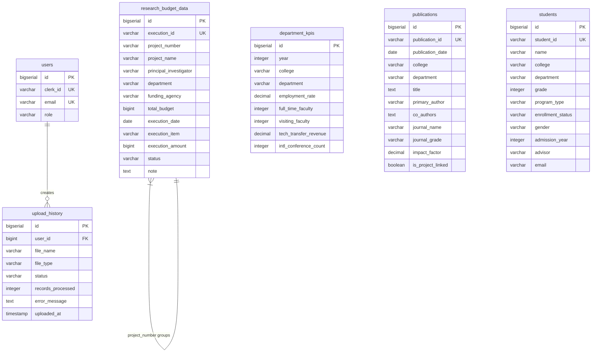

# Database Design: 대학교 데이터 시각화 대시보드

> **설계 원칙**: 유저플로우에 명시된 기능만 구현. 간결하고 확장 가능한 최소 스펙.

---

## 1. 데이터 플로우

### 1.1 전체 흐름
```
[이카운트 엑셀]
  → [관리자 업로드]
  → [Pandas 파싱 & 검증]
  → [PostgreSQL 저장]
  → [API 조회]
  → [차트 렌더링]
```

### 1.2 핵심 플로우

**인증**: Clerk Webhook → users 테이블 저장

**업로드**:
```
CSV 파일 → 파싱 → 데이터 테이블 UPSERT → upload_history 기록
```

**조회**:
```
토큰 검증 → 필터 조건으로 쿼리 → 집계 → JSON 응답
```

---

## 2. 데이터베이스 스키마

### 2.1 ERD



---

## 3. 테이블 정의

### 3.1 users
**목적**: Clerk 사용자 동기화 (유저플로우 1, 2)

| 컬럼 | 타입 | 제약 | 설명 |
|------|------|------|------|
| id | BIGSERIAL | PK | 사용자 ID |
| clerk_id | VARCHAR(255) | UNIQUE, NOT NULL | Clerk ID |
| email | VARCHAR(255) | UNIQUE, NOT NULL | 이메일 |
| role | VARCHAR(20) | NOT NULL, DEFAULT 'user' | 권한 (admin/user) |

**인덱스**: `idx_users_clerk_id` ON (clerk_id)

---

### 3.2 department_kpis
**목적**: 학과별 KPI (유저플로우 4, 5, 9)

| 컬럼 | 타입 | 제약 | 설명 |
|------|------|------|------|
| id | BIGSERIAL | PK | |
| year | INTEGER | NOT NULL | 평가년도 |
| college | VARCHAR(100) | NOT NULL | 단과대학 |
| department | VARCHAR(100) | NOT NULL | 학과 |
| employment_rate | DECIMAL(5,2) | | 취업률 (%) |
| full_time_faculty | INTEGER | | 전임교원 수 |
| visiting_faculty | INTEGER | | 초빙교원 수 |
| tech_transfer_revenue | DECIMAL(12,2) | | 기술이전 수입 (억원) |
| intl_conference_count | INTEGER | | 국제학술대회 횟수 |

**인덱스**:
- `idx_dept_kpis_year` ON (year)
- `idx_dept_kpis_dept` ON (department)

**유니크**: (year, college, department)

---

### 3.3 publications
**목적**: 논문 정보 (유저플로우 4, 6, 9)

| 컬럼 | 타입 | 제약 | 설명 |
|------|------|------|------|
| id | BIGSERIAL | PK | |
| publication_id | VARCHAR(50) | UNIQUE, NOT NULL | 논문 ID |
| publication_date | DATE | NOT NULL | 게재일 |
| college | VARCHAR(100) | NOT NULL | 단과대학 |
| department | VARCHAR(100) | NOT NULL | 학과 |
| title | TEXT | NOT NULL | 논문제목 |
| primary_author | VARCHAR(100) | NOT NULL | 주저자 |
| co_authors | TEXT | | 참여저자 (;구분) |
| journal_name | VARCHAR(255) | NOT NULL | 학술지명 |
| journal_grade | VARCHAR(50) | | 저널등급 |
| impact_factor | DECIMAL(5,2) | | Impact Factor |
| is_project_linked | BOOLEAN | DEFAULT FALSE | 과제연계 |

**인덱스**:
- `idx_publications_date` ON (publication_date)
- `idx_publications_grade` ON (journal_grade)

---

### 3.4 students
**목적**: 학생 정보 (유저플로우 4, 7, 9)

| 컬럼 | 타입 | 제약 | 설명 |
|------|------|------|------|
| id | BIGSERIAL | PK | |
| student_id | VARCHAR(20) | UNIQUE, NOT NULL | 학번 |
| name | VARCHAR(100) | NOT NULL | 이름 |
| college | VARCHAR(100) | NOT NULL | 단과대학 |
| department | VARCHAR(100) | NOT NULL | 학과 |
| grade | INTEGER | | 학년 (0=대학원) |
| program_type | VARCHAR(50) | NOT NULL | 과정 (학사/석사/박사) |
| enrollment_status | VARCHAR(50) | NOT NULL | 학적 (재학/휴학/졸업) |
| gender | VARCHAR(10) | | 성별 |
| admission_year | INTEGER | NOT NULL | 입학년도 |
| advisor | VARCHAR(100) | | 지도교수 |
| email | VARCHAR(255) | | 이메일 |

**인덱스**:
- `idx_students_dept` ON (department)
- `idx_students_status` ON (enrollment_status)

---

### 3.5 research_budget_data
**목적**: 연구과제 & 예산 통합 (유저플로우 4, 5, 8, 9)

> CSV 파일 구조를 반영한 비정규화 테이블. 조인 오버헤드 제거.

| 컬럼 | 타입 | 제약 | 설명 |
|------|------|------|------|
| id | BIGSERIAL | PK | |
| execution_id | VARCHAR(50) | UNIQUE, NOT NULL | 집행 ID |
| project_number | VARCHAR(50) | NOT NULL | 과제번호 |
| project_name | VARCHAR(255) | NOT NULL | 과제명 |
| principal_investigator | VARCHAR(100) | NOT NULL | 연구책임자 |
| department | VARCHAR(100) | NOT NULL | 소속학과 |
| funding_agency | VARCHAR(255) | NOT NULL | 지원기관 |
| total_budget | BIGINT | NOT NULL | 총연구비 (원) |
| execution_date | DATE | NOT NULL | 집행일자 |
| execution_item | VARCHAR(255) | NOT NULL | 집행항목 |
| execution_amount | BIGINT | NOT NULL | 집행금액 (원) |
| status | VARCHAR(50) | NOT NULL | 상태 |
| note | TEXT | | 비고 |

**인덱스**:
- `idx_research_budget_project` ON (project_number)
- `idx_research_budget_dept` ON (department)
- `idx_research_budget_date` ON (execution_date)

---

### 3.6 upload_history
**목적**: 업로드 이력 (유저플로우 9, 10)

| 컬럼 | 타입 | 제약 | 설명 |
|------|------|------|------|
| id | BIGSERIAL | PK | |
| user_id | BIGINT | FK → users(id), NOT NULL | 업로드 사용자 |
| file_name | VARCHAR(255) | NOT NULL | 파일명 |
| file_type | VARCHAR(50) | NOT NULL | 파일 타입 |
| status | VARCHAR(50) | NOT NULL | 처리 상태 |
| records_processed | INTEGER | DEFAULT 0 | 처리 건수 |
| error_message | TEXT | | 오류 메시지 |
| uploaded_at | TIMESTAMP | NOT NULL, DEFAULT NOW() | 업로드 일시 |

**인덱스**: `idx_upload_history_uploaded_at` ON (uploaded_at DESC)

**외래키**:
```sql
FOREIGN KEY (user_id) REFERENCES users(id) ON DELETE CASCADE
```

---

## 4. 핵심 쿼리

### 4.1 메인 대시보드 KPI (유저플로우 4)

```sql
-- 총 실적 (최신년도 평균)
SELECT AVG(employment_rate), SUM(tech_transfer_revenue)
FROM department_kpis
WHERE year = (SELECT MAX(year) FROM department_kpis);

-- 논문 수 (금년)
SELECT COUNT(*)
FROM publications
WHERE EXTRACT(YEAR FROM publication_date) = EXTRACT(YEAR FROM CURRENT_DATE);

-- 학생 수 (재학생)
SELECT COUNT(*)
FROM students
WHERE enrollment_status = '재학';

-- 예산 집행률
SELECT
    SUM(total_budget) as total,
    SUM(execution_amount) as executed
FROM research_budget_data
WHERE status = '집행완료';
```

### 4.2 실적 분석 (유저플로우 5)

```sql
-- 기간별 추이
SELECT year, AVG(employment_rate), SUM(tech_transfer_revenue)
FROM department_kpis
WHERE year BETWEEN :start_year AND :end_year
  AND (:department IS NULL OR department = :department)
GROUP BY year
ORDER BY year;

-- 부서별 비교
SELECT college, department, AVG(employment_rate)
FROM department_kpis
WHERE year = :year
GROUP BY college, department
ORDER BY AVG(employment_rate) DESC;
```

### 4.3 논문 분석 (유저플로우 6)

```sql
-- 연도별 게재 수
SELECT EXTRACT(YEAR FROM publication_date) as year, COUNT(*)
FROM publications
GROUP BY year
ORDER BY year;

-- 학술지별 분류
SELECT journal_grade, COUNT(*)
FROM publications
WHERE EXTRACT(YEAR FROM publication_date) = :year
GROUP BY journal_grade;
```

### 4.4 학생 분석 (유저플로우 7)

```sql
-- 학과별 학생 수
SELECT college, department, COUNT(*)
FROM students
WHERE enrollment_status = '재학'
GROUP BY college, department;

-- 학년별 분포
SELECT program_type, grade, COUNT(*)
FROM students
WHERE enrollment_status = '재학'
GROUP BY program_type, grade;
```

### 4.5 예산 분석 (유저플로우 8)

```sql
-- 부서별 예산 배분
SELECT
    department,
    SUM(DISTINCT total_budget) as budget,
    SUM(execution_amount) as executed
FROM research_budget_data
WHERE (:department IS NULL OR department = :department)
GROUP BY department;

-- 연도별 추이
SELECT EXTRACT(YEAR FROM execution_date) as year, SUM(execution_amount)
FROM research_budget_data
WHERE status = '집행완료'
GROUP BY year
ORDER BY year;
```

### 4.6 업로드 히스토리 (유저플로우 10)

```sql
SELECT
    h.file_name,
    h.file_type,
    h.status,
    h.records_processed,
    h.uploaded_at,
    u.email as uploaded_by
FROM upload_history h
JOIN users u ON h.user_id = u.id
ORDER BY h.uploaded_at DESC
LIMIT 50;
```

---

## 5. 데이터베이스 생성 스크립트

```sql
-- 데이터베이스 생성
CREATE DATABASE university_dashboard;

\c university_dashboard;

-- users 테이블
CREATE TABLE users (
    id BIGSERIAL PRIMARY KEY,
    clerk_id VARCHAR(255) UNIQUE NOT NULL,
    email VARCHAR(255) UNIQUE NOT NULL,
    role VARCHAR(20) NOT NULL DEFAULT 'user' CHECK (role IN ('admin', 'user'))
);

CREATE INDEX idx_users_clerk_id ON users(clerk_id);

-- department_kpis 테이블
CREATE TABLE department_kpis (
    id BIGSERIAL PRIMARY KEY,
    year INTEGER NOT NULL CHECK (year >= 2000 AND year <= 2100),
    college VARCHAR(100) NOT NULL,
    department VARCHAR(100) NOT NULL,
    employment_rate DECIMAL(5,2) CHECK (employment_rate >= 0 AND employment_rate <= 100),
    full_time_faculty INTEGER,
    visiting_faculty INTEGER,
    tech_transfer_revenue DECIMAL(12,2),
    intl_conference_count INTEGER,
    UNIQUE (year, college, department)
);

CREATE INDEX idx_dept_kpis_year ON department_kpis(year);
CREATE INDEX idx_dept_kpis_dept ON department_kpis(department);

-- publications 테이블
CREATE TABLE publications (
    id BIGSERIAL PRIMARY KEY,
    publication_id VARCHAR(50) UNIQUE NOT NULL,
    publication_date DATE NOT NULL,
    college VARCHAR(100) NOT NULL,
    department VARCHAR(100) NOT NULL,
    title TEXT NOT NULL,
    primary_author VARCHAR(100) NOT NULL,
    co_authors TEXT,
    journal_name VARCHAR(255) NOT NULL,
    journal_grade VARCHAR(50),
    impact_factor DECIMAL(5,2),
    is_project_linked BOOLEAN DEFAULT FALSE
);

CREATE INDEX idx_publications_date ON publications(publication_date);
CREATE INDEX idx_publications_grade ON publications(journal_grade);

-- students 테이블
CREATE TABLE students (
    id BIGSERIAL PRIMARY KEY,
    student_id VARCHAR(20) UNIQUE NOT NULL,
    name VARCHAR(100) NOT NULL,
    college VARCHAR(100) NOT NULL,
    department VARCHAR(100) NOT NULL,
    grade INTEGER CHECK (grade >= 0 AND grade <= 8),
    program_type VARCHAR(50) NOT NULL CHECK (program_type IN ('학사', '석사', '박사')),
    enrollment_status VARCHAR(50) NOT NULL CHECK (enrollment_status IN ('재학', '휴학', '졸업', '자퇴', '제적')),
    gender VARCHAR(10),
    admission_year INTEGER NOT NULL CHECK (admission_year >= 1900 AND admission_year <= 2100),
    advisor VARCHAR(100),
    email VARCHAR(255)
);

CREATE INDEX idx_students_dept ON students(department);
CREATE INDEX idx_students_status ON students(enrollment_status);

-- research_budget_data 테이블 (통합)
CREATE TABLE research_budget_data (
    id BIGSERIAL PRIMARY KEY,
    execution_id VARCHAR(50) UNIQUE NOT NULL,
    project_number VARCHAR(50) NOT NULL,
    project_name VARCHAR(255) NOT NULL,
    principal_investigator VARCHAR(100) NOT NULL,
    department VARCHAR(100) NOT NULL,
    funding_agency VARCHAR(255) NOT NULL,
    total_budget BIGINT NOT NULL,
    execution_date DATE NOT NULL,
    execution_item VARCHAR(255) NOT NULL,
    execution_amount BIGINT NOT NULL,
    status VARCHAR(50) NOT NULL CHECK (status IN ('집행완료', '처리중', '취소')),
    note TEXT
);

CREATE INDEX idx_research_budget_project ON research_budget_data(project_number);
CREATE INDEX idx_research_budget_dept ON research_budget_data(department);
CREATE INDEX idx_research_budget_date ON research_budget_data(execution_date);

-- upload_history 테이블
CREATE TABLE upload_history (
    id BIGSERIAL PRIMARY KEY,
    user_id BIGINT NOT NULL REFERENCES users(id) ON DELETE CASCADE,
    file_name VARCHAR(255) NOT NULL,
    file_type VARCHAR(50) NOT NULL CHECK (file_type IN ('department_kpi', 'publication_list', 'research_project_data', 'student_roster')),
    status VARCHAR(50) NOT NULL CHECK (status IN ('success', 'failed')),
    records_processed INTEGER DEFAULT 0,
    error_message TEXT,
    uploaded_at TIMESTAMP NOT NULL DEFAULT NOW()
);

CREATE INDEX idx_upload_history_uploaded_at ON upload_history(uploaded_at DESC);
```

---

## 6. UPSERT 전략

CSV 업로드 시 중복 처리:

```sql
-- department_kpis
INSERT INTO department_kpis (year, college, department, ...)
VALUES (:year, :college, :department, ...)
ON CONFLICT (year, college, department)
DO UPDATE SET
    employment_rate = EXCLUDED.employment_rate,
    full_time_faculty = EXCLUDED.full_time_faculty,
    visiting_faculty = EXCLUDED.visiting_faculty,
    tech_transfer_revenue = EXCLUDED.tech_transfer_revenue,
    intl_conference_count = EXCLUDED.intl_conference_count;

-- publications
INSERT INTO publications (publication_id, ...)
VALUES (:publication_id, ...)
ON CONFLICT (publication_id)
DO UPDATE SET
    publication_date = EXCLUDED.publication_date,
    title = EXCLUDED.title,
    ...;

-- students
INSERT INTO students (student_id, ...)
VALUES (:student_id, ...)
ON CONFLICT (student_id)
DO UPDATE SET
    name = EXCLUDED.name,
    college = EXCLUDED.college,
    ...;

-- research_budget_data
INSERT INTO research_budget_data (execution_id, ...)
VALUES (:execution_id, ...)
ON CONFLICT (execution_id)
DO UPDATE SET
    project_name = EXCLUDED.project_name,
    execution_amount = EXCLUDED.execution_amount,
    ...;
```

---

## 7. 설계 근거

### 제거한 요소
1. **uploaded_by 컬럼**: 유저플로우에서 "누가 업로드했는지" 조회 불필요. upload_history에만 기록.
2. **created_at/updated_at**: 데이터 조회/필터링에 사용 안 함. 추적 필요 시 upload_history 활용.
3. **과도한 인덱스**: 실제 WHERE/JOIN/ORDER BY 절에 사용되는 컬럼만 인덱스 생성.
4. **트리거**: updated_at 자동 갱신 불필요.
5. **research_projects 분리**: CSV 1개 파일이므로 통합 테이블로 단순화. JOIN 제거로 쿼리 성능 향상.

### 유지한 요소
1. **users**: Clerk Webhook 동기화 필수 (유저플로우 1).
2. **upload_history**: 업로드 이력 조회 필수 (유저플로우 10).
3. **필수 인덱스**: year, department, date 등 필터링/정렬에 사용.
4. **CHECK 제약조건**: 데이터 무결성을 위한 최소한의 검증.

### 비정규화 선택
- `research_budget_data`: 과제 정보와 집행 내역을 통합
  - 장점: 조인 제거, 쿼리 단순화, CSV 구조 반영
  - 단점: total_budget 중복 저장 (허용 가능한 수준)
  - 근거: 조회 성능 > 저장 공간

---

## 8. 확장성

### 필요 시 추가 가능한 요소
- **파티셔닝**: 데이터 증가 시 year 기준 파티션
- **캐싱**: Redis로 KPI 데이터 캐싱 (TTL: 5분)
- **읽기 전용 복제**: 조회 부하 분산

### 현재는 불필요
- 복잡한 트리거/프로시저
- 감사 로그 테이블
- 버전 관리 시스템
- 대용량 데이터 아카이빙

---

## 부록: CSV 매핑

| CSV 파일 | 테이블 | 비고 |
|----------|--------|------|
| department_kpi.csv | department_kpis | 1:1 매핑 |
| publication_list.csv | publications | 1:1 매핑 |
| student_roster.csv | students | 1:1 매핑 |
| research_project_data.csv | research_budget_data | 통합 테이블 |
