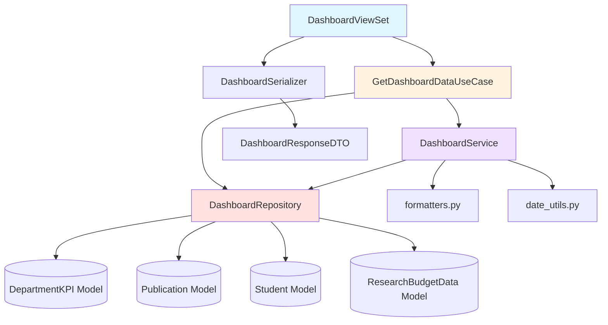
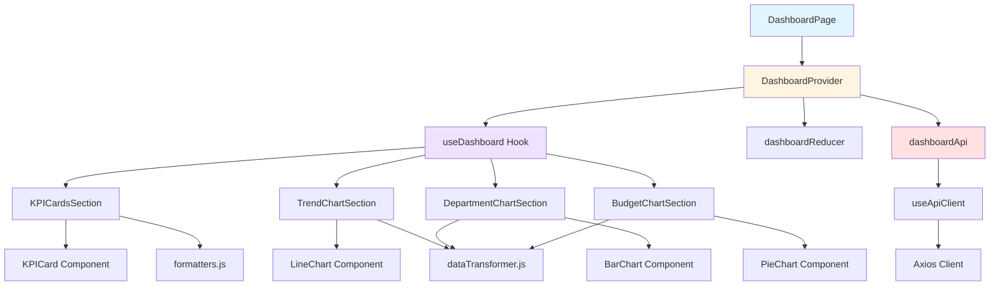
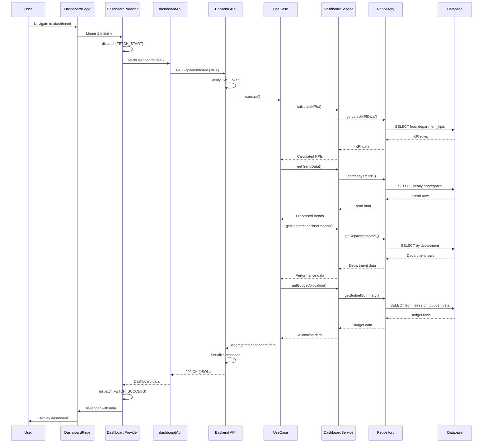

# Implementation Plan: Dashboard Home Page

> **Page**: `/dashboard`
> **Priority**: Phase 1 (MVP)
> **Status**: Planning Complete

---

## Overview

### Module Summary

This document outlines the implementation plan for the Dashboard Home page, which is the main landing page after user authentication. The page displays key performance indicators (KPIs), trend charts, department performance, and budget allocation visualizations.

| Module | Location | Type | Description |
|--------|----------|------|-------------|
| **DashboardViewSet** | `backend/apps/data_dashboard/presentation/views.py` | Backend API | REST API endpoint for dashboard data |
| **DashboardSerializer** | `backend/apps/data_dashboard/presentation/serializers.py` | Backend API | Data serialization/validation |
| **GetDashboardDataUseCase** | `backend/apps/data_dashboard/application/use_cases.py` | Backend Logic | Dashboard data aggregation orchestration |
| **DashboardService** | `backend/apps/data_dashboard/domain/services.py` | Backend Logic | Business logic for data calculations |
| **DashboardRepository** | `backend/apps/data_dashboard/infrastructure/repositories.py` | Backend Data | Data access layer for dashboard queries |
| **DashboardPage** | `frontend/src/pages/DashboardPage.jsx` | Frontend Page | Main dashboard page component |
| **DashboardProvider** | `frontend/src/context/DashboardContext.jsx` | Frontend State | Context provider for dashboard state |
| **KPICardsSection** | `frontend/src/components/dashboard/KPICardsSection.jsx` | Frontend UI | KPI cards display section |
| **TrendChartSection** | `frontend/src/components/dashboard/TrendChartSection.jsx` | Frontend UI | Line chart for trends |
| **DepartmentChartSection** | `frontend/src/components/dashboard/DepartmentChartSection.jsx` | Frontend UI | Bar chart for departments |
| **BudgetChartSection** | `frontend/src/components/dashboard/BudgetChartSection.jsx` | Frontend UI | Pie chart for budget |
| **dashboardApi** | `frontend/src/api/dashboardApi.js` | Frontend API | API client for dashboard endpoints |

---

## Diagram: Module Relationships

### Backend Module Relationship



### Frontend Module Relationship



### Full Data Flow



---

## Implementation Plan

### Phase 1: Backend API Layer

#### Module 1: DashboardRepository

**File**: `backend/apps/data_dashboard/infrastructure/repositories.py`

**Purpose**: Data access layer for dashboard queries

**Dependencies**:
- Django ORM models: `DepartmentKPI`, `Publication`, `Student`, `ResearchBudgetData`
- `utils/date_utils.py`: `get_current_year()`

**Implementation Details**:

```python
class DashboardRepository:
    """Repository for dashboard data queries"""

    def get_latest_kpi_data(self):
        """
        Query latest year KPI data from department_kpis table

        Returns:
            QuerySet of DepartmentKPI for the latest year
        """
        # Query: SELECT * FROM department_kpis
        #        WHERE year = (SELECT MAX(year) FROM department_kpis)
        pass

    def get_publication_count_current_year(self):
        """
        Query publication count for current year

        Returns:
            int: Total publication count
        """
        # Query: SELECT COUNT(*) FROM publications
        #        WHERE EXTRACT(YEAR FROM publication_date) = current_year
        pass

    def get_active_student_count(self):
        """
        Query count of students with enrollment_status = '재학'

        Returns:
            int: Active student count
        """
        # Query: SELECT COUNT(*) FROM students
        #        WHERE enrollment_status = '재학'
        pass

    def get_budget_summary(self):
        """
        Query budget totals and execution amounts

        Returns:
            dict: {
                'total_budget': sum of total_budget,
                'executed_amount': sum of execution_amount where status='집행완료'
            }
        """
        # Query: SELECT SUM(DISTINCT total_budget), SUM(execution_amount)
        #        FROM research_budget_data WHERE status = '집행완료'
        pass

    def get_yearly_trends(self, start_year=None, end_year=None):
        """
        Query yearly KPI trends

        Args:
            start_year (int): Starting year (default: 4 years ago)
            end_year (int): Ending year (default: current year)

        Returns:
            QuerySet: Yearly aggregated data
        """
        # Query: SELECT year, AVG(employment_rate), SUM(tech_transfer_revenue)
        #        FROM department_kpis WHERE year BETWEEN start_year AND end_year
        #        GROUP BY year ORDER BY year
        pass

    def get_department_performance(self, year=None):
        """
        Query department performance for a given year

        Args:
            year (int): Target year (default: latest year)

        Returns:
            QuerySet: Department aggregated performance
        """
        # Query: SELECT department, AVG(employment_rate),
        #        SUM(tech_transfer_revenue)
        #        FROM department_kpis WHERE year = target_year
        #        GROUP BY department ORDER BY AVG(employment_rate) DESC
        pass

    def get_budget_allocation(self):
        """
        Query budget allocation by department

        Returns:
            QuerySet: Department budget allocation
        """
        # Query: SELECT department, SUM(DISTINCT total_budget),
        #        SUM(execution_amount)
        #        FROM research_budget_data
        #        GROUP BY department
        pass
```

**Tests**: Unit tests for each query method with mock data

**QA Sheet**: Not required (data layer)

---

#### Module 2: DashboardService

**File**: `backend/apps/data_dashboard/domain/services.py`

**Purpose**: Business logic for dashboard data calculations and aggregations

**Dependencies**:
- `DashboardRepository` (injected)
- `utils/formatters.py`: `format_percentage()`, `format_currency()`
- `utils/date_utils.py`: `get_current_year()`

**Implementation Details**:

```python
class DashboardService:
    """Service for dashboard business logic"""

    def __init__(self, repository: DashboardRepository):
        self.repository = repository

    def calculate_kpi_metrics(self):
        """
        Calculate KPI metrics from raw data

        Returns:
            dict: {
                'total_performance': float (avg employment rate),
                'publication_count': int,
                'student_count': int,
                'budget_status': {
                    'total': int,
                    'executed': int,
                    'rate': float (percentage)
                }
            }
        """
        # 1. Get latest KPI data from repository
        # 2. Calculate average employment_rate
        # 3. Get publication count
        # 4. Get student count
        # 5. Get budget data and calculate execution rate
        # 6. Return formatted dictionary
        pass

    def calculate_trend_data(self):
        """
        Calculate yearly trend data

        Returns:
            list: [
                {'year': int, 'value': float},
                ...
            ]
        """
        # 1. Get yearly trends from repository (last 4 years)
        # 2. Calculate average employment rate per year
        # 3. Format as list of dicts
        pass

    def calculate_department_performance(self):
        """
        Calculate department performance metrics

        Returns:
            list: [
                {'department': str, 'value': float},
                ...
            ]
        """
        # 1. Get department performance from repository
        # 2. Calculate weighted performance score
        # 3. Sort by performance (descending)
        # 4. Return top departments
        pass

    def calculate_budget_allocation(self):
        """
        Calculate budget allocation by category

        Returns:
            list: [
                {'category': str, 'value': int},
                ...
            ]
        """
        # 1. Get budget allocation from repository
        # 2. Group by department
        # 3. Calculate total per department
        # 4. Format as category/value pairs
        pass
```

**Tests**: Unit tests with mock repository

**QA Sheet**: Not required (business logic layer)

---

#### Module 3: GetDashboardDataUseCase

**File**: `backend/apps/data_dashboard/application/use_cases.py`

**Purpose**: Orchestrate dashboard data aggregation workflow

**Dependencies**:
- `DashboardService` (injected)
- `core/exceptions.py`: Custom exceptions

**Implementation Details**:

```python
class GetDashboardDataUseCase:
    """Use case for fetching dashboard data"""

    def __init__(self, service: DashboardService):
        self.service = service

    def execute(self):
        """
        Execute dashboard data retrieval

        Returns:
            dict: Complete dashboard data

        Raises:
            NotFoundError: If no data exists
            ValidationError: If data is invalid
        """
        try:
            # 1. Calculate KPI metrics
            kpi_data = self.service.calculate_kpi_metrics()

            # 2. Calculate trend data
            trend_data = self.service.calculate_trend_data()

            # 3. Calculate department performance
            department_data = self.service.calculate_department_performance()

            # 4. Calculate budget allocation
            budget_data = self.service.calculate_budget_allocation()

            # 5. Validate all data exists
            if not kpi_data or not trend_data:
                raise NotFoundError("Dashboard data is empty")

            # 6. Return aggregated data
            return {
                'kpi_data': kpi_data,
                'trend_data': trend_data,
                'department_data': department_data,
                'budget_data': budget_data,
                'last_updated': datetime.now().isoformat()
            }

        except Exception as e:
            # Log error and re-raise
            raise
```

**Tests**: Unit tests with mock service

**QA Sheet**: Not required (use case layer)

---

#### Module 4: DashboardSerializer

**File**: `backend/apps/data_dashboard/presentation/serializers.py`

**Purpose**: Serialize dashboard response data

**Dependencies**:
- Django REST Framework `serializers`

**Implementation Details**:

```python
class BudgetStatusSerializer(serializers.Serializer):
    """Budget status data"""
    total = serializers.IntegerField()
    executed = serializers.IntegerField()
    rate = serializers.FloatField()

class KPIDataSerializer(serializers.Serializer):
    """KPI metrics data"""
    total_performance = serializers.FloatField()
    publication_count = serializers.IntegerField()
    student_count = serializers.IntegerField()
    budget_status = BudgetStatusSerializer()

class TrendDataItemSerializer(serializers.Serializer):
    """Trend data point"""
    year = serializers.IntegerField()
    value = serializers.FloatField()

class DepartmentDataItemSerializer(serializers.Serializer):
    """Department performance data point"""
    department = serializers.CharField()
    value = serializers.FloatField()

class BudgetDataItemSerializer(serializers.Serializer):
    """Budget allocation data point"""
    category = serializers.CharField()
    value = serializers.IntegerField()

class DashboardSerializer(serializers.Serializer):
    """Complete dashboard response"""
    kpi_data = KPIDataSerializer()
    trend_data = TrendDataItemSerializer(many=True)
    department_data = DepartmentDataItemSerializer(many=True)
    budget_data = BudgetDataItemSerializer(many=True)
    last_updated = serializers.DateTimeField()
```

**Tests**: Serialization validation tests

**QA Sheet**: Not required (serializer)

---

#### Module 5: DashboardViewSet

**File**: `backend/apps/data_dashboard/presentation/views.py`

**Purpose**: REST API endpoint for dashboard data

**Dependencies**:
- Django REST Framework `viewsets.ViewSet`
- `GetDashboardDataUseCase`
- `DashboardSerializer`
- `core/middleware.py`: JWT authentication (automatic)
- `core/exceptions.py`: Exception handlers

**Implementation Details**:

```python
class DashboardViewSet(viewsets.ViewSet):
    """
    Dashboard API ViewSet

    Endpoints:
        GET /api/dashboard/ - Retrieve dashboard data
    """

    def list(self, request):
        """
        GET /api/dashboard/

        Returns complete dashboard data including:
        - KPI metrics (총 실적, 논문 수, 학생 수, 예산 현황)
        - Trend data (yearly trends)
        - Department performance
        - Budget allocation

        Authentication: Required (JWT)

        Response: 200 OK
        {
            "kpi_data": {...},
            "trend_data": [...],
            "department_data": [...],
            "budget_data": [...],
            "last_updated": "2025-11-02T10:30:00Z"
        }

        Error Responses:
        - 401: Unauthorized (invalid/missing token)
        - 404: No data found
        - 500: Internal server error
        """
        try:
            # 1. User authentication handled by middleware (request.user)
            # 2. Initialize use case with dependencies
            repository = DashboardRepository()
            service = DashboardService(repository)
            use_case = GetDashboardDataUseCase(service)

            # 3. Execute use case
            data = use_case.execute()

            # 4. Serialize response
            serializer = DashboardSerializer(data)

            # 5. Return response
            return Response(serializer.data, status=status.HTTP_200_OK)

        except NotFoundError as e:
            return Response(
                {'error': {'message': str(e), 'code': 'NOT_FOUND'}},
                status=status.HTTP_404_NOT_FOUND
            )
        except Exception as e:
            return Response(
                {'error': {'message': 'Internal server error', 'code': 'SERVER_ERROR'}},
                status=status.HTTP_500_INTERNAL_SERVER_ERROR
            )
```

**URL Configuration**:

**File**: `backend/apps/data_dashboard/presentation/urls.py`

```python
from rest_framework.routers import DefaultRouter
from .views import DashboardViewSet

router = DefaultRouter()
router.register(r'dashboard', DashboardViewSet, basename='dashboard')

urlpatterns = router.urls
```

**Tests**: Integration tests with mock database

**QA Sheet**:

| Test Case | Input | Expected Output | Status |
|-----------|-------|-----------------|--------|
| GET dashboard with valid token | JWT token | 200 OK with full data | |
| GET dashboard without token | No auth header | 401 Unauthorized | |
| GET dashboard with expired token | Expired JWT | 401 Unauthorized | |
| GET dashboard with no data | Valid token, empty DB | 404 Not Found | |
| GET dashboard with DB error | Valid token | 500 Server Error | |

---

### Phase 2: Frontend API Client

#### Module 6: dashboardApi

**File**: `frontend/src/api/dashboardApi.js`

**Purpose**: API client for dashboard endpoints

**Dependencies**:
- `api/client.js`: `createAuthenticatedClient`

**Implementation Details**:

```javascript
/**
 * Dashboard API Client
 * Handles all API calls related to dashboard data
 */

import { createAuthenticatedClient } from './client';

/**
 * Fetch complete dashboard data
 *
 * @param {string} token - JWT authentication token
 * @returns {Promise<Object>} Dashboard data
 * @throws {Error} API error
 */
export const fetchDashboardData = async (token) => {
  const client = createAuthenticatedClient(token);

  try {
    const response = await client.get('/dashboard/');
    return response.data;
  } catch (error) {
    if (error.response) {
      // Server responded with error
      throw {
        message: error.response.data.error?.message || 'Failed to fetch dashboard data',
        code: error.response.data.error?.code || 'API_ERROR',
        statusCode: error.response.status
      };
    } else if (error.request) {
      // Request sent but no response
      throw {
        message: 'Network error. Please check your connection.',
        code: 'NETWORK_ERROR',
        statusCode: 0
      };
    } else {
      // Request setup error
      throw {
        message: 'Failed to send request',
        code: 'REQUEST_ERROR',
        statusCode: 0
      };
    }
  }
};
```

**Tests**: Unit tests with mock axios

**QA Sheet**: Not required (API client)

---

### Phase 3: Frontend State Management

#### Module 7: DashboardProvider

**File**: `frontend/src/context/DashboardContext.jsx`

**Purpose**: Context provider for dashboard state management using useReducer

**Dependencies**:
- React `createContext`, `useContext`, `useReducer`, `useEffect`
- `hooks/useAuth.js`: `useAuth()`
- `hooks/useApiClient.js`: `useApiClient()`
- `api/dashboardApi.js`: `fetchDashboardData()`

**Implementation Details**:

```javascript
import { createContext, useContext, useReducer, useEffect } from 'react';
import { useAuth } from '../hooks/useAuth';
import { fetchDashboardData } from '../api/dashboardApi';

// Action Types
const ActionTypes = {
  FETCH_DASHBOARD_START: 'FETCH_DASHBOARD_START',
  FETCH_DASHBOARD_SUCCESS: 'FETCH_DASHBOARD_SUCCESS',
  FETCH_DASHBOARD_FAILURE: 'FETCH_DASHBOARD_FAILURE',
  CLEAR_ERROR: 'CLEAR_ERROR',
};

// Initial State
const initialState = {
  kpiData: null,
  trendData: [],
  departmentData: [],
  budgetData: [],
  isLoading: true,
  error: null,
  lastUpdated: null,
};

// Reducer
function dashboardReducer(state, action) {
  switch (action.type) {
    case ActionTypes.FETCH_DASHBOARD_START:
      return {
        ...state,
        isLoading: true,
        error: null,
      };

    case ActionTypes.FETCH_DASHBOARD_SUCCESS:
      return {
        ...state,
        kpiData: action.payload.kpiData,
        trendData: action.payload.trendData,
        departmentData: action.payload.departmentData,
        budgetData: action.payload.budgetData,
        lastUpdated: action.payload.lastUpdated,
        isLoading: false,
        error: null,
      };

    case ActionTypes.FETCH_DASHBOARD_FAILURE:
      return {
        ...state,
        isLoading: false,
        error: action.payload,
      };

    case ActionTypes.CLEAR_ERROR:
      return {
        ...state,
        error: null,
      };

    default:
      return state;
  }
}

// Context
const DashboardContext = createContext();

// Provider Component
export const DashboardProvider = ({ children }) => {
  const [state, dispatch] = useReducer(dashboardReducer, initialState);
  const { getToken, signOut } = useAuth();

  /**
   * Fetch dashboard data from API
   */
  const fetchData = async () => {
    dispatch({ type: ActionTypes.FETCH_DASHBOARD_START });

    try {
      const token = await getToken();
      const data = await fetchDashboardData(token);

      dispatch({
        type: ActionTypes.FETCH_DASHBOARD_SUCCESS,
        payload: data,
      });
    } catch (error) {
      // Handle token expiration
      if (error.statusCode === 401) {
        signOut();
        return;
      }

      dispatch({
        type: ActionTypes.FETCH_DASHBOARD_FAILURE,
        payload: error,
      });
    }
  };

  /**
   * Refresh dashboard data
   */
  const refreshDashboard = async () => {
    await fetchData();
  };

  /**
   * Clear error state
   */
  const clearError = () => {
    dispatch({ type: ActionTypes.CLEAR_ERROR });
  };

  // Fetch data on mount
  useEffect(() => {
    fetchData();
  }, []);

  const value = {
    // State
    ...state,

    // Actions
    fetchDashboardData: fetchData,
    refreshDashboard,
    clearError,
  };

  return (
    <DashboardContext.Provider value={value}>
      {children}
    </DashboardContext.Provider>
  );
};

// Custom Hook
export const useDashboard = () => {
  const context = useContext(DashboardContext);
  if (!context) {
    throw new Error('useDashboard must be used within DashboardProvider');
  }
  return context;
};
```

**Tests**: Unit tests for reducer and context

**QA Sheet**: Not required (context provider)

---

### Phase 4: Frontend UI Components

#### Module 8: KPICardsSection

**File**: `frontend/src/components/dashboard/KPICardsSection.jsx`

**Purpose**: Display 4 KPI cards (총 실적, 논문 수, 학생 수, 예산 현황)

**Dependencies**:
- `context/DashboardContext.jsx`: `useDashboard()`
- `components/charts/KPICard.jsx` (common module)
- `utils/formatters.js`: `formatNumber()`, `formatPercentage()`, `formatCurrency()`
- MUI: `Grid`, `Skeleton`

**Implementation Details**:

```javascript
import { Grid, Skeleton } from '@mui/material';
import { useDashboard } from '../../context/DashboardContext';
import { KPICard } from '../charts/KPICard';
import { formatNumber, formatPercentage, formatCurrency } from '../../utils/formatters';

export const KPICardsSection = () => {
  const { kpiData, isLoading, error } = useDashboard();

  if (isLoading) {
    return (
      <Grid container spacing={3}>
        {[1, 2, 3, 4].map((i) => (
          <Grid item xs={12} sm={6} md={3} key={i}>
            <Skeleton variant="rectangular" height={150} />
          </Grid>
        ))}
      </Grid>
    );
  }

  if (error || !kpiData) {
    return null;
  }

  return (
    <Grid container spacing={3}>
      <Grid item xs={12} sm={6} md={3}>
        <KPICard
          title="총 실적"
          value={formatPercentage(kpiData.totalPerformance)}
          subtitle="평균 취업률"
        />
      </Grid>

      <Grid item xs={12} sm={6} md={3}>
        <KPICard
          title="논문 게재 수"
          value={formatNumber(kpiData.publicationCount)}
          subtitle="올해"
        />
      </Grid>

      <Grid item xs={12} sm={6} md={3}>
        <KPICard
          title="학생 수"
          value={formatNumber(kpiData.studentCount)}
          subtitle="재학생"
        />
      </Grid>

      <Grid item xs={12} sm={6} md={3}>
        <KPICard
          title="예산 집행률"
          value={formatPercentage(kpiData.budgetStatus.rate)}
          subtitle={`${formatCurrency(kpiData.budgetStatus.executed)} / ${formatCurrency(kpiData.budgetStatus.total)}`}
        />
      </Grid>
    </Grid>
  );
};
```

**Tests**: Component tests with mock context

**QA Sheet**:

| Test Case | Input | Expected Output | Status |
|-----------|-------|-----------------|--------|
| Render loading state | isLoading=true | Show 4 skeleton cards | |
| Render with data | Valid kpiData | Show 4 KPI cards with formatted values | |
| Render with error | error object | Show nothing (null) | |
| Render with no data | kpiData=null | Show nothing (null) | |
| Format large numbers | 1543 students | "1,543" | |
| Format percentages | 85.5 | "85.5%" | |
| Format currency | 5000000000 | "5,000,000,000원" | |

---

#### Module 9: TrendChartSection

**File**: `frontend/src/components/dashboard/TrendChartSection.jsx`

**Purpose**: Display line chart for yearly trends

**Dependencies**:
- `context/DashboardContext.jsx`: `useDashboard()`
- `components/charts/LineChart.jsx` (common module)
- `services/dataTransformer.js`: `transformToLineChartData()`
- MUI: `Card`, `CardHeader`, `CardContent`, `Skeleton`

**Implementation Details**:

```javascript
import { Card, CardHeader, CardContent, Skeleton } from '@mui/material';
import { useDashboard } from '../../context/DashboardContext';
import { LineChart } from '../charts/LineChart';
import { transformToLineChartData } from '../../services/dataTransformer';

export const TrendChartSection = () => {
  const { trendData, isLoading } = useDashboard();

  if (isLoading) {
    return (
      <Card>
        <CardHeader title="기간별 추이" />
        <CardContent>
          <Skeleton variant="rectangular" height={300} />
        </CardContent>
      </Card>
    );
  }

  if (!trendData || trendData.length === 0) {
    return (
      <Card>
        <CardHeader title="기간별 추이" />
        <CardContent>
          <p>데이터가 없습니다.</p>
        </CardContent>
      </Card>
    );
  }

  const chartData = transformToLineChartData(trendData, 'year', 'value');

  const options = {
    responsive: true,
    maintainAspectRatio: false,
    plugins: {
      legend: {
        display: true,
        position: 'top',
      },
      title: {
        display: false,
      },
    },
    scales: {
      y: {
        beginAtZero: false,
      },
    },
  };

  return (
    <Card>
      <CardHeader title="기간별 추이" />
      <CardContent sx={{ height: 300 }}>
        <LineChart data={chartData} options={options} />
      </CardContent>
    </Card>
  );
};
```

**Tests**: Component tests with mock context

**QA Sheet**:

| Test Case | Input | Expected Output | Status |
|-----------|-------|-----------------|--------|
| Render loading state | isLoading=true | Show skeleton | |
| Render with data | Valid trendData | Show line chart | |
| Render with no data | trendData=[] | Show "데이터가 없습니다" | |
| Data transformation | [{year:2020,value:75.2}] | Correct chart format | |
| Chart responsiveness | Window resize | Chart adjusts size | |

---

#### Module 10: DepartmentChartSection

**File**: `frontend/src/components/dashboard/DepartmentChartSection.jsx`

**Purpose**: Display bar chart for department performance

**Dependencies**:
- `context/DashboardContext.jsx`: `useDashboard()`
- `components/charts/BarChart.jsx` (common module)
- `services/dataTransformer.js`: `transformToBarChartData()`
- MUI: `Card`, `CardHeader`, `CardContent`, `Skeleton`

**Implementation Details**:

```javascript
import { Card, CardHeader, CardContent, Skeleton } from '@mui/material';
import { useDashboard } from '../../context/DashboardContext';
import { BarChart } from '../charts/BarChart';
import { transformToBarChartData } from '../../services/dataTransformer';

export const DepartmentChartSection = () => {
  const { departmentData, isLoading } = useDashboard();

  if (isLoading) {
    return (
      <Card>
        <CardHeader title="부서별 성과 비교" />
        <CardContent>
          <Skeleton variant="rectangular" height={300} />
        </CardContent>
      </Card>
    );
  }

  if (!departmentData || departmentData.length === 0) {
    return (
      <Card>
        <CardHeader title="부서별 성과 비교" />
        <CardContent>
          <p>데이터가 없습니다.</p>
        </CardContent>
      </Card>
    );
  }

  const chartData = transformToBarChartData(departmentData, 'department', 'value');

  const options = {
    responsive: true,
    maintainAspectRatio: false,
    plugins: {
      legend: {
        display: false,
      },
    },
    scales: {
      y: {
        beginAtZero: true,
      },
    },
  };

  return (
    <Card>
      <CardHeader title="부서별 성과 비교" />
      <CardContent sx={{ height: 300 }}>
        <BarChart data={chartData} options={options} />
      </CardContent>
    </Card>
  );
};
```

**Tests**: Component tests with mock context

**QA Sheet**:

| Test Case | Input | Expected Output | Status |
|-----------|-------|-----------------|--------|
| Render loading state | isLoading=true | Show skeleton | |
| Render with data | Valid departmentData | Show bar chart | |
| Render with no data | departmentData=[] | Show "데이터가 없습니다" | |
| Data transformation | [{department:"CS",value:92.3}] | Correct chart format | |
| Chart responsiveness | Window resize | Chart adjusts size | |

---

#### Module 11: BudgetChartSection

**File**: `frontend/src/components/dashboard/BudgetChartSection.jsx`

**Purpose**: Display pie chart for budget allocation

**Dependencies**:
- `context/DashboardContext.jsx`: `useDashboard()`
- `components/charts/PieChart.jsx` (common module)
- `services/dataTransformer.js`: `transformToPieChartData()`
- MUI: `Card`, `CardHeader`, `CardContent`, `Skeleton`

**Implementation Details**:

```javascript
import { Card, CardHeader, CardContent, Skeleton } from '@mui/material';
import { useDashboard } from '../../context/DashboardContext';
import { PieChart } from '../charts/PieChart';
import { transformToPieChartData } from '../../services/dataTransformer';

export const BudgetChartSection = () => {
  const { budgetData, isLoading } = useDashboard();

  if (isLoading) {
    return (
      <Card>
        <CardHeader title="예산 배분 현황" />
        <CardContent>
          <Skeleton variant="circular" width={300} height={300} sx={{ margin: '0 auto' }} />
        </CardContent>
      </Card>
    );
  }

  if (!budgetData || budgetData.length === 0) {
    return (
      <Card>
        <CardHeader title="예산 배분 현황" />
        <CardContent>
          <p>데이터가 없습니다.</p>
        </CardContent>
      </Card>
    );
  }

  const chartData = transformToPieChartData(budgetData, 'category', 'value');

  const options = {
    responsive: true,
    maintainAspectRatio: false,
    plugins: {
      legend: {
        display: true,
        position: 'right',
      },
    },
  };

  return (
    <Card>
      <CardHeader title="예산 배분 현황" />
      <CardContent sx={{ height: 300 }}>
        <PieChart data={chartData} options={options} />
      </CardContent>
    </Card>
  );
};
```

**Tests**: Component tests with mock context

**QA Sheet**:

| Test Case | Input | Expected Output | Status |
|-----------|-------|-----------------|--------|
| Render loading state | isLoading=true | Show skeleton | |
| Render with data | Valid budgetData | Show pie chart | |
| Render with no data | budgetData=[] | Show "데이터가 없습니다" | |
| Data transformation | [{category:"인건비",value:2000000000}] | Correct chart format | |
| Chart responsiveness | Window resize | Chart adjusts size | |

---

#### Module 12: DashboardPage

**File**: `frontend/src/pages/DashboardPage.jsx`

**Purpose**: Main dashboard page component that assembles all sections

**Dependencies**:
- `MainLayout` (common module)
- `context/DashboardContext.jsx`: `DashboardProvider`, `useDashboard()`
- `components/dashboard/KPICardsSection.jsx`
- `components/dashboard/TrendChartSection.jsx`
- `components/dashboard/DepartmentChartSection.jsx`
- `components/dashboard/BudgetChartSection.jsx`
- MUI: `Box`, `Typography`, `Alert`, `Button`, `Grid`

**Implementation Details**:

```javascript
import { Box, Typography, Alert, Button, Grid } from '@mui/material';
import RefreshIcon from '@mui/icons-material/Refresh';
import { MainLayout } from '../layouts/MainLayout';
import { DashboardProvider, useDashboard } from '../context/DashboardContext';
import { KPICardsSection } from '../components/dashboard/KPICardsSection';
import { TrendChartSection } from '../components/dashboard/TrendChartSection';
import { DepartmentChartSection } from '../components/dashboard/DepartmentChartSection';
import { BudgetChartSection } from '../components/dashboard/BudgetChartSection';
import { formatDate } from '../utils/formatters';

/**
 * Dashboard Content Component
 * Displays all dashboard sections and handles errors
 */
const DashboardContent = () => {
  const { error, lastUpdated, clearError, refreshDashboard, isLoading } = useDashboard();

  return (
    <Box sx={{ p: 3 }}>
      {/* Header */}
      <Box sx={{ display: 'flex', justifyContent: 'space-between', alignItems: 'center', mb: 3 }}>
        <Box>
          <Typography variant="h4" component="h1" gutterBottom>
            대시보드
          </Typography>
          {lastUpdated && (
            <Typography variant="body2" color="textSecondary">
              마지막 업데이트: {formatDate(lastUpdated)}
            </Typography>
          )}
        </Box>
        <Button
          variant="outlined"
          startIcon={<RefreshIcon />}
          onClick={refreshDashboard}
          disabled={isLoading}
        >
          새로고침
        </Button>
      </Box>

      {/* Error Alert */}
      {error && (
        <Alert
          severity="error"
          action={
            <>
              <Button color="inherit" size="small" onClick={refreshDashboard}>
                재시도
              </Button>
              <Button color="inherit" size="small" onClick={clearError}>
                닫기
              </Button>
            </>
          }
          sx={{ mb: 3 }}
        >
          {error.message}
        </Alert>
      )}

      {/* KPI Cards */}
      <Box sx={{ mb: 4 }}>
        <KPICardsSection />
      </Box>

      {/* Charts Section */}
      <Grid container spacing={3}>
        <Grid item xs={12} md={6}>
          <TrendChartSection />
        </Grid>
        <Grid item xs={12} md={6}>
          <DepartmentChartSection />
        </Grid>
        <Grid item xs={12} md={6}>
          <BudgetChartSection />
        </Grid>
      </Grid>
    </Box>
  );
};

/**
 * Dashboard Page Component
 * Wraps content with DashboardProvider and MainLayout
 */
const DashboardPage = () => {
  return (
    <MainLayout>
      <DashboardProvider>
        <DashboardContent />
      </DashboardProvider>
    </MainLayout>
  );
};

export default DashboardPage;
```

**Tests**: Integration tests with mock context

**QA Sheet**:

| Test Case | Input | Expected Output | Status |
|-----------|-------|-----------------|--------|
| Page loads successfully | Navigate to /dashboard | Show all sections | |
| Refresh button works | Click refresh | Reload data | |
| Error shows alert | API error | Show error alert with retry | |
| Retry works | Click retry | Re-fetch data | |
| Dismiss error works | Click close | Hide error alert | |
| Loading state | isLoading=true | Show skeletons | |
| Last updated shows | Valid lastUpdated | Show formatted date/time | |
| All charts render | Valid data | Show 4 KPI cards + 3 charts | |

---

## Shared Module Dependencies

### Common Backend Modules (From common-modules.md)

| Module | Location | Usage in Dashboard |
|--------|----------|-------------------|
| User Model | `apps/users/models.py` | JWT authentication (via middleware) |
| ClerkAuthenticationMiddleware | `core/middleware.py` | Automatic JWT verification |
| Custom Exceptions | `core/exceptions.py` | `NotFoundError`, `ValidationError` |
| DepartmentKPI Model | `apps/data_dashboard/models.py` | Query KPI data |
| Publication Model | `apps/data_dashboard/models.py` | Query publication count |
| Student Model | `apps/data_dashboard/models.py` | Query student count |
| ResearchBudgetData Model | `apps/data_dashboard/models.py` | Query budget data |
| formatters.py | `utils/formatters.py` | Format currency, percentages |
| date_utils.py | `utils/date_utils.py` | Get current year |

### Common Frontend Modules (From common-modules.md)

| Module | Location | Usage in Dashboard |
|--------|----------|-------------------|
| MainLayout | `layouts/MainLayout.jsx` | Page layout wrapper |
| useAuth | `hooks/useAuth.js` | Get JWT token, sign out |
| useApiClient | `hooks/useApiClient.js` | Create authenticated client |
| KPICard | `components/charts/KPICard.jsx` | Display KPI metrics |
| LineChart | `components/charts/LineChart.jsx` | Trend chart |
| BarChart | `components/charts/BarChart.jsx` | Department chart |
| PieChart | `components/charts/PieChart.jsx` | Budget chart |
| dataTransformer | `services/dataTransformer.js` | Transform data for charts |
| formatters | `utils/formatters.js` | Format numbers, currency, dates |

---

## Implementation Order

### Week 1: Backend Foundation

1. **Day 1-2**: DashboardRepository
   - Implement all query methods
   - Write unit tests with fixtures
   - Verify SQL queries

2. **Day 3-4**: DashboardService
   - Implement business logic
   - Write unit tests with mock repository
   - Test calculations

3. **Day 5**: GetDashboardDataUseCase
   - Implement orchestration
   - Write unit tests with mock service
   - Test error handling

### Week 2: Backend API & Frontend State

4. **Day 1-2**: DashboardSerializer & DashboardViewSet
   - Implement serializer
   - Implement API endpoint
   - Write integration tests
   - Test with Postman/curl

5. **Day 3-4**: Frontend API Client & Context
   - Implement dashboardApi.js
   - Implement DashboardProvider
   - Write unit tests for reducer
   - Test API integration

### Week 3: Frontend UI Components

6. **Day 1**: KPICardsSection
   - Implement component
   - Write tests
   - Test with mock data

7. **Day 2**: Chart Components
   - Implement TrendChartSection
   - Implement DepartmentChartSection
   - Implement BudgetChartSection
   - Write tests for each

8. **Day 3**: DashboardPage Integration
   - Implement main page
   - Integrate all sections
   - Write integration tests

9. **Day 4-5**: Testing & QA
   - Complete all QA sheets
   - Fix bugs
   - Performance testing
   - Cross-browser testing

---

## Testing Strategy

### Backend Testing

#### Unit Tests
- **Repository**: Test each query method with fixture data
- **Service**: Test business logic with mock repository
- **UseCase**: Test orchestration with mock service

#### Integration Tests
- **API Endpoint**: Test full request/response cycle with test database
- **Authentication**: Test JWT token validation
- **Error Handling**: Test all error scenarios

#### Test Tools
- pytest
- pytest-django
- Django TestCase
- Factory Boy (for fixtures)

### Frontend Testing

#### Unit Tests
- **Reducer**: Test all action types and state transitions
- **Context**: Test provider and hook
- **API Client**: Test with mock axios

#### Component Tests
- **Sections**: Test rendering with mock context
- **Page**: Test integration with mock provider

#### Integration Tests
- **Full Flow**: Test from page load to data display
- **Error Scenarios**: Test error handling and recovery

#### Test Tools
- Jest
- React Testing Library
- Mock Service Worker (MSW)

---

## Error Handling

### Backend Errors

| Error Type | Status Code | Response | Action |
|------------|-------------|----------|--------|
| Missing JWT token | 401 | `{"error": {"message": "Authentication required", "code": "UNAUTHORIZED"}}` | Redirect to login |
| Invalid JWT token | 401 | `{"error": {"message": "Invalid token", "code": "UNAUTHORIZED"}}` | Redirect to login |
| Expired JWT token | 401 | `{"error": {"message": "Token expired", "code": "UNAUTHORIZED"}}` | Redirect to login |
| No data found | 404 | `{"error": {"message": "Dashboard data not found", "code": "NOT_FOUND"}}` | Show empty state |
| Database error | 500 | `{"error": {"message": "Internal server error", "code": "SERVER_ERROR"}}` | Show error with retry |
| Calculation error | 500 | `{"error": {"message": "Data processing failed", "code": "SERVER_ERROR"}}` | Show error with retry |

### Frontend Errors

| Error Type | Display | Recovery |
|------------|---------|----------|
| Network error | "네트워크 오류가 발생했습니다. 연결을 확인해주세요." | Retry button |
| Token expired | "세션이 만료되었습니다. 다시 로그인해주세요." | Auto redirect to login |
| No data | "데이터가 없습니다." | Show empty state message |
| API error | Error message from backend | Retry button |
| Chart render error | "차트를 표시할 수 없습니다." | Log error, show message |

---

## Performance Considerations

### Backend Optimization

1. **Database Query Optimization**
   - Use `select_related()` and `prefetch_related()` where appropriate
   - Index frequently queried fields
   - Avoid N+1 queries

2. **Data Aggregation**
   - Perform aggregations at database level
   - Cache KPI calculations (future enhancement)

3. **Response Size**
   - Only send necessary fields
   - Compress large responses

### Frontend Optimization

1. **Component Rendering**
   - Use `React.memo()` for chart components
   - Implement skeleton UI for better perceived performance

2. **Data Loading**
   - Show skeletons instead of spinners
   - Load charts progressively

3. **Chart Performance**
   - Lazy load Chart.js library
   - Limit data points if too many

---

## Security Considerations

### Backend Security

1. **Authentication**
   - JWT token validation on every request (middleware)
   - Token expiration handling

2. **Authorization**
   - All users can view dashboard (no role restriction for MVP)
   - Future: Add role-based access control

3. **Data Access**
   - Use ORM to prevent SQL injection
   - Validate all inputs

### Frontend Security

1. **Token Management**
   - Never log tokens
   - Clear tokens on logout
   - Handle token refresh (future)

2. **Error Messages**
   - Don't expose sensitive information
   - Generic error messages for users

---

## Future Enhancements (Out of Scope for MVP)

1. **Date Range Filters**
   - Allow users to select custom date ranges
   - Filter all charts by date

2. **Department Filters**
   - Filter data by specific departments
   - Multi-select department filter

3. **Export Functionality**
   - Export dashboard data to Excel
   - Export charts as images

4. **Real-time Updates**
   - WebSocket for live data updates
   - Auto-refresh every N minutes

5. **Caching**
   - Cache dashboard data for 5 minutes
   - Reduce database load

6. **Advanced Charts**
   - Drill-down capabilities
   - Interactive tooltips with more details

---

## Dependencies Checklist

### Backend Dependencies (Must exist before implementation)

- [x] Django project initialized
- [x] PostgreSQL database configured
- [x] All models defined (DepartmentKPI, Publication, Student, ResearchBudgetData)
- [x] User model with Clerk integration
- [x] ClerkAuthenticationMiddleware
- [x] Custom exceptions (core/exceptions.py)
- [x] Utility functions (formatters.py, date_utils.py)

### Frontend Dependencies (Must exist before implementation)

- [x] React project initialized
- [x] Clerk ClerkProvider configured
- [x] MainLayout component
- [x] useAuth hook
- [x] useApiClient hook
- [x] KPICard component
- [x] LineChart component
- [x] BarChart component
- [x] PieChart component
- [x] dataTransformer service
- [x] formatters utilities

---

## Acceptance Criteria

### Backend Acceptance Criteria

- [ ] API endpoint `/api/dashboard/` returns 200 OK with valid JWT token
- [ ] Response includes all required fields (kpiData, trendData, departmentData, budgetData, lastUpdated)
- [ ] KPI metrics are correctly calculated from database
- [ ] Trend data shows last 4 years
- [ ] Department data is sorted by performance (descending)
- [ ] Budget data is grouped by department
- [ ] All unit tests pass
- [ ] All integration tests pass
- [ ] API documentation is complete

### Frontend Acceptance Criteria

- [ ] Dashboard page loads within 3 seconds
- [ ] All 4 KPI cards display correct data
- [ ] Line chart shows trend data correctly
- [ ] Bar chart shows department performance correctly
- [ ] Pie chart shows budget allocation correctly
- [ ] Loading skeletons show while fetching data
- [ ] Error alert shows on API failure
- [ ] Retry button re-fetches data
- [ ] Refresh button updates all data
- [ ] Last updated timestamp is displayed
- [ ] Token expiration redirects to login
- [ ] All component tests pass
- [ ] All integration tests pass

---

## Related Documents

- [PRD](/Users/paul/edu/awesomedev/final_report/docs/prd.md)
- [Userflow 004](/Users/paul/edu/awesomedev/final_report/docs/userflow.md#4-메인-대시보드-조회)
- [Database Design](/Users/paul/edu/awesomedev/final_report/docs/database.md)
- [State Management Design](/Users/paul/edu/awesomedev/final_report/docs/pages/1-dashboard-home/state.md)
- [Common Modules](/Users/paul/edu/awesomedev/final_report/docs/common-modules.md)
- [Architecture](/Users/paul/edu/awesomedev/final_report/docs/architecture.md)
- [Tech Stack](/Users/paul/edu/awesomedev/final_report/docs/techstack.md)
- [Use Case 004 Spec](/Users/paul/edu/awesomedev/final_report/docs/usecase/004/spec.md)

---

## Notes

- This plan follows the layered architecture defined in `/docs/architecture.md`
- All modules adhere to SOLID principles
- DRY principles are applied by reusing common modules
- State management follows the Flux pattern with useReducer
- All dependencies on common modules are explicitly listed
- Implementation order ensures dependencies are available when needed
- QA sheets are provided for presentation layer components
- Unit tests are required for all business logic modules
