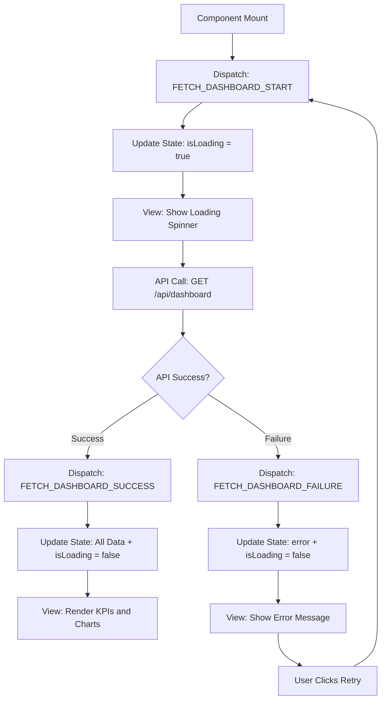
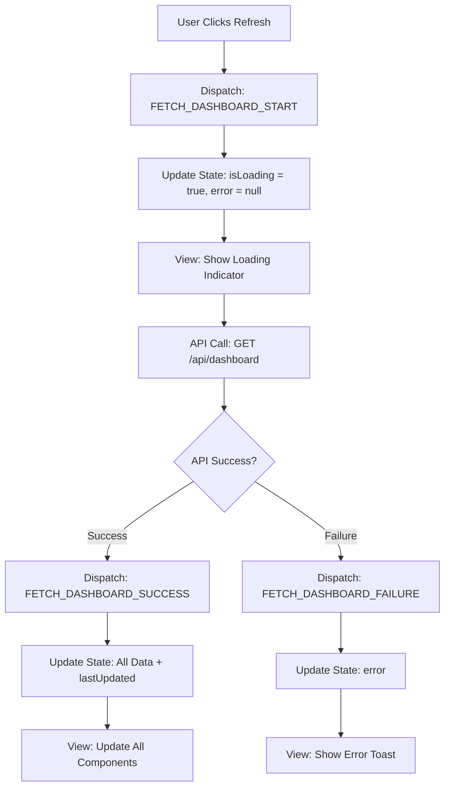
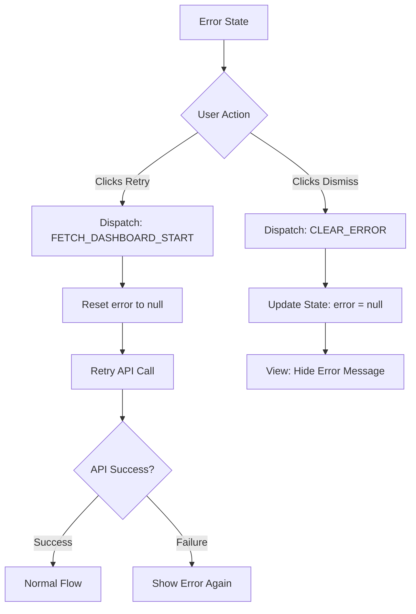
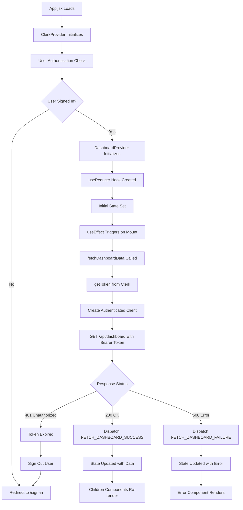
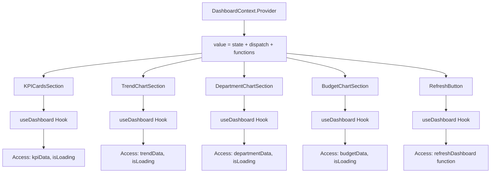
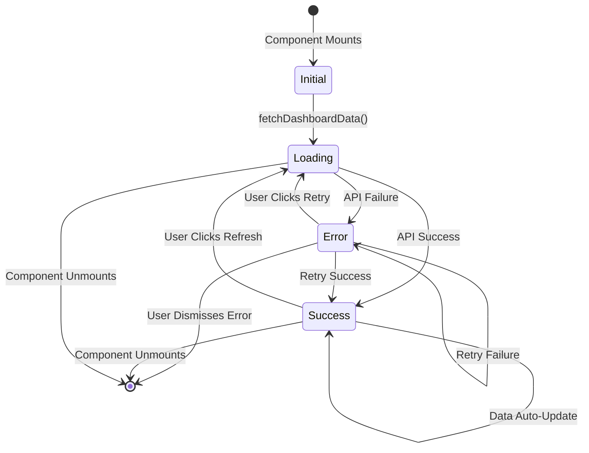

# State Management Design: Dashboard Home Page

> **Page**: `/dashboard`
> **Pattern**: Context + useReducer (Flux)
> **Purpose**: Main dashboard displaying KPIs, trends, and visualizations

---

## 1. State Data (Managed by useReducer)

All data that changes based on user actions or API responses:

| State Variable | Type | Initial Value | Description |
|----------------|------|---------------|-------------|
| `kpiData` | Object | `null` | KPI metrics (총 실적, 논문 수, 학생 수, 예산 현황) |
| `trendData` | Array | `[]` | Time series data for line chart |
| `departmentData` | Array | `[]` | Department performance data for bar chart |
| `budgetData` | Array | `[]` | Budget allocation data for pie chart |
| `isLoading` | Boolean | `true` | Loading state for initial data fetch |
| `error` | Object | `null` | Error object with message and code |
| `lastUpdated` | String | `null` | ISO timestamp of last data refresh |

### State Structure

```javascript
const initialState = {
  kpiData: null,
  trendData: [],
  departmentData: [],
  budgetData: [],
  isLoading: true,
  error: null,
  lastUpdated: null,
};
```

---

## 2. Non-State Data (Props or Derived)

Data that is displayed but NOT managed by state:

| Data | Source | Description |
|------|--------|-------------|
| User info (name, email) | Clerk Context | Current authenticated user |
| Current date/time | JavaScript Date | For display purposes |
| Chart colors | Theme constant | Static color palette |
| Chart labels | i18n / constants | Static labels for charts |
| Page title | Constants | "대시보드" |
| Navigation menu items | Constants | Static menu structure |

---

## 3. State Change Conditions

| State | Condition for Change | How Screen Changes |
|-------|---------------------|-------------------|
| `isLoading` | **true → false**: API call completes (success or failure)<br>**false → true**: Manual refresh triggered | Show/hide loading spinner or skeleton UI |
| `kpiData` | API returns KPI metrics successfully | Update 4 KPI cards with new values |
| `trendData` | API returns trend data successfully | Re-render line chart with new data points |
| `departmentData` | API returns department performance data | Re-render bar chart with new department bars |
| `budgetData` | API returns budget allocation data | Re-render pie chart with new segments |
| `error` | **null → error**: API call fails<br>**error → null**: User dismisses error or retry succeeds | Show/hide error message with retry button |
| `lastUpdated` | API call completes successfully | Update timestamp display in footer/header |

---

## 4. Action → Store → View Flow (Flux Pattern)

### Mermaid Diagram: Main Data Loading Flow



### Mermaid Diagram: Refresh Flow



### Mermaid Diagram: Error Recovery Flow



---

## 5. Context Data Loading Flow

### Mermaid Diagram: Context Provider Flow



### Mermaid Diagram: Context Propagation to Children



---

## 6. Reducer Actions

### Action Types

```javascript
const ActionTypes = {
  FETCH_DASHBOARD_START: 'FETCH_DASHBOARD_START',
  FETCH_DASHBOARD_SUCCESS: 'FETCH_DASHBOARD_SUCCESS',
  FETCH_DASHBOARD_FAILURE: 'FETCH_DASHBOARD_FAILURE',
  CLEAR_ERROR: 'CLEAR_ERROR',
};
```

### Action Creators

```javascript
// Action payloads structure (interface-level only)

// 1. FETCH_DASHBOARD_START
{
  type: 'FETCH_DASHBOARD_START',
  payload: null
}

// 2. FETCH_DASHBOARD_SUCCESS
{
  type: 'FETCH_DASHBOARD_SUCCESS',
  payload: {
    kpiData: {
      totalPerformance: number,
      publicationCount: number,
      studentCount: number,
      budgetStatus: {
        total: number,
        executed: number,
        rate: number
      }
    },
    trendData: [
      { year: number, value: number },
      ...
    ],
    departmentData: [
      { department: string, value: number },
      ...
    ],
    budgetData: [
      { category: string, value: number },
      ...
    ],
    lastUpdated: string (ISO timestamp)
  }
}

// 3. FETCH_DASHBOARD_FAILURE
{
  type: 'FETCH_DASHBOARD_FAILURE',
  payload: {
    message: string,
    code: string,
    statusCode: number
  }
}

// 4. CLEAR_ERROR
{
  type: 'CLEAR_ERROR',
  payload: null
}
```

### Reducer Function Signature

```javascript
function dashboardReducer(state, action) {
  switch (action.type) {
    case 'FETCH_DASHBOARD_START':
      // Set isLoading = true, error = null

    case 'FETCH_DASHBOARD_SUCCESS':
      // Set all data, isLoading = false, error = null, lastUpdated

    case 'FETCH_DASHBOARD_FAILURE':
      // Set error, isLoading = false

    case 'CLEAR_ERROR':
      // Set error = null

    default:
      return state;
  }
}
```

---

## 7. Context Provider Interface

### Provider Structure

```javascript
// DashboardProvider.jsx

const DashboardContext = createContext();

export const DashboardProvider = ({ children }) => {
  const [state, dispatch] = useReducer(dashboardReducer, initialState);
  const { getToken } = useAuth();
  const { getAuthenticatedClient } = useApiClient();

  // Exposed functions (see section 8)
  const value = {
    // State
    ...state,

    // Actions
    fetchDashboardData,
    refreshDashboard,
    clearError,
  };

  return (
    <DashboardContext.Provider value={value}>
      {children}
    </DashboardContext.Provider>
  );
};

// Custom Hook
export const useDashboard = () => {
  const context = useContext(DashboardContext);
  if (!context) {
    throw new Error('useDashboard must be used within DashboardProvider');
  }
  return context;
};
```

---

## 8. Variables and Functions Exposed to Child Components

### State Variables (Read-Only)

| Variable | Type | Description | Usage in Children |
|----------|------|-------------|------------------|
| `kpiData` | Object | KPI metrics | KPICard components read specific values |
| `trendData` | Array | Trend data points | LineChart component consumes |
| `departmentData` | Array | Department performance | BarChart component consumes |
| `budgetData` | Array | Budget allocation | PieChart component consumes |
| `isLoading` | Boolean | Loading state | All components show loading UI |
| `error` | Object | Error details | ErrorBoundary component displays |
| `lastUpdated` | String | Last update timestamp | Footer displays formatted time |

### Action Functions

| Function | Parameters | Return | Description | Usage |
|----------|-----------|--------|-------------|-------|
| `fetchDashboardData()` | None | Promise | Fetches all dashboard data from API | Called on mount and manual refresh |
| `refreshDashboard()` | None | Promise | Same as fetchDashboardData, with user feedback | Called by refresh button |
| `clearError()` | None | void | Clears error state | Called when user dismisses error |

### Function Signatures (Interface-Level)

```javascript
// 1. fetchDashboardData
async function fetchDashboardData() {
  // Dispatch FETCH_DASHBOARD_START
  // Get authenticated API client
  // Call GET /api/dashboard
  // On success: Dispatch FETCH_DASHBOARD_SUCCESS with data
  // On failure: Dispatch FETCH_DASHBOARD_FAILURE with error
}

// 2. refreshDashboard
async function refreshDashboard() {
  // Same as fetchDashboardData
  // Additionally: Show success toast after completion
}

// 3. clearError
function clearError() {
  // Dispatch CLEAR_ERROR
}
```

---

## 9. Child Component Usage Examples

### Example 1: KPICard Component

```javascript
import { useDashboard } from '../../context/DashboardContext';

const KPICardsSection = () => {
  const { kpiData, isLoading, error } = useDashboard();

  if (isLoading) {
    return <LoadingSkeleton />;
  }

  if (error) {
    return <ErrorMessage error={error} />;
  }

  return (
    <Grid container spacing={3}>
      <Grid item xs={12} sm={6} md={3}>
        <KPICard
          title="총 실적"
          value={kpiData.totalPerformance}
        />
      </Grid>
      {/* ... other KPI cards */}
    </Grid>
  );
};
```

### Example 2: TrendChart Component

```javascript
import { useDashboard } from '../../context/DashboardContext';
import { LineChart } from '../../components/charts/LineChart';
import { transformToLineChartData } from '../../services/dataTransformer';

const TrendChartSection = () => {
  const { trendData, isLoading } = useDashboard();

  if (isLoading) {
    return <ChartSkeleton />;
  }

  const chartData = transformToLineChartData(trendData, 'year', 'value');

  return (
    <Card>
      <CardHeader title="기간별 추이" />
      <CardContent>
        <LineChart data={chartData} />
      </CardContent>
    </Card>
  );
};
```

### Example 3: RefreshButton Component

```javascript
import { useDashboard } from '../../context/DashboardContext';

const RefreshButton = () => {
  const { refreshDashboard, isLoading } = useDashboard();

  const handleRefresh = async () => {
    await refreshDashboard();
    // Toast notification handled by context
  };

  return (
    <Button
      onClick={handleRefresh}
      disabled={isLoading}
      startIcon={<RefreshIcon />}
    >
      새로고침
    </Button>
  );
};
```

### Example 4: ErrorBoundary Component

```javascript
import { useDashboard } from '../../context/DashboardContext';

const DashboardErrorBoundary = () => {
  const { error, clearError, fetchDashboardData } = useDashboard();

  if (!error) return null;

  return (
    <Alert
      severity="error"
      action={
        <>
          <Button onClick={fetchDashboardData}>재시도</Button>
          <Button onClick={clearError}>닫기</Button>
        </>
      }
    >
      {error.message}
    </Alert>
  );
};
```

---

## 10. API Integration

### API Endpoint

```
GET /api/dashboard
Authorization: Bearer {jwt_token}
```

### Response Structure (Contract)

```json
{
  "kpiData": {
    "totalPerformance": 85.5,
    "publicationCount": 124,
    "studentCount": 1543,
    "budgetStatus": {
      "total": 5000000000,
      "executed": 3500000000,
      "rate": 70.0
    }
  },
  "trendData": [
    { "year": 2020, "value": 75.2 },
    { "year": 2021, "value": 78.5 },
    { "year": 2022, "value": 82.1 },
    { "year": 2023, "value": 85.5 }
  ],
  "departmentData": [
    { "department": "컴퓨터공학과", "value": 92.3 },
    { "department": "전자공학과", "value": 88.7 },
    { "department": "기계공학과", "value": 85.1 }
  ],
  "budgetData": [
    { "category": "인건비", "value": 2000000000 },
    { "category": "연구비", "value": 1500000000 },
    { "category": "운영비", "value": 1000000000 }
  ],
  "lastUpdated": "2025-11-02T10:30:00Z"
}
```

### Error Response Structure

```json
{
  "error": {
    "message": "Failed to fetch dashboard data",
    "code": "FETCH_ERROR",
    "statusCode": 500
  }
}
```

---

## 11. Component Tree Structure

```
DashboardPage
├── DashboardProvider (Context)
│   ├── PageHeader
│   │   ├── Title
│   │   ├── LastUpdatedTime (uses: lastUpdated)
│   │   └── RefreshButton (uses: refreshDashboard, isLoading)
│   │
│   ├── DashboardErrorBoundary (uses: error, clearError, fetchDashboardData)
│   │
│   ├── KPICardsSection (uses: kpiData, isLoading)
│   │   ├── KPICard (총 실적)
│   │   ├── KPICard (논문 게재 수)
│   │   ├── KPICard (학생 수)
│   │   └── KPICard (예산 현황)
│   │
│   ├── ChartsSection
│   │   ├── TrendChartSection (uses: trendData, isLoading)
│   │   ├── DepartmentChartSection (uses: departmentData, isLoading)
│   │   └── BudgetChartSection (uses: budgetData, isLoading)
│   │
│   └── PageFooter
│       └── LastUpdatedInfo (uses: lastUpdated)
```

---

## 12. State Lifecycle

### Mermaid Diagram: Complete State Lifecycle



---

## 13. DRY Principles Applied

### Reusable Patterns

1. **Single Source of Truth**: All dashboard data managed in one context
2. **Unified Error Handling**: Single error state handles all API failures
3. **Loading State**: Single `isLoading` flag controls all loading UIs
4. **Action Pattern**: Consistent action structure (START → SUCCESS/FAILURE)
5. **API Client**: Shared `getAuthenticatedClient` from common hook
6. **Data Transformation**: Reusable transformers from `dataTransformer.js`

### Avoided Duplication

- No duplicate API calls in child components
- No separate loading states per component
- No separate error boundaries per section
- No duplicate token management
- No repeated data transformation logic

---

## 14. Performance Considerations

### Optimization Strategies

1. **Memoization**: Child components should use `React.memo` to prevent unnecessary re-renders
2. **Lazy Loading**: Charts load only when visible (use Intersection Observer)
3. **Data Caching**: Consider caching API response for 5 minutes (future enhancement)
4. **Skeleton UI**: Show skeleton instead of spinner for better perceived performance
5. **Code Splitting**: Lazy load chart libraries

---

## 15. Testing Considerations

### State Testing Checklist

- [ ] Initial state is correctly set
- [ ] FETCH_DASHBOARD_START sets isLoading to true
- [ ] FETCH_DASHBOARD_SUCCESS updates all data fields
- [ ] FETCH_DASHBOARD_FAILURE sets error state
- [ ] CLEAR_ERROR resets error to null
- [ ] Multiple sequential actions work correctly
- [ ] Context provides correct values to children
- [ ] useDashboard hook throws error outside provider

### Integration Testing Checklist

- [ ] API call triggers on component mount
- [ ] Loading UI shows during fetch
- [ ] KPI cards display correct data
- [ ] Charts render with correct data
- [ ] Refresh button triggers re-fetch
- [ ] Error UI shows on API failure
- [ ] Retry button recovers from error
- [ ] Token expiration redirects to login

---

## 16. Future Enhancements (Out of Scope)

- Filters by date range or department
- Real-time data updates via WebSocket
- Data export functionality
- Custom dashboard layouts
- User preferences persistence
- Advanced chart interactions (drill-down)

---

## Appendix: Related Documents

- [PRD](/Users/paul/edu/awesomedev/final_report/docs/prd.md)
- [Userflow](/Users/paul/edu/awesomedev/final_report/docs/userflow.md)
- [Database Design](/Users/paul/edu/awesomedev/final_report/docs/database.md)
- [Common Modules](/Users/paul/edu/awesomedev/final_report/docs/common-modules.md)
- [Use Case 004](/Users/paul/edu/awesomedev/final_report/docs/usecase/004/spec.md)
