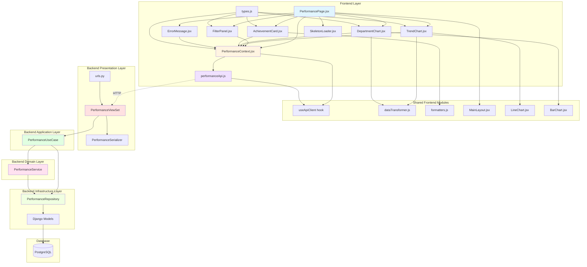

# Implementation Plan: Performance Analysis Page (`/dashboard/performance`)

> **Use Case**: UC-005 실적 분석 조회
> **State Pattern**: Context + useReducer (Flux)
> **Related Documents**: [State Design](./state.md), [Use Case Spec](/docs/usecase/005/spec.md)

---

## Overview

### Module List

| # | Module Name | Location | Type | Description |
|---|-------------|----------|------|-------------|
| **Backend** |
| 1 | Performance ViewSet | `backend/apps/data_dashboard/presentation/views.py` | Presentation | API endpoint for performance data |
| 2 | Performance Serializers | `backend/apps/data_dashboard/presentation/serializers.py` | Presentation | Data serialization/validation |
| 3 | Performance Use Cases | `backend/apps/data_dashboard/application/use_cases.py` | Application | Business flow orchestration |
| 4 | Performance Service | `backend/apps/data_dashboard/domain/services.py` | Domain | Business logic for calculations |
| 5 | Performance Repository | `backend/apps/data_dashboard/infrastructure/repositories.py` | Infrastructure | Data access layer |
| 6 | Performance URL Routes | `backend/apps/data_dashboard/presentation/urls.py` | Presentation | URL routing configuration |
| **Frontend** |
| 7 | PerformancePage | `frontend/src/pages/PerformancePage.jsx` | Page | Main page container |
| 8 | PerformanceContext | `frontend/src/pages/PerformancePage/PerformanceContext.jsx` | State | Context provider with reducer |
| 9 | FilterPanel | `frontend/src/pages/PerformancePage/components/FilterPanel.jsx` | Component | Filter UI component |
| 10 | TrendChart | `frontend/src/pages/PerformancePage/components/TrendChart.jsx` | Component | Time series line chart |
| 11 | DepartmentChart | `frontend/src/pages/PerformancePage/components/DepartmentChart.jsx` | Component | Department comparison bar chart |
| 12 | AchievementCard | `frontend/src/pages/PerformancePage/components/AchievementCard.jsx` | Component | Achievement rate display |
| 13 | ErrorMessage | `frontend/src/pages/PerformancePage/components/ErrorMessage.jsx` | Component | Error handling UI |
| 14 | SkeletonLoader | `frontend/src/pages/PerformancePage/components/SkeletonLoader.jsx` | Component | Loading state UI |
| **Shared/Utils** |
| 15 | Performance API Client | `frontend/src/api/performanceApi.js` | API | API call functions |
| 16 | Performance Types | `frontend/src/pages/PerformancePage/types.js` | Types | TypeScript/PropTypes definitions |
| **Testing** |
| 17 | Backend Unit Tests | `backend/apps/data_dashboard/tests/unit/test_performance.py` | Test | Unit tests for backend |
| 18 | Frontend Unit Tests | `frontend/src/pages/PerformancePage/__tests__/` | Test | Unit tests for frontend |
| 19 | QA Test Sheet | `docs/pages/2-performance-analysis/qa-sheet.md` | QA | Manual testing checklist |

---

## Module Relationships Diagram



---

## Implementation Plan

### Phase 1: Backend Foundation

#### Module 1: Performance Repository (Infrastructure Layer)

**File**: `backend/apps/data_dashboard/infrastructure/repositories.py`

**Purpose**: Data access layer for performance-related queries

**Implementation**:

```python
class PerformanceRepository:
    """Repository for performance data access"""

    def get_performance_trend(
        self,
        start_date: date,
        end_date: date,
        department: Optional[str] = None,
        project: Optional[str] = None
    ) -> List[Dict]:
        """
        Get performance trend data over time period

        Query: database.md section 4.2
        - Groups by year/month
        - Filters by date range and optional filters
        - Returns aggregated performance metrics
        """
        pass

    def get_department_comparison(
        self,
        start_date: date,
        end_date: date,
        project: Optional[str] = None
    ) -> List[Dict]:
        """
        Get department-wise performance comparison

        Query: database.md section 4.2
        - Groups by department
        - Aggregates performance values
        - Orders by performance DESC
        """
        pass

    def get_achievement_rate(
        self,
        start_date: date,
        end_date: date,
        department: Optional[str] = None
    ) -> Dict:
        """
        Calculate achievement rate against targets

        Business Rule: BR-3 from usecase spec
        - Actual vs Target calculation
        - Status determination (success/warning/danger)
        """
        pass
```

**Dependencies**:
- Django ORM models: `DepartmentKPI`, `ResearchBudgetData`
- Python standard library: `datetime`, `typing`

**Testing**:
- Unit test: Query correctness with mock data
- Unit test: Filter application validation
- Unit test: Edge case - no data in date range

---

#### Module 2: Performance Service (Domain Layer)

**File**: `backend/apps/data_dashboard/domain/services.py`

**Purpose**: Business logic for performance calculations and data processing

**Implementation**:

```python
class PerformanceService:
    """Domain service for performance business logic"""

    def __init__(self, repository: PerformanceRepository):
        self.repository = repository

    def calculate_achievement_rate(
        self,
        actual: Decimal,
        target: Decimal
    ) -> Dict:
        """
        Calculate achievement rate and determine status

        Business Rule: BR-3
        - Rate = (actual / target) * 100
        - Status: >= 100 = success, >= 80 = warning, < 80 = danger
        - Handle division by zero
        """
        if not target or target == 0:
            return {
                'actual': actual,
                'target': target,
                'rate': None,
                'status': 'unknown'
            }

        rate = (actual / target) * 100

        if rate >= 100:
            status = 'success'
        elif rate >= 80:
            status = 'warning'
        else:
            status = 'danger'

        return {
            'actual': float(actual),
            'target': float(target),
            'rate': float(rate),
            'status': status
        }

    def aggregate_trend_data(
        self,
        raw_data: List[Dict],
        interval: str = 'month'
    ) -> List[Dict]:
        """
        Aggregate performance data by time interval

        Business Rule: BR-4
        - Monthly aggregation by default
        - Sum values within each period
        """
        pass

    def calculate_department_percentages(
        self,
        department_data: List[Dict]
    ) -> List[Dict]:
        """
        Calculate percentage contribution of each department

        - Total = sum of all department values
        - Percentage = (dept_value / total) * 100
        """
        pass
```

**Dependencies**:
- Repository: `PerformanceRepository`
- Utils: `backend/utils/formatters.py`

**Testing**:
- Unit test: Achievement rate calculation
- Unit test: Status determination logic
- Unit test: Division by zero handling
- Unit test: Percentage calculation accuracy

---

#### Module 3: Performance Use Case (Application Layer)

**File**: `backend/apps/data_dashboard/application/use_cases.py`

**Purpose**: Orchestrate the complete performance data retrieval flow

**Implementation**:

```python
class GetPerformanceDataUseCase:
    """
    Use case: Retrieve performance analysis data

    Orchestrates:
    1. Filter validation
    2. Data retrieval from repository
    3. Business logic application via service
    4. Response formatting
    """

    def __init__(
        self,
        repository: PerformanceRepository,
        service: PerformanceService
    ):
        self.repository = repository
        self.service = service

    def execute(
        self,
        start_date: date,
        end_date: date,
        department: Optional[str] = None,
        project: Optional[str] = None
    ) -> Dict:
        """
        Execute the performance data retrieval use case

        Returns:
        {
            'trendData': [...],
            'departmentData': [...],
            'achievementData': {...}
        }
        """
        # 1. Validate filters (BR-2)
        self._validate_date_range(start_date, end_date)

        # 2. Fetch raw data
        trend_data = self.repository.get_performance_trend(
            start_date, end_date, department, project
        )

        department_data = self.repository.get_department_comparison(
            start_date, end_date, project
        )

        achievement_raw = self.repository.get_achievement_rate(
            start_date, end_date, department
        )

        # 3. Apply business logic
        trend_aggregated = self.service.aggregate_trend_data(trend_data)
        dept_with_percentages = self.service.calculate_department_percentages(
            department_data
        )
        achievement_calculated = self.service.calculate_achievement_rate(
            achievement_raw['actual'],
            achievement_raw['target']
        )

        # 4. Return formatted response
        return {
            'trendData': trend_aggregated,
            'departmentData': dept_with_percentages,
            'achievementData': achievement_calculated
        }

    def _validate_date_range(self, start_date: date, end_date: date):
        """Validate date range according to BR-2"""
        if start_date > end_date:
            raise ValidationError("Start date must be before end date")

        year_diff = (end_date - start_date).days / 365
        if year_diff > 5:
            raise ValidationError("Maximum query period is 5 years")
```

**Dependencies**:
- Repository: `PerformanceRepository`
- Service: `PerformanceService`
- Exceptions: `core.exceptions.ValidationError`

**Testing**:
- Unit test: Date range validation
- Unit test: Complete flow with mock dependencies
- Unit test: Error handling for invalid filters

---

#### Module 4: Performance Serializers (Presentation Layer)

**File**: `backend/apps/data_dashboard/presentation/serializers.py`

**Purpose**: Request validation and response serialization

**Implementation**:

```python
from rest_framework import serializers

class PerformanceFilterSerializer(serializers.Serializer):
    """Validates incoming filter parameters"""

    start_date = serializers.DateField(
        required=False,
        help_text="Start date (YYYY-MM-DD)"
    )
    end_date = serializers.DateField(
        required=False,
        help_text="End date (YYYY-MM-DD)"
    )
    department = serializers.CharField(
        required=False,
        allow_null=True,
        max_length=100
    )
    project = serializers.CharField(
        required=False,
        allow_null=True,
        max_length=50
    )

    def validate(self, data):
        """Custom validation for date range"""
        start_date = data.get('start_date')
        end_date = data.get('end_date')

        if start_date and end_date:
            if start_date > end_date:
                raise serializers.ValidationError(
                    "Start date must be before end date"
                )

        return data


class TrendDataPointSerializer(serializers.Serializer):
    """Serializes a single trend data point"""
    date = serializers.CharField()
    value = serializers.FloatField()
    target = serializers.FloatField(required=False, allow_null=True)


class DepartmentDataPointSerializer(serializers.Serializer):
    """Serializes a single department data point"""
    department = serializers.CharField()
    value = serializers.FloatField()
    percentage = serializers.FloatField(required=False, allow_null=True)


class AchievementDataSerializer(serializers.Serializer):
    """Serializes achievement rate data"""
    actual = serializers.FloatField()
    target = serializers.FloatField()
    rate = serializers.FloatField(allow_null=True)
    status = serializers.ChoiceField(
        choices=['success', 'warning', 'danger', 'unknown']
    )


class PerformanceResponseSerializer(serializers.Serializer):
    """Serializes the complete performance response"""
    trendData = TrendDataPointSerializer(many=True)
    departmentData = DepartmentDataPointSerializer(many=True)
    achievementData = AchievementDataSerializer()
```

**Dependencies**:
- Django Rest Framework serializers

**Testing**:
- Unit test: Filter validation
- Unit test: Serialization output format
- Unit test: Invalid date range error

---

#### Module 5: Performance ViewSet (Presentation Layer)

**File**: `backend/apps/data_dashboard/presentation/views.py`

**Purpose**: API endpoint for performance data

**Implementation**:

```python
from rest_framework import viewsets, status
from rest_framework.decorators import action
from rest_framework.response import Response
from rest_framework.permissions import IsAuthenticated
from datetime import datetime, timedelta

class PerformanceViewSet(viewsets.ViewSet):
    """
    API endpoints for performance analysis

    GET /api/performance/
    Query params: startDate, endDate, department, project
    """

    permission_classes = [IsAuthenticated]

    def __init__(self, **kwargs):
        super().__init__(**kwargs)
        # Dependency injection (will be set up in apps.py)
        self.use_case = None  # GetPerformanceDataUseCase

    def list(self, request):
        """
        GET /api/performance/

        Returns performance analysis data with optional filters
        """
        # 1. Validate filters
        filter_serializer = PerformanceFilterSerializer(
            data=request.query_params
        )
        filter_serializer.is_valid(raise_exception=True)

        # 2. Set default dates if not provided
        filters = filter_serializer.validated_data
        end_date = filters.get('end_date') or datetime.now().date()
        start_date = filters.get('start_date') or (
            end_date - timedelta(days=365)
        )

        # 3. Execute use case
        try:
            result = self.use_case.execute(
                start_date=start_date,
                end_date=end_date,
                department=filters.get('department'),
                project=filters.get('project')
            )
        except ValidationError as e:
            return Response(
                {'error': str(e)},
                status=status.HTTP_400_BAD_REQUEST
            )
        except Exception as e:
            return Response(
                {'error': 'Failed to fetch performance data'},
                status=status.HTTP_500_INTERNAL_SERVER_ERROR
            )

        # 4. Serialize response
        serializer = PerformanceResponseSerializer(data=result)
        serializer.is_valid(raise_exception=True)

        return Response(serializer.data, status=status.HTTP_200_OK)
```

**Dependencies**:
- DRF: `viewsets`, `Response`, `IsAuthenticated`
- Use Case: `GetPerformanceDataUseCase`
- Serializers: `PerformanceFilterSerializer`, `PerformanceResponseSerializer`
- Middleware: `ClerkAuthenticationMiddleware` (auto-applied)

**Testing**:
- Integration test: Successful data retrieval
- Integration test: Filter application
- Integration test: Auth required (401)
- Integration test: Invalid filters (400)

---

#### Module 6: URL Routes

**File**: `backend/apps/data_dashboard/presentation/urls.py`

**Purpose**: Route configuration for performance endpoints

**Implementation**:

```python
from rest_framework.routers import DefaultRouter
from .views import PerformanceViewSet

router = DefaultRouter()
router.register(r'performance', PerformanceViewSet, basename='performance')

urlpatterns = router.urls
```

**Dependencies**:
- DRF Router
- PerformanceViewSet

---

### Phase 2: Frontend Foundation

#### Module 7: Performance API Client

**File**: `frontend/src/api/performanceApi.js`

**Purpose**: Centralize API calls for performance data

**Implementation**:

```javascript
/**
 * Performance API client
 *
 * Provides functions to interact with performance endpoints
 */

/**
 * Fetch performance data with filters
 *
 * @param {Object} client - Authenticated axios client
 * @param {Object} filters - Filter parameters
 * @param {string} filters.startDate - Start date (YYYY-MM-DD)
 * @param {string} filters.endDate - End date (YYYY-MM-DD)
 * @param {string} [filters.department] - Department filter
 * @param {string} [filters.project] - Project filter
 * @returns {Promise<Object>} Performance data
 */
export const fetchPerformanceData = async (client, filters = {}) => {
  const params = new URLSearchParams();

  if (filters.startDate) params.append('startDate', filters.startDate);
  if (filters.endDate) params.append('endDate', filters.endDate);
  if (filters.department) params.append('department', filters.department);
  if (filters.project) params.append('project', filters.project);

  const response = await client.get(
    `/performance/?${params.toString()}`
  );

  return response.data;
};

/**
 * Fetch available departments for filter options
 *
 * @param {Object} client - Authenticated axios client
 * @returns {Promise<Array>} List of departments
 */
export const fetchDepartments = async (client) => {
  const response = await client.get('/departments/');
  return response.data;
};

/**
 * Fetch available projects for filter options
 *
 * @param {Object} client - Authenticated axios client
 * @returns {Promise<Array>} List of projects
 */
export const fetchProjects = async (client) => {
  const response = await client.get('/projects/');
  return response.data;
};
```

**Dependencies**:
- Shared: `useApiClient` hook
- Axios client from `api/client.js`

**Testing**:
- Unit test: Query parameter building
- Integration test: API call with mock server

---

#### Module 8: Performance Types

**File**: `frontend/src/pages/PerformancePage/types.js`

**Purpose**: Type definitions and PropTypes for type safety

**Implementation**:

```javascript
import PropTypes from 'prop-types';

/**
 * Trend data point type
 */
export const TrendDataPointType = PropTypes.shape({
  date: PropTypes.string.isRequired,
  value: PropTypes.number.isRequired,
  target: PropTypes.number,
});

/**
 * Department data point type
 */
export const DepartmentDataPointType = PropTypes.shape({
  department: PropTypes.string.isRequired,
  value: PropTypes.number.isRequired,
  percentage: PropTypes.number,
});

/**
 * Achievement data type
 */
export const AchievementDataType = PropTypes.shape({
  actual: PropTypes.number.isRequired,
  target: PropTypes.number.isRequired,
  rate: PropTypes.number,
  status: PropTypes.oneOf(['success', 'warning', 'danger', 'unknown']).isRequired,
});

/**
 * Performance data type (complete)
 */
export const PerformanceDataType = PropTypes.shape({
  trendData: PropTypes.arrayOf(TrendDataPointType).isRequired,
  departmentData: PropTypes.arrayOf(DepartmentDataPointType).isRequired,
  achievementData: AchievementDataType.isRequired,
});

/**
 * Filter state type
 */
export const FilterStateType = PropTypes.shape({
  startDate: PropTypes.string.isRequired,
  endDate: PropTypes.string.isRequired,
  department: PropTypes.string,
  project: PropTypes.string,
});

/**
 * Loading state type
 */
export const LoadingStateType = PropTypes.shape({
  initial: PropTypes.bool.isRequired,
  filter: PropTypes.bool.isRequired,
});

/**
 * Error state type
 */
export const ErrorStateType = PropTypes.shape({
  type: PropTypes.oneOf(['network', 'auth', 'validation', 'data']).isRequired,
  message: PropTypes.string.isRequired,
});
```

**Dependencies**:
- PropTypes library

---

#### Module 9: Performance Context

**File**: `frontend/src/pages/PerformancePage/PerformanceContext.jsx`

**Purpose**: State management using Context + useReducer pattern

**Implementation**: See state.md for complete implementation details

**Key Features**:
- useReducer with 7 action types
- Context provider wrapping page
- Exposed state and action functions
- URL synchronization
- Error handling
- Loading state management

**Dependencies**:
- React: `createContext`, `useContext`, `useReducer`, `useEffect`
- Hooks: `useApiClient`, `useAuth`
- API: `performanceApi.js`
- Router: `react-router-dom`

**Testing**:
- Unit test: Reducer state transitions
- Unit test: Action creators
- Integration test: Context provider
- Integration test: URL synchronization

---

#### Module 10: PerformancePage Component

**File**: `frontend/src/pages/PerformancePage.jsx`

**Purpose**: Main page container orchestrating all components

**Implementation**:

```javascript
import React from 'react';
import { Box, Container, Typography, Grid } from '@mui/material';
import { MainLayout } from '../../layouts/MainLayout';
import { PerformanceProvider, usePerformanceContext } from './PerformanceContext';
import FilterPanel from './components/FilterPanel';
import TrendChart from './components/TrendChart';
import DepartmentChart from './components/DepartmentChart';
import AchievementCard from './components/AchievementCard';
import ErrorMessage from './components/ErrorMessage';
import SkeletonLoader from './components/SkeletonLoader';

/**
 * Performance Analysis Page
 *
 * Route: /dashboard/performance
 * Use Case: UC-005
 */
function PerformancePageContent() {
  const { state } = usePerformanceContext();
  const { loadingState, error } = state;

  // Initial loading state
  if (loadingState.initial) {
    return <SkeletonLoader />;
  }

  // Error state
  if (error) {
    return <ErrorMessage />;
  }

  // Success state - render all components
  return (
    <Box>
      {/* Page Header */}
      <Box mb={3}>
        <Typography variant="h4" component="h1" gutterBottom>
          실적 분석
        </Typography>
        <Typography variant="body2" color="textSecondary">
          부서별 및 프로젝트별 실적 데이터를 분석합니다
        </Typography>
      </Box>

      {/* Filter Panel */}
      <FilterPanel />

      {/* Charts Grid */}
      <Grid container spacing={3} mt={2}>
        {/* Trend Chart - Full Width */}
        <Grid item xs={12}>
          <TrendChart />
        </Grid>

        {/* Department Chart - 8 columns */}
        <Grid item xs={12} md={8}>
          <DepartmentChart />
        </Grid>

        {/* Achievement Card - 4 columns */}
        <Grid item xs={12} md={4}>
          <AchievementCard />
        </Grid>
      </Grid>
    </Box>
  );
}

export default function PerformancePage() {
  return (
    <MainLayout>
      <Container maxWidth="lg">
        <PerformanceProvider>
          <PerformancePageContent />
        </PerformanceProvider>
      </Container>
    </MainLayout>
  );
}
```

**Dependencies**:
- MUI: `Box`, `Container`, `Typography`, `Grid`
- Layout: `MainLayout`
- Context: `PerformanceProvider`, `usePerformanceContext`
- Child components: All performance page components

**Testing**:
- Integration test: Page renders correctly
- Integration test: Shows loading state
- Integration test: Shows error state
- Integration test: Shows data state

---

#### Module 11: FilterPanel Component

**File**: `frontend/src/pages/PerformancePage/components/FilterPanel.jsx`

**Purpose**: UI for applying filters to performance data

**Implementation**:

```javascript
import React, { useState, useEffect } from 'react';
import {
  Card,
  CardContent,
  Grid,
  TextField,
  MenuItem,
  Button,
  Box,
  Chip
} from '@mui/material';
import { FilterList, Refresh } from '@mui/icons-material';
import { usePerformanceContext } from '../PerformanceContext';
import { FilterStateType } from '../types';

/**
 * Filter Panel Component
 *
 * Allows users to filter performance data by:
 * - Date range (start/end date)
 * - Department
 * - Project
 */
export default function FilterPanel() {
  const { state, actions } = usePerformanceContext();
  const { filters, loadingState } = state;

  const [localFilters, setLocalFilters] = useState(filters);
  const [departments, setDepartments] = useState([]);
  const [projects, setProjects] = useState([]);

  // Load filter options on mount
  useEffect(() => {
    // TODO: Fetch departments and projects from API
    // For now using mock data
    setDepartments(['컴퓨터공학과', '전자공학과', '기계공학과']);
    setProjects(['Project A', 'Project B', 'Project C']);
  }, []);

  const handleDateChange = (field) => (event) => {
    setLocalFilters({
      ...localFilters,
      [field]: event.target.value
    });
  };

  const handleSelectChange = (field) => (event) => {
    setLocalFilters({
      ...localFilters,
      [field]: event.target.value || null
    });
  };

  const handleApply = () => {
    actions.updateFilters(localFilters);
  };

  const handleReset = () => {
    actions.resetFilters();
    setLocalFilters(state.filters); // Will be updated after reset
  };

  const isFilterActive = () => {
    return filters.department || filters.project;
  };

  return (
    <Card>
      <CardContent>
        <Box display="flex" alignItems="center" mb={2}>
          <FilterList sx={{ mr: 1 }} />
          <Typography variant="h6">필터</Typography>
        </Box>

        <Grid container spacing={2}>
          {/* Start Date */}
          <Grid item xs={12} sm={6} md={3}>
            <TextField
              fullWidth
              label="시작일"
              type="date"
              value={localFilters.startDate}
              onChange={handleDateChange('startDate')}
              InputLabelProps={{ shrink: true }}
              disabled={loadingState.filter}
            />
          </Grid>

          {/* End Date */}
          <Grid item xs={12} sm={6} md={3}>
            <TextField
              fullWidth
              label="종료일"
              type="date"
              value={localFilters.endDate}
              onChange={handleDateChange('endDate')}
              InputLabelProps={{ shrink: true }}
              disabled={loadingState.filter}
            />
          </Grid>

          {/* Department */}
          <Grid item xs={12} sm={6} md={3}>
            <TextField
              fullWidth
              select
              label="부서"
              value={localFilters.department || ''}
              onChange={handleSelectChange('department')}
              disabled={loadingState.filter}
            >
              <MenuItem value="">전체</MenuItem>
              {departments.map((dept) => (
                <MenuItem key={dept} value={dept}>
                  {dept}
                </MenuItem>
              ))}
            </TextField>
          </Grid>

          {/* Project */}
          <Grid item xs={12} sm={6} md={3}>
            <TextField
              fullWidth
              select
              label="프로젝트"
              value={localFilters.project || ''}
              onChange={handleSelectChange('project')}
              disabled={loadingState.filter}
            >
              <MenuItem value="">전체</MenuItem>
              {projects.map((proj) => (
                <MenuItem key={proj} value={proj}>
                  {proj}
                </MenuItem>
              ))}
            </TextField>
          </Grid>
        </Grid>

        {/* Action Buttons */}
        <Box display="flex" justifyContent="flex-end" gap={1} mt={2}>
          <Button
            variant="outlined"
            onClick={handleReset}
            disabled={loadingState.filter || !isFilterActive()}
          >
            초기화
          </Button>
          <Button
            variant="contained"
            startIcon={<FilterList />}
            onClick={handleApply}
            disabled={loadingState.filter}
          >
            {loadingState.filter ? '적용 중...' : '필터 적용'}
          </Button>
        </Box>

        {/* Active Filters Display */}
        {isFilterActive() && (
          <Box mt={2} display="flex" gap={1} flexWrap="wrap">
            {filters.department && (
              <Chip
                label={`부서: ${filters.department}`}
                onDelete={() => actions.updateFilters({ department: null })}
                size="small"
              />
            )}
            {filters.project && (
              <Chip
                label={`프로젝트: ${filters.project}`}
                onDelete={() => actions.updateFilters({ project: null })}
                size="small"
              />
            )}
          </Box>
        )}
      </CardContent>
    </Card>
  );
}

FilterPanel.propTypes = {
  // No props - uses context
};
```

**Dependencies**:
- MUI components
- Context: `usePerformanceContext`
- Types: `FilterStateType`

**Testing**:
- Unit test: Filter changes update local state
- Unit test: Apply button triggers action
- Unit test: Reset button clears filters
- Component test: Renders with context

---

#### Module 12: TrendChart Component

**File**: `frontend/src/pages/PerformancePage/components/TrendChart.jsx`

**Purpose**: Display time-series performance trend

**Implementation**:

```javascript
import React, { useMemo } from 'react';
import { Card, CardHeader, CardContent, Box, Typography } from '@mui/material';
import { TrendingUp } from '@mui/icons-material';
import { LineChart } from '../../../components/charts/LineChart';
import { transformToLineChartData } from '../../../services/dataTransformer';
import { usePerformanceContext } from '../PerformanceContext';

/**
 * Trend Chart Component
 *
 * Displays performance trend over time using line chart
 */
export default function TrendChart() {
  const { state } = usePerformanceContext();
  const { performanceData, loadingState } = state;

  // Memoize chart data transformation
  const chartData = useMemo(() => {
    if (!performanceData?.trendData || performanceData.trendData.length === 0) {
      return null;
    }

    return transformToLineChartData(
      performanceData.trendData,
      'date',
      'value'
    );
  }, [performanceData?.trendData]);

  const chartOptions = {
    responsive: true,
    plugins: {
      legend: {
        position: 'top',
      },
      title: {
        display: false,
      },
      tooltip: {
        callbacks: {
          label: (context) => {
            return `실적: ${context.parsed.y.toLocaleString()}`;
          }
        }
      }
    },
    scales: {
      y: {
        beginAtZero: true,
        ticks: {
          callback: (value) => value.toLocaleString()
        }
      }
    }
  };

  // Loading overlay
  if (loadingState.filter) {
    return (
      <Card>
        <CardHeader
          title="기간별 실적 추이"
          avatar={<TrendingUp />}
        />
        <CardContent>
          <Box
            display="flex"
            justifyContent="center"
            alignItems="center"
            minHeight={300}
          >
            <CircularProgress />
          </Box>
        </CardContent>
      </Card>
    );
  }

  // Empty state
  if (!chartData) {
    return (
      <Card>
        <CardHeader
          title="기간별 실적 추이"
          avatar={<TrendingUp />}
        />
        <CardContent>
          <Box
            display="flex"
            justifyContent="center"
            alignItems="center"
            minHeight={300}
          >
            <Typography color="textSecondary">
              표시할 데이터가 없습니다
            </Typography>
          </Box>
        </CardContent>
      </Card>
    );
  }

  return (
    <Card>
      <CardHeader
        title="기간별 실적 추이"
        avatar={<TrendingUp />}
        subheader="월별 실적 변화를 확인하세요"
      />
      <CardContent>
        <LineChart data={chartData} options={chartOptions} />
      </CardContent>
    </Card>
  );
}
```

**Dependencies**:
- MUI components
- Shared: `LineChart` component
- Shared: `transformToLineChartData` function
- Context: `usePerformanceContext`

**Testing**:
- Unit test: Data transformation
- Component test: Renders with data
- Component test: Shows loading state
- Component test: Shows empty state

---

#### Module 13: DepartmentChart Component

**File**: `frontend/src/pages/PerformancePage/components/DepartmentChart.jsx`

**Purpose**: Display department-wise performance comparison

**Implementation**:

```javascript
import React, { useMemo } from 'react';
import { Card, CardHeader, CardContent, Box, Typography } from '@mui/material';
import { BarChart as BarChartIcon } from '@mui/icons-material';
import { BarChart } from '../../../components/charts/BarChart';
import { transformToBarChartData } from '../../../services/dataTransformer';
import { usePerformanceContext } from '../PerformanceContext';

/**
 * Department Chart Component
 *
 * Displays department performance comparison using bar chart
 */
export default function DepartmentChart() {
  const { state } = usePerformanceContext();
  const { performanceData, loadingState } = state;

  const chartData = useMemo(() => {
    if (!performanceData?.departmentData ||
        performanceData.departmentData.length === 0) {
      return null;
    }

    return transformToBarChartData(
      performanceData.departmentData,
      'department',
      'value'
    );
  }, [performanceData?.departmentData]);

  const chartOptions = {
    responsive: true,
    plugins: {
      legend: {
        display: false,
      },
      tooltip: {
        callbacks: {
          label: (context) => {
            const dataPoint = performanceData.departmentData[context.dataIndex];
            const percentage = dataPoint.percentage
              ? ` (${dataPoint.percentage.toFixed(1)}%)`
              : '';
            return `실적: ${context.parsed.y.toLocaleString()}${percentage}`;
          }
        }
      }
    },
    scales: {
      y: {
        beginAtZero: true,
        ticks: {
          callback: (value) => value.toLocaleString()
        }
      }
    }
  };

  if (loadingState.filter) {
    return (
      <Card>
        <CardHeader
          title="부서별 실적 비교"
          avatar={<BarChartIcon />}
        />
        <CardContent>
          <Box display="flex" justifyContent="center" minHeight={300}>
            <CircularProgress />
          </Box>
        </CardContent>
      </Card>
    );
  }

  if (!chartData) {
    return (
      <Card>
        <CardHeader
          title="부서별 실적 비교"
          avatar={<BarChartIcon />}
        />
        <CardContent>
          <Box display="flex" justifyContent="center" minHeight={300}>
            <Typography color="textSecondary">
              표시할 데이터가 없습니다
            </Typography>
          </Box>
        </CardContent>
      </Card>
    );
  }

  return (
    <Card>
      <CardHeader
        title="부서별 실적 비교"
        avatar={<BarChartIcon />}
        subheader="부서별 실적을 비교하세요"
      />
      <CardContent>
        <BarChart data={chartData} options={chartOptions} />
      </CardContent>
    </Card>
  );
}
```

**Dependencies**:
- Same as TrendChart (BarChart instead of LineChart)

**Testing**:
- Same as TrendChart

---

#### Module 14: AchievementCard Component

**File**: `frontend/src/pages/PerformancePage/components/AchievementCard.jsx`

**Purpose**: Display achievement rate against target

**Implementation**:

```javascript
import React from 'react';
import {
  Card,
  CardHeader,
  CardContent,
  Box,
  Typography,
  LinearProgress,
  Chip
} from '@mui/material';
import { EmojiEvents } from '@mui/icons-material';
import { formatCurrency, formatPercentage } from '../../../utils/formatters';
import { usePerformanceContext } from '../PerformanceContext';

/**
 * Achievement Card Component
 *
 * Displays target achievement rate with visual indicators
 */
export default function AchievementCard() {
  const { state } = usePerformanceContext();
  const { performanceData } = state;

  if (!performanceData?.achievementData) {
    return null;
  }

  const { actual, target, rate, status } = performanceData.achievementData;

  // Color based on status (BR-3)
  const getStatusColor = () => {
    switch (status) {
      case 'success':
        return 'success';
      case 'warning':
        return 'warning';
      case 'danger':
        return 'error';
      default:
        return 'default';
    }
  };

  const getStatusLabel = () => {
    switch (status) {
      case 'success':
        return '목표 달성';
      case 'warning':
        return '주의';
      case 'danger':
        return '미달성';
      default:
        return '목표 미설정';
    }
  };

  return (
    <Card>
      <CardHeader
        title="목표 대비 달성률"
        avatar={<EmojiEvents />}
        action={
          <Chip
            label={getStatusLabel()}
            color={getStatusColor()}
            size="small"
          />
        }
      />
      <CardContent>
        {/* Achievement Rate */}
        <Box textAlign="center" mb={3}>
          <Typography variant="h2" component="div" color={getStatusColor()}>
            {rate !== null ? formatPercentage(rate) : 'N/A'}
          </Typography>
        </Box>

        {/* Progress Bar */}
        {rate !== null && (
          <Box mb={3}>
            <LinearProgress
              variant="determinate"
              value={Math.min(rate, 100)}
              color={getStatusColor()}
              sx={{ height: 10, borderRadius: 5 }}
            />
          </Box>
        )}

        {/* Actual vs Target */}
        <Box>
          <Box display="flex" justifyContent="space-between" mb={1}>
            <Typography variant="body2" color="textSecondary">
              실제 실적
            </Typography>
            <Typography variant="body2" fontWeight="bold">
              {formatCurrency(actual)}
            </Typography>
          </Box>
          <Box display="flex" justifyContent="space-between">
            <Typography variant="body2" color="textSecondary">
              목표 실적
            </Typography>
            <Typography variant="body2" fontWeight="bold">
              {formatCurrency(target)}
            </Typography>
          </Box>
        </Box>
      </CardContent>
    </Card>
  );
}
```

**Dependencies**:
- MUI components
- Shared: `formatCurrency`, `formatPercentage`
- Context: `usePerformanceContext`

**Testing**:
- Unit test: Status color mapping
- Unit test: Status label mapping
- Component test: Renders with data
- Component test: Handles null rate

---

#### Module 15: ErrorMessage Component

**File**: `frontend/src/pages/PerformancePage/components/ErrorMessage.jsx`

**Purpose**: Display error messages with recovery actions

**Implementation**:

```javascript
import React from 'react';
import { Alert, AlertTitle, Button, Box } from '@mui/material';
import { useNavigate } from 'react-router-dom';
import { usePerformanceContext } from '../PerformanceContext';

/**
 * Error Message Component
 *
 * Displays error with appropriate recovery actions based on error type
 */
export default function ErrorMessage() {
  const { state, actions } = usePerformanceContext();
  const { error } = state;
  const navigate = useNavigate();

  if (!error) return null;

  const handleRetry = () => {
    actions.clearError();
    actions.fetchPerformanceData();
  };

  const handleLogin = () => {
    navigate('/sign-in');
  };

  const getErrorSeverity = () => {
    return error.type === 'auth' ? 'warning' : 'error';
  };

  const getActionButton = () => {
    if (error.type === 'auth') {
      return (
        <Button color="inherit" size="small" onClick={handleLogin}>
          로그인 페이지로 이동
        </Button>
      );
    }

    return (
      <Button color="inherit" size="small" onClick={handleRetry}>
        재시도
      </Button>
    );
  };

  return (
    <Alert
      severity={getErrorSeverity()}
      action={getActionButton()}
    >
      <AlertTitle>오류 발생</AlertTitle>
      {error.message}
    </Alert>
  );
}
```

**Dependencies**:
- MUI components
- Router: `useNavigate`
- Context: `usePerformanceContext`

**Testing**:
- Component test: Shows error message
- Component test: Retry button works
- Component test: Auth error shows login button

---

#### Module 16: SkeletonLoader Component

**File**: `frontend/src/pages/PerformancePage/components/SkeletonLoader.jsx`

**Purpose**: Loading state placeholder UI

**Implementation**:

```javascript
import React from 'react';
import { Box, Grid, Card, CardContent, Skeleton } from '@mui/material';

/**
 * Skeleton Loader Component
 *
 * Displays loading placeholders while data is being fetched
 */
export default function SkeletonLoader() {
  return (
    <Box>
      {/* Header Skeleton */}
      <Box mb={3}>
        <Skeleton variant="text" width="30%" height={40} />
        <Skeleton variant="text" width="50%" height={20} />
      </Box>

      {/* Filter Panel Skeleton */}
      <Card sx={{ mb: 3 }}>
        <CardContent>
          <Grid container spacing={2}>
            {[1, 2, 3, 4].map((i) => (
              <Grid item xs={12} sm={6} md={3} key={i}>
                <Skeleton variant="rectangular" height={56} />
              </Grid>
            ))}
          </Grid>
        </CardContent>
      </Card>

      {/* Charts Skeleton */}
      <Grid container spacing={3}>
        {/* Trend Chart Skeleton */}
        <Grid item xs={12}>
          <Card>
            <CardContent>
              <Skeleton variant="text" width="40%" height={30} sx={{ mb: 2 }} />
              <Skeleton variant="rectangular" height={300} />
            </CardContent>
          </Card>
        </Grid>

        {/* Department Chart Skeleton */}
        <Grid item xs={12} md={8}>
          <Card>
            <CardContent>
              <Skeleton variant="text" width="40%" height={30} sx={{ mb: 2 }} />
              <Skeleton variant="rectangular" height={300} />
            </CardContent>
          </Card>
        </Grid>

        {/* Achievement Card Skeleton */}
        <Grid item xs={12} md={4}>
          <Card>
            <CardContent>
              <Skeleton variant="text" width="60%" height={30} sx={{ mb: 2 }} />
              <Skeleton variant="circular" width={100} height={100} sx={{ mx: 'auto', mb: 2 }} />
              <Skeleton variant="rectangular" height={10} sx={{ mb: 2 }} />
              <Skeleton variant="text" />
              <Skeleton variant="text" />
            </CardContent>
          </Card>
        </Grid>
      </Grid>
    </Box>
  );
}
```

**Dependencies**:
- MUI: `Skeleton`, layout components

**Testing**:
- Visual test: Matches page layout
- Component test: Renders without errors

---

### Phase 3: Testing & QA

#### Module 17: Backend Unit Tests

**File**: `backend/apps/data_dashboard/tests/unit/test_performance.py`

**Purpose**: Unit tests for backend modules

**Implementation**:

```python
import pytest
from datetime import date, timedelta
from decimal import Decimal
from django.test import TestCase
from apps.data_dashboard.domain.services import PerformanceService
from apps.data_dashboard.application.use_cases import GetPerformanceDataUseCase
from core.exceptions import ValidationError

class TestPerformanceService(TestCase):
    """Test PerformanceService business logic"""

    def setUp(self):
        self.service = PerformanceService(repository=None)

    def test_calculate_achievement_rate_success(self):
        """Test achievement rate calculation for success status"""
        result = self.service.calculate_achievement_rate(
            actual=Decimal('1000'),
            target=Decimal('1000')
        )

        assert result['rate'] == 100.0
        assert result['status'] == 'success'

    def test_calculate_achievement_rate_warning(self):
        """Test achievement rate calculation for warning status"""
        result = self.service.calculate_achievement_rate(
            actual=Decimal('850'),
            target=Decimal('1000')
        )

        assert result['rate'] == 85.0
        assert result['status'] == 'warning'

    def test_calculate_achievement_rate_danger(self):
        """Test achievement rate calculation for danger status"""
        result = self.service.calculate_achievement_rate(
            actual=Decimal('700'),
            target=Decimal('1000')
        )

        assert result['rate'] == 70.0
        assert result['status'] == 'danger'

    def test_calculate_achievement_rate_zero_target(self):
        """Test achievement rate with zero target"""
        result = self.service.calculate_achievement_rate(
            actual=Decimal('1000'),
            target=Decimal('0')
        )

        assert result['rate'] is None
        assert result['status'] == 'unknown'


class TestGetPerformanceDataUseCase(TestCase):
    """Test GetPerformanceDataUseCase orchestration"""

    def test_validate_date_range_invalid(self):
        """Test date range validation fails for invalid range"""
        use_case = GetPerformanceDataUseCase(
            repository=Mock(),
            service=Mock()
        )

        with pytest.raises(ValidationError):
            use_case._validate_date_range(
                start_date=date(2024, 1, 1),
                end_date=date(2023, 1, 1)
            )

    def test_validate_date_range_exceeds_5_years(self):
        """Test date range validation fails for >5 years"""
        use_case = GetPerformanceDataUseCase(
            repository=Mock(),
            service=Mock()
        )

        with pytest.raises(ValidationError):
            use_case._validate_date_range(
                start_date=date(2018, 1, 1),
                end_date=date(2024, 1, 1)
            )
```

**Test Coverage Goals**:
- Repository: 80%+ coverage
- Service: 90%+ coverage (all business logic)
- Use Case: 85%+ coverage
- ViewSet: 75%+ coverage (integration tests)

---

#### Module 18: Frontend Unit Tests

**File**: `frontend/src/pages/PerformancePage/__tests__/`

**Test Files**:
- `PerformanceContext.test.js`
- `FilterPanel.test.jsx`
- `TrendChart.test.jsx`
- `DepartmentChart.test.jsx`
- `AchievementCard.test.jsx`

**Example Test**:

```javascript
// PerformanceContext.test.js
import { renderHook, act } from '@testing-library/react-hooks';
import { PerformanceProvider, usePerformanceContext } from '../PerformanceContext';

describe('PerformanceContext', () => {
  test('initial state is set correctly', () => {
    const wrapper = ({ children }) => (
      <PerformanceProvider>{children}</PerformanceProvider>
    );

    const { result } = renderHook(() => usePerformanceContext(), { wrapper });

    expect(result.current.state.performanceData).toBeNull();
    expect(result.current.state.loadingState.initial).toBe(true);
    expect(result.current.state.error).toBeNull();
  });

  test('updateFilters triggers data fetch', async () => {
    const wrapper = ({ children }) => (
      <PerformanceProvider>{children}</PerformanceProvider>
    );

    const { result } = renderHook(() => usePerformanceContext(), { wrapper });

    await act(async () => {
      result.current.actions.updateFilters({ department: 'CS' });
    });

    expect(result.current.state.filters.department).toBe('CS');
    // Mock API would be called here
  });
});
```

**Test Coverage Goals**:
- Context/Reducer: 85%+ coverage
- Components: 70%+ coverage
- Utils/Helpers: 90%+ coverage

---

#### Module 19: QA Test Sheet

**File**: `docs/pages/2-performance-analysis/qa-sheet.md`

**Purpose**: Manual testing checklist for QA

**Structure**:

```markdown
# QA Test Sheet: Performance Analysis Page

## Test Environment
- Browser: Chrome/Firefox/Safari
- Device: Desktop/Mobile
- Backend: Staging/Production
- Test Data: Available

---

## Test Cases

### 1. Page Load & Authentication

| # | Test Case | Steps | Expected Result | Status |
|---|-----------|-------|-----------------|--------|
| 1.1 | Authenticated access | 1. Login<br>2. Navigate to /dashboard/performance | Page loads successfully | [ ] |
| 1.2 | Unauthenticated access | 1. Logout<br>2. Navigate to /dashboard/performance | Redirect to /sign-in | [ ] |
| 1.3 | Token expiration | 1. Login<br>2. Wait for token expiry<br>3. Try to use filters | Show auth error, redirect to login | [ ] |

### 2. Data Loading

| # | Test Case | Steps | Expected Result | Status |
|---|-----------|-------|-----------------|--------|
| 2.1 | Initial data load | Open page | Show skeleton loader → Data displays | [ ] |
| 2.2 | Empty data | Use filters with no matching data | Show "No data" message | [ ] |
| 2.3 | API error | Mock API failure | Show error message with retry button | [ ] |

### 3. Filter Functionality

| # | Test Case | Steps | Expected Result | Status |
|---|-----------|-------|-----------------|--------|
| 3.1 | Date range filter | 1. Select start/end dates<br>2. Click apply | Charts update with filtered data | [ ] |
| 3.2 | Department filter | 1. Select department<br>2. Click apply | Charts show only selected department | [ ] |
| 3.3 | Combined filters | Apply multiple filters | All filters applied (AND logic) | [ ] |
| 3.4 | Filter reset | Click reset button | Filters cleared, default data loads | [ ] |
| 3.5 | Invalid date range | Start date > End date | Show validation error | [ ] |
| 3.6 | Date range > 5 years | Select 6 year range | Show validation error (BR-2) | [ ] |

### 4. Chart Display

| # | Test Case | Steps | Expected Result | Status |
|---|-----------|-------|-----------------|--------|
| 4.1 | Trend chart renders | Load page with data | Line chart displays correctly | [ ] |
| 4.2 | Department chart renders | Load page with data | Bar chart displays correctly | [ ] |
| 4.3 | Achievement card renders | Load page with data | Card shows rate and status | [ ] |
| 4.4 | Chart tooltips | Hover over chart elements | Tooltip shows formatted data | [ ] |
| 4.5 | Responsive layout | Resize browser window | Charts adjust to screen size | [ ] |

### 5. Achievement Rate Display

| # | Test Case | Steps | Expected Result | Status |
|---|-----------|-------|-----------------|--------|
| 5.1 | Success status (>=100%) | View data with 100%+ rate | Green color, "목표 달성" label | [ ] |
| 5.2 | Warning status (80-99%) | View data with 85% rate | Yellow color, "주의" label | [ ] |
| 5.3 | Danger status (<80%) | View data with 70% rate | Red color, "미달성" label | [ ] |
| 5.4 | Unknown status | View data with no target | Gray color, "목표 미설정" label | [ ] |

### 6. URL Synchronization

| # | Test Case | Steps | Expected Result | Status |
|---|-----------|-------|-----------------|--------|
| 6.1 | Filters in URL | Apply filters | URL updates with query params | [ ] |
| 6.2 | URL persistence | 1. Apply filters<br>2. Refresh page | Filters restored from URL | [ ] |
| 6.3 | Browser back button | 1. Apply filters<br>2. Click back | Previous filter state restored | [ ] |
| 6.4 | Direct URL access | Navigate to URL with params | Filters pre-applied from URL | [ ] |

### 7. Error Handling

| # | Test Case | Steps | Expected Result | Status |
|---|-----------|-------|-----------------|--------|
| 7.1 | Network error | Disconnect network, retry | Show network error message | [ ] |
| 7.2 | Server error (500) | Mock server error | Show server error message | [ ] |
| 7.3 | Validation error (400) | Send invalid filters | Show validation error | [ ] |
| 7.4 | Error recovery | Click retry after error | Data loads successfully | [ ] |

### 8. Performance

| # | Test Case | Steps | Expected Result | Status |
|---|-----------|-------|-----------------|--------|
| 8.1 | Page load time | Measure initial load | < 3 seconds | [ ] |
| 8.2 | Filter application time | Measure filter response | < 2 seconds | [ ] |
| 8.3 | Chart render time | Measure chart display | < 1 second | [ ] |

---

## Test Results Summary

**Date**: _______________
**Tester**: _______________
**Pass Rate**: _____% (_____ / _____ tests)

**Issues Found**:
1.
2.
3.

**Notes**:
```

---

## Implementation Sequence

### Week 1: Backend Core

1. **Day 1-2**: Repository & Service
   - Implement `PerformanceRepository`
   - Implement `PerformanceService`
   - Write unit tests

2. **Day 3-4**: Use Case & Serializers
   - Implement `GetPerformanceDataUseCase`
   - Implement all serializers
   - Write unit tests

3. **Day 5**: ViewSet & Routes
   - Implement `PerformanceViewSet`
   - Configure URL routes
   - Write integration tests

### Week 2: Frontend Core

1. **Day 1-2**: Context & API
   - Implement `PerformanceContext`
   - Implement `performanceApi.js`
   - Write reducer tests

2. **Day 3**: Main Page & Filter
   - Implement `PerformancePage`
   - Implement `FilterPanel`
   - Test filter functionality

3. **Day 4-5**: Charts & Cards
   - Implement `TrendChart`
   - Implement `DepartmentChart`
   - Implement `AchievementCard`
   - Test all components

### Week 3: Polish & QA

1. **Day 1-2**: Error Handling & Loading
   - Implement `ErrorMessage`
   - Implement `SkeletonLoader`
   - Test all edge cases

2. **Day 3-4**: Integration Testing
   - End-to-end tests
   - Cross-browser testing
   - Performance testing

3. **Day 5**: QA & Documentation
   - Manual QA testing
   - Fix bugs
   - Update documentation

---

## Dependencies Map

### Backend Dependencies

```
PerformanceViewSet
  ├─> GetPerformanceDataUseCase
  │    ├─> PerformanceService
  │    │    └─> PerformanceRepository
  │    │         └─> Django Models (DepartmentKPI, ResearchBudgetData)
  │    └─> PerformanceRepository
  ├─> PerformanceSerializer
  └─> core.middleware.ClerkAuthenticationMiddleware
```

### Frontend Dependencies

```
PerformancePage
  ├─> MainLayout (common)
  ├─> PerformanceProvider
  │    ├─> useApiClient (common)
  │    ├─> performanceApi.js
  │    └─> useReducer (React)
  ├─> FilterPanel
  │    └─> PerformanceContext
  ├─> TrendChart
  │    ├─> PerformanceContext
  │    ├─> LineChart (common)
  │    └─> dataTransformer (common)
  ├─> DepartmentChart
  │    ├─> PerformanceContext
  │    ├─> BarChart (common)
  │    └─> dataTransformer (common)
  ├─> AchievementCard
  │    ├─> PerformanceContext
  │    └─> formatters (common)
  ├─> ErrorMessage
  │    └─> PerformanceContext
  └─> SkeletonLoader
```

---

## DRY Principles Applied

### Reused Modules

1. **Common Components** (No duplication):
   - `MainLayout` - Layout structure
   - `LineChart` - Chart rendering
   - `BarChart` - Chart rendering
   - `Loading` - Loading indicators

2. **Common Utilities** (No duplication):
   - `useApiClient` - API authentication
   - `dataTransformer` - Chart data conversion
   - `formatters` - Number/currency formatting
   - `validators` - Input validation

3. **Backend Common** (No duplication):
   - `ClerkAuthenticationMiddleware` - Auth handling
   - `StandardResultsSetPagination` - Pagination
   - Exception classes - Error handling
   - Django models - Data layer

### Avoided Duplication

- **Single API endpoint**: `/api/performance/` handles all queries
- **Single context provider**: All state in one place
- **Single repository**: All data access centralized
- **Single service**: All business logic centralized
- **Shared serializers**: Reused across views
- **Shared types**: PropTypes defined once

---

## Acceptance Criteria

### Functional Requirements

- [ ] Page loads successfully for authenticated users
- [ ] Initial data displays within 3 seconds
- [ ] All three charts render correctly
- [ ] Filters work as specified (date, department, project)
- [ ] Achievement rate calculation follows BR-3
- [ ] Date range validation follows BR-2
- [ ] URL synchronization works (filters persist)
- [ ] Error handling covers all edge cases
- [ ] Loading states display correctly
- [ ] Empty states display correctly

### Non-Functional Requirements

- [ ] Code follows DRY principles
- [ ] No code duplication with other pages
- [ ] Unit test coverage >= 80%
- [ ] Integration test coverage >= 70%
- [ ] QA sheet 100% pass rate
- [ ] Responsive design works on mobile/tablet/desktop
- [ ] Cross-browser compatible (Chrome, Firefox, Safari)
- [ ] Accessibility (WCAG AA compliance)
- [ ] Performance (LCP < 2.5s, FID < 100ms)

---

## Risk Mitigation

### Identified Risks

| Risk | Impact | Probability | Mitigation |
|------|--------|-------------|------------|
| Complex query performance | High | Medium | Add database indexes, optimize queries |
| Chart library compatibility | Medium | Low | Use well-tested libraries (Chart.js) |
| Date range edge cases | Medium | Medium | Comprehensive validation tests |
| URL sync complexity | Medium | Low | Use proven patterns from state.md |
| Auth token expiry | High | Medium | Implement refresh logic, clear error messages |

---

## Appendix: Related Documents

- [State Management Design](./state.md)
- [Use Case Specification](/docs/usecase/005/spec.md)
- [Database Design](/docs/database.md)
- [Common Modules](/docs/common-modules.md)
- [Architecture](/docs/architecture.md)
- [Userflow](/docs/userflow.md) - Section 5
- [PRD](/docs/prd.md) - Section 2.1.3
