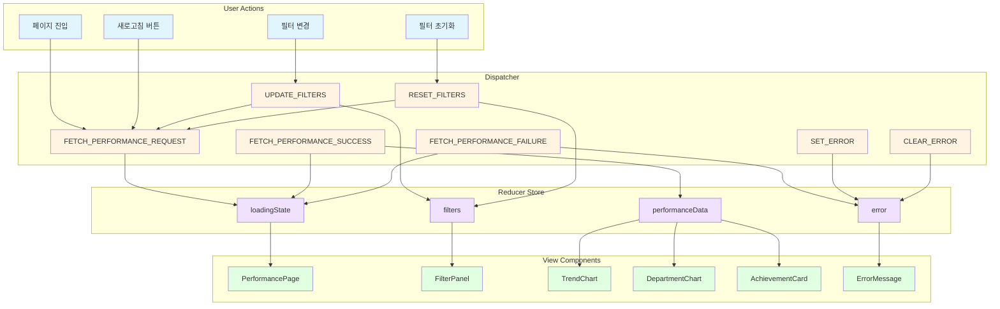
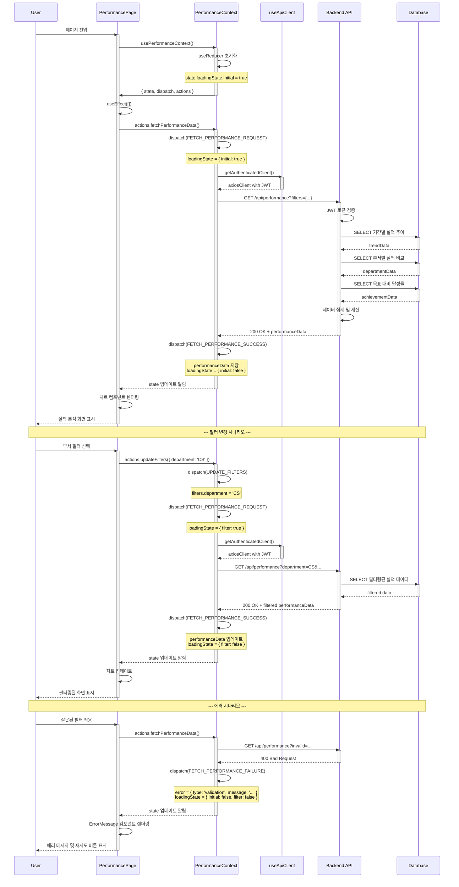

# State Management Design: Performance Analysis Page

> **Page URL**: `/dashboard/performance`
> **Use Case**: UC-005 실적 분석 조회
> **Pattern**: Context + useReducer (Flux)

---

## 1. State Data (관리 대상)

### 1.1 Core State (useReducer로 관리)

| State Name | Type | Initial Value | Description |
|------------|------|---------------|-------------|
| `performanceData` | `object` | `null` | 기간별/부서별 실적 데이터 |
| `performanceData.trendData` | `array` | `[]` | 기간별 실적 추이 데이터 |
| `performanceData.departmentData` | `array` | `[]` | 부서별 실적 비교 데이터 |
| `performanceData.achievementData` | `object` | `null` | 목표 대비 달성률 데이터 |
| `filters` | `object` | `defaultFilters` | 필터 상태 |
| `filters.startDate` | `string` | `1년전` | 시작일 (YYYY-MM-DD) |
| `filters.endDate` | `string` | `오늘` | 종료일 (YYYY-MM-DD) |
| `filters.department` | `string \| null` | `null` | 선택된 부서 |
| `filters.project` | `string \| null` | `null` | 선택된 프로젝트 |
| `loadingState` | `object` | `{ initial: true, filter: false }` | 로딩 상태 |
| `error` | `object \| null` | `null` | 에러 정보 |
| `error.type` | `string` | - | 에러 타입 (network, auth, data) |
| `error.message` | `string` | - | 에러 메시지 |

### 1.2 Default Filter Values

```javascript
const defaultFilters = {
  startDate: getDateOneYearAgo(), // 1년 전
  endDate: getTodayDate(),         // 오늘
  department: null,
  project: null,
};
```

---

## 2. Non-State Data (상태 관리 불필요)

### 2.1 Static Configuration

| Data | Source | Description |
|------|--------|-------------|
| Chart Options | Constants | Chart.js 차트 설정 옵션 |
| Color Schemes | Theme | 차트 색상 테마 |
| Department List | API (별도 호출) | 부서 목록 (필터 옵션용) |
| Project List | API (별도 호출) | 프로젝트 목록 (필터 옵션용) |

### 2.2 Derived Data (연산으로 생성)

| Data | Derivation | Description |
|------|------------|-------------|
| Chart Data | `transformToLineChartData(trendData)` | 라인 차트용 데이터 |
| Bar Chart Data | `transformToBarChartData(departmentData)` | 막대 차트용 데이터 |
| Achievement Rate | `calculateAchievementRate(achievementData)` | 달성률 계산 |
| Achievement Color | `getAchievementColor(rate)` | 달성률 색상 (녹색/황색/적색) |
| Filter Summary | `getFilterSummaryText(filters)` | 필터 요약 텍스트 |

### 2.3 UI State (Local Component State)

| State | Component | Description |
|-------|-----------|-------------|
| `isFilterPanelOpen` | FilterPanel | 필터 패널 열림/닫힘 |
| `tooltipData` | Chart Components | 차트 툴팁 데이터 |
| `selectedChartType` | ChartSelector | 선택된 차트 타입 |

---

## 3. State Change Conditions & Screen Updates

| State Name | Conditions for Change | Screen Changes |
|------------|----------------------|----------------|
| `performanceData` | - 초기 페이지 로드<br>- 필터 적용<br>- 수동 새로고침 | - 로딩 인디케이터 표시<br>- 차트 리렌더링<br>- 데이터 테이블 업데이트 |
| `filters.startDate` | - 사용자가 시작일 선택<br>- URL 파라미터 변경 | - 필터 UI 업데이트<br>- 필터 태그 표시<br>- API 재호출 |
| `filters.endDate` | - 사용자가 종료일 선택<br>- URL 파라미터 변경 | - 필터 UI 업데이트<br>- 필터 태그 표시<br>- API 재호출 |
| `filters.department` | - 사용자가 부서 선택/해제<br>- URL 파라미터 변경 | - 필터 UI 업데이트<br>- 필터 태그 표시<br>- API 재호출 |
| `filters.project` | - 사용자가 프로젝트 선택/해제<br>- URL 파라미터 변경 | - 필터 UI 업데이트<br>- 필터 태그 표시<br>- API 재호출 |
| `loadingState.initial` | - 페이지 진입 시 true<br>- 초기 데이터 로드 완료 시 false | - 스켈레톤 UI 표시/숨김<br>- 차트 영역 표시/숨김 |
| `loadingState.filter` | - 필터 적용 시 true<br>- 필터 데이터 로드 완료 시 false | - 필터 로딩 인디케이터 표시/숨김<br>- 차트 오버레이 표시 |
| `error` | - API 호출 실패<br>- 인증 오류<br>- 데이터 검증 실패 | - 에러 메시지 표시<br>- 재시도 버튼 표시<br>- 또는 로그인 페이지로 리다이렉트 |

---

## 4. Action → Store → View Flow (Flux Pattern)

### 4.1 Mermaid Diagram



### 4.2 Action Types

```javascript
const ActionTypes = {
  // Data Fetching
  FETCH_PERFORMANCE_REQUEST: 'FETCH_PERFORMANCE_REQUEST',
  FETCH_PERFORMANCE_SUCCESS: 'FETCH_PERFORMANCE_SUCCESS',
  FETCH_PERFORMANCE_FAILURE: 'FETCH_PERFORMANCE_FAILURE',

  // Filter Management
  UPDATE_FILTERS: 'UPDATE_FILTERS',
  RESET_FILTERS: 'RESET_FILTERS',

  // Error Handling
  SET_ERROR: 'SET_ERROR',
  CLEAR_ERROR: 'CLEAR_ERROR',
};
```

### 4.3 Reducer Logic

```javascript
const initialState = {
  performanceData: null,
  filters: defaultFilters,
  loadingState: {
    initial: true,
    filter: false,
  },
  error: null,
};

function performanceReducer(state, action) {
  switch (action.type) {
    case ActionTypes.FETCH_PERFORMANCE_REQUEST:
      return {
        ...state,
        loadingState: {
          initial: state.performanceData === null,
          filter: state.performanceData !== null,
        },
        error: null,
      };

    case ActionTypes.FETCH_PERFORMANCE_SUCCESS:
      return {
        ...state,
        performanceData: action.payload,
        loadingState: {
          initial: false,
          filter: false,
        },
        error: null,
      };

    case ActionTypes.FETCH_PERFORMANCE_FAILURE:
      return {
        ...state,
        loadingState: {
          initial: false,
          filter: false,
        },
        error: {
          type: action.payload.type,
          message: action.payload.message,
        },
      };

    case ActionTypes.UPDATE_FILTERS:
      return {
        ...state,
        filters: {
          ...state.filters,
          ...action.payload,
        },
      };

    case ActionTypes.RESET_FILTERS:
      return {
        ...state,
        filters: defaultFilters,
      };

    case ActionTypes.SET_ERROR:
      return {
        ...state,
        error: action.payload,
      };

    case ActionTypes.CLEAR_ERROR:
      return {
        ...state,
        error: null,
      };

    default:
      return state;
  }
}
```

---

## 5. Context Data Loading Flow

### 5.1 Mermaid Diagram



### 5.2 Loading States

| Loading State | Condition | UI Behavior |
|--------------|-----------|-------------|
| `initial: true` | 페이지 최초 진입 시 | - 전체 페이지 스켈레톤 UI<br>- 차트 영역 로딩 스피너<br>- 필터 패널 비활성화 |
| `filter: true` | 필터 적용 중 | - 차트 영역 오버레이<br>- 작은 로딩 인디케이터<br>- 필터 패널 활성화 유지 |
| `both false` | 데이터 로드 완료 | - 차트 및 데이터 표시<br>- 모든 인터랙션 활성화 |

---

## 6. Variables and Functions Exposed to Children

### 6.1 Context Provider Interface

```javascript
interface PerformanceContextValue {
  // State
  state: {
    performanceData: PerformanceData | null;
    filters: FilterState;
    loadingState: LoadingState;
    error: ErrorState | null;
  };

  // Actions
  actions: {
    fetchPerformanceData: () => Promise<void>;
    updateFilters: (filters: Partial<FilterState>) => void;
    resetFilters: () => void;
    clearError: () => void;
  };

  // Dispatch (advanced use only)
  dispatch: Dispatch<PerformanceAction>;
}
```

### 6.2 Exported Types

```typescript
// Performance Data Types
type PerformanceData = {
  trendData: TrendDataPoint[];
  departmentData: DepartmentDataPoint[];
  achievementData: AchievementData;
};

type TrendDataPoint = {
  date: string;           // YYYY-MM-DD
  value: number;          // 실적 값
  target?: number;        // 목표 값 (선택)
};

type DepartmentDataPoint = {
  department: string;
  value: number;
  percentage?: number;    // 전체 대비 비율
};

type AchievementData = {
  actual: number;         // 실제 실적
  target: number;         // 목표 실적
  rate: number;           // 달성률 (0-100+)
  status: 'success' | 'warning' | 'danger';
};

// Filter Types
type FilterState = {
  startDate: string;      // YYYY-MM-DD
  endDate: string;        // YYYY-MM-DD
  department: string | null;
  project: string | null;
};

// Loading State
type LoadingState = {
  initial: boolean;
  filter: boolean;
};

// Error State
type ErrorState = {
  type: 'network' | 'auth' | 'validation' | 'data';
  message: string;
};
```

### 6.3 Action Creators (Helper Functions)

```javascript
const actionCreators = {
  /**
   * 실적 데이터를 서버에서 가져옴
   * - 현재 필터 상태를 쿼리 파라미터로 전송
   * - 인증 토큰 자동 포함
   */
  fetchPerformanceData: async () => {
    dispatch({ type: ActionTypes.FETCH_PERFORMANCE_REQUEST });

    try {
      const client = await getAuthenticatedClient();
      const queryParams = buildQueryParams(state.filters);
      const response = await client.get(`/api/performance${queryParams}`);

      dispatch({
        type: ActionTypes.FETCH_PERFORMANCE_SUCCESS,
        payload: response.data,
      });
    } catch (error) {
      dispatch({
        type: ActionTypes.FETCH_PERFORMANCE_FAILURE,
        payload: {
          type: getErrorType(error),
          message: getErrorMessage(error),
        },
      });
    }
  },

  /**
   * 필터 업데이트 및 데이터 재조회
   * @param {Partial<FilterState>} newFilters - 변경할 필터 값
   */
  updateFilters: (newFilters) => {
    // 1. 필터 상태 업데이트
    dispatch({
      type: ActionTypes.UPDATE_FILTERS,
      payload: newFilters,
    });

    // 2. URL 파라미터 동기화
    updateUrlParams(newFilters);

    // 3. 데이터 재조회
    actionCreators.fetchPerformanceData();
  },

  /**
   * 필터를 기본값으로 초기화
   */
  resetFilters: () => {
    dispatch({ type: ActionTypes.RESET_FILTERS });
    clearUrlParams();
    actionCreators.fetchPerformanceData();
  },

  /**
   * 에러 상태 초기화
   */
  clearError: () => {
    dispatch({ type: ActionTypes.CLEAR_ERROR });
  },
};
```

### 6.4 Utility Functions (Non-exposed)

```javascript
// Query Parameter Builder
function buildQueryParams(filters) {
  const params = new URLSearchParams();

  if (filters.startDate) params.append('startDate', filters.startDate);
  if (filters.endDate) params.append('endDate', filters.endDate);
  if (filters.department) params.append('department', filters.department);
  if (filters.project) params.append('project', filters.project);

  return params.toString() ? `?${params.toString()}` : '';
}

// URL Parameter Sync
function updateUrlParams(filters) {
  const params = new URLSearchParams(window.location.search);

  Object.entries(filters).forEach(([key, value]) => {
    if (value !== null && value !== undefined) {
      params.set(key, value);
    } else {
      params.delete(key);
    }
  });

  window.history.replaceState(
    {},
    '',
    `${window.location.pathname}?${params.toString()}`
  );
}

// Error Type Detection
function getErrorType(error) {
  if (error.response?.status === 401) return 'auth';
  if (error.response?.status === 400) return 'validation';
  if (error.response?.status >= 500) return 'network';
  if (!error.response) return 'network';
  return 'data';
}

// Error Message Extraction
function getErrorMessage(error) {
  if (error.response?.data?.message) {
    return error.response.data.message;
  }
  if (error.response?.status === 401) {
    return '인증이 만료되었습니다. 다시 로그인해주세요.';
  }
  if (error.response?.status === 400) {
    return '필터 조건이 올바르지 않습니다.';
  }
  if (!error.response) {
    return '네트워크 연결을 확인해주세요.';
  }
  return '데이터를 불러오는데 실패했습니다.';
}

// Date Helper
function getDateOneYearAgo() {
  const date = new Date();
  date.setFullYear(date.getFullYear() - 1);
  return date.toISOString().split('T')[0]; // YYYY-MM-DD
}

function getTodayDate() {
  return new Date().toISOString().split('T')[0]; // YYYY-MM-DD
}
```

---

## 7. Child Component Usage Examples

### 7.1 PerformancePage (Container)

```javascript
import { PerformanceProvider, usePerformanceContext } from './PerformanceContext';

function PerformancePage() {
  return (
    <PerformanceProvider>
      <MainLayout>
        <PageHeader />
        <FilterPanel />
        <PerformanceContent />
      </MainLayout>
    </PerformanceProvider>
  );
}

function PerformanceContent() {
  const { state } = usePerformanceContext();

  if (state.loadingState.initial) {
    return <SkeletonLoader />;
  }

  if (state.error) {
    return <ErrorMessage error={state.error} />;
  }

  return (
    <>
      <TrendChart />
      <DepartmentChart />
      <AchievementCard />
    </>
  );
}
```

### 7.2 FilterPanel Component

```javascript
function FilterPanel() {
  const { state, actions } = usePerformanceContext();
  const { filters } = state;

  const handleDateChange = (field, value) => {
    actions.updateFilters({ [field]: value });
  };

  const handleDepartmentChange = (department) => {
    actions.updateFilters({ department });
  };

  const handleReset = () => {
    actions.resetFilters();
  };

  return (
    <Card>
      <DateRangePicker
        startDate={filters.startDate}
        endDate={filters.endDate}
        onChange={handleDateChange}
      />
      <DepartmentSelector
        selected={filters.department}
        onChange={handleDepartmentChange}
      />
      <Button onClick={handleReset}>
        필터 초기화
      </Button>
    </Card>
  );
}
```

### 7.3 TrendChart Component

```javascript
function TrendChart() {
  const { state } = usePerformanceContext();
  const { performanceData, loadingState } = state;

  if (loadingState.filter) {
    return <ChartLoadingOverlay />;
  }

  if (!performanceData?.trendData || performanceData.trendData.length === 0) {
    return <EmptyState message="데이터가 없습니다" />;
  }

  const chartData = transformToLineChartData(
    performanceData.trendData,
    'date',
    'value'
  );

  return (
    <Card title="기간별 실적 추이">
      <LineChart data={chartData} options={chartOptions} />
    </Card>
  );
}
```

### 7.4 DepartmentChart Component

```javascript
function DepartmentChart() {
  const { state } = usePerformanceContext();
  const { performanceData } = state;

  if (!performanceData?.departmentData) {
    return null;
  }

  const chartData = transformToBarChartData(
    performanceData.departmentData,
    'department',
    'value'
  );

  return (
    <Card title="부서별 실적 비교">
      <BarChart data={chartData} options={chartOptions} />
    </Card>
  );
}
```

### 7.5 AchievementCard Component

```javascript
function AchievementCard() {
  const { state } = usePerformanceContext();
  const { performanceData } = state;

  if (!performanceData?.achievementData) {
    return null;
  }

  const { actual, target, rate, status } = performanceData.achievementData;

  return (
    <Card title="목표 대비 달성률">
      <Box>
        <Typography variant="h3">
          {formatPercentage(rate)}
        </Typography>
        <Typography variant="body2" color="textSecondary">
          실적: {formatCurrency(actual)} / 목표: {formatCurrency(target)}
        </Typography>
        <AchievementGauge value={rate} status={status} />
      </Box>
    </Card>
  );
}
```

### 7.6 ErrorMessage Component

```javascript
function ErrorMessage({ error }) {
  const { actions } = usePerformanceContext();
  const navigate = useNavigate();

  const handleRetry = () => {
    actions.clearError();
    actions.fetchPerformanceData();
  };

  const handleLogin = () => {
    navigate('/sign-in');
  };

  return (
    <Alert severity="error">
      <AlertTitle>오류 발생</AlertTitle>
      <Typography>{error.message}</Typography>
      <Box mt={2}>
        {error.type === 'auth' ? (
          <Button onClick={handleLogin}>로그인 페이지로 이동</Button>
        ) : (
          <Button onClick={handleRetry}>재시도</Button>
        )}
      </Box>
    </Alert>
  );
}
```

---

## 8. Business Rules Implementation

### 8.1 Filter Validation

```javascript
// BR-2: 기간 필터 제약
function validateFilters(filters) {
  const errors = [];

  // 시작일이 종료일보다 뒤인지 확인
  if (new Date(filters.startDate) > new Date(filters.endDate)) {
    errors.push('시작일은 종료일보다 앞서야 합니다');
  }

  // 최대 조회 기간 5년 확인
  const yearDiff = getYearDifference(filters.startDate, filters.endDate);
  if (yearDiff > 5) {
    errors.push('최대 조회 기간은 5년입니다');
  }

  return errors;
}
```

### 8.2 Achievement Rate Calculation

```javascript
// BR-3: 목표 달성률 계산
function calculateAchievementData(actual, target) {
  if (!target || target === 0) {
    return {
      actual,
      target,
      rate: null,
      status: 'unknown',
    };
  }

  const rate = (actual / target) * 100;

  let status;
  if (rate >= 100) status = 'success';
  else if (rate >= 80) status = 'warning';
  else status = 'danger';

  return {
    actual,
    target,
    rate,
    status,
  };
}

function getAchievementColor(status) {
  const colors = {
    success: '#4caf50',  // 녹색
    warning: '#ff9800',  // 황색
    danger: '#f44336',   // 적색
    unknown: '#9e9e9e',  // 회색
  };

  return colors[status] || colors.unknown;
}
```

---

## 9. Performance Optimization

### 9.1 Memoization

```javascript
// 차트 데이터 메모이제이션
const chartData = useMemo(() => {
  if (!performanceData?.trendData) return null;
  return transformToLineChartData(performanceData.trendData, 'date', 'value');
}, [performanceData?.trendData]);

// 필터 요약 메모이제이션
const filterSummary = useMemo(() => {
  return getFilterSummaryText(state.filters);
}, [state.filters]);
```

### 9.2 Debounced Filter Updates

```javascript
// 필터 입력 디바운싱 (연속 입력 방지)
const debouncedUpdateFilters = useMemo(
  () => debounce((filters) => {
    actions.updateFilters(filters);
  }, 500),
  [actions]
);
```

---

## 10. URL Synchronization

### 10.1 Initial Load from URL

```javascript
// 페이지 로드 시 URL 파라미터에서 필터 복원
useEffect(() => {
  const params = new URLSearchParams(window.location.search);
  const urlFilters = {
    startDate: params.get('startDate') || defaultFilters.startDate,
    endDate: params.get('endDate') || defaultFilters.endDate,
    department: params.get('department') || null,
    project: params.get('project') || null,
  };

  // URL 파라미터가 있으면 필터 적용
  if (params.toString()) {
    actions.updateFilters(urlFilters);
  } else {
    actions.fetchPerformanceData();
  }
}, []);
```

### 10.2 Browser Back/Forward Support

```javascript
// 브라우저 뒤로가기/앞으로가기 지원
useEffect(() => {
  const handlePopState = () => {
    const params = new URLSearchParams(window.location.search);
    const urlFilters = {
      startDate: params.get('startDate') || defaultFilters.startDate,
      endDate: params.get('endDate') || defaultFilters.endDate,
      department: params.get('department') || null,
      project: params.get('project') || null,
    };

    dispatch({ type: ActionTypes.UPDATE_FILTERS, payload: urlFilters });
    actions.fetchPerformanceData();
  };

  window.addEventListener('popstate', handlePopState);
  return () => window.removeEventListener('popstate', handlePopState);
}, []);
```

---

## 11. Testing Scenarios

### 11.1 State Transition Tests

| Test Case | Initial State | Action | Expected State |
|-----------|--------------|--------|----------------|
| 초기 로딩 | `loadingState.initial: true` | `FETCH_PERFORMANCE_SUCCESS` | `loadingState.initial: false, performanceData: {...}` |
| 필터 업데이트 | `filters: default` | `UPDATE_FILTERS({ department: 'CS' })` | `filters.department: 'CS'` |
| 에러 발생 | `error: null` | `FETCH_PERFORMANCE_FAILURE` | `error: { type, message }` |
| 필터 초기화 | `filters: { custom }` | `RESET_FILTERS` | `filters: default` |

### 11.2 Integration Tests

| Test Case | Description |
|-----------|-------------|
| 인증 토큰 만료 | 401 응답 시 로그인 페이지로 리다이렉트 |
| 네트워크 오류 | 재시도 버튼 표시 및 동작 확인 |
| 빈 데이터 | EmptyState 컴포넌트 렌더링 확인 |
| 필터 검증 | 잘못된 날짜 범위 입력 시 에러 메시지 |

---

## 12. DRY Principles Applied

### 12.1 Reusable Patterns

1. **Error Handling**: 모든 API 호출에서 동일한 에러 처리 로직 사용
2. **Loading States**: `loadingState` 객체로 통합 관리
3. **Filter Management**: 필터 업데이트 시 자동으로 데이터 재조회
4. **URL Synchronization**: 필터 변경 시 자동으로 URL 업데이트

### 12.2 Shared Utilities

- `buildQueryParams`: 필터를 쿼리 문자열로 변환
- `getErrorType`, `getErrorMessage`: 에러 처리 표준화
- `updateUrlParams`: URL 파라미터 동기화
- Date helpers: 날짜 계산 로직 재사용

### 12.3 Avoided Duplication

- Chart 데이터 변환 로직: `services/dataTransformer.js`에서 재사용
- 포맷팅 함수: `utils/formatters.js`에서 재사용
- API 클라이언트: `useApiClient` 훅으로 통합
- 레이아웃: `MainLayout` 컴포넌트 재사용

---

## Summary

이 문서는 Performance Analysis 페이지의 상태 관리 설계를 정의합니다:

- **Context + useReducer** 패턴으로 Flux 아키텍처 구현
- **4가지 핵심 상태**: performanceData, filters, loadingState, error
- **7가지 액션 타입**으로 모든 상태 변경 관리
- **URL 동기화**로 필터 상태 영속성 보장
- **타입 안전성**을 위한 명확한 인터페이스 정의
- **DRY 원칙** 준수로 코드 중복 최소화

이 설계를 따라 구현하면 유지보수가 용이하고 확장 가능한 상태 관리를 구축할 수 있습니다.
