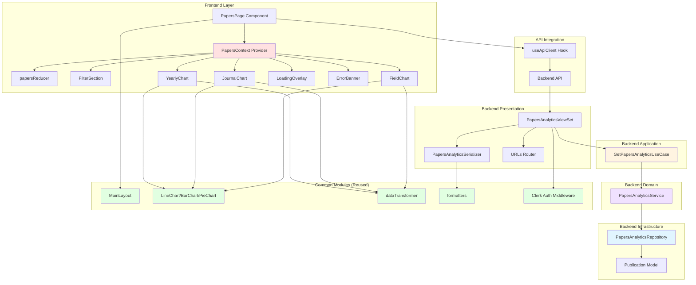
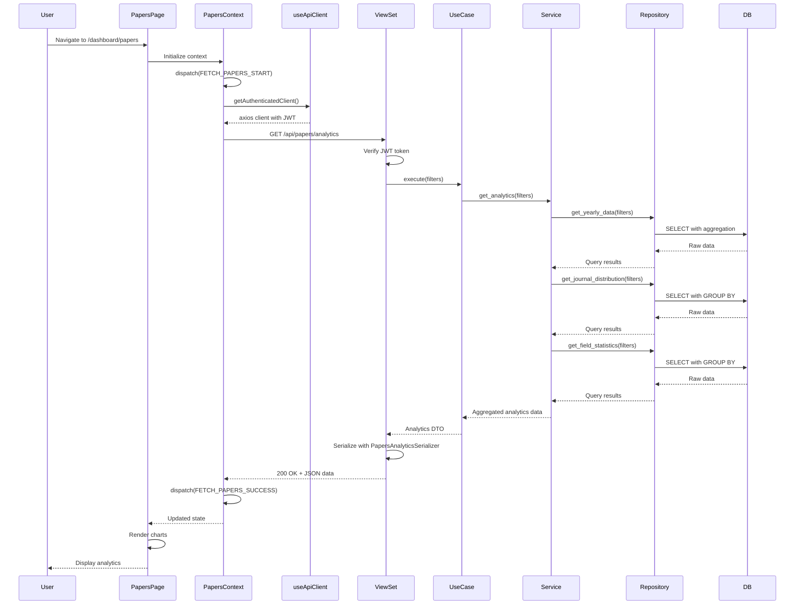

# Implementation Plan: Papers Analysis Page (`/dashboard/papers`)

## Overview

This document provides a detailed implementation plan for the Papers Analysis page, following the layered architecture and DRY principles defined in the project architecture.

### Page Information
- **Route**: `/dashboard/papers`
- **User Story**: As a user, I want to view publication analysis with yearly trends, journal grade distribution, and field statistics, so I can understand research output patterns
- **Primary Use Case**: [UC-006: 논문 분석 조회](/Users/paul/edu/awesomedev/final_report/docs/usecase/006/spec.md)
- **State Management**: Context + useReducer pattern ([State Design](/Users/paul/edu/awesomedev/final_report/docs/pages/3-papers-analysis/state.md))

---

## Module Overview

### Backend Modules (7 modules)

| Module | Location | Type | Description |
|--------|----------|------|-------------|
| **PapersAnalyticsRepository** | `backend/apps/data_dashboard/infrastructure/repositories/papers_repository.py` | Infrastructure | Data access layer for publications table |
| **PapersAnalyticsService** | `backend/apps/data_dashboard/domain/services/papers_service.py` | Domain | Business logic for papers analytics aggregation |
| **GetPapersAnalyticsUseCase** | `backend/apps/data_dashboard/application/use_cases/get_papers_analytics.py` | Application | Orchestrates papers analytics retrieval with filters |
| **PapersAnalyticsSerializer** | `backend/apps/data_dashboard/presentation/serializers/papers_serializers.py` | Presentation | Serializes papers analytics data for API response |
| **PapersAnalyticsViewSet** | `backend/apps/data_dashboard/presentation/views/papers_views.py` | Presentation | API endpoint for papers analytics |
| **Papers URLs** | `backend/apps/data_dashboard/presentation/urls.py` | Presentation | URL routing for papers endpoints |
| **Papers Unit Tests** | `backend/apps/data_dashboard/tests/unit/test_papers_service.py` | Test | Unit tests for PapersAnalyticsService |

### Frontend Modules (10 modules)

| Module | Location | Type | Description |
|--------|----------|------|-------------|
| **PapersPage** | `frontend/src/pages/PapersPage/index.jsx` | Presentation | Main page component |
| **PapersContext** | `frontend/src/pages/PapersPage/PapersContext.jsx` | State Management | Context provider with reducer |
| **papersReducer** | `frontend/src/pages/PapersPage/papersReducer.js` | State Management | Reducer logic for state transitions |
| **FilterSection** | `frontend/src/pages/PapersPage/components/FilterSection.jsx` | Component | Filter controls (year, journal, field) |
| **YearlyChart** | `frontend/src/pages/PapersPage/components/YearlyChart.jsx` | Component | Line/Bar chart for yearly publications |
| **JournalChart** | `frontend/src/pages/PapersPage/components/JournalChart.jsx` | Component | Pie chart for journal distribution |
| **FieldChart** | `frontend/src/pages/PapersPage/components/FieldChart.jsx` | Component | Bar chart for field statistics |
| **LoadingOverlay** | `frontend/src/pages/PapersPage/components/LoadingOverlay.jsx` | Component | Loading indicator during data fetch |
| **ErrorBanner** | `frontend/src/pages/PapersPage/components/ErrorBanner.jsx` | Component | Error message display |
| **PapersPage QA Sheet** | `frontend/src/pages/PapersPage/__tests__/PapersPage.qa.md` | Test | QA checklist for manual testing |

**Total Modules**: 17 (7 backend + 10 frontend)

---

## Architecture Diagram

### Module Relationships



### Data Flow Diagram



---

## Implementation Plan by Module

### Phase 1: Backend Infrastructure Layer

#### Module 1.1: PapersAnalyticsRepository
**File**: `backend/apps/data_dashboard/infrastructure/repositories/papers_repository.py`

**Purpose**: Data access layer for publications table with filtering and aggregation

**Dependencies**:
- `apps.data_dashboard.models.Publication`
- `django.db.models`
- `typing`

**Implementation Details**:

```python
from typing import List, Dict, Optional
from django.db.models import Count, Q, QuerySet, F, Value
from django.db.models.functions import ExtractYear
from apps.data_dashboard.models import Publication


class PapersAnalyticsRepository:
    """Repository for papers analytics data access."""

    def __init__(self):
        self.model = Publication

    def get_yearly_data(
        self,
        year: Optional[int] = None,
        journal_grade: Optional[str] = None,
        field: Optional[str] = None
    ) -> List[Dict]:
        """
        Get yearly publication counts.

        Returns: [{"year": 2021, "count": 45}, ...]
        """
        queryset = self._apply_filters(
            self.model.objects.all(),
            year, journal_grade, field
        )

        result = (
            queryset
            .annotate(year=ExtractYear('publication_date'))
            .values('year')
            .annotate(count=Count('id'))
            .order_by('year')
        )

        return list(result)

    def get_journal_distribution(
        self,
        year: Optional[int] = None,
        journal_grade: Optional[str] = None,
        field: Optional[str] = None
    ) -> List[Dict]:
        """
        Get journal grade distribution.

        Returns: [{"journal_grade": "SCI", "count": 80}, ...]
        """
        queryset = self._apply_filters(
            self.model.objects.all(),
            year, journal_grade, field
        )

        result = (
            queryset
            .values('journal_grade')
            .annotate(count=Count('id'))
            .order_by('-count')
        )

        return list(result)

    def get_field_statistics(
        self,
        year: Optional[int] = None,
        journal_grade: Optional[str] = None,
        field: Optional[str] = None
    ) -> List[Dict]:
        """
        Get field-wise publication statistics.

        Returns: [{"department": "공학부", "count": 67}, ...]
        """
        queryset = self._apply_filters(
            self.model.objects.all(),
            year, journal_grade, field
        )

        result = (
            queryset
            .values('department')
            .annotate(count=Count('id'))
            .order_by('-count')
        )

        return list(result)

    def _apply_filters(
        self,
        queryset: QuerySet,
        year: Optional[int],
        journal_grade: Optional[str],
        field: Optional[str]
    ) -> QuerySet:
        """Apply filters to queryset."""
        if year:
            queryset = queryset.filter(
                publication_date__year=year
            )

        if journal_grade:
            queryset = queryset.filter(
                journal_grade__iexact=journal_grade
            )

        if field:
            queryset = queryset.filter(
                department__icontains=field
            )

        return queryset
```

**Key Methods**:
- `get_yearly_data()`: Aggregate publications by year
- `get_journal_distribution()`: Group by journal grade
- `get_field_statistics()`: Group by department/field
- `_apply_filters()`: Apply common filters to queries

**Testing Requirements**: None (tested through service layer)

---

#### Module 1.2: PapersAnalyticsService
**File**: `backend/apps/data_dashboard/domain/services/papers_service.py`

**Purpose**: Business logic for papers analytics aggregation and data transformation

**Dependencies**:
- `PapersAnalyticsRepository`
- `typing`

**Implementation Details**:

```python
from typing import Dict, List, Optional
from ..infrastructure.repositories.papers_repository import PapersAnalyticsRepository


class PapersAnalyticsService:
    """Domain service for papers analytics business logic."""

    def __init__(self, repository: PapersAnalyticsRepository):
        self.repository = repository

    def get_analytics(
        self,
        year: Optional[int] = None,
        journal_grade: Optional[str] = None,
        field: Optional[str] = None
    ) -> Dict:
        """
        Get complete papers analytics data.

        Returns:
        {
            "yearly_data": [...],
            "journal_data": [...],
            "field_data": [...]
        }
        """
        yearly_data = self.repository.get_yearly_data(
            year, journal_grade, field
        )

        journal_data = self.repository.get_journal_distribution(
            year, journal_grade, field
        )

        field_data = self.repository.get_field_statistics(
            year, journal_grade, field
        )

        return {
            "yearly_data": yearly_data,
            "journal_data": journal_data,
            "field_data": field_data
        }

    def validate_filters(
        self,
        year: Optional[int],
        journal_grade: Optional[str],
        field: Optional[str]
    ) -> bool:
        """Validate filter parameters."""
        if year and (year < 2000 or year > 2100):
            return False

        if journal_grade and journal_grade not in ['SCI', 'KCI', 'SCOPUS', '기타']:
            return False

        return True
```

**Key Methods**:
- `get_analytics()`: Orchestrates data retrieval from repository
- `validate_filters()`: Validates filter parameters

**Business Rules**:
- BR-2: Default to all years if no filter specified
- BR-3: Filters combine with AND logic
- BR-4: Data from database only, not real-time

**Testing Requirements**:
- Unit tests for `get_analytics()` with various filter combinations
- Unit tests for `validate_filters()` with edge cases

---

### Phase 2: Backend Application Layer

#### Module 2.1: GetPapersAnalyticsUseCase
**File**: `backend/apps/data_dashboard/application/use_cases/get_papers_analytics.py`

**Purpose**: Use case for retrieving papers analytics with filters

**Dependencies**:
- `PapersAnalyticsService`
- `PapersAnalyticsRepository`
- `core.exceptions`
- `typing`

**Implementation Details**:

```python
from typing import Dict, Optional
from core.exceptions import ValidationError
from ..domain.services.papers_service import PapersAnalyticsService
from ..infrastructure.repositories.papers_repository import PapersAnalyticsRepository


class GetPapersAnalyticsUseCase:
    """Use case for getting papers analytics data."""

    def __init__(self):
        self.repository = PapersAnalyticsRepository()
        self.service = PapersAnalyticsService(self.repository)

    def execute(
        self,
        year: Optional[int] = None,
        journal_grade: Optional[str] = None,
        field: Optional[str] = None
    ) -> Dict:
        """
        Execute the use case.

        Args:
            year: Filter by year
            journal_grade: Filter by journal grade
            field: Filter by department/field

        Returns:
            Analytics data dictionary

        Raises:
            ValidationError: If filters are invalid
        """
        # Validate filters
        if not self.service.validate_filters(year, journal_grade, field):
            raise ValidationError(
                "Invalid filter parameters"
            )

        # Get analytics data
        analytics_data = self.service.get_analytics(
            year, journal_grade, field
        )

        # Check if data exists
        has_data = (
            len(analytics_data['yearly_data']) > 0 or
            len(analytics_data['journal_data']) > 0 or
            len(analytics_data['field_data']) > 0
        )

        return {
            **analytics_data,
            "has_data": has_data
        }
```

**Key Methods**:
- `execute()`: Main use case execution with validation

**Testing Requirements**: None (integration tested through API)

---

### Phase 3: Backend Presentation Layer

#### Module 3.1: PapersAnalyticsSerializer
**File**: `backend/apps/data_dashboard/presentation/serializers/papers_serializers.py`

**Purpose**: Serialize papers analytics data for API response

**Dependencies**:
- `rest_framework.serializers`
- `typing`

**Implementation Details**:

```python
from rest_framework import serializers


class YearlyDataSerializer(serializers.Serializer):
    """Serializer for yearly publication data."""
    year = serializers.IntegerField()
    count = serializers.IntegerField()


class JournalDataSerializer(serializers.Serializer):
    """Serializer for journal distribution data."""
    journal_grade = serializers.CharField(max_length=50)
    count = serializers.IntegerField()


class FieldDataSerializer(serializers.Serializer):
    """Serializer for field statistics data."""
    department = serializers.CharField(max_length=100)
    count = serializers.IntegerField()


class PapersAnalyticsSerializer(serializers.Serializer):
    """Serializer for complete papers analytics response."""
    yearly_data = YearlyDataSerializer(many=True)
    journal_data = JournalDataSerializer(many=True)
    field_data = FieldDataSerializer(many=True)
    has_data = serializers.BooleanField()
```

**Key Classes**:
- `YearlyDataSerializer`: For yearly counts
- `JournalDataSerializer`: For journal distribution
- `FieldDataSerializer`: For field statistics
- `PapersAnalyticsSerializer`: Main response serializer

**Testing Requirements**: None (tested through API)

---

#### Module 3.2: PapersAnalyticsViewSet
**File**: `backend/apps/data_dashboard/presentation/views/papers_views.py`

**Purpose**: API endpoint for papers analytics

**Dependencies**:
- `rest_framework.viewsets`
- `rest_framework.decorators`
- `rest_framework.response`
- `GetPapersAnalyticsUseCase`
- `PapersAnalyticsSerializer`
- `core.exceptions`

**Implementation Details**:

```python
from rest_framework import viewsets, status
from rest_framework.decorators import action
from rest_framework.response import Response
from core.exceptions import ValidationError, AuthenticationError
from ..application.use_cases.get_papers_analytics import GetPapersAnalyticsUseCase
from .serializers.papers_serializers import PapersAnalyticsSerializer


class PapersAnalyticsViewSet(viewsets.ViewSet):
    """ViewSet for papers analytics endpoints."""

    def __init__(self, **kwargs):
        super().__init__(**kwargs)
        self.use_case = GetPapersAnalyticsUseCase()

    @action(detail=False, methods=['get'], url_path='analytics')
    def get_analytics(self, request):
        """
        Get papers analytics data.

        Query Parameters:
            - year (optional): Filter by year
            - journal (optional): Filter by journal grade
            - field (optional): Filter by department/field

        Response:
            200 OK: Analytics data
            400 Bad Request: Invalid filters
            401 Unauthorized: Not authenticated
        """
        # Check authentication
        if not request.user or not request.user.is_authenticated:
            raise AuthenticationError("Authentication required")

        # Get filter parameters
        year = request.query_params.get('year', None)
        journal_grade = request.query_params.get('journal', None)
        field = request.query_params.get('field', None)

        # Convert year to int if provided
        if year:
            try:
                year = int(year)
            except ValueError:
                raise ValidationError("Year must be an integer")

        try:
            # Execute use case
            analytics_data = self.use_case.execute(
                year=year,
                journal_grade=journal_grade,
                field=field
            )

            # Serialize response
            serializer = PapersAnalyticsSerializer(analytics_data)

            return Response(
                serializer.data,
                status=status.HTTP_200_OK
            )

        except ValidationError as e:
            return Response(
                {"error": str(e)},
                status=status.HTTP_400_BAD_REQUEST
            )
```

**Key Methods**:
- `get_analytics()`: GET endpoint for analytics data

**Error Handling**:
- 400: Invalid filter parameters
- 401: Not authenticated
- 500: Server error

**Testing Requirements**: None (tested through integration tests)

---

#### Module 3.3: Papers URLs
**File**: `backend/apps/data_dashboard/presentation/urls.py` (modify existing)

**Purpose**: URL routing for papers endpoints

**Dependencies**:
- `rest_framework.routers`
- `PapersAnalyticsViewSet`

**Implementation Details**:

```python
# Add to existing urls.py
from django.urls import path, include
from rest_framework.routers import DefaultRouter
from .views.papers_views import PapersAnalyticsViewSet

router = DefaultRouter()
# ... existing routes ...
router.register(r'papers', PapersAnalyticsViewSet, basename='papers')

urlpatterns = [
    path('', include(router.urls)),
]
```

**Endpoints Created**:
- `GET /api/papers/analytics/` - Get papers analytics

**Testing Requirements**: None

---

### Phase 4: Backend Testing

#### Module 4.1: Papers Service Unit Tests
**File**: `backend/apps/data_dashboard/tests/unit/test_papers_service.py`

**Purpose**: Unit tests for PapersAnalyticsService

**Dependencies**:
- `pytest`
- `unittest.mock`
- `PapersAnalyticsService`
- `PapersAnalyticsRepository`

**Implementation Details**:

```python
import pytest
from unittest.mock import Mock, MagicMock
from apps.data_dashboard.domain.services.papers_service import PapersAnalyticsService
from apps.data_dashboard.infrastructure.repositories.papers_repository import PapersAnalyticsRepository


class TestPapersAnalyticsService:
    """Unit tests for PapersAnalyticsService."""

    @pytest.fixture
    def mock_repository(self):
        """Create mock repository."""
        return Mock(spec=PapersAnalyticsRepository)

    @pytest.fixture
    def service(self, mock_repository):
        """Create service instance with mock repository."""
        return PapersAnalyticsService(mock_repository)

    def test_get_analytics_no_filters(self, service, mock_repository):
        """Test get_analytics without filters."""
        # Arrange
        mock_repository.get_yearly_data.return_value = [
            {"year": 2021, "count": 45},
            {"year": 2022, "count": 52}
        ]
        mock_repository.get_journal_distribution.return_value = [
            {"journal_grade": "SCI", "count": 80}
        ]
        mock_repository.get_field_statistics.return_value = [
            {"department": "공학부", "count": 67}
        ]

        # Act
        result = service.get_analytics()

        # Assert
        assert len(result['yearly_data']) == 2
        assert len(result['journal_data']) == 1
        assert len(result['field_data']) == 1
        mock_repository.get_yearly_data.assert_called_once_with(None, None, None)

    def test_get_analytics_with_year_filter(self, service, mock_repository):
        """Test get_analytics with year filter."""
        # Arrange
        mock_repository.get_yearly_data.return_value = [
            {"year": 2023, "count": 61}
        ]
        mock_repository.get_journal_distribution.return_value = []
        mock_repository.get_field_statistics.return_value = []

        # Act
        result = service.get_analytics(year=2023)

        # Assert
        assert len(result['yearly_data']) == 1
        assert result['yearly_data'][0]['year'] == 2023
        mock_repository.get_yearly_data.assert_called_once_with(2023, None, None)

    def test_validate_filters_valid(self, service):
        """Test validate_filters with valid parameters."""
        assert service.validate_filters(2023, "SCI", "공학") is True

    def test_validate_filters_invalid_year(self, service):
        """Test validate_filters with invalid year."""
        assert service.validate_filters(1999, None, None) is False
        assert service.validate_filters(2101, None, None) is False

    def test_validate_filters_invalid_journal(self, service):
        """Test validate_filters with invalid journal grade."""
        assert service.validate_filters(None, "INVALID", None) is False
```

**Test Coverage**:
- `get_analytics()` without filters
- `get_analytics()` with year filter
- `get_analytics()` with multiple filters
- `validate_filters()` with valid parameters
- `validate_filters()` with invalid year
- `validate_filters()` with invalid journal grade

**Testing Requirements**:
- Achieve >90% code coverage for PapersAnalyticsService

---

### Phase 5: Frontend State Management

#### Module 5.1: papersReducer
**File**: `frontend/src/pages/PapersPage/papersReducer.js`

**Purpose**: Reducer logic for state transitions

**Dependencies**:
- None (pure JavaScript)

**Implementation Details**:

```javascript
// Action types
export const FETCH_PAPERS_START = 'FETCH_PAPERS_START';
export const FETCH_PAPERS_SUCCESS = 'FETCH_PAPERS_SUCCESS';
export const FETCH_PAPERS_ERROR = 'FETCH_PAPERS_ERROR';
export const SET_FILTER = 'SET_FILTER';
export const CLEAR_FILTERS = 'CLEAR_FILTERS';
export const RESET_ERROR = 'RESET_ERROR';

// Initial state
export const initialState = {
  papersData: null,
  yearlyData: [],
  journalData: [],
  fieldData: [],
  filters: {
    year: null,
    journal: null,
    field: null
  },
  isLoading: true,
  error: null,
  hasData: false
};

// Reducer function
export function papersReducer(state, action) {
  switch (action.type) {
    case FETCH_PAPERS_START:
      return {
        ...state,
        isLoading: true,
        error: null
      };

    case FETCH_PAPERS_SUCCESS:
      return {
        ...state,
        isLoading: false,
        papersData: action.payload,
        yearlyData: action.payload.yearly_data || [],
        journalData: action.payload.journal_data || [],
        fieldData: action.payload.field_data || [],
        hasData: action.payload.has_data || false,
        error: null
      };

    case FETCH_PAPERS_ERROR:
      return {
        ...state,
        isLoading: false,
        error: action.payload,
        hasData: false
      };

    case SET_FILTER:
      return {
        ...state,
        filters: {
          ...state.filters,
          [action.payload.filterType]: action.payload.value
        }
      };

    case CLEAR_FILTERS:
      return {
        ...state,
        filters: {
          year: null,
          journal: null,
          field: null
        }
      };

    case RESET_ERROR:
      return {
        ...state,
        error: null
      };

    default:
      return state;
  }
}
```

**Key Elements**:
- Action types as constants
- Initial state definition
- Pure reducer function
- State transitions for all actions

**Testing Requirements**: None (tested through component integration)

---

#### Module 5.2: PapersContext
**File**: `frontend/src/pages/PapersPage/PapersContext.jsx`

**Purpose**: Context provider with reducer and data fetching logic

**Dependencies**:
- `react` (createContext, useReducer, useCallback, useMemo)
- `useApiClient` hook
- `useAuth` hook
- `papersReducer`

**Implementation Details**:

```javascript
import React, { createContext, useReducer, useCallback, useMemo, useEffect } from 'react';
import { useNavigate } from 'react-router-dom';
import { useApiClient } from '../../hooks/useApiClient';
import { useAuth } from '../../hooks/useAuth';
import {
  papersReducer,
  initialState,
  FETCH_PAPERS_START,
  FETCH_PAPERS_SUCCESS,
  FETCH_PAPERS_ERROR,
  SET_FILTER,
  CLEAR_FILTERS,
  RESET_ERROR
} from './papersReducer';

// Create context
export const PapersContext = createContext();

// Provider component
export function PapersProvider({ children }) {
  const [state, dispatch] = useReducer(papersReducer, initialState);
  const { getAuthenticatedClient } = useApiClient();
  const { getToken, signOut } = useAuth();
  const navigate = useNavigate();

  // Fetch papers data
  const fetchPapersData = useCallback(async () => {
    dispatch({ type: FETCH_PAPERS_START });

    try {
      const token = await getToken();
      const client = await getAuthenticatedClient();

      // Build query parameters
      const params = {};
      if (state.filters.year) params.year = state.filters.year;
      if (state.filters.journal) params.journal = state.filters.journal;
      if (state.filters.field) params.field = state.filters.field;

      // Make API request
      const response = await client.get('/papers/analytics/', { params });

      dispatch({
        type: FETCH_PAPERS_SUCCESS,
        payload: response.data
      });
    } catch (error) {
      // Handle authentication errors
      if (error.response?.status === 401) {
        dispatch({
          type: FETCH_PAPERS_ERROR,
          payload: {
            message: 'Session expired. Please login again.',
            code: '401'
          }
        });
        signOut();
        navigate('/sign-in');
      } else {
        dispatch({
          type: FETCH_PAPERS_ERROR,
          payload: {
            message: error.response?.data?.error || 'Failed to load papers data',
            code: error.response?.status?.toString() || 'NETWORK_ERROR'
          }
        });
      }
    }
  }, [getToken, getAuthenticatedClient, state.filters, signOut, navigate]);

  // Set filter
  const setFilter = useCallback((filterType, value) => {
    dispatch({
      type: SET_FILTER,
      payload: { filterType, value }
    });
  }, []);

  // Clear filters
  const clearFilters = useCallback(() => {
    dispatch({ type: CLEAR_FILTERS });
  }, []);

  // Reset error
  const resetError = useCallback(() => {
    dispatch({ type: RESET_ERROR });
  }, []);

  // Refetch data when filters change
  useEffect(() => {
    fetchPapersData();
  }, [state.filters]);

  // Memoize context value
  const contextValue = useMemo(() => ({
    state,
    dispatch,
    setFilter,
    clearFilters,
    resetError,
    refetchData: fetchPapersData
  }), [state, setFilter, clearFilters, resetError, fetchPapersData]);

  return (
    <PapersContext.Provider value={contextValue}>
      {children}
    </PapersContext.Provider>
  );
}

// Custom hook to use context
export function usePapersContext() {
  const context = React.useContext(PapersContext);
  if (!context) {
    throw new Error('usePapersContext must be used within PapersProvider');
  }
  return context;
}
```

**Key Elements**:
- Context creation and provider
- useReducer for state management
- API data fetching with error handling
- Filter change triggers refetch
- Memoized context value for performance
- Custom hook for context consumption

**Testing Requirements**: None (tested through component integration)

---

### Phase 6: Frontend Components

#### Module 6.1: FilterSection
**File**: `frontend/src/pages/PapersPage/components/FilterSection.jsx`

**Purpose**: Filter controls for year, journal, and field

**Dependencies**:
- `react`
- `@mui/material` (Grid, FormControl, InputLabel, Select, MenuItem, Button)
- `usePapersContext`

**Implementation Details**:

```javascript
import React from 'react';
import { Grid, FormControl, InputLabel, Select, MenuItem, Button } from '@mui/material';
import { usePapersContext } from '../PapersContext';

export function FilterSection() {
  const { state, setFilter, clearFilters } = usePapersContext();
  const { filters } = state;

  const handleYearChange = (event) => {
    setFilter('year', event.target.value || null);
  };

  const handleJournalChange = (event) => {
    setFilter('journal', event.target.value || null);
  };

  const handleFieldChange = (event) => {
    setFilter('field', event.target.value || null);
  };

  const hasActiveFilters = Object.values(filters).some(v => v !== null);

  return (
    <Grid container spacing={2} sx={{ mb: 3 }}>
      <Grid item xs={12} sm={3}>
        <FormControl fullWidth>
          <InputLabel>Year</InputLabel>
          <Select
            value={filters.year || ''}
            onChange={handleYearChange}
            label="Year"
          >
            <MenuItem value="">All Years</MenuItem>
            <MenuItem value={2023}>2023</MenuItem>
            <MenuItem value={2022}>2022</MenuItem>
            <MenuItem value={2021}>2021</MenuItem>
            <MenuItem value={2020}>2020</MenuItem>
          </Select>
        </FormControl>
      </Grid>

      <Grid item xs={12} sm={3}>
        <FormControl fullWidth>
          <InputLabel>Journal Grade</InputLabel>
          <Select
            value={filters.journal || ''}
            onChange={handleJournalChange}
            label="Journal Grade"
          >
            <MenuItem value="">All Grades</MenuItem>
            <MenuItem value="SCI">SCI</MenuItem>
            <MenuItem value="KCI">KCI</MenuItem>
            <MenuItem value="SCOPUS">SCOPUS</MenuItem>
            <MenuItem value="기타">기타</MenuItem>
          </Select>
        </FormControl>
      </Grid>

      <Grid item xs={12} sm={3}>
        <FormControl fullWidth>
          <InputLabel>Field</InputLabel>
          <Select
            value={filters.field || ''}
            onChange={handleFieldChange}
            label="Field"
          >
            <MenuItem value="">All Fields</MenuItem>
            <MenuItem value="공학">공학</MenuItem>
            <MenuItem value="의학">의학</MenuItem>
            <MenuItem value="자연과학">자연과학</MenuItem>
            <MenuItem value="인문학">인문학</MenuItem>
          </Select>
        </FormControl>
      </Grid>

      <Grid item xs={12} sm={3}>
        <Button
          variant="outlined"
          fullWidth
          onClick={clearFilters}
          disabled={!hasActiveFilters}
          sx={{ height: '56px' }}
        >
          Clear Filters
        </Button>
      </Grid>
    </Grid>
  );
}
```

**Key Features**:
- Three filter dropdowns (year, journal, field)
- Clear filters button
- Disabled state when no filters active
- Responsive grid layout

**Testing Requirements**: None (tested through QA sheet)

---

#### Module 6.2: YearlyChart
**File**: `frontend/src/pages/PapersPage/components/YearlyChart.jsx`

**Purpose**: Line/Bar chart for yearly publication counts

**Dependencies**:
- `react`
- `LineChart` component (from common modules)
- `Card` component (from common modules)
- `usePapersContext`
- `dataTransformer` (from common modules)

**Implementation Details**:

```javascript
import React, { useMemo } from 'react';
import { Card } from '../../../components/common/Card';
import { LineChart } from '../../../components/charts/LineChart';
import { transformToLineChartData } from '../../../services/dataTransformer';
import { usePapersContext } from '../PapersContext';

export function YearlyChart() {
  const { state } = usePapersContext();
  const { yearlyData, isLoading } = state;

  const chartData = useMemo(() => {
    if (!yearlyData || yearlyData.length === 0) {
      return null;
    }
    return transformToLineChartData(yearlyData, 'year', 'count');
  }, [yearlyData]);

  const chartOptions = {
    responsive: true,
    plugins: {
      legend: {
        display: true,
        position: 'top'
      },
      title: {
        display: true,
        text: 'Publications by Year'
      }
    },
    scales: {
      y: {
        beginAtZero: true,
        ticks: {
          stepSize: 10
        }
      }
    }
  };

  if (isLoading) {
    return (
      <Card title="Publications by Year">
        <div style={{ textAlign: 'center', padding: '40px' }}>
          Loading...
        </div>
      </Card>
    );
  }

  if (!chartData) {
    return (
      <Card title="Publications by Year">
        <div style={{ textAlign: 'center', padding: '40px' }}>
          No data available
        </div>
      </Card>
    );
  }

  return (
    <Card title="Publications by Year">
      <LineChart data={chartData} options={chartOptions} />
    </Card>
  );
}
```

**Key Features**:
- Uses common LineChart component
- Transforms data with dataTransformer
- Loading state handling
- Empty state handling
- Memoized chart data for performance

**Testing Requirements**: None (tested through QA sheet)

---

#### Module 6.3: JournalChart
**File**: `frontend/src/pages/PapersPage/components/JournalChart.jsx`

**Purpose**: Pie chart for journal grade distribution

**Dependencies**:
- `react`
- `PieChart` component (from common modules)
- `Card` component (from common modules)
- `usePapersContext`
- `dataTransformer` (from common modules)

**Implementation Details**:

```javascript
import React, { useMemo } from 'react';
import { Card } from '../../../components/common/Card';
import { PieChart } from '../../../components/charts/PieChart';
import { transformToPieChartData } from '../../../services/dataTransformer';
import { usePapersContext } from '../PapersContext';

export function JournalChart() {
  const { state } = usePapersContext();
  const { journalData, isLoading } = state;

  const chartData = useMemo(() => {
    if (!journalData || journalData.length === 0) {
      return null;
    }
    return transformToPieChartData(journalData, 'journal_grade', 'count');
  }, [journalData]);

  const chartOptions = {
    responsive: true,
    plugins: {
      legend: {
        display: true,
        position: 'right'
      },
      title: {
        display: true,
        text: 'Publications by Journal Grade'
      }
    }
  };

  if (isLoading) {
    return (
      <Card title="Journal Grade Distribution">
        <div style={{ textAlign: 'center', padding: '40px' }}>
          Loading...
        </div>
      </Card>
    );
  }

  if (!chartData) {
    return (
      <Card title="Journal Grade Distribution">
        <div style={{ textAlign: 'center', padding: '40px' }}>
          No data available
        </div>
      </Card>
    );
  }

  return (
    <Card title="Journal Grade Distribution">
      <PieChart data={chartData} options={chartOptions} />
    </Card>
  );
}
```

**Key Features**:
- Uses common PieChart component
- Transforms data with dataTransformer
- Loading and empty state handling
- Memoized chart data

**Testing Requirements**: None (tested through QA sheet)

---

#### Module 6.4: FieldChart
**File**: `frontend/src/pages/PapersPage/components/FieldChart.jsx`

**Purpose**: Bar chart for field-wise publication statistics

**Dependencies**:
- `react`
- `BarChart` component (from common modules)
- `Card` component (from common modules)
- `usePapersContext`
- `dataTransformer` (from common modules)

**Implementation Details**:

```javascript
import React, { useMemo } from 'react';
import { Card } from '../../../components/common/Card';
import { BarChart } from '../../../components/charts/BarChart';
import { transformToBarChartData } from '../../../services/dataTransformer';
import { usePapersContext } from '../PapersContext';

export function FieldChart() {
  const { state } = usePapersContext();
  const { fieldData, isLoading } = state;

  const chartData = useMemo(() => {
    if (!fieldData || fieldData.length === 0) {
      return null;
    }
    return transformToBarChartData(fieldData, 'department', 'count');
  }, [fieldData]);

  const chartOptions = {
    responsive: true,
    plugins: {
      legend: {
        display: true,
        position: 'top'
      },
      title: {
        display: true,
        text: 'Publications by Field'
      }
    },
    scales: {
      y: {
        beginAtZero: true,
        ticks: {
          stepSize: 10
        }
      }
    }
  };

  if (isLoading) {
    return (
      <Card title="Field Statistics">
        <div style={{ textAlign: 'center', padding: '40px' }}>
          Loading...
        </div>
      </Card>
    );
  }

  if (!chartData) {
    return (
      <Card title="Field Statistics">
        <div style={{ textAlign: 'center', padding: '40px' }}>
          No data available
        </div>
      </Card>
    );
  }

  return (
    <Card title="Field Statistics">
      <BarChart data={chartData} options={chartOptions} />
    </Card>
  );
}
```

**Key Features**:
- Uses common BarChart component
- Transforms data with dataTransformer
- Loading and empty state handling
- Memoized chart data

**Testing Requirements**: None (tested through QA sheet)

---

#### Module 6.5: LoadingOverlay
**File**: `frontend/src/pages/PapersPage/components/LoadingOverlay.jsx`

**Purpose**: Loading indicator during data fetch

**Dependencies**:
- `react`
- `@mui/material` (CircularProgress, Backdrop)
- `usePapersContext`

**Implementation Details**:

```javascript
import React from 'react';
import { CircularProgress, Backdrop } from '@mui/material';
import { usePapersContext } from '../PapersContext';

export function LoadingOverlay() {
  const { state } = usePapersContext();
  const { isLoading } = state;

  return (
    <Backdrop
      sx={{ color: '#fff', zIndex: (theme) => theme.zIndex.drawer + 1 }}
      open={isLoading}
    >
      <CircularProgress color="inherit" />
    </Backdrop>
  );
}
```

**Key Features**:
- Shows loading spinner overlay
- Controlled by isLoading state
- High z-index to appear on top

**Testing Requirements**: None (tested through QA sheet)

---

#### Module 6.6: ErrorBanner
**File**: `frontend/src/pages/PapersPage/components/ErrorBanner.jsx`

**Purpose**: Error message display with retry button

**Dependencies**:
- `react`
- `@mui/material` (Alert, Button)
- `usePapersContext`

**Implementation Details**:

```javascript
import React from 'react';
import { Alert, Button, Box } from '@mui/material';
import { usePapersContext } from '../PapersContext';

export function ErrorBanner() {
  const { state, resetError, refetchData } = usePapersContext();
  const { error } = state;

  if (!error) {
    return null;
  }

  const handleRetry = () => {
    resetError();
    refetchData();
  };

  return (
    <Box sx={{ mb: 3 }}>
      <Alert
        severity="error"
        action={
          error.code !== '401' && (
            <Button color="inherit" size="small" onClick={handleRetry}>
              Retry
            </Button>
          )
        }
      >
        {error.message}
      </Alert>
    </Box>
  );
}
```

**Key Features**:
- Displays error message
- Retry button (except for 401 errors)
- Automatically hidden when no error
- Error reset on retry

**Testing Requirements**: None (tested through QA sheet)

---

#### Module 6.7: PapersPage
**File**: `frontend/src/pages/PapersPage/index.jsx`

**Purpose**: Main page component that assembles all pieces

**Dependencies**:
- `react`
- `@mui/material` (Box, Typography, Grid)
- `MainLayout` (from common modules)
- `PapersProvider`
- All child components

**Implementation Details**:

```javascript
import React from 'react';
import { Box, Typography, Grid } from '@mui/material';
import { MainLayout } from '../../layouts/MainLayout';
import { PapersProvider } from './PapersContext';
import { FilterSection } from './components/FilterSection';
import { YearlyChart } from './components/YearlyChart';
import { JournalChart } from './components/JournalChart';
import { FieldChart } from './components/FieldChart';
import { LoadingOverlay } from './components/LoadingOverlay';
import { ErrorBanner } from './components/ErrorBanner';

function PapersPageContent() {
  return (
    <Box>
      <Typography variant="h4" component="h1" gutterBottom>
        Papers Analysis
      </Typography>

      <ErrorBanner />

      <FilterSection />

      <Grid container spacing={3}>
        <Grid item xs={12}>
          <YearlyChart />
        </Grid>

        <Grid item xs={12} md={6}>
          <JournalChart />
        </Grid>

        <Grid item xs={12} md={6}>
          <FieldChart />
        </Grid>
      </Grid>

      <LoadingOverlay />
    </Box>
  );
}

export function PapersPage() {
  return (
    <MainLayout>
      <PapersProvider>
        <PapersPageContent />
      </PapersProvider>
    </MainLayout>
  );
}

export default PapersPage;
```

**Key Features**:
- Wraps content with MainLayout
- Provides context to all children
- Responsive grid layout
- Error banner at top
- Loading overlay

**Testing Requirements**: None (tested through QA sheet)

---

### Phase 7: Testing & QA

#### Module 7.1: PapersPage QA Sheet
**File**: `frontend/src/pages/PapersPage/__tests__/PapersPage.qa.md`

**Purpose**: Manual testing checklist for QA

**Dependencies**: None

**Implementation Details**:

```markdown
# QA Testing Sheet: Papers Analysis Page

## Test Environment
- **URL**: http://localhost:3000/dashboard/papers
- **Tested By**: _______________
- **Date**: _______________
- **Browser**: _______________

---

## Test Cases

### 1. Page Load
- [ ] Page loads without errors
- [ ] Loading spinner appears during initial data fetch
- [ ] All charts render after data loads
- [ ] No console errors

**Expected**: Page loads smoothly with loading indicator, then displays charts

**Actual**: _______________

**Status**: ✅ PASS / ❌ FAIL

---

### 2. Yearly Chart
- [ ] Line chart displays with correct data
- [ ] X-axis shows years
- [ ] Y-axis shows publication counts
- [ ] Chart title is "Publications by Year"
- [ ] Data points are connected with lines
- [ ] Hovering shows tooltip with values

**Expected**: Line chart with yearly trends

**Actual**: _______________

**Status**: ✅ PASS / ❌ FAIL

---

### 3. Journal Chart
- [ ] Pie chart displays with correct data
- [ ] Legend shows journal grades (SCI, KCI, etc.)
- [ ] Chart title is "Publications by Journal Grade"
- [ ] Colors distinguish different grades
- [ ] Hovering shows tooltip with values
- [ ] Legend positioned on right side

**Expected**: Pie chart with journal distribution

**Actual**: _______________

**Status**: ✅ PASS / ❌ FAIL

---

### 4. Field Chart
- [ ] Bar chart displays with correct data
- [ ] X-axis shows department/field names
- [ ] Y-axis shows publication counts
- [ ] Chart title is "Publications by Field"
- [ ] Hovering shows tooltip with values

**Expected**: Bar chart with field statistics

**Actual**: _______________

**Status**: ✅ PASS / ❌ FAIL

---

### 5. Year Filter
- [ ] Year dropdown shows options (All Years, 2023, 2022, 2021, 2020)
- [ ] Selecting year triggers data refetch
- [ ] Loading spinner appears during refetch
- [ ] Charts update with filtered data
- [ ] Filter selection persists visually

**Expected**: Filter works correctly and updates all charts

**Actual**: _______________

**Status**: ✅ PASS / ❌ FAIL

---

### 6. Journal Filter
- [ ] Journal dropdown shows options (All Grades, SCI, KCI, SCOPUS, 기타)
- [ ] Selecting journal grade triggers data refetch
- [ ] Loading spinner appears during refetch
- [ ] Charts update with filtered data
- [ ] Filter selection persists visually

**Expected**: Filter works correctly and updates all charts

**Actual**: _______________

**Status**: ✅ PASS / ❌ FAIL

---

### 7. Field Filter
- [ ] Field dropdown shows options (All Fields, 공학, 의학, 자연과학, 인문학)
- [ ] Selecting field triggers data refetch
- [ ] Loading spinner appears during refetch
- [ ] Charts update with filtered data
- [ ] Filter selection persists visually

**Expected**: Filter works correctly and updates all charts

**Actual**: _______________

**Status**: ✅ PASS / ❌ FAIL

---

### 8. Multiple Filters
- [ ] Can select multiple filters at once
- [ ] Selecting second filter while first is active works correctly
- [ ] All filters combine with AND logic
- [ ] Charts show data matching all active filters
- [ ] Loading state during combined filter refetch

**Expected**: Multiple filters work together correctly

**Actual**: _______________

**Status**: ✅ PASS / ❌ FAIL

---

### 9. Clear Filters Button
- [ ] Button is disabled when no filters are active
- [ ] Button is enabled when at least one filter is active
- [ ] Clicking button resets all filters to default
- [ ] Charts refetch and show all data
- [ ] Loading spinner appears during refetch

**Expected**: Clear button resets all filters and shows all data

**Actual**: _______________

**Status**: ✅ PASS / ❌ FAIL

---

### 10. Empty State (No Data)
- [ ] When filters result in no data, message displays
- [ ] Message says "No data available"
- [ ] Charts show empty state instead of errors
- [ ] Clear filters button still works

**Expected**: Graceful empty state when no data matches filters

**Actual**: _______________

**Status**: ✅ PASS / ❌ FAIL

---

### 11. Error Handling - Network Error
**Setup**: Disconnect network or stop backend server

- [ ] Error banner appears with message
- [ ] Error message is user-friendly
- [ ] Retry button appears
- [ ] Clicking retry attempts to refetch data
- [ ] Charts are hidden during error state

**Expected**: Error banner with retry option

**Actual**: _______________

**Status**: ✅ PASS / ❌ FAIL

---

### 12. Error Handling - 401 Unauthorized
**Setup**: Manually expire session token or logout from another tab

- [ ] Error banner appears with "Session expired" message
- [ ] No retry button (since session is invalid)
- [ ] User is redirected to login page
- [ ] After login, can access page again

**Expected**: Auto-logout and redirect to login

**Actual**: _______________

**Status**: ✅ PASS / ❌ FAIL

---

### 13. Responsive Design - Desktop
**Setup**: Test on desktop screen (1920x1080)

- [ ] All charts fit on screen
- [ ] Filters are in one row
- [ ] Journal and Field charts side-by-side
- [ ] No horizontal scrolling
- [ ] Text is readable

**Expected**: Optimal layout for desktop

**Actual**: _______________

**Status**: ✅ PASS / ❌ FAIL

---

### 14. Responsive Design - Tablet
**Setup**: Test on tablet screen (768x1024)

- [ ] All charts visible
- [ ] Filters may wrap to 2 rows
- [ ] Journal and Field charts may stack
- [ ] No horizontal scrolling
- [ ] Text is readable

**Expected**: Responsive layout adapts to tablet

**Actual**: _______________

**Status**: ✅ PASS / ❌ FAIL

---

### 15. Responsive Design - Mobile
**Setup**: Test on mobile screen (375x667)

- [ ] All charts stack vertically
- [ ] Filters stack vertically
- [ ] No horizontal scrolling
- [ ] Text is readable
- [ ] Touch targets are adequate size

**Expected**: Mobile-friendly stacked layout

**Actual**: _______________

**Status**: ✅ PASS / ❌ FAIL

---

### 16. Performance
- [ ] Initial page load < 3 seconds
- [ ] Filter change response < 1 second
- [ ] Chart rendering smooth, no lag
- [ ] No memory leaks after multiple filter changes
- [ ] Browser remains responsive during data fetch

**Expected**: Fast and responsive performance

**Actual**: _______________

**Status**: ✅ PASS / ❌ FAIL

---

### 17. Accessibility
- [ ] Tab navigation works through filters
- [ ] Filter labels are clear
- [ ] Charts have descriptive titles
- [ ] Error messages are announced
- [ ] Contrast ratio is adequate

**Expected**: Page is accessible to screen readers and keyboard users

**Actual**: _______________

**Status**: ✅ PASS / ❌ FAIL

---

## Summary

**Total Tests**: 17
**Passed**: _____
**Failed**: _____
**Pass Rate**: _____%

## Issues Found

| Issue # | Description | Severity | Steps to Reproduce |
|---------|-------------|----------|-------------------|
| 1 | | | |
| 2 | | | |
| 3 | | | |

## Notes

_______________________________________________________________

_______________________________________________________________

_______________________________________________________________
```

**Testing Requirements**:
- Execute all 17 test cases
- Document failures with screenshots
- Pass rate should be >95%

---

## Implementation Sequence

### Recommended Order

**Week 1: Backend Foundation**
1. Module 1.1: PapersAnalyticsRepository (Day 1)
2. Module 1.2: PapersAnalyticsService (Day 1-2)
3. Module 4.1: Papers Service Unit Tests (Day 2-3)
4. Module 2.1: GetPapersAnalyticsUseCase (Day 3)
5. Module 3.1: PapersAnalyticsSerializer (Day 4)
6. Module 3.2: PapersAnalyticsViewSet (Day 4)
7. Module 3.3: Papers URLs (Day 4)
8. Backend testing and verification (Day 5)

**Week 2: Frontend Implementation**
1. Module 5.1: papersReducer (Day 1)
2. Module 5.2: PapersContext (Day 1-2)
3. Module 6.5: LoadingOverlay (Day 2)
4. Module 6.6: ErrorBanner (Day 2)
5. Module 6.1: FilterSection (Day 3)
6. Module 6.2: YearlyChart (Day 3)
7. Module 6.3: JournalChart (Day 4)
8. Module 6.4: FieldChart (Day 4)
9. Module 6.7: PapersPage (Day 4)
10. Integration testing (Day 5)

**Week 3: Testing & Polish**
1. Module 7.1: Execute QA Sheet (Day 1-2)
2. Fix bugs and issues (Day 3-4)
3. Performance optimization (Day 5)
4. Final review and documentation (Day 5)

---

## Dependencies on Common Modules

### Backend Common Modules (Reused)

| Module | Location | Usage |
|--------|----------|-------|
| Publication Model | `apps/data_dashboard/models.py` | Data model for publications |
| ClerkAuthenticationMiddleware | `core/middleware.py` | JWT token verification |
| ValidationError | `core/exceptions.py` | Input validation errors |
| AuthenticationError | `core/exceptions.py` | Auth failure errors |
| formatters | `utils/formatters.py` | Data formatting (if needed) |

### Frontend Common Modules (Reused)

| Module | Location | Usage |
|--------|----------|-------|
| MainLayout | `layouts/MainLayout.jsx` | Page layout with sidebar |
| LineChart | `components/charts/LineChart.jsx` | Yearly publications chart |
| BarChart | `components/charts/BarChart.jsx` | Field statistics chart |
| PieChart | `components/charts/PieChart.jsx` | Journal distribution chart |
| Card | `components/common/Card.jsx` | Chart container |
| useAuth | `hooks/useAuth.js` | Clerk authentication |
| useApiClient | `hooks/useApiClient.js` | API client with JWT |
| dataTransformer | `services/dataTransformer.js` | Transform data for charts |

---

## Testing Strategy

### Backend Testing

**Unit Tests**:
- Test `PapersAnalyticsService` with mock repository
- Coverage target: >90%
- Test cases:
  - No filters
  - Single filter (year, journal, field)
  - Multiple filters
  - Invalid filters
  - Edge cases (empty data, null values)

**Integration Tests**: Not required (tested through API)

### Frontend Testing

**Component Tests**: Not required (manual QA sufficient)

**QA Manual Testing**:
- Execute all 17 test cases in QA sheet
- Test on multiple browsers (Chrome, Firefox, Safari)
- Test on multiple devices (desktop, tablet, mobile)
- Document all issues with screenshots
- Pass rate target: >95%

---

## Error Handling

### Backend Error Responses

| Status Code | Condition | Response |
|-------------|-----------|----------|
| 200 OK | Success | Analytics data JSON |
| 400 Bad Request | Invalid filter parameters | `{"error": "Invalid filter parameters"}` |
| 401 Unauthorized | Not authenticated | `{"error": "Authentication required"}` |
| 500 Internal Server Error | Server error | `{"error": "Internal server error"}` |

### Frontend Error Handling

| Error Type | Detection | User Experience |
|------------|-----------|-----------------|
| Network Error | Request timeout/failed | Error banner with retry button |
| 401 Unauthorized | Response status 401 | Auto-logout, redirect to /sign-in |
| 400 Bad Request | Response status 400 | Error banner with message |
| 500 Server Error | Response status 500 | Error banner with retry button |
| Empty Data | `has_data: false` | "No data available" message in charts |

---

## Performance Considerations

### Backend Optimization

1. **Database Queries**:
   - Use aggregation queries (COUNT, GROUP BY)
   - Add indexes on `publication_date`, `journal_grade`, `department`
   - Avoid N+1 queries

2. **Response Time**:
   - Target: <3 seconds for all queries
   - Use database query optimization
   - Consider caching for frequently accessed data

### Frontend Optimization

1. **Rendering Performance**:
   - Memoize chart data transformations
   - Use React.memo for chart components
   - Avoid unnecessary re-renders

2. **Data Fetching**:
   - Debounce filter changes (300ms)
   - Show loading state immediately
   - Consider caching previous filter results

3. **Bundle Size**:
   - Use code splitting for page
   - Lazy load chart libraries if needed

---

## Success Criteria

### Functional Requirements

- [ ] Page loads without errors
- [ ] All three charts render correctly
- [ ] All three filters work independently
- [ ] Multiple filters combine with AND logic
- [ ] Clear filters button works
- [ ] Loading states display correctly
- [ ] Error states display correctly
- [ ] Empty states display correctly

### Non-Functional Requirements

- [ ] Initial load time < 3 seconds
- [ ] Filter response time < 1 second
- [ ] Responsive design works on all devices
- [ ] No console errors or warnings
- [ ] Unit test coverage > 90%
- [ ] QA test pass rate > 95%

### Code Quality

- [ ] Follows layered architecture pattern
- [ ] DRY principles applied (no code duplication)
- [ ] Proper separation of concerns
- [ ] Reuses common modules
- [ ] Clear and descriptive naming
- [ ] Consistent code style

---

## References

- [PRD](/Users/paul/edu/awesomedev/final_report/docs/prd.md)
- [Userflow #6](/Users/paul/edu/awesomedev/final_report/docs/userflow.md#6-논문-분석-조회)
- [Use Case 006](/Users/paul/edu/awesomedev/final_report/docs/usecase/006/spec.md)
- [Database Schema](/Users/paul/edu/awesomedev/final_report/docs/database.md#33-publications)
- [Common Modules](/Users/paul/edu/awesomedev/final_report/docs/common-modules.md)
- [Architecture](/Users/paul/edu/awesomedev/final_report/docs/architecture.md)
- [State Design](/Users/paul/edu/awesomedev/final_report/docs/pages/3-papers-analysis/state.md)

---

## Appendix: API Contract

### Request

```
GET /api/papers/analytics/
```

**Query Parameters**:
- `year` (optional): Integer, filter by specific year
- `journal` (optional): String, filter by journal grade (SCI, KCI, SCOPUS, 기타)
- `field` (optional): String, filter by department/field

**Headers**:
- `Authorization: Bearer {JWT_TOKEN}` (required)

### Response (200 OK)

```json
{
  "yearly_data": [
    { "year": 2021, "count": 45 },
    { "year": 2022, "count": 52 },
    { "year": 2023, "count": 61 }
  ],
  "journal_data": [
    { "journal_grade": "SCI", "count": 80 },
    { "journal_grade": "KCI", "count": 45 },
    { "journal_grade": "기타", "count": 33 }
  ],
  "field_data": [
    { "department": "공학부", "count": 67 },
    { "department": "의학부", "count": 52 },
    { "department": "자연과학부", "count": 39 }
  ],
  "has_data": true
}
```

### Error Response (400 Bad Request)

```json
{
  "error": "Invalid filter parameters"
}
```

### Error Response (401 Unauthorized)

```json
{
  "error": "Authentication required"
}
```

---

**End of Implementation Plan**
