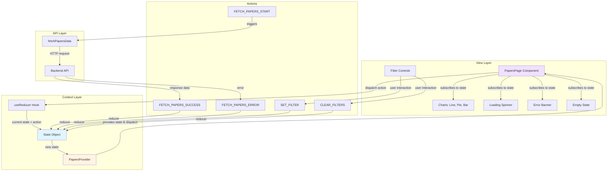
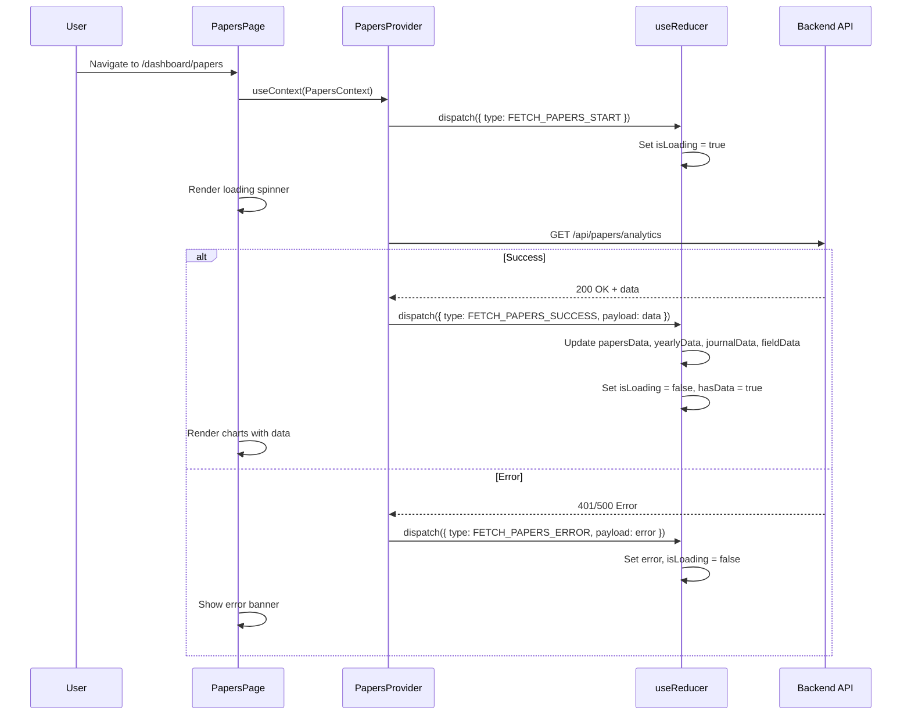
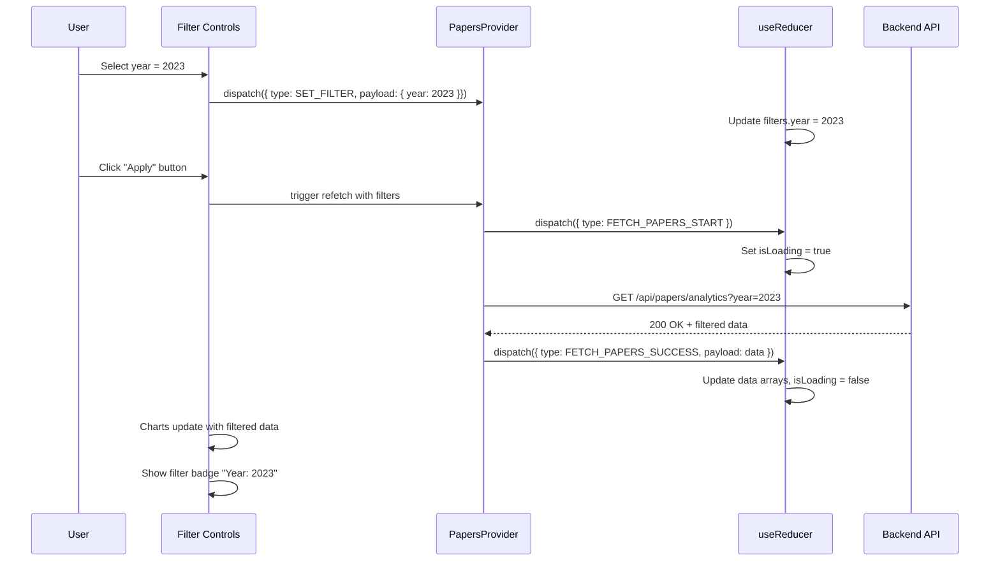
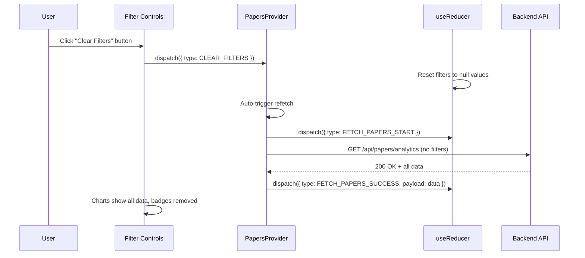
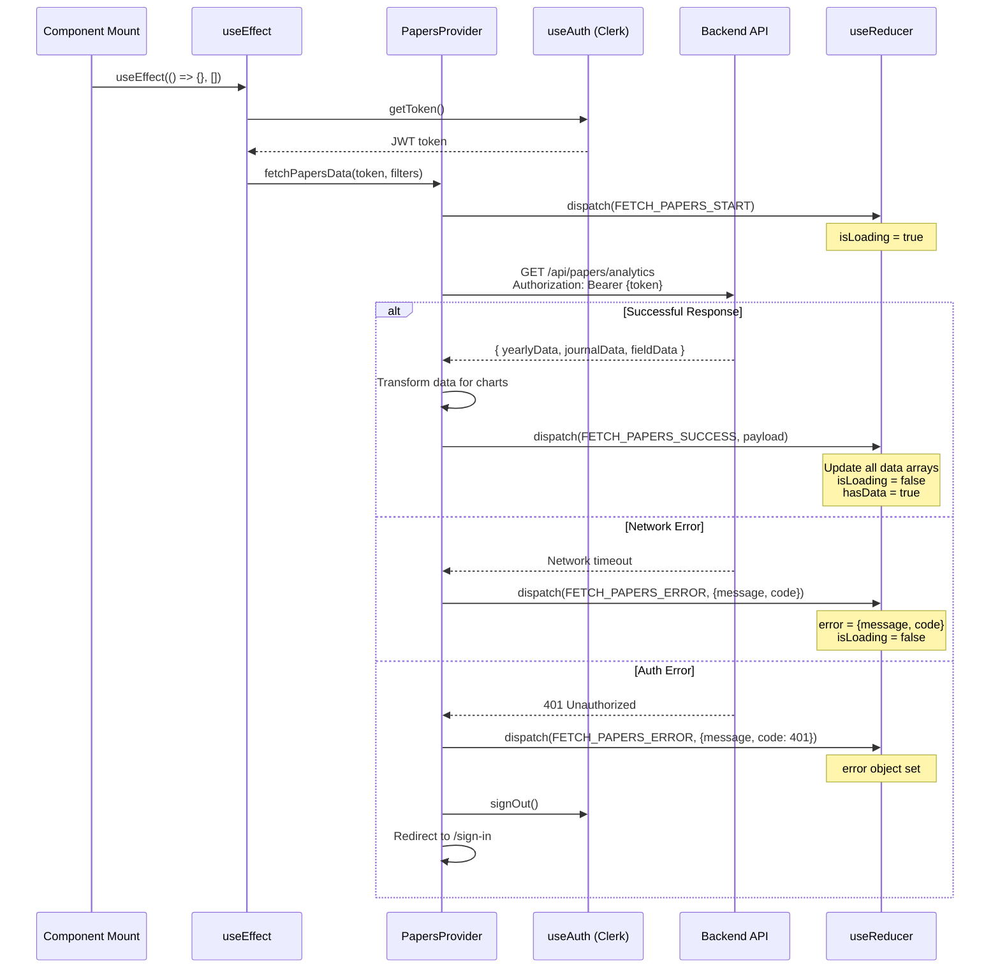
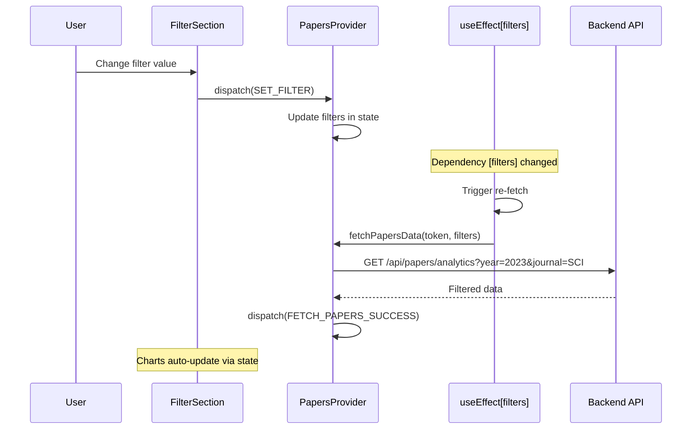

# State Management Design: Papers Analysis Page

## Overview

**Page Route**: `/dashboard/papers`

**State Pattern**: Context + useReducer

**Purpose**: Manage papers analysis data, filters, loading states, and errors for the papers analysis dashboard page.

---

## 1. State Data (Managed in Reducer)

All state data managed by useReducer:

| State Name | Type | Initial Value | Description |
|------------|------|---------------|-------------|
| `papersData` | Object | `null` | Complete papers analysis data from API |
| `yearlyData` | Array | `[]` | Yearly publication count data for line/bar chart |
| `journalData` | Array | `[]` | Journal grade distribution data for pie chart |
| `fieldData` | Array | `[]` | Field-wise publication statistics for bar chart |
| `filters` | Object | `{ year: null, journal: null, field: null }` | Active filter selections |
| `isLoading` | Boolean | `true` | Loading state for initial/filtered data fetch |
| `error` | Object | `null` | Error object `{ message: string, code: string }` |
| `hasData` | Boolean | `false` | Whether any data exists (for empty state) |

---

## 2. Derived/Computed Data (NOT State)

Data displayed on screen but computed from state, not stored:

| Data | Source | Computation |
|------|--------|-------------|
| Active filter count | `filters` | Count non-null filter values |
| Filter badges | `filters` | Map filters to label strings |
| Total publications | `yearlyData` | Sum of all counts |
| Chart ready status | `yearlyData`, `journalData`, `fieldData` | Check if arrays have length > 0 |
| Empty state message | `hasData`, `filters` | Conditional text based on filter state |
| Chart options | N/A | Static configuration objects |
| Formatted dates | `yearlyData` | Transform year to display format |

---

## 3. State Transitions Table

| State Name | Condition for Change | How Screen Changes |
|------------|---------------------|-------------------|
| `isLoading` | **true**: API request starts<br>**false**: API response received or error | Shows/hides loading spinner overlay |
| `papersData` | API success response | Raw data stored, triggers derived data computation |
| `yearlyData` | API success, data transformed | Line/bar chart re-renders with new data |
| `journalData` | API success, data transformed | Pie chart re-renders with distribution |
| `fieldData` | API success, data transformed | Bar chart re-renders with comparison |
| `filters` | User selects filter dropdown or clicks "apply" | Filter badges update, API refetch triggered |
| `error` | API error response (network/401/500) | Error alert/banner displayed, charts hidden |
| `hasData` | Check after data fetch: `yearlyData.length > 0` | Empty state vs. charts display toggle |

---

## 4. Action → Store → View Flow (Flux Pattern)

### 4.1 Mermaid Diagram: Complete Flow



### 4.2 Detailed Action Flows

#### Flow 1: Initial Page Load



#### Flow 2: Filter Application



#### Flow 3: Clear Filters



---

## 5. Context Data Loading Flow

### 5.1 Context Provider Structure

```mermaid
graph TB
    A[App Root] --> B[ClerkProvider]
    B --> C[MainLayout]
    C --> D[PapersProvider]
    D --> E[PapersPage Component]

    E --> F[FilterSection]
    E --> G[ChartsSection]
    E --> H[LoadingOverlay]
    E --> I[ErrorBanner]

    G --> J[YearlyChart: Line/Bar]
    G --> K[JournalChart: Pie]
    G --> L[FieldChart: Bar]

    D -.provides.-> |state & dispatch| E
    D -.provides.-> |state & dispatch| F
    D -.provides.-> |state & dispatch| G

    style D fill:#ffe1e1
    style E fill:#e1f5ff
```

### 5.2 Data Loading Sequence



### 5.3 Filter Change Re-fetch Flow



---

## 6. Variables and Functions Exposed to Children

### 6.1 Context Value Interface

```typescript
interface PapersContextValue {
  // State
  state: {
    papersData: PapersData | null;
    yearlyData: YearlyDataPoint[];
    journalData: JournalDataPoint[];
    fieldData: FieldDataPoint[];
    filters: PapersFilters;
    isLoading: boolean;
    error: ErrorObject | null;
    hasData: boolean;
  };

  // Actions
  dispatch: Dispatch<PapersAction>;

  // Helper Functions
  setFilter: (filterType: string, value: any) => void;
  clearFilters: () => void;
  refetchData: () => Promise<void>;
}
```

### 6.2 Exposed Variables

| Variable | Type | Description | Used By |
|----------|------|-------------|---------|
| `state.yearlyData` | Array | Yearly publication counts | YearlyChart component |
| `state.journalData` | Array | Journal grade distribution | JournalChart component |
| `state.fieldData` | Array | Field statistics | FieldChart component |
| `state.filters` | Object | Current filter selections | FilterSection component |
| `state.isLoading` | Boolean | Loading indicator state | LoadingOverlay component |
| `state.error` | Object/null | Error information | ErrorBanner component |
| `state.hasData` | Boolean | Data existence check | EmptyState component |

### 6.3 Exposed Functions

| Function | Signature | Description | Used By |
|----------|-----------|-------------|---------|
| `setFilter` | `(filterType: string, value: any) => void` | Update single filter value | Filter dropdowns |
| `clearFilters` | `() => void` | Reset all filters to null | Clear button |
| `refetchData` | `() => Promise<void>` | Manually trigger data refetch | Refresh button |
| `dispatch` | `(action: PapersAction) => void` | Direct reducer dispatch (advanced) | Custom hooks |

### 6.4 Custom Hooks (Optional)

```typescript
// Convenience hook for filter management
function usePapersFilters() {
  const { state, setFilter, clearFilters } = usePapersContext();

  return {
    filters: state.filters,
    setFilter,
    clearFilters,
    hasActiveFilters: Object.values(state.filters).some(v => v !== null)
  };
}

// Convenience hook for chart data
function usePapersChartData() {
  const { state } = usePapersContext();

  return {
    yearlyData: state.yearlyData,
    journalData: state.journalData,
    fieldData: state.fieldData,
    isLoading: state.isLoading,
    hasData: state.hasData
  };
}
```

---

## 7. Reducer Actions Specification

### 7.1 Action Types

```typescript
enum PapersActionType {
  FETCH_PAPERS_START = 'FETCH_PAPERS_START',
  FETCH_PAPERS_SUCCESS = 'FETCH_PAPERS_SUCCESS',
  FETCH_PAPERS_ERROR = 'FETCH_PAPERS_ERROR',
  SET_FILTER = 'SET_FILTER',
  CLEAR_FILTERS = 'CLEAR_FILTERS',
  RESET_ERROR = 'RESET_ERROR'
}
```

### 7.2 Action Payloads

| Action Type | Payload | Description |
|------------|---------|-------------|
| `FETCH_PAPERS_START` | None | Triggered when API call begins |
| `FETCH_PAPERS_SUCCESS` | `{ papersData, yearlyData, journalData, fieldData }` | API data received |
| `FETCH_PAPERS_ERROR` | `{ message: string, code: string }` | Error details |
| `SET_FILTER` | `{ filterType: string, value: any }` | Single filter update |
| `CLEAR_FILTERS` | None | Reset all filters |
| `RESET_ERROR` | None | Clear error state |

### 7.3 Reducer Logic Summary

```typescript
function papersReducer(state: PapersState, action: PapersAction): PapersState {
  switch (action.type) {
    case FETCH_PAPERS_START:
      return {
        ...state,
        isLoading: true,
        error: null
      };

    case FETCH_PAPERS_SUCCESS:
      return {
        ...state,
        isLoading: false,
        papersData: action.payload.papersData,
        yearlyData: action.payload.yearlyData,
        journalData: action.payload.journalData,
        fieldData: action.payload.fieldData,
        hasData: action.payload.yearlyData.length > 0,
        error: null
      };

    case FETCH_PAPERS_ERROR:
      return {
        ...state,
        isLoading: false,
        error: action.payload,
        hasData: false
      };

    case SET_FILTER:
      return {
        ...state,
        filters: {
          ...state.filters,
          [action.payload.filterType]: action.payload.value
        }
      };

    case CLEAR_FILTERS:
      return {
        ...state,
        filters: {
          year: null,
          journal: null,
          field: null
        }
      };

    case RESET_ERROR:
      return {
        ...state,
        error: null
      };

    default:
      return state;
  }
}
```

---

## 8. Component Tree and State Consumption

```mermaid
graph TB
    A[PapersProvider<br/>Provides: state, dispatch, helpers] --> B[PapersPage]

    B --> C[PageHeader]
    B --> D[FilterSection]
    B --> E[ChartsContainer]
    B --> F[LoadingOverlay]
    B --> G[ErrorBanner]
    B --> H[EmptyState]

    D --> D1[YearFilter<br/>Consumes: filters.year<br/>Calls: setFilter]
    D --> D2[JournalFilter<br/>Consumes: filters.journal<br/>Calls: setFilter]
    D --> D3[FieldFilter<br/>Consumes: filters.field<br/>Calls: setFilter]
    D --> D4[ClearButton<br/>Consumes: filters<br/>Calls: clearFilters]

    E --> E1[YearlyChart<br/>Consumes: yearlyData, isLoading]
    E --> E2[JournalChart<br/>Consumes: journalData, isLoading]
    E --> E3[FieldChart<br/>Consumes: fieldData, isLoading]

    F -.consumes.-> |isLoading| A
    G -.consumes.-> |error| A
    H -.consumes.-> |hasData, filters| A

    style A fill:#ffe1e1
    style B fill:#e1f5ff
    style E fill:#f0e1ff
```

---

## 9. API Integration Points

### 9.1 API Endpoint

**Endpoint**: `GET /api/papers/analytics`

**Query Parameters**:
- `year` (optional): Filter by specific year
- `journal` (optional): Filter by journal grade (e.g., SCI, KCI)
- `field` (optional): Filter by field/department

**Request Headers**:
- `Authorization: Bearer {JWT_TOKEN}`

**Response Format**:
```json
{
  "yearlyData": [
    { "year": 2021, "count": 45 },
    { "year": 2022, "count": 52 },
    { "year": 2023, "count": 61 }
  ],
  "journalData": [
    { "grade": "SCI", "count": 80 },
    { "grade": "KCI", "count": 45 },
    { "grade": "기타", "count": 33 }
  ],
  "fieldData": [
    { "field": "공학", "count": 67 },
    { "field": "의학", "count": 52 },
    { "field": "자연과학", "count": 39 }
  ]
}
```

### 9.2 Error Handling

| Status Code | Action | User Experience |
|-------------|--------|-----------------|
| 200 OK | `FETCH_PAPERS_SUCCESS` | Show charts |
| 401 Unauthorized | `FETCH_PAPERS_ERROR` + redirect | Auto-logout, redirect to login |
| 404 Not Found | `FETCH_PAPERS_ERROR` | "No data available" message |
| 500 Server Error | `FETCH_PAPERS_ERROR` | "Server error, try again" + retry button |
| Network Error | `FETCH_PAPERS_ERROR` | "Connection lost" + retry button |

---

## 10. Performance Optimizations

### 10.1 Memoization Strategy

- **Context Value**: Memoize context value with `useMemo` to prevent unnecessary re-renders
- **Chart Data**: Transform data only when source arrays change
- **Filter Options**: Static filter options don't need state

### 10.2 Data Fetching Strategy

- **Initial Load**: Fetch all data without filters
- **Filter Change**: Debounce filter changes (300ms) before triggering refetch
- **Cache Strategy**: Consider caching previous filter results in sessionStorage

### 10.3 Render Optimization

- **Chart Components**: Use `React.memo` for chart components
- **Filter Components**: Use `React.memo` to prevent re-renders during data loading
- **Conditional Rendering**: Hide charts during loading instead of unmounting

---

## 11. Testing Considerations

### 11.1 State Tests

- Initial state values are correct
- Each action produces expected state transitions
- Filter combinations work correctly
- Error states are handled properly

### 11.2 Integration Tests

- Data fetching on mount
- Filter application triggers refetch
- Error handling flows (401, 500, network)
- Loading states during async operations

### 11.3 Component Tests

- Charts render with mock data
- Filters update state correctly
- Empty state appears when hasData = false
- Error banner shows correct messages

---

## 12. DRY Principles Applied

### 12.1 Reusable Patterns

- **Filter Logic**: Single `setFilter` function handles all filter types
- **Data Transformation**: Centralized in Context, not repeated in components
- **Error Handling**: Single error state and banner component for all errors
- **Loading State**: Single `isLoading` flag for all async operations

### 12.2 Shared with Other Pages

The following can be reused from common modules:
- API client setup (from `api/client.js`)
- Authentication hook (from `hooks/useAuth.js`)
- Chart components (from `components/charts/`)
- Layout wrapper (from `layouts/MainLayout.jsx`)
- Data transformers (from `services/dataTransformer.js`)

### 12.3 Not State-Managed

These should NOT be in reducer state:
- Static filter options (dropdown values)
- Chart configuration objects (colors, labels)
- UI strings and messages
- Component visibility logic (derived from state)
- Formatted display values (computed on render)

---

## 13. Migration Path from Other Patterns

### 13.1 From useState to Context + useReducer

**Before** (multiple useState):
```typescript
const [data, setData] = useState(null);
const [loading, setLoading] = useState(true);
const [error, setError] = useState(null);
const [filters, setFilters] = useState({});
```

**After** (single useReducer):
```typescript
const [state, dispatch] = useReducer(papersReducer, initialState);
```

**Benefits**:
- Centralized state updates
- Predictable state transitions
- Easier to test
- Better for complex state interdependencies

### 13.2 From Props Drilling to Context

**Before**:
```jsx
<PapersPage>
  <FilterSection filters={filters} setFilter={setFilter} />
  <Charts data={data} loading={loading} />
</PapersPage>
```

**After**:
```jsx
<PapersProvider>
  <PapersPage>
    <FilterSection /> {/* Uses context internally */}
    <Charts /> {/* Uses context internally */}
  </PapersPage>
</PapersProvider>
```

---

## 14. File Structure

```
src/
├── pages/
│   └── PapersPage/
│       ├── index.jsx                    # Main page component
│       ├── PapersContext.jsx            # Context + Provider
│       ├── papersReducer.js             # Reducer logic
│       ├── papersActions.js             # Action creators
│       ├── papersTypes.js               # TypeScript types/interfaces
│       └── components/
│           ├── FilterSection.jsx        # Filter controls
│           ├── YearlyChart.jsx          # Yearly publications chart
│           ├── JournalChart.jsx         # Journal distribution chart
│           ├── FieldChart.jsx           # Field statistics chart
│           ├── LoadingOverlay.jsx       # Loading indicator
│           ├── ErrorBanner.jsx          # Error display
│           └── EmptyState.jsx           # No data message
```

---

## 15. Summary Checklist

### State Management
- [x] All state variables identified and justified
- [x] Derived data separated from state
- [x] State transitions documented
- [x] Action types defined

### Architecture
- [x] Context + useReducer pattern chosen
- [x] Provider structure documented
- [x] Component tree mapped
- [x] Data flow visualized

### Integration
- [x] API endpoints specified
- [x] Error handling defined
- [x] Loading states planned
- [x] Filter logic designed

### Best Practices
- [x] DRY principles applied
- [x] Performance optimizations noted
- [x] Testing strategy outlined
- [x] Common module reuse identified

---

## References

- [PRD](/Users/paul/edu/awesomedev/final_report/docs/prd.md)
- [Userflow #6](/Users/paul/edu/awesomedev/final_report/docs/userflow.md#6-논문-분석-조회)
- [Use Case 006](/Users/paul/edu/awesomedev/final_report/docs/usecase/006/spec.md)
- [Database Schema](/Users/paul/edu/awesomedev/final_report/docs/database.md#33-publications)
- [Common Modules](/Users/paul/edu/awesomedev/final_report/docs/common-modules.md)
