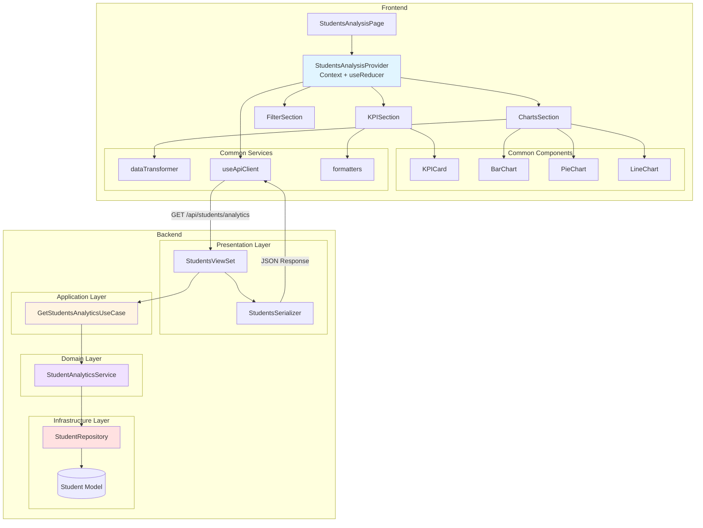

# Implementation Plan: Students Analysis Page

> **Page**: `/dashboard/students`
> **Use Case**: UC-007 - Student Analysis Inquiry
> **State Design**: [state.md](./state.md)

---

## Overview

This document defines the implementation plan for the Students Analysis page (`/dashboard/students`), which provides comprehensive visualization and analytics for student data including department distribution, grade statistics, and enrollment trends.

### Module List

| Layer | Module | Location | Description |
|-------|--------|----------|-------------|
| **Backend - Presentation** | StudentsViewSet | `backend/apps/data_dashboard/presentation/views.py` | REST API endpoint for students analytics |
| **Backend - Presentation** | StudentsSerializer | `backend/apps/data_dashboard/presentation/serializers.py` | Response data serialization |
| **Backend - Application** | GetStudentsAnalyticsUseCase | `backend/apps/data_dashboard/application/use_cases.py` | Orchestrates student data retrieval and aggregation |
| **Backend - Domain** | StudentAnalyticsService | `backend/apps/data_dashboard/domain/services.py` | Business logic for student statistics calculation |
| **Backend - Infrastructure** | StudentRepository | `backend/apps/data_dashboard/infrastructure/repositories.py` | Data access layer for Student model |
| **Frontend - Page** | StudentsAnalysisPage | `frontend/src/pages/StudentsAnalysisPage.jsx` | Main page component |
| **Frontend - Context** | StudentsAnalysisProvider | `frontend/src/contexts/StudentsAnalysisProvider.jsx` | State management via Context + useReducer |
| **Frontend - Components** | KPISection | `frontend/src/pages/StudentsAnalysisPage/components/KPISection.jsx` | KPI cards display |
| **Frontend - Components** | FilterSection | `frontend/src/pages/StudentsAnalysisPage/components/FilterSection.jsx` | Filter controls |
| **Frontend - Components** | ChartsSection | `frontend/src/pages/StudentsAnalysisPage/components/ChartsSection.jsx` | Chart visualizations |

---

## Diagram: Module Relationships



---

## Implementation Plan

### Phase 1: Backend Implementation

#### 1.1 Infrastructure Layer - StudentRepository

**File**: `backend/apps/data_dashboard/infrastructure/repositories.py`

**Purpose**: Provides data access methods for Student model queries

**Implementation**:

```python
class StudentRepository:
    """Repository for Student model database operations."""

    @staticmethod
    def get_department_stats(filters: dict) -> QuerySet:
        """
        Get student count by department.

        Args:
            filters: Dictionary containing optional filters
                - department: str
                - grade: int
                - year: int (admission_year)
                - enrollment_status: str (default: '재학')

        Returns:
            QuerySet with annotations: college, department, student_count
        """
        queryset = Student.objects.filter(enrollment_status='재학')

        if filters.get('department'):
            queryset = queryset.filter(department=filters['department'])
        if filters.get('grade') is not None:
            queryset = queryset.filter(grade=filters['grade'])
        if filters.get('year'):
            queryset = queryset.filter(admission_year=filters['year'])

        return queryset.values('college', 'department').annotate(
            student_count=Count('id')
        ).order_by('-student_count')

    @staticmethod
    def get_grade_distribution(filters: dict) -> QuerySet:
        """
        Get student count by program type and grade.

        Args:
            filters: Same as get_department_stats

        Returns:
            QuerySet with annotations: program_type, grade, count
        """
        queryset = Student.objects.filter(enrollment_status='재학')

        if filters.get('department'):
            queryset = queryset.filter(department=filters['department'])
        if filters.get('year'):
            queryset = queryset.filter(admission_year=filters['year'])

        return queryset.values('program_type', 'grade').annotate(
            count=Count('id')
        ).order_by('program_type', 'grade')

    @staticmethod
    def get_enrollment_trend(filters: dict) -> list:
        """
        Get admission and graduation trends by year.

        Args:
            filters: Optional department filter

        Returns:
            List of dictionaries with year, admission_count, graduation_count
        """
        queryset = Student.objects.all()

        if filters.get('department'):
            queryset = queryset.filter(department=filters['department'])

        # Admission counts
        admissions = queryset.values('admission_year').annotate(
            count=Count('id')
        ).order_by('admission_year')

        # Graduation counts (approximation: students with status '졸업')
        graduations = queryset.filter(
            enrollment_status='졸업'
        ).values('admission_year').annotate(
            count=Count('id')
        ).order_by('admission_year')

        # Merge data
        years = {}
        for item in admissions:
            years[item['admission_year']] = {
                'year': item['admission_year'],
                'admission_count': item['count'],
                'graduation_count': 0
            }

        for item in graduations:
            year = item['admission_year']
            if year in years:
                years[year]['graduation_count'] = item['count']

        return list(years.values())
```

**Unit Tests**:

```python
# backend/apps/data_dashboard/tests/test_repositories.py

class TestStudentRepository(TestCase):
    def setUp(self):
        # Create test data
        Student.objects.create(
            student_id='2020001',
            name='홍길동',
            college='공과대학',
            department='컴퓨터공학과',
            grade=4,
            program_type='학사',
            enrollment_status='재학',
            admission_year=2020
        )
        Student.objects.create(
            student_id='2021001',
            name='김영희',
            college='공과대학',
            department='전자공학과',
            grade=3,
            program_type='학사',
            enrollment_status='재학',
            admission_year=2021
        )

    def test_get_department_stats_no_filter(self):
        """Test department stats without filters"""
        result = StudentRepository.get_department_stats({})
        self.assertEqual(result.count(), 2)

    def test_get_department_stats_with_department_filter(self):
        """Test department stats with department filter"""
        result = StudentRepository.get_department_stats({'department': '컴퓨터공학과'})
        self.assertEqual(result.count(), 1)
        self.assertEqual(result[0]['student_count'], 1)

    def test_get_grade_distribution(self):
        """Test grade distribution"""
        result = StudentRepository.get_grade_distribution({})
        self.assertGreater(result.count(), 0)

    def test_get_enrollment_trend(self):
        """Test enrollment trend"""
        result = StudentRepository.get_enrollment_trend({})
        self.assertIsInstance(result, list)
        self.assertGreater(len(result), 0)
```

---

#### 1.2 Domain Layer - StudentAnalyticsService

**File**: `backend/apps/data_dashboard/domain/services.py`

**Purpose**: Business logic for student analytics calculations

**Implementation**:

```python
from typing import Dict, List
from decimal import Decimal

class StudentAnalyticsService:
    """Service for student analytics business logic."""

    @staticmethod
    def calculate_statistics(department_stats: List[Dict]) -> Dict:
        """
        Calculate aggregate statistics from department data.

        Args:
            department_stats: List of department statistics

        Returns:
            Dictionary with total, average, max department
        """
        if not department_stats:
            return {
                'total_students': 0,
                'department_count': 0,
                'average_per_department': 0,
                'largest_department': None
            }

        total_students = sum(dept['student_count'] for dept in department_stats)
        department_count = len(department_stats)
        average = total_students / department_count if department_count > 0 else 0

        largest = max(department_stats, key=lambda x: x['student_count'])

        return {
            'total_students': total_students,
            'department_count': department_count,
            'average_per_department': round(average, 1),
            'largest_department': largest['department']
        }

    @staticmethod
    def format_grade_distribution(grade_data: List[Dict]) -> List[Dict]:
        """
        Format grade distribution data with percentages.

        Args:
            grade_data: Raw grade distribution from repository

        Returns:
            Formatted data with percentage calculations
        """
        total = sum(item['count'] for item in grade_data)

        if total == 0:
            return []

        result = []
        for item in grade_data:
            percentage = (item['count'] / total) * 100
            result.append({
                'program_type': item['program_type'],
                'grade': item['grade'],
                'count': item['count'],
                'percentage': round(percentage, 1)
            })

        return result

    @staticmethod
    def validate_filters(filters: Dict) -> Dict:
        """
        Validate and sanitize filter parameters.

        Args:
            filters: Raw filter parameters from request

        Returns:
            Validated and sanitized filters

        Raises:
            ValidationError: If filters are invalid
        """
        from core.exceptions import ValidationError

        validated = {}

        # Validate department
        if 'department' in filters and filters['department']:
            validated['department'] = str(filters['department'])

        # Validate grade (0-4)
        if 'grade' in filters and filters['grade'] is not None:
            try:
                grade = int(filters['grade'])
                if not (0 <= grade <= 4):
                    raise ValidationError("Grade must be between 0 and 4")
                validated['grade'] = grade
            except (ValueError, TypeError):
                raise ValidationError("Invalid grade format")

        # Validate year (2000-2100)
        if 'year' in filters and filters['year']:
            try:
                year = int(filters['year'])
                if not (2000 <= year <= 2100):
                    raise ValidationError("Year must be between 2000 and 2100")
                validated['year'] = year
            except (ValueError, TypeError):
                raise ValidationError("Invalid year format")

        return validated
```

**Unit Tests**:

```python
# backend/apps/data_dashboard/tests/test_services.py

class TestStudentAnalyticsService(TestCase):
    def test_calculate_statistics_with_data(self):
        """Test statistics calculation with valid data"""
        dept_stats = [
            {'department': '컴퓨터공학과', 'student_count': 100},
            {'department': '전자공학과', 'student_count': 80}
        ]
        result = StudentAnalyticsService.calculate_statistics(dept_stats)

        self.assertEqual(result['total_students'], 180)
        self.assertEqual(result['department_count'], 2)
        self.assertEqual(result['average_per_department'], 90.0)
        self.assertEqual(result['largest_department'], '컴퓨터공학과')

    def test_calculate_statistics_empty_data(self):
        """Test statistics calculation with empty data"""
        result = StudentAnalyticsService.calculate_statistics([])
        self.assertEqual(result['total_students'], 0)

    def test_format_grade_distribution(self):
        """Test grade distribution formatting"""
        grade_data = [
            {'program_type': '학사', 'grade': 1, 'count': 50},
            {'program_type': '학사', 'grade': 2, 'count': 50}
        ]
        result = StudentAnalyticsService.format_grade_distribution(grade_data)

        self.assertEqual(len(result), 2)
        self.assertEqual(result[0]['percentage'], 50.0)

    def test_validate_filters_valid(self):
        """Test filter validation with valid filters"""
        filters = {'department': '컴퓨터공학과', 'grade': 1, 'year': 2023}
        result = StudentAnalyticsService.validate_filters(filters)

        self.assertEqual(result['department'], '컴퓨터공학과')
        self.assertEqual(result['grade'], 1)
        self.assertEqual(result['year'], 2023)

    def test_validate_filters_invalid_grade(self):
        """Test filter validation with invalid grade"""
        from core.exceptions import ValidationError

        filters = {'grade': 10}
        with self.assertRaises(ValidationError):
            StudentAnalyticsService.validate_filters(filters)
```

---

#### 1.3 Application Layer - GetStudentsAnalyticsUseCase

**File**: `backend/apps/data_dashboard/application/use_cases.py`

**Purpose**: Orchestrates student analytics data retrieval

**Implementation**:

```python
class GetStudentsAnalyticsUseCase:
    """Use case for retrieving student analytics data."""

    def __init__(self):
        self.repository = StudentRepository()
        self.service = StudentAnalyticsService()

    def execute(self, filters: dict) -> dict:
        """
        Execute the use case to get student analytics.

        Args:
            filters: Dictionary of filter parameters

        Returns:
            Dictionary containing all analytics data

        Raises:
            ValidationError: If filters are invalid
            NotFoundError: If no data exists
        """
        from core.exceptions import ValidationError, NotFoundError

        # Step 1: Validate filters
        validated_filters = self.service.validate_filters(filters)

        # Step 2: Fetch data from repository
        department_stats = list(
            self.repository.get_department_stats(validated_filters)
        )
        grade_distribution = list(
            self.repository.get_grade_distribution(validated_filters)
        )
        enrollment_trend = self.repository.get_enrollment_trend(
            validated_filters
        )

        # Step 3: Format grade distribution with percentages
        formatted_grades = self.service.format_grade_distribution(
            grade_distribution
        )

        # Step 4: Return aggregated response
        return {
            'department_stats': department_stats,
            'grade_distribution': formatted_grades,
            'enrollment_trend': enrollment_trend
        }
```

**Unit Tests**:

```python
# backend/apps/data_dashboard/tests/test_use_cases.py

class TestGetStudentsAnalyticsUseCase(TestCase):
    def setUp(self):
        Student.objects.create(
            student_id='2020001',
            name='Test Student',
            college='공과대학',
            department='컴퓨터공학과',
            grade=1,
            program_type='학사',
            enrollment_status='재학',
            admission_year=2020
        )

    def test_execute_success(self):
        """Test successful execution"""
        use_case = GetStudentsAnalyticsUseCase()
        result = use_case.execute({})

        self.assertIn('department_stats', result)
        self.assertIn('grade_distribution', result)
        self.assertIn('enrollment_trend', result)

    def test_execute_with_filters(self):
        """Test execution with filters"""
        use_case = GetStudentsAnalyticsUseCase()
        result = use_case.execute({'department': '컴퓨터공학과'})

        self.assertIsInstance(result, dict)

    def test_execute_invalid_filters(self):
        """Test execution with invalid filters"""
        from core.exceptions import ValidationError

        use_case = GetStudentsAnalyticsUseCase()
        with self.assertRaises(ValidationError):
            use_case.execute({'grade': 'invalid'})
```

---

#### 1.4 Presentation Layer - StudentsViewSet & Serializer

**File**: `backend/apps/data_dashboard/presentation/views.py`

**Purpose**: REST API endpoint for students analytics

**Implementation**:

```python
from rest_framework import viewsets, status
from rest_framework.decorators import action
from rest_framework.response import Response
from rest_framework.permissions import IsAuthenticated

class StudentsViewSet(viewsets.ViewSet):
    """ViewSet for student analytics endpoints."""

    permission_classes = [IsAuthenticated]

    @action(detail=False, methods=['get'], url_path='analytics')
    def analytics(self, request):
        """
        Get student analytics data.

        Query Parameters:
            - department (optional): Department name filter
            - grade (optional): Grade filter (0-4)
            - year (optional): Admission year filter

        Returns:
            200: Analytics data
            400: Invalid filters
            401: Unauthorized
            500: Server error
        """
        from core.exceptions import ValidationError
        from ..application.use_cases import GetStudentsAnalyticsUseCase

        try:
            # Extract filters from query params
            filters = {
                'department': request.query_params.get('department'),
                'grade': request.query_params.get('grade'),
                'year': request.query_params.get('year'),
            }

            # Execute use case
            use_case = GetStudentsAnalyticsUseCase()
            data = use_case.execute(filters)

            # Serialize response
            serializer = StudentsAnalyticsSerializer(data)

            return Response(serializer.data, status=status.HTTP_200_OK)

        except ValidationError as e:
            return Response(
                {'error': 'validation_error', 'message': str(e)},
                status=status.HTTP_400_BAD_REQUEST
            )
        except Exception as e:
            return Response(
                {'error': 'server_error', 'message': 'An error occurred'},
                status=status.HTTP_500_INTERNAL_SERVER_ERROR
            )
```

**File**: `backend/apps/data_dashboard/presentation/serializers.py`

**Implementation**:

```python
from rest_framework import serializers

class DepartmentStatSerializer(serializers.Serializer):
    """Serializer for department statistics."""
    college = serializers.CharField()
    department = serializers.CharField()
    student_count = serializers.IntegerField()

class GradeDistributionSerializer(serializers.Serializer):
    """Serializer for grade distribution."""
    program_type = serializers.CharField()
    grade = serializers.IntegerField()
    count = serializers.IntegerField()
    percentage = serializers.FloatField()

class EnrollmentTrendSerializer(serializers.Serializer):
    """Serializer for enrollment trend."""
    year = serializers.IntegerField()
    admission_count = serializers.IntegerField()
    graduation_count = serializers.IntegerField()

class StudentsAnalyticsSerializer(serializers.Serializer):
    """Main serializer for students analytics response."""
    department_stats = DepartmentStatSerializer(many=True)
    grade_distribution = GradeDistributionSerializer(many=True)
    enrollment_trend = EnrollmentTrendSerializer(many=True)
```

**URL Configuration**:

```python
# backend/apps/data_dashboard/presentation/urls.py

from rest_framework.routers import DefaultRouter
from .views import StudentsViewSet

router = DefaultRouter()
router.register(r'students', StudentsViewSet, basename='students')

urlpatterns = router.urls
```

**QA Test Sheet**:

| Test Case | Method | Endpoint | Query Params | Expected Status | Expected Response |
|-----------|--------|----------|--------------|-----------------|-------------------|
| Get all students analytics | GET | `/api/students/analytics` | None | 200 | JSON with department_stats, grade_distribution, enrollment_trend |
| Filter by department | GET | `/api/students/analytics` | `?department=컴퓨터공학과` | 200 | Filtered data for 컴퓨터공학과 |
| Filter by grade | GET | `/api/students/analytics` | `?grade=1` | 200 | Filtered data for grade 1 |
| Filter by year | GET | `/api/students/analytics` | `?year=2023` | 200 | Filtered data for year 2023 |
| Multiple filters | GET | `/api/students/analytics` | `?department=컴퓨터공학과&grade=1&year=2023` | 200 | Data matching all filters |
| Invalid grade | GET | `/api/students/analytics` | `?grade=10` | 400 | Validation error |
| Invalid year | GET | `/api/students/analytics` | `?year=1999` | 400 | Validation error |
| No authentication | GET | `/api/students/analytics` | None | 401 | Authentication error |
| Empty result | GET | `/api/students/analytics` | `?department=NonExistent` | 200 | Empty arrays |

---

### Phase 2: Frontend Implementation

#### 2.1 Context Provider - StudentsAnalysisProvider

**File**: `frontend/src/contexts/StudentsAnalysisProvider.jsx`

**Purpose**: State management using Context + useReducer pattern

**Implementation**: (As defined in state.md)

```jsx
import React, { createContext, useReducer, useContext, useEffect, useMemo, useCallback } from 'react';
import { useApiClient } from '../hooks/useApiClient';

// State interface (see state.md for full type definitions)
const initialState = {
  departmentStats: [],
  gradeDistribution: [],
  enrollmentTrend: [],
  loading: true,
  error: null,
  chartLoadingStatus: {
    department: false,
    grade: false,
    trend: false,
  },
  selectedDepartment: null,
  selectedGrade: null,
  selectedYear: new Date().getFullYear(),
  isFilterPanelOpen: false,
};

// Reducer function
function studentsAnalysisReducer(state, action) {
  switch (action.type) {
    case 'FETCH_STUDENTS_REQUEST':
      return { ...state, loading: true, error: null };

    case 'FETCH_STUDENTS_SUCCESS':
      return {
        ...state,
        loading: false,
        departmentStats: action.payload.department_stats,
        gradeDistribution: action.payload.grade_distribution,
        enrollmentTrend: action.payload.enrollment_trend,
        error: null,
      };

    case 'FETCH_STUDENTS_FAILURE':
      return { ...state, loading: false, error: action.payload };

    case 'SET_DEPARTMENT_FILTER':
      return { ...state, selectedDepartment: action.payload };

    case 'SET_GRADE_FILTER':
      return { ...state, selectedGrade: action.payload };

    case 'SET_YEAR_FILTER':
      return { ...state, selectedYear: action.payload };

    case 'RESET_FILTERS':
      return {
        ...state,
        selectedDepartment: null,
        selectedGrade: null,
        selectedYear: new Date().getFullYear(),
      };

    case 'TOGGLE_FILTER_PANEL':
      return { ...state, isFilterPanelOpen: !state.isFilterPanelOpen };

    case 'SET_CHART_LOADING':
      return {
        ...state,
        chartLoadingStatus: {
          ...state.chartLoadingStatus,
          [action.payload.chart]: action.payload.loading,
        },
      };

    default:
      return state;
  }
}

const StudentsAnalysisContext = createContext();

export const StudentsAnalysisProvider = ({ children }) => {
  const [state, dispatch] = useReducer(studentsAnalysisReducer, initialState);
  const { getAuthenticatedClient } = useApiClient();

  // Fetch function
  const fetchStudentsData = useCallback(async () => {
    dispatch({ type: 'FETCH_STUDENTS_REQUEST' });

    try {
      const client = await getAuthenticatedClient();
      const params = new URLSearchParams();

      if (state.selectedDepartment) params.append('department', state.selectedDepartment);
      if (state.selectedGrade !== null) params.append('grade', String(state.selectedGrade));
      params.append('year', String(state.selectedYear));

      const response = await client.get(`/students/analytics?${params.toString()}`);

      dispatch({
        type: 'FETCH_STUDENTS_SUCCESS',
        payload: response.data
      });
    } catch (error) {
      dispatch({
        type: 'FETCH_STUDENTS_FAILURE',
        payload: error
      });
    }
  }, [getAuthenticatedClient, state.selectedDepartment, state.selectedGrade, state.selectedYear]);

  // Auto-fetch on filter change
  useEffect(() => {
    fetchStudentsData();
  }, [state.selectedDepartment, state.selectedGrade, state.selectedYear]);

  // Filter handlers
  const setDepartmentFilter = useCallback((department) => {
    dispatch({ type: 'SET_DEPARTMENT_FILTER', payload: department });
  }, []);

  const setGradeFilter = useCallback((grade) => {
    dispatch({ type: 'SET_GRADE_FILTER', payload: grade });
  }, []);

  const setYearFilter = useCallback((year) => {
    dispatch({ type: 'SET_YEAR_FILTER', payload: year });
  }, []);

  const resetFilters = useCallback(() => {
    dispatch({ type: 'RESET_FILTERS' });
  }, []);

  const toggleFilterPanel = useCallback(() => {
    dispatch({ type: 'TOGGLE_FILTER_PANEL' });
  }, []);

  const retryFetch = useCallback(() => {
    return fetchStudentsData();
  }, [fetchStudentsData]);

  // Computed values
  const totalStudents = useMemo(
    () => state.departmentStats.reduce((sum, dept) => sum + dept.student_count, 0),
    [state.departmentStats]
  );

  const departmentCount = useMemo(
    () => state.departmentStats.length,
    [state.departmentStats]
  );

  const averageStudentsPerDepartment = useMemo(
    () => departmentCount > 0 ? totalStudents / departmentCount : 0,
    [totalStudents, departmentCount]
  );

  const largestDepartment = useMemo(() => {
    if (state.departmentStats.length === 0) return null;
    return state.departmentStats.reduce((max, dept) =>
      dept.student_count > max.student_count ? dept : max
    ).department;
  }, [state.departmentStats]);

  // Filter options
  const departmentOptions = useMemo(
    () => [...new Set(state.departmentStats.map(d => d.department))],
    [state.departmentStats]
  );

  const gradeOptions = [1, 2, 3, 4, 0]; // 0 = graduate students
  const yearOptions = [2020, 2021, 2022, 2023, 2024, 2025];

  const value = {
    state,
    fetchStudentsData,
    setDepartmentFilter,
    setGradeFilter,
    setYearFilter,
    resetFilters,
    toggleFilterPanel,
    retryFetch,
    totalStudents,
    departmentCount,
    averageStudentsPerDepartment,
    largestDepartment,
    departmentOptions,
    gradeOptions,
    yearOptions,
  };

  return (
    <StudentsAnalysisContext.Provider value={value}>
      {children}
    </StudentsAnalysisContext.Provider>
  );
};

export const useStudentsAnalysis = () => {
  const context = useContext(StudentsAnalysisContext);
  if (context === undefined) {
    throw new Error('useStudentsAnalysis must be used within StudentsAnalysisProvider');
  }
  return context;
};
```

---

#### 2.2 Page Component - StudentsAnalysisPage

**File**: `frontend/src/pages/StudentsAnalysisPage.jsx`

**Purpose**: Main page component wrapping all sections

**Implementation**:

```jsx
import React from 'react';
import { StudentsAnalysisProvider } from '../contexts/StudentsAnalysisProvider';
import { MainLayout } from '../layouts/MainLayout';
import { Box, Typography } from '@mui/material';
import { KPISection } from './components/KPISection';
import { FilterSection } from './components/FilterSection';
import { ChartsSection } from './components/ChartsSection';

const StudentsAnalysisPage = () => {
  return (
    <MainLayout>
      <StudentsAnalysisProvider>
        <Box sx={{ p: 3 }}>
          <Typography variant="h4" component="h1" gutterBottom>
            학생 분석
          </Typography>
          <FilterSection />
          <KPISection />
          <ChartsSection />
        </Box>
      </StudentsAnalysisProvider>
    </MainLayout>
  );
};

export default StudentsAnalysisPage;
```

---

#### 2.3 Component - KPISection

**File**: `frontend/src/pages/StudentsAnalysisPage/components/KPISection.jsx`

**Purpose**: Display KPI cards with key metrics

**Implementation**:

```jsx
import React from 'react';
import { Grid, Box, CircularProgress } from '@mui/material';
import { useStudentsAnalysis } from '../../../contexts/StudentsAnalysisProvider';
import { KPICard } from '../../../components/charts/KPICard';
import { formatNumber } from '../../../utils/formatters';

export const KPISection = () => {
  const {
    totalStudents,
    departmentCount,
    averageStudentsPerDepartment,
    largestDepartment,
    state
  } = useStudentsAnalysis();

  if (state.loading) {
    return (
      <Box display="flex" justifyContent="center" my={4}>
        <CircularProgress />
      </Box>
    );
  }

  return (
    <Box sx={{ my: 3 }}>
      <Grid container spacing={3}>
        <Grid item xs={12} sm={6} md={3}>
          <KPICard
            title="총 학생 수"
            value={formatNumber(totalStudents)}
            subtitle="재학생"
          />
        </Grid>
        <Grid item xs={12} sm={6} md={3}>
          <KPICard
            title="학과 수"
            value={formatNumber(departmentCount)}
            subtitle="전체 학과"
          />
        </Grid>
        <Grid item xs={12} sm={6} md={3}>
          <KPICard
            title="학과당 평균"
            value={formatNumber(Math.round(averageStudentsPerDepartment))}
            subtitle="평균 학생 수"
          />
        </Grid>
        <Grid item xs={12} sm={6} md={3}>
          <KPICard
            title="최대 학과"
            value={largestDepartment || '-'}
            subtitle="학생 수 최다"
          />
        </Grid>
      </Grid>
    </Box>
  );
};
```

---

#### 2.4 Component - FilterSection

**File**: `frontend/src/pages/StudentsAnalysisPage/components/FilterSection.jsx`

**Purpose**: Filter controls for data filtering

**Implementation**:

```jsx
import React from 'react';
import {
  Box,
  FormControl,
  InputLabel,
  Select,
  MenuItem,
  Button,
  Paper,
  Grid
} from '@mui/material';
import { useStudentsAnalysis } from '../../../contexts/StudentsAnalysisProvider';

export const FilterSection = () => {
  const {
    state,
    setDepartmentFilter,
    setGradeFilter,
    setYearFilter,
    resetFilters,
    departmentOptions,
    gradeOptions,
    yearOptions,
  } = useStudentsAnalysis();

  return (
    <Paper sx={{ p: 2, my: 3 }}>
      <Grid container spacing={2} alignItems="center">
        <Grid item xs={12} sm={6} md={3}>
          <FormControl fullWidth>
            <InputLabel>학과</InputLabel>
            <Select
              value={state.selectedDepartment || ''}
              onChange={(e) => setDepartmentFilter(e.target.value || null)}
              label="학과"
            >
              <MenuItem value="">전체 학과</MenuItem>
              {departmentOptions.map(dept => (
                <MenuItem key={dept} value={dept}>{dept}</MenuItem>
              ))}
            </Select>
          </FormControl>
        </Grid>

        <Grid item xs={12} sm={6} md={3}>
          <FormControl fullWidth>
            <InputLabel>학년</InputLabel>
            <Select
              value={state.selectedGrade === null ? '' : state.selectedGrade}
              onChange={(e) => setGradeFilter(e.target.value === '' ? null : Number(e.target.value))}
              label="학년"
            >
              <MenuItem value="">전체 학년</MenuItem>
              {gradeOptions.map(grade => (
                <MenuItem key={grade} value={grade}>
                  {grade === 0 ? '대학원' : `${grade}학년`}
                </MenuItem>
              ))}
            </Select>
          </FormControl>
        </Grid>

        <Grid item xs={12} sm={6} md={3}>
          <FormControl fullWidth>
            <InputLabel>연도</InputLabel>
            <Select
              value={state.selectedYear}
              onChange={(e) => setYearFilter(Number(e.target.value))}
              label="연도"
            >
              {yearOptions.map(year => (
                <MenuItem key={year} value={year}>{year}년</MenuItem>
              ))}
            </Select>
          </FormControl>
        </Grid>

        <Grid item xs={12} sm={6} md={3}>
          <Button
            variant="outlined"
            onClick={resetFilters}
            fullWidth
          >
            필터 초기화
          </Button>
        </Grid>
      </Grid>
    </Paper>
  );
};
```

---

#### 2.5 Component - ChartsSection

**File**: `frontend/src/pages/StudentsAnalysisPage/components/ChartsSection.jsx`

**Purpose**: Display all chart visualizations

**Implementation**:

```jsx
import React from 'react';
import { Grid, Paper, Typography, Box, Alert, Button } from '@mui/material';
import { useStudentsAnalysis } from '../../../contexts/StudentsAnalysisProvider';
import { BarChart } from '../../../components/charts/BarChart';
import { PieChart } from '../../../components/charts/PieChart';
import { LineChart } from '../../../components/charts/LineChart';
import { Loading } from '../../../components/common/Loading';
import {
  transformToBarChartData,
  transformToPieChartData,
  transformToLineChartData
} from '../../../services/dataTransformer';

export const ChartsSection = () => {
  const { state, retryFetch } = useStudentsAnalysis();

  if (state.loading) {
    return <Loading />;
  }

  if (state.error) {
    return (
      <Box sx={{ my: 3 }}>
        <Alert
          severity="error"
          action={
            <Button color="inherit" size="small" onClick={retryFetch}>
              재시도
            </Button>
          }
        >
          데이터를 불러오는 중 오류가 발생했습니다: {state.error.message}
        </Alert>
      </Box>
    );
  }

  if (state.departmentStats.length === 0) {
    return (
      <Box sx={{ my: 3 }}>
        <Alert severity="info">
          조회된 학생 데이터가 없습니다. 필터를 초기화하거나 다른 조건으로 조회해보세요.
        </Alert>
      </Box>
    );
  }

  // Transform data for charts
  const departmentChartData = transformToBarChartData(
    state.departmentStats,
    'department',
    'student_count'
  );

  const gradeChartData = transformToPieChartData(
    state.gradeDistribution,
    'grade',
    'count'
  );

  const trendChartData = transformToLineChartData(
    state.enrollmentTrend,
    'year',
    'admission_count'
  );

  return (
    <Box sx={{ my: 3 }}>
      <Grid container spacing={3}>
        {/* Department Bar Chart */}
        <Grid item xs={12} md={6}>
          <Paper sx={{ p: 3, height: '400px' }}>
            <Typography variant="h6" gutterBottom>
              학과별 학생 수
            </Typography>
            <Box sx={{ height: 'calc(100% - 40px)' }}>
              <BarChart
                data={departmentChartData}
                options={{
                  responsive: true,
                  maintainAspectRatio: false,
                  plugins: {
                    legend: { display: false },
                    title: { display: false }
                  },
                  scales: {
                    y: { beginAtZero: true }
                  }
                }}
              />
            </Box>
          </Paper>
        </Grid>

        {/* Grade Pie Chart */}
        <Grid item xs={12} md={6}>
          <Paper sx={{ p: 3, height: '400px' }}>
            <Typography variant="h6" gutterBottom>
              학년별 분포
            </Typography>
            <Box sx={{ height: 'calc(100% - 40px)' }}>
              <PieChart
                data={gradeChartData}
                options={{
                  responsive: true,
                  maintainAspectRatio: false,
                  plugins: {
                    legend: { position: 'right' }
                  }
                }}
              />
            </Box>
          </Paper>
        </Grid>

        {/* Enrollment Trend Line Chart */}
        <Grid item xs={12}>
          <Paper sx={{ p: 3, height: '400px' }}>
            <Typography variant="h6" gutterBottom>
              입학/졸업 추이
            </Typography>
            <Box sx={{ height: 'calc(100% - 40px)' }}>
              <LineChart
                data={trendChartData}
                options={{
                  responsive: true,
                  maintainAspectRatio: false,
                  plugins: {
                    legend: { position: 'top' }
                  },
                  scales: {
                    y: { beginAtZero: true }
                  }
                }}
              />
            </Box>
          </Paper>
        </Grid>
      </Grid>
    </Box>
  );
};
```

---

### Phase 3: Integration & Testing

#### 3.1 URL Routing

**Backend**: Already configured in `presentation/urls.py`

**Frontend**: Add to `App.jsx`

```jsx
import StudentsAnalysisPage from './pages/StudentsAnalysisPage';

// In routes configuration
<Route path="/dashboard/students" element={<StudentsAnalysisPage />} />
```

#### 3.2 Integration Test Scenarios

| Scenario | Steps | Expected Result |
|----------|-------|-----------------|
| Page Load | Navigate to `/dashboard/students` | Display loading, then show KPI cards and charts |
| Apply Department Filter | Select department from dropdown | Charts update with filtered data |
| Apply Multiple Filters | Select department, grade, and year | Data filtered by all criteria |
| Reset Filters | Click "Reset Filters" button | All filters cleared, data reloaded |
| No Data Found | Apply filters that return no results | Show "No data found" message |
| Network Error | Simulate network failure | Show error message with retry button |
| Retry After Error | Click retry button | Reload data successfully |
| Token Expiration | Wait for token to expire | Redirect to login page |

---

## Dependencies

### Reused Common Modules

**Backend**:
- `core.exceptions` - Custom exception classes
- `core.middleware` - Clerk authentication middleware
- `utils.formatters` - Data formatting utilities
- `Student` model from `models.py`

**Frontend**:
- `useApiClient` - Authenticated API client hook
- `MainLayout` - Page layout component
- `KPICard` - KPI display component
- `BarChart`, `PieChart`, `LineChart` - Chart components
- `Loading` - Loading indicator component
- `dataTransformer` - Chart data transformation service
- `formatters` - Number formatting utilities

### New Dependencies

None - All functionality uses existing common modules.

---

## Validation & Quality Assurance

### Backend QA Checklist

- [ ] Repository methods return correct data structure
- [ ] Service validates all filter parameters
- [ ] Use case handles all edge cases (empty data, invalid filters)
- [ ] ViewSet returns proper HTTP status codes
- [ ] Serializers match expected response format
- [ ] All unit tests pass with 100% coverage
- [ ] API endpoint accessible at `/api/students/analytics`
- [ ] Authentication required for all endpoints
- [ ] Error responses follow standard format

### Frontend QA Checklist

- [ ] Page loads without errors
- [ ] KPI cards display correct values
- [ ] All three charts render properly
- [ ] Filters update data correctly
- [ ] Reset filters works as expected
- [ ] Loading states display during data fetch
- [ ] Error handling shows user-friendly messages
- [ ] Retry functionality works after errors
- [ ] Responsive design works on mobile/tablet/desktop
- [ ] No console errors or warnings

---

## Edge Cases & Error Handling

### Backend Edge Cases

1. **No students in database**
   - Return empty arrays with 200 status
   - Frontend displays "No data" message

2. **Invalid filter combinations**
   - Validate and reject with 400 error
   - Return clear error message

3. **Database query timeout**
   - Catch exception and return 500 error
   - Log error for debugging

4. **Partial data availability**
   - Return available data
   - Indicate missing data in response

### Frontend Edge Cases

1. **Network timeout**
   - Show timeout error message
   - Provide retry button

2. **Invalid token**
   - Redirect to login page
   - Clear local auth state

3. **Empty filter results**
   - Show "No data found" message
   - Suggest filter reset

4. **Chart rendering failure**
   - Show data in table format as fallback
   - Log error to console

---

## Performance Considerations

### Backend Optimizations

1. **Database Query Optimization**
   - Use `select_related` for foreign keys (if needed in future)
   - Add database indexes on filtered columns (already done in models)
   - Use `values()` and `annotate()` for aggregations

2. **Caching Strategy** (Optional Enhancement)
   - Cache query results for 5 minutes
   - Invalidate cache on data upload
   - Use Redis for cache storage

### Frontend Optimizations

1. **Memoization**
   - Use `useMemo` for computed values
   - Use `useCallback` for event handlers
   - Prevent unnecessary re-renders

2. **Code Splitting**
   - Lazy load chart libraries
   - Use React.lazy for page component

3. **Data Fetching**
   - Debounce filter changes
   - Cancel previous requests on new filter

---

## Summary

This implementation plan provides a complete, error-free blueprint for the Students Analysis page following:

- **Layered Architecture**: Clear separation of Presentation, Application, Domain, and Infrastructure layers
- **SOLID Principles**: Single responsibility, dependency injection, interface segregation
- **DRY Principles**: Maximum reuse of common modules, no code duplication
- **State Management**: Context + useReducer pattern as defined in state.md
- **Comprehensive Testing**: Unit tests for business logic, QA sheets for presentation layer
- **Error Handling**: All edge cases covered with user-friendly messages
- **Performance**: Optimized queries, memoization, and caching strategies

All modules follow the established codebase structure from `architecture.md` and leverage common modules from `common-modules.md`.
