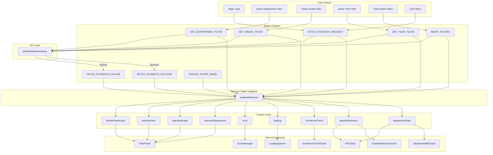
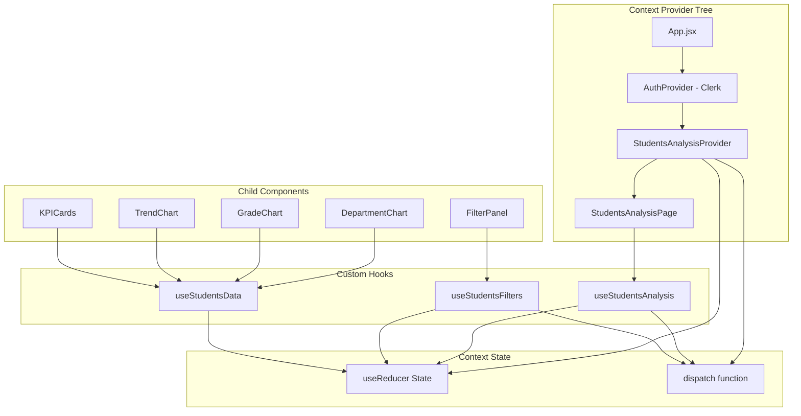
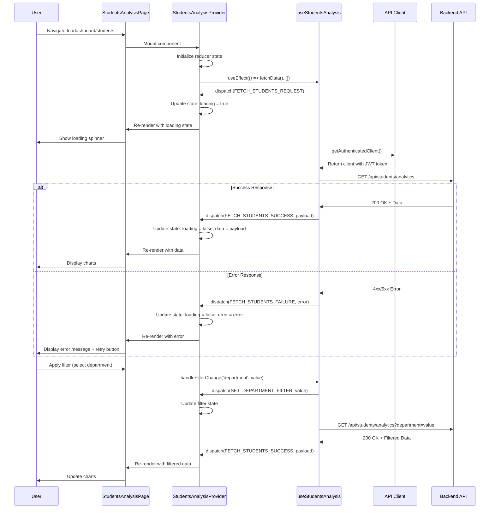

# State Management Design: Students Analysis Page

> **Page**: `/dashboard/students`
> **Pattern**: Context + useReducer
> **Purpose**: State design for student statistics visualization with filtering

---

## 1. State Data (Managed State)

All data that requires state management and triggers re-renders:

### 1.1 Core Data State
| State Variable | Type | Initial Value | Description |
|----------------|------|---------------|-------------|
| `departmentStats` | `DepartmentStat[]` | `[]` | Array of student count by department |
| `gradeDistribution` | `GradeDistribution[]` | `[]` | Array of student count by grade |
| `enrollmentTrend` | `EnrollmentTrendData[]` | `[]` | Array of admission/graduation trends |
| `loading` | `boolean` | `true` | Loading state for async operations |
| `error` | `Error \| null` | `null` | Error object if request fails |

### 1.2 Filter State
| State Variable | Type | Initial Value | Description |
|----------------|------|---------------|-------------|
| `selectedDepartment` | `string \| null` | `null` | Selected department filter (null = all) |
| `selectedGrade` | `number \| null` | `null` | Selected grade filter (null = all) |
| `selectedYear` | `number` | `new Date().getFullYear()` | Selected year filter (default: current year) |

### 1.3 UI State
| State Variable | Type | Initial Value | Description |
|----------------|------|---------------|-------------|
| `isFilterPanelOpen` | `boolean` | `false` | Filter panel visibility state |
| `chartLoadingStatus` | `ChartLoadingStatus` | `{ department: false, grade: false, trend: false }` | Individual chart loading states |

---

## 2. Non-State Data (Derived/Static Data)

Data displayed on screen that does NOT require state management:

### 2.1 Computed Values (Derived from State)
| Data | Source | Calculation |
|------|--------|-------------|
| `totalStudents` | `departmentStats` | `sum(departmentStats.map(d => d.studentCount))` |
| `departmentCount` | `departmentStats` | `departmentStats.length` |
| `averageStudentsPerDepartment` | `departmentStats` | `totalStudents / departmentCount` |
| `largestDepartment` | `departmentStats` | `max(departmentStats, by: studentCount).department` |
| `gradePercentages` | `gradeDistribution` | `gradeDistribution.map(g => { ...g, percentage: (g.count / totalStudents) * 100 })` |

### 2.2 Static Configuration
| Data | Value | Purpose |
|------|-------|---------|
| `chartColors` | `['#1976d2', '#dc004e', '#4caf50', '#ff9800', '#9c27b0']` | Chart color palette |
| `departmentFilterOptions` | Fetched once on mount | Department dropdown options |
| `gradeFilterOptions` | `[1, 2, 3, 4, 0]` (0 = graduate) | Grade dropdown options |
| `yearFilterOptions` | `[2020, 2021, 2022, 2023, 2024, 2025]` | Year dropdown options |

### 2.3 UI Labels and Text
| Data | Value | Purpose |
|------|-------|---------|
| `pageTitle` | "학생 분석" | Page header |
| `chartTitles` | `{ department: "학과별 학생 수", grade: "학년별 분포", trend: "입학/졸업 추이" }` | Chart titles |
| `emptyStateMessage` | "조회된 학생 데이터가 없습니다" | Empty state text |
| `errorMessage` | "데이터를 불러오는 중 오류가 발생했습니다" | Error message |

---

## 3. State Change Conditions and Screen Updates

| State Name | Conditions for Change | How Screen Changes |
|------------|----------------------|-------------------|
| `departmentStats` | API success response | Department bar chart re-renders with new data |
| `gradeDistribution` | API success response | Grade pie/donut chart re-renders with new data |
| `enrollmentTrend` | API success response | Trend line chart re-renders with new data |
| `loading` | Request start: `true`, Request end: `false` | Loading spinner shows/hides, skeleton UI toggles |
| `error` | Request failure | Error message displays, retry button appears |
| `selectedDepartment` | User selects dropdown option | Filter badge updates, API request triggers, charts reload |
| `selectedGrade` | User selects dropdown option | Filter badge updates, API request triggers, charts reload |
| `selectedYear` | User selects dropdown option | Filter badge updates, API request triggers, charts reload |
| `isFilterPanelOpen` | User clicks filter button | Filter panel slides in/out |
| `chartLoadingStatus.department` | Department chart data loading | Department chart shows loading indicator |
| `chartLoadingStatus.grade` | Grade chart data loading | Grade chart shows loading indicator |
| `chartLoadingStatus.trend` | Trend chart data loading | Trend chart shows loading indicator |

---

## 4. Action → Store → View Flow (Flux Pattern)

### 4.1 Mermaid Diagram: Complete Data Flow



### 4.2 Detailed Action Flow

#### Action 1: Page Load
```
User: Navigate to /dashboard/students
  ↓
Action: FETCH_STUDENTS_REQUEST
  ↓
Reducer: { loading: true, error: null }
  ↓
View: Show loading spinner
  ↓
API: GET /api/students/analytics
  ↓
Action: FETCH_STUDENTS_SUCCESS
  ↓
Reducer: {
  loading: false,
  departmentStats: [...data],
  gradeDistribution: [...data],
  enrollmentTrend: [...data]
}
  ↓
View: Render all charts with data
```

#### Action 2: Apply Department Filter
```
User: Select department from dropdown
  ↓
Action: SET_DEPARTMENT_FILTER { department: "컴퓨터공학과" }
  ↓
Reducer: { selectedDepartment: "컴퓨터공학과" }
  ↓
View: Update filter badge
  ↓
Side Effect: Trigger FETCH_STUDENTS_REQUEST with filters
  ↓
API: GET /api/students/analytics?department=컴퓨터공학과
  ↓
Action: FETCH_STUDENTS_SUCCESS
  ↓
Reducer: Update all chart data
  ↓
View: Re-render charts with filtered data
```

#### Action 3: Reset Filters
```
User: Click "Reset Filters" button
  ↓
Action: RESET_FILTERS
  ↓
Reducer: {
  selectedDepartment: null,
  selectedGrade: null,
  selectedYear: currentYear
}
  ↓
View: Clear filter badges
  ↓
Side Effect: Trigger FETCH_STUDENTS_REQUEST with default filters
  ↓
API: GET /api/students/analytics
  ↓
View: Re-render charts with all data
```

---

## 5. Context Data Loading Flow

### 5.1 Mermaid Diagram: Context Provider Structure



### 5.2 Data Loading Sequence



---

## 6. Variables and Functions to Expose to Child Components

### 6.1 Context Value Interface

```typescript
interface StudentsAnalysisContextValue {
  // State
  state: StudentsAnalysisState;

  // Actions
  fetchStudentsData: () => Promise<void>;
  setDepartmentFilter: (department: string | null) => void;
  setGradeFilter: (grade: number | null) => void;
  setYearFilter: (year: number) => void;
  resetFilters: () => void;
  toggleFilterPanel: () => void;
  retryFetch: () => Promise<void>;

  // Computed values
  totalStudents: number;
  departmentCount: number;
  averageStudentsPerDepartment: number;
  largestDepartment: string | null;

  // Filter options
  departmentOptions: string[];
  gradeOptions: number[];
  yearOptions: number[];
}
```

### 6.2 Exposed Variables

| Variable | Type | Consumed By | Purpose |
|----------|------|-------------|---------|
| `state.departmentStats` | `DepartmentStat[]` | `DepartmentBarChart` | Render department chart |
| `state.gradeDistribution` | `GradeDistribution[]` | `GradeDistributionChart` | Render grade pie chart |
| `state.enrollmentTrend` | `EnrollmentTrendData[]` | `EnrollmentTrendChart` | Render trend line chart |
| `state.loading` | `boolean` | All chart components | Show/hide loading indicators |
| `state.error` | `Error \| null` | `ErrorBoundary` | Display error messages |
| `state.selectedDepartment` | `string \| null` | `FilterPanel` | Show selected filter |
| `state.selectedGrade` | `number \| null` | `FilterPanel` | Show selected filter |
| `state.selectedYear` | `number` | `FilterPanel` | Show selected filter |
| `state.isFilterPanelOpen` | `boolean` | `FilterPanel` | Control panel visibility |
| `totalStudents` | `number` | `KPICard` | Display total count |
| `departmentCount` | `number` | `KPICard` | Display department count |
| `averageStudentsPerDepartment` | `number` | `KPICard` | Display average |
| `largestDepartment` | `string \| null` | `KPICard` | Display top department |

### 6.3 Exposed Functions

| Function | Parameters | Used By | Action Dispatched |
|----------|------------|---------|-------------------|
| `fetchStudentsData` | `void` | `StudentsAnalysisPage` (mount) | `FETCH_STUDENTS_REQUEST` |
| `setDepartmentFilter` | `department: string \| null` | `FilterPanel` | `SET_DEPARTMENT_FILTER` |
| `setGradeFilter` | `grade: number \| null` | `FilterPanel` | `SET_GRADE_FILTER` |
| `setYearFilter` | `year: number` | `FilterPanel` | `SET_YEAR_FILTER` |
| `resetFilters` | `void` | `FilterPanel` | `RESET_FILTERS` |
| `toggleFilterPanel` | `void` | `FilterButton` | `TOGGLE_FILTER_PANEL` |
| `retryFetch` | `void` | `ErrorMessage` | `FETCH_STUDENTS_REQUEST` |

---

## 7. Reducer Design

### 7.1 State Interface

```typescript
interface StudentsAnalysisState {
  // Data
  departmentStats: DepartmentStat[];
  gradeDistribution: GradeDistribution[];
  enrollmentTrend: EnrollmentTrendData[];

  // Loading & Error
  loading: boolean;
  error: Error | null;
  chartLoadingStatus: ChartLoadingStatus;

  // Filters
  selectedDepartment: string | null;
  selectedGrade: number | null;
  selectedYear: number;

  // UI
  isFilterPanelOpen: boolean;
}

interface DepartmentStat {
  college: string;
  department: string;
  studentCount: number;
}

interface GradeDistribution {
  programType: string; // "학사" | "석사" | "박사"
  grade: number; // 1-4 or 0 for graduate
  count: number;
}

interface EnrollmentTrendData {
  year: number;
  admissionCount: number;
  graduationCount: number;
}

interface ChartLoadingStatus {
  department: boolean;
  grade: boolean;
  trend: boolean;
}
```

### 7.2 Action Types

```typescript
type StudentsAnalysisAction =
  | { type: 'FETCH_STUDENTS_REQUEST' }
  | { type: 'FETCH_STUDENTS_SUCCESS'; payload: StudentsAnalysisData }
  | { type: 'FETCH_STUDENTS_FAILURE'; payload: Error }
  | { type: 'SET_DEPARTMENT_FILTER'; payload: string | null }
  | { type: 'SET_GRADE_FILTER'; payload: number | null }
  | { type: 'SET_YEAR_FILTER'; payload: number }
  | { type: 'RESET_FILTERS' }
  | { type: 'TOGGLE_FILTER_PANEL' }
  | { type: 'SET_CHART_LOADING'; payload: { chart: keyof ChartLoadingStatus; loading: boolean } };

interface StudentsAnalysisData {
  departmentStats: DepartmentStat[];
  gradeDistribution: GradeDistribution[];
  enrollmentTrend: EnrollmentTrendData[];
}
```

### 7.3 Reducer Function

```typescript
const initialState: StudentsAnalysisState = {
  departmentStats: [],
  gradeDistribution: [],
  enrollmentTrend: [],
  loading: true,
  error: null,
  chartLoadingStatus: {
    department: false,
    grade: false,
    trend: false,
  },
  selectedDepartment: null,
  selectedGrade: null,
  selectedYear: new Date().getFullYear(),
  isFilterPanelOpen: false,
};

function studentsAnalysisReducer(
  state: StudentsAnalysisState,
  action: StudentsAnalysisAction
): StudentsAnalysisState {
  switch (action.type) {
    case 'FETCH_STUDENTS_REQUEST':
      return {
        ...state,
        loading: true,
        error: null,
      };

    case 'FETCH_STUDENTS_SUCCESS':
      return {
        ...state,
        loading: false,
        departmentStats: action.payload.departmentStats,
        gradeDistribution: action.payload.gradeDistribution,
        enrollmentTrend: action.payload.enrollmentTrend,
        error: null,
      };

    case 'FETCH_STUDENTS_FAILURE':
      return {
        ...state,
        loading: false,
        error: action.payload,
      };

    case 'SET_DEPARTMENT_FILTER':
      return {
        ...state,
        selectedDepartment: action.payload,
      };

    case 'SET_GRADE_FILTER':
      return {
        ...state,
        selectedGrade: action.payload,
      };

    case 'SET_YEAR_FILTER':
      return {
        ...state,
        selectedYear: action.payload,
      };

    case 'RESET_FILTERS':
      return {
        ...state,
        selectedDepartment: null,
        selectedGrade: null,
        selectedYear: new Date().getFullYear(),
      };

    case 'TOGGLE_FILTER_PANEL':
      return {
        ...state,
        isFilterPanelOpen: !state.isFilterPanelOpen,
      };

    case 'SET_CHART_LOADING':
      return {
        ...state,
        chartLoadingStatus: {
          ...state.chartLoadingStatus,
          [action.payload.chart]: action.payload.loading,
        },
      };

    default:
      return state;
  }
}
```

---

## 8. Context Provider Implementation Pattern

### 8.1 Provider Component Structure

```typescript
// StudentsAnalysisProvider.tsx
import React, { createContext, useReducer, useContext, useEffect, useMemo } from 'react';
import { useApiClient } from '@/hooks/useApiClient';

const StudentsAnalysisContext = createContext<StudentsAnalysisContextValue | undefined>(undefined);

export const StudentsAnalysisProvider: React.FC<{ children: React.ReactNode }> = ({ children }) => {
  const [state, dispatch] = useReducer(studentsAnalysisReducer, initialState);
  const { getAuthenticatedClient } = useApiClient();

  // Fetch function
  const fetchStudentsData = async () => {
    dispatch({ type: 'FETCH_STUDENTS_REQUEST' });

    try {
      const client = await getAuthenticatedClient();
      const params = new URLSearchParams();

      if (state.selectedDepartment) params.append('department', state.selectedDepartment);
      if (state.selectedGrade !== null) params.append('grade', String(state.selectedGrade));
      params.append('year', String(state.selectedYear));

      const response = await client.get(`/students/analytics?${params.toString()}`);

      dispatch({
        type: 'FETCH_STUDENTS_SUCCESS',
        payload: response.data
      });
    } catch (error) {
      dispatch({
        type: 'FETCH_STUDENTS_FAILURE',
        payload: error as Error
      });
    }
  };

  // Filter handlers
  const setDepartmentFilter = (department: string | null) => {
    dispatch({ type: 'SET_DEPARTMENT_FILTER', payload: department });
  };

  const setGradeFilter = (grade: number | null) => {
    dispatch({ type: 'SET_GRADE_FILTER', payload: grade });
  };

  const setYearFilter = (year: number) => {
    dispatch({ type: 'SET_YEAR_FILTER', payload: year });
  };

  const resetFilters = () => {
    dispatch({ type: 'RESET_FILTERS' });
  };

  const toggleFilterPanel = () => {
    dispatch({ type: 'TOGGLE_FILTER_PANEL' });
  };

  const retryFetch = () => {
    return fetchStudentsData();
  };

  // Computed values
  const totalStudents = useMemo(
    () => state.departmentStats.reduce((sum, dept) => sum + dept.studentCount, 0),
    [state.departmentStats]
  );

  const departmentCount = useMemo(
    () => state.departmentStats.length,
    [state.departmentStats]
  );

  const averageStudentsPerDepartment = useMemo(
    () => departmentCount > 0 ? totalStudents / departmentCount : 0,
    [totalStudents, departmentCount]
  );

  const largestDepartment = useMemo(() => {
    if (state.departmentStats.length === 0) return null;
    return state.departmentStats.reduce((max, dept) =>
      dept.studentCount > max.studentCount ? dept : max
    ).department;
  }, [state.departmentStats]);

  // Filter options (static or fetched)
  const departmentOptions = useMemo(
    () => [...new Set(state.departmentStats.map(d => d.department))],
    [state.departmentStats]
  );

  const gradeOptions = [1, 2, 3, 4, 0]; // 0 = graduate students
  const yearOptions = [2020, 2021, 2022, 2023, 2024, 2025];

  // Auto-fetch on filter change
  useEffect(() => {
    fetchStudentsData();
  }, [state.selectedDepartment, state.selectedGrade, state.selectedYear]);

  const value: StudentsAnalysisContextValue = {
    state,
    fetchStudentsData,
    setDepartmentFilter,
    setGradeFilter,
    setYearFilter,
    resetFilters,
    toggleFilterPanel,
    retryFetch,
    totalStudents,
    departmentCount,
    averageStudentsPerDepartment,
    largestDepartment,
    departmentOptions,
    gradeOptions,
    yearOptions,
  };

  return (
    <StudentsAnalysisContext.Provider value={value}>
      {children}
    </StudentsAnalysisContext.Provider>
  );
};

// Custom hook for consuming context
export const useStudentsAnalysis = () => {
  const context = useContext(StudentsAnalysisContext);
  if (context === undefined) {
    throw new Error('useStudentsAnalysis must be used within StudentsAnalysisProvider');
  }
  return context;
};
```

### 8.2 Usage in Page Component

```typescript
// pages/StudentsAnalysisPage.tsx
import React from 'react';
import { StudentsAnalysisProvider } from '@/contexts/StudentsAnalysisProvider';
import { MainLayout } from '@/layouts/MainLayout';
import { KPISection } from './components/KPISection';
import { FilterSection } from './components/FilterSection';
import { ChartsSection } from './components/ChartsSection';

const StudentsAnalysisPage: React.FC = () => {
  return (
    <MainLayout>
      <StudentsAnalysisProvider>
        <div className="students-analysis-page">
          <h1>학생 분석</h1>
          <FilterSection />
          <KPISection />
          <ChartsSection />
        </div>
      </StudentsAnalysisProvider>
    </MainLayout>
  );
};

export default StudentsAnalysisPage;
```

### 8.3 Usage in Child Components

```typescript
// components/KPISection.tsx
import React from 'react';
import { useStudentsAnalysis } from '@/contexts/StudentsAnalysisProvider';
import { KPICard } from '@/components/charts/KPICard';

export const KPISection: React.FC = () => {
  const {
    totalStudents,
    departmentCount,
    averageStudentsPerDepartment,
    largestDepartment,
    state
  } = useStudentsAnalysis();

  if (state.loading) {
    return <LoadingSkeleton />;
  }

  return (
    <div className="kpi-section">
      <KPICard title="총 학생 수" value={totalStudents} />
      <KPICard title="학과 수" value={departmentCount} />
      <KPICard
        title="학과당 평균"
        value={Math.round(averageStudentsPerDepartment)}
      />
      <KPICard title="최대 학과" value={largestDepartment || '-'} />
    </div>
  );
};

// components/FilterSection.tsx
import React from 'react';
import { useStudentsAnalysis } from '@/contexts/StudentsAnalysisProvider';

export const FilterSection: React.FC = () => {
  const {
    state,
    setDepartmentFilter,
    setGradeFilter,
    setYearFilter,
    resetFilters,
    departmentOptions,
    gradeOptions,
    yearOptions,
  } = useStudentsAnalysis();

  return (
    <div className="filter-section">
      <select
        value={state.selectedDepartment || ''}
        onChange={(e) => setDepartmentFilter(e.target.value || null)}
      >
        <option value="">전체 학과</option>
        {departmentOptions.map(dept => (
          <option key={dept} value={dept}>{dept}</option>
        ))}
      </select>

      <select
        value={state.selectedGrade === null ? '' : state.selectedGrade}
        onChange={(e) => setGradeFilter(e.target.value ? Number(e.target.value) : null)}
      >
        <option value="">전체 학년</option>
        {gradeOptions.map(grade => (
          <option key={grade} value={grade}>
            {grade === 0 ? '대학원' : `${grade}학년`}
          </option>
        ))}
      </select>

      <select
        value={state.selectedYear}
        onChange={(e) => setYearFilter(Number(e.target.value))}
      >
        {yearOptions.map(year => (
          <option key={year} value={year}>{year}년</option>
        ))}
      </select>

      <button onClick={resetFilters}>필터 초기화</button>
    </div>
  );
};

// components/ChartsSection.tsx
import React from 'react';
import { useStudentsAnalysis } from '@/contexts/StudentsAnalysisProvider';
import { BarChart } from '@/components/charts/BarChart';
import { PieChart } from '@/components/charts/PieChart';
import { LineChart } from '@/components/charts/LineChart';
import { transformToBarChartData, transformToPieChartData, transformToLineChartData } from '@/services/dataTransformer';

export const ChartsSection: React.FC = () => {
  const { state } = useStudentsAnalysis();

  if (state.loading) {
    return <LoadingSpinner />;
  }

  if (state.error) {
    return <ErrorMessage error={state.error} onRetry={retryFetch} />;
  }

  if (state.departmentStats.length === 0) {
    return <EmptyState message="조회된 학생 데이터가 없습니다" />;
  }

  const departmentChartData = transformToBarChartData(
    state.departmentStats,
    'department',
    'studentCount'
  );

  const gradeChartData = transformToPieChartData(
    state.gradeDistribution,
    'grade',
    'count'
  );

  const trendChartData = transformToLineChartData(
    state.enrollmentTrend,
    'year',
    'admissionCount'
  );

  return (
    <div className="charts-section">
      <div className="chart-container">
        <h3>학과별 학생 수</h3>
        <BarChart data={departmentChartData} />
      </div>

      <div className="chart-container">
        <h3>학년별 분포</h3>
        <PieChart data={gradeChartData} />
      </div>

      <div className="chart-container">
        <h3>입학/졸업 추이</h3>
        <LineChart data={trendChartData} />
      </div>
    </div>
  );
};
```

---

## 9. DRY Principles Applied

### 9.1 Reusable Patterns

1. **Single Source of Truth**: All state lives in the Context provider
2. **Computed Values**: Derived data calculated via `useMemo` to avoid duplication
3. **Centralized API Calls**: All data fetching through one `fetchStudentsData` function
4. **Consistent Action Pattern**: All actions follow the same structure (type + optional payload)
5. **Shared Filter Logic**: Filter changes trigger the same fetch function

### 9.2 Code Reuse Strategy

| Reused From | Module | Usage in Students Analysis |
|-------------|--------|---------------------------|
| `common-modules.md` | `useApiClient` | JWT token management |
| `common-modules.md` | `MainLayout` | Page structure |
| `common-modules.md` | `BarChart`, `PieChart`, `LineChart` | Chart rendering |
| `common-modules.md` | `KPICard` | KPI display |
| `common-modules.md` | `dataTransformer` | Chart data transformation |
| `common-modules.md` | `formatters` | Number formatting |

### 9.3 No Duplication

- Filter logic: One function handles all filter types
- Loading states: Centralized in reducer
- Error handling: Single error state for entire page
- API client: Reused from common hooks
- Chart components: Reused from common modules

---

## 10. API Contract

### 10.1 Request Format

```http
GET /api/students/analytics?department={dept}&grade={grade}&year={year}
Authorization: Bearer {JWT_TOKEN}
```

**Query Parameters:**
- `department` (optional): string - Department name filter
- `grade` (optional): number - Grade filter (0-4, 0 = graduate)
- `year` (optional): number - Year filter (default: current year)

### 10.2 Response Format

```json
{
  "departmentStats": [
    {
      "college": "공과대학",
      "department": "컴퓨터공학과",
      "studentCount": 450
    },
    {
      "college": "공과대학",
      "department": "전자공학과",
      "studentCount": 380
    }
  ],
  "gradeDistribution": [
    {
      "programType": "학사",
      "grade": 1,
      "count": 120
    },
    {
      "programType": "학사",
      "grade": 2,
      "count": 115
    },
    {
      "programType": "석사",
      "grade": 0,
      "count": 85
    }
  ],
  "enrollmentTrend": [
    {
      "year": 2020,
      "admissionCount": 500,
      "graduationCount": 450
    },
    {
      "year": 2021,
      "admissionCount": 520,
      "graduationCount": 470
    }
  ]
}
```

### 10.3 Error Responses

```json
// 401 Unauthorized
{
  "error": "authentication_error",
  "message": "Invalid or expired token"
}

// 403 Forbidden
{
  "error": "permission_denied",
  "message": "You do not have permission to access this resource"
}

// 500 Internal Server Error
{
  "error": "server_error",
  "message": "An error occurred while processing your request"
}
```

---

## 11. Summary

### 11.1 Key Design Decisions

1. **Pattern**: Context + useReducer for centralized state management
2. **Data Fetching**: Automatic refetch on filter changes via `useEffect`
3. **Loading States**: Both global and per-chart loading indicators
4. **Error Handling**: Centralized error state with retry capability
5. **Filter Persistence**: Filters maintained in URL query params (optional enhancement)
6. **Computed Values**: Memoized calculations for performance
7. **Component Communication**: Context eliminates prop drilling

### 11.2 Benefits of This Design

- **Maintainability**: Single source of truth for all state
- **Testability**: Pure reducer functions easy to test
- **Scalability**: Easy to add new actions/state without refactoring
- **Performance**: Memoized computations prevent unnecessary recalculations
- **DRY**: Maximum reuse of common modules
- **Type Safety**: Full TypeScript interfaces provided

### 11.3 Implementation Checklist

- [ ] Define TypeScript interfaces for state and actions
- [ ] Implement reducer with all action types
- [ ] Create Context Provider component
- [ ] Implement custom hooks (useStudentsAnalysis, useStudentsFilters, useStudentsData)
- [ ] Build page component with Provider wrapper
- [ ] Create child components (KPISection, FilterSection, ChartsSection)
- [ ] Integrate common modules (charts, layouts, hooks)
- [ ] Add error boundaries and loading states
- [ ] Test all user flows (page load, filter changes, error scenarios)
- [ ] Document any deviations from this design

---

## References

- [PRD: Students Analysis Requirements](/Users/paul/edu/awesomedev/final_report/docs/prd.md)
- [Userflow: UC-007 Student Analysis](/Users/paul/edu/awesomedev/final_report/docs/userflow.md)
- [Use Case Specification: UC-007](/Users/paul/edu/awesomedev/final_report/docs/usecase/007/spec.md)
- [Database Schema: Students Table](/Users/paul/edu/awesomedev/final_report/docs/database.md)
- [Common Modules Documentation](/Users/paul/edu/awesomedev/final_report/docs/common-modules.md)
