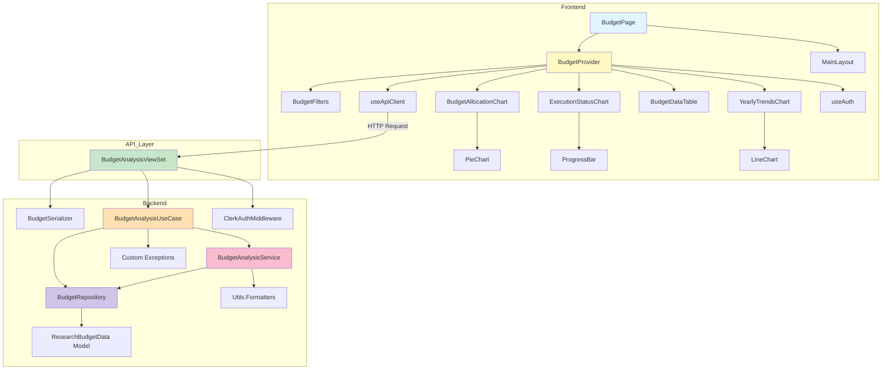
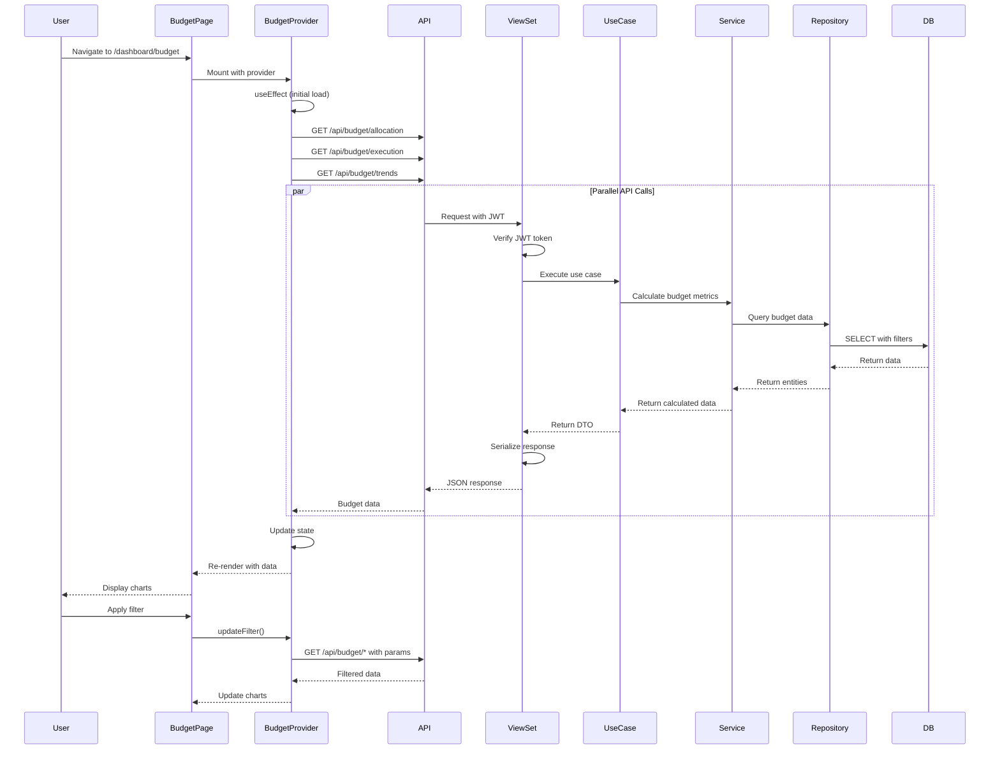

# Implementation Plan: Budget Analysis Page

> **Page Route**: `/dashboard/budget`
> **Use Case**: UC-008 - Budget Analysis Query
> **Architecture**: Layered Architecture (Presentation → Application → Domain → Infrastructure)
> **State Management**: Context + useReducer Pattern

---

## 1. Overview

This document outlines the implementation plan for the Budget Analysis page, following the project's layered architecture and SOLID principles. The page displays budget allocation, execution status, and year-over-year trends with comprehensive filtering capabilities.

### 1.1 Module Summary

| Module Name | Layer | Location | Description |
|------------|-------|----------|-------------|
| **BudgetAnalysisViewSet** | Presentation | `backend/apps/data_dashboard/presentation/views.py` | REST API endpoints for budget data |
| **BudgetSerializer** | Presentation | `backend/apps/data_dashboard/presentation/serializers.py` | Request/response serialization |
| **BudgetAnalysisUseCase** | Application | `backend/apps/data_dashboard/application/use_cases.py` | Orchestrates budget data retrieval and processing |
| **BudgetAnalysisService** | Domain | `backend/apps/data_dashboard/domain/services.py` | Business logic for budget calculations |
| **BudgetRepository** | Infrastructure | `backend/apps/data_dashboard/infrastructure/repositories.py` | Data access layer for budget queries |
| **BudgetProvider** | Application | `frontend/src/contexts/BudgetContext.jsx` | React Context for state management |
| **BudgetPage** | Presentation | `frontend/src/pages/BudgetPage.jsx` | Main page component |
| **BudgetFilters** | Presentation | `frontend/src/components/budget/BudgetFilters.jsx` | Filter panel component |
| **BudgetAllocationChart** | Presentation | `frontend/src/components/budget/BudgetAllocationChart.jsx` | Pie chart for budget allocation |
| **ExecutionStatusChart** | Presentation | `frontend/src/components/budget/ExecutionStatusChart.jsx` | Progress bars for execution status |
| **YearlyTrendsChart** | Presentation | `frontend/src/components/budget/YearlyTrendsChart.jsx` | Line chart for yearly trends |
| **BudgetDataTable** | Presentation | `frontend/src/components/budget/BudgetDataTable.jsx` | Table view for budget data |

### 1.2 Shared Modules Used

**Backend (from common-modules.md)**:
- `core.exceptions`: Custom exception classes
- `core.middleware`: Clerk authentication middleware
- `core.pagination`: Standard pagination
- `utils.formatters`: Currency and percentage formatting
- `utils.validators`: Data validation utilities
- `apps.data_dashboard.models`: ResearchBudgetData model

**Frontend (from common-modules.md)**:
- `api/client.js`: Axios instance
- `hooks/useAuth.js`: Authentication hook
- `hooks/useApiClient.js`: API client hook
- `components/common/*`: Button, Card, Table, Loading
- `components/charts/*`: PieChart, LineChart
- `layouts/MainLayout.jsx`: Main page layout
- `services/dataTransformer.js`: Chart data transformation
- `utils/formatters.js`: Number and currency formatting

---

## 2. Architecture Diagram

### 2.1 Module Relationship Diagram



### 2.2 Data Flow Diagram



---

## 3. Backend Implementation Plan

### 3.1 Presentation Layer

#### Module: BudgetAnalysisViewSet

**File**: `backend/apps/data_dashboard/presentation/views.py`

**Purpose**: Expose REST API endpoints for budget analysis data

**Endpoints**:
1. `GET /api/budget/allocation` - Department-wise budget allocation
2. `GET /api/budget/execution` - Budget execution status
3. `GET /api/budget/trends` - Year-over-year budget trends

**Implementation**:

```python
from rest_framework import viewsets, status
from rest_framework.decorators import action
from rest_framework.response import Response
from rest_framework.permissions import IsAuthenticated
from core.exceptions import ValidationError, NotFoundError
from core.pagination import StandardResultsSetPagination
from ..application.use_cases import BudgetAnalysisUseCase
from .serializers import (
    BudgetAllocationSerializer,
    ExecutionStatusSerializer,
    YearlyTrendsSerializer,
    BudgetFilterSerializer
)

class BudgetAnalysisViewSet(viewsets.ViewSet):
    """
    ViewSet for budget analysis endpoints

    Provides three main endpoints:
    - allocation: Department budget distribution
    - execution: Budget execution status with rates
    - trends: Year-over-year budget trends
    """

    permission_classes = [IsAuthenticated]

    def __init__(self, **kwargs):
        super().__init__(**kwargs)
        self.use_case = BudgetAnalysisUseCase()

    @action(detail=False, methods=['get'])
    def allocation(self, request):
        """
        Get department-wise budget allocation

        Query Parameters:
        - department (optional): Filter by department
        - year (optional): Filter by year (default: current year)
        - category (optional): Filter by budget category

        Returns:
        - 200: List of budget allocation items
        - 400: Invalid filter parameters
        - 401: Unauthorized
        """
        # Validate query parameters
        filter_serializer = BudgetFilterSerializer(data=request.query_params)
        filter_serializer.is_valid(raise_exception=True)

        filters = filter_serializer.validated_data

        # Execute use case
        result = self.use_case.get_budget_allocation(
            department=filters.get('department'),
            year=filters.get('year'),
            category=filters.get('category')
        )

        # Serialize response
        serializer = BudgetAllocationSerializer(result, many=True)

        return Response({
            'data': serializer.data,
            'total': len(serializer.data)
        }, status=status.HTTP_200_OK)

    @action(detail=False, methods=['get'])
    def execution(self, request):
        """
        Get budget execution status by department

        Query Parameters:
        - department (optional): Filter by department
        - year (optional): Filter by year
        - start_date (optional): Start date for execution filter
        - end_date (optional): End date for execution filter

        Returns:
        - 200: Execution status with rates and warnings
        - 400: Invalid parameters
        """
        filter_serializer = BudgetFilterSerializer(data=request.query_params)
        filter_serializer.is_valid(raise_exception=True)

        filters = filter_serializer.validated_data

        result = self.use_case.get_execution_status(
            department=filters.get('department'),
            year=filters.get('year'),
            start_date=filters.get('start_date'),
            end_date=filters.get('end_date')
        )

        serializer = ExecutionStatusSerializer(result['data'], many=True)

        return Response({
            'data': serializer.data,
            'summary': result['summary']
        }, status=status.HTTP_200_OK)

    @action(detail=False, methods=['get'])
    def trends(self, request):
        """
        Get year-over-year budget trends

        Query Parameters:
        - department (optional): Filter by department
        - start_year (optional): Start year for trends
        - end_year (optional): End year for trends

        Returns:
        - 200: Yearly budget trends data
        """
        filter_serializer = BudgetFilterSerializer(data=request.query_params)
        filter_serializer.is_valid(raise_exception=True)

        filters = filter_serializer.validated_data

        result = self.use_case.get_yearly_trends(
            department=filters.get('department'),
            start_year=filters.get('start_year'),
            end_year=filters.get('end_year')
        )

        serializer = YearlyTrendsSerializer(result, many=True)

        return Response({
            'data': serializer.data,
            'yearRange': {
                'min': result[0]['year'] if result else None,
                'max': result[-1]['year'] if result else None
            }
        }, status=status.HTTP_200_OK)
```

**QA Sheet**:

| Test Case | Input | Expected Output | Status |
|-----------|-------|-----------------|--------|
| Get allocation without filters | `GET /api/budget/allocation` | 200, all departments | ☐ |
| Get allocation with department filter | `GET /api/budget/allocation?department=CS` | 200, CS department only | ☐ |
| Get allocation with invalid year | `GET /api/budget/allocation?year=1999` | 400, validation error | ☐ |
| Get allocation without authentication | No JWT token | 401, unauthorized | ☐ |
| Get execution status with date range | `GET /api/budget/execution?start_date=2024-01-01&end_date=2024-12-31` | 200, filtered by date | ☐ |
| Get execution with critical departments | Execution rate > 100% | 200, status='critical' | ☐ |
| Get trends with year range | `GET /api/budget/trends?start_year=2020&end_year=2024` | 200, 5 years data | ☐ |
| Get trends with no data | Department with no budget | 200, empty array | ☐ |

#### Module: BudgetSerializer

**File**: `backend/apps/data_dashboard/presentation/serializers.py`

**Purpose**: Serialize/deserialize budget data for API requests and responses

**Implementation**:

```python
from rest_framework import serializers
from datetime import datetime
from utils.validators import validate_year

class BudgetFilterSerializer(serializers.Serializer):
    """Validates query parameters for budget endpoints"""

    department = serializers.CharField(required=False, allow_null=True)
    year = serializers.IntegerField(
        required=False,
        default=datetime.now().year,
        validators=[validate_year]
    )
    category = serializers.CharField(required=False, allow_null=True)
    start_date = serializers.DateField(required=False, allow_null=True)
    end_date = serializers.DateField(required=False, allow_null=True)
    start_year = serializers.IntegerField(required=False, validators=[validate_year])
    end_year = serializers.IntegerField(required=False, validators=[validate_year])

    def validate(self, data):
        """Cross-field validation"""
        # Validate date range
        if data.get('start_date') and data.get('end_date'):
            if data['start_date'] > data['end_date']:
                raise serializers.ValidationError(
                    "start_date must be before end_date"
                )

        # Validate year range
        if data.get('start_year') and data.get('end_year'):
            if data['start_year'] > data['end_year']:
                raise serializers.ValidationError(
                    "start_year must be before end_year"
                )

        return data

class BudgetAllocationSerializer(serializers.Serializer):
    """Serializes budget allocation data"""

    department = serializers.CharField()
    total_budget = serializers.IntegerField()
    percentage = serializers.DecimalField(max_digits=5, decimal_places=2)
    project_count = serializers.IntegerField()

class ExecutionStatusSerializer(serializers.Serializer):
    """Serializes budget execution status"""

    department = serializers.CharField()
    total_budget = serializers.IntegerField()
    executed_amount = serializers.IntegerField()
    execution_rate = serializers.DecimalField(max_digits=5, decimal_places=2)
    remaining_budget = serializers.IntegerField()
    status = serializers.ChoiceField(choices=['normal', 'warning', 'critical'])

class YearlyTrendsSerializer(serializers.Serializer):
    """Serializes yearly budget trends"""

    year = serializers.IntegerField()
    total_budget = serializers.IntegerField()
    executed_amount = serializers.IntegerField()
    execution_rate = serializers.DecimalField(max_digits=5, decimal_places=2)
```

**Unit Tests**:

```python
# tests/unit/test_budget_serializers.py

from django.test import TestCase
from apps.data_dashboard.presentation.serializers import (
    BudgetFilterSerializer,
    BudgetAllocationSerializer,
    ExecutionStatusSerializer
)

class BudgetFilterSerializerTest(TestCase):

    def test_valid_filters(self):
        """Test serializer with valid filter data"""
        data = {
            'department': 'CS',
            'year': 2024,
            'category': 'Research'
        }
        serializer = BudgetFilterSerializer(data=data)
        self.assertTrue(serializer.is_valid())
        self.assertEqual(serializer.validated_data['department'], 'CS')

    def test_default_year(self):
        """Test year defaults to current year"""
        serializer = BudgetFilterSerializer(data={})
        self.assertTrue(serializer.is_valid())
        self.assertIsNotNone(serializer.validated_data['year'])

    def test_invalid_date_range(self):
        """Test validation fails for invalid date range"""
        data = {
            'start_date': '2024-12-31',
            'end_date': '2024-01-01'
        }
        serializer = BudgetFilterSerializer(data=data)
        self.assertFalse(serializer.is_valid())
        self.assertIn('non_field_errors', serializer.errors)

    def test_invalid_year(self):
        """Test validation fails for invalid year"""
        data = {'year': 1999}
        serializer = BudgetFilterSerializer(data=data)
        self.assertFalse(serializer.is_valid())
```

---

### 3.2 Application Layer

#### Module: BudgetAnalysisUseCase

**File**: `backend/apps/data_dashboard/application/use_cases.py`

**Purpose**: Orchestrate budget data retrieval and business logic execution

**Implementation**:

```python
from typing import List, Dict, Optional
from datetime import date
from ..domain.services import BudgetAnalysisService
from ..infrastructure.repositories import BudgetRepository
from core.exceptions import ValidationError, NotFoundError

class BudgetAnalysisUseCase:
    """
    Use case for budget analysis operations

    Orchestrates the interaction between service layer and repository
    to provide budget analysis data for the presentation layer.
    """

    def __init__(self):
        self.repository = BudgetRepository()
        self.service = BudgetAnalysisService(self.repository)

    def get_budget_allocation(
        self,
        department: Optional[str] = None,
        year: Optional[int] = None,
        category: Optional[str] = None
    ) -> List[Dict]:
        """
        Get department-wise budget allocation

        Args:
            department: Filter by specific department
            year: Filter by year (default: current year)
            category: Filter by budget category

        Returns:
            List of budget allocation items with:
            - department: Department name
            - total_budget: Total budget amount
            - percentage: Percentage of overall budget
            - project_count: Number of projects

        Raises:
            ValidationError: If filters are invalid
            NotFoundError: If no data found
        """
        # Delegate to service layer
        result = self.service.calculate_budget_allocation(
            department=department,
            year=year,
            category=category
        )

        if not result:
            raise NotFoundError("No budget allocation data found for the given filters")

        return result

    def get_execution_status(
        self,
        department: Optional[str] = None,
        year: Optional[int] = None,
        start_date: Optional[date] = None,
        end_date: Optional[date] = None
    ) -> Dict:
        """
        Get budget execution status with rates and warnings

        Args:
            department: Filter by department
            year: Filter by year
            start_date: Start date for execution period
            end_date: End date for execution period

        Returns:
            Dictionary with:
            - data: List of execution status items
            - summary: Overall execution summary

        Raises:
            ValidationError: If date range is invalid
        """
        # Validate date range
        if start_date and end_date and start_date > end_date:
            raise ValidationError("start_date must be before end_date")

        # Get execution data from service
        data = self.service.calculate_execution_status(
            department=department,
            year=year,
            start_date=start_date,
            end_date=end_date
        )

        # Calculate summary
        summary = self.service.calculate_execution_summary(data)

        return {
            'data': data,
            'summary': summary
        }

    def get_yearly_trends(
        self,
        department: Optional[str] = None,
        start_year: Optional[int] = None,
        end_year: Optional[int] = None
    ) -> List[Dict]:
        """
        Get year-over-year budget trends

        Args:
            department: Filter by department
            start_year: Start year for trend analysis
            end_year: End year for trend analysis

        Returns:
            List of yearly trend items
        """
        result = self.service.calculate_yearly_trends(
            department=department,
            start_year=start_year,
            end_year=end_year
        )

        return result
```

**Unit Tests**:

```python
# tests/unit/test_budget_use_cases.py

from django.test import TestCase
from unittest.mock import Mock, patch
from apps.data_dashboard.application.use_cases import BudgetAnalysisUseCase
from core.exceptions import ValidationError, NotFoundError

class BudgetAnalysisUseCaseTest(TestCase):

    def setUp(self):
        self.use_case = BudgetAnalysisUseCase()
        self.use_case.service = Mock()

    def test_get_budget_allocation_success(self):
        """Test successful budget allocation retrieval"""
        mock_data = [
            {'department': 'CS', 'total_budget': 1000000, 'percentage': 50.0, 'project_count': 5}
        ]
        self.use_case.service.calculate_budget_allocation.return_value = mock_data

        result = self.use_case.get_budget_allocation(department='CS', year=2024)

        self.assertEqual(len(result), 1)
        self.assertEqual(result[0]['department'], 'CS')
        self.use_case.service.calculate_budget_allocation.assert_called_once()

    def test_get_budget_allocation_not_found(self):
        """Test NotFoundError when no data exists"""
        self.use_case.service.calculate_budget_allocation.return_value = []

        with self.assertRaises(NotFoundError):
            self.use_case.get_budget_allocation(department='NonExistent')

    def test_get_execution_status_invalid_date_range(self):
        """Test ValidationError for invalid date range"""
        from datetime import date

        with self.assertRaises(ValidationError):
            self.use_case.get_execution_status(
                start_date=date(2024, 12, 31),
                end_date=date(2024, 1, 1)
            )

    def test_get_execution_status_with_summary(self):
        """Test execution status includes summary"""
        mock_data = [
            {
                'department': 'CS',
                'total_budget': 1000000,
                'executed_amount': 950000,
                'execution_rate': 95.0,
                'remaining_budget': 50000,
                'status': 'warning'
            }
        ]
        mock_summary = {
            'total_budget': 1000000,
            'total_executed': 950000,
            'overall_rate': 95.0
        }

        self.use_case.service.calculate_execution_status.return_value = mock_data
        self.use_case.service.calculate_execution_summary.return_value = mock_summary

        result = self.use_case.get_execution_status(year=2024)

        self.assertIn('data', result)
        self.assertIn('summary', result)
        self.assertEqual(result['summary']['overall_rate'], 95.0)
```

---

### 3.3 Domain Layer

#### Module: BudgetAnalysisService

**File**: `backend/apps/data_dashboard/domain/services.py`

**Purpose**: Core business logic for budget calculations and analysis

**Implementation**:

```python
from typing import List, Dict, Optional
from datetime import date, datetime
from decimal import Decimal
from ..infrastructure.repositories import BudgetRepository

class BudgetAnalysisService:
    """
    Domain service for budget analysis business logic

    Responsibilities:
    - Calculate budget allocation percentages
    - Calculate execution rates
    - Determine execution status (normal/warning/critical)
    - Calculate remaining budgets
    - Aggregate yearly trends
    """

    def __init__(self, repository: BudgetRepository):
        self.repository = repository

    def calculate_budget_allocation(
        self,
        department: Optional[str] = None,
        year: Optional[int] = None,
        category: Optional[str] = None
    ) -> List[Dict]:
        """
        Calculate department-wise budget allocation with percentages

        Business Rules:
        - BR-7: Amounts formatted with thousand separators
        - Percentage calculated as (dept_budget / total_budget) * 100
        - Rounded to 2 decimal places
        """
        # Get raw data from repository
        budget_data = self.repository.get_budget_by_department(
            department=department,
            year=year or datetime.now().year,
            category=category
        )

        # Calculate total budget
        total_budget = sum(item['total_budget'] for item in budget_data)

        # Calculate percentages
        result = []
        for item in budget_data:
            percentage = (item['total_budget'] / total_budget * 100) if total_budget > 0 else 0
            result.append({
                'department': item['department'],
                'total_budget': item['total_budget'],
                'percentage': round(Decimal(percentage), 2),
                'project_count': item['project_count']
            })

        # Sort by budget descending
        result.sort(key=lambda x: x['total_budget'], reverse=True)

        return result

    def calculate_execution_status(
        self,
        department: Optional[str] = None,
        year: Optional[int] = None,
        start_date: Optional[date] = None,
        end_date: Optional[date] = None
    ) -> List[Dict]:
        """
        Calculate budget execution status with rates and warnings

        Business Rules:
        - BR-2: Execution rate = (executed / total) * 100
        - BR-3: Remaining = total - executed
        - BR-4: Status levels:
          - normal: < 90%
          - warning: 90-100%
          - critical: > 100%
        """
        # Get execution data
        execution_data = self.repository.get_execution_by_department(
            department=department,
            year=year or datetime.now().year,
            start_date=start_date,
            end_date=end_date
        )

        result = []
        for item in execution_data:
            total = item['total_budget']
            executed = item['executed_amount']

            # Calculate execution rate (BR-2)
            rate = (executed / total * 100) if total > 0 else 0

            # Calculate remaining (BR-3)
            remaining = total - executed

            # Determine status (BR-4)
            if rate >= 100:
                status = 'critical'
            elif rate >= 90:
                status = 'warning'
            else:
                status = 'normal'

            result.append({
                'department': item['department'],
                'total_budget': total,
                'executed_amount': executed,
                'execution_rate': round(Decimal(rate), 2),
                'remaining_budget': remaining,
                'status': status
            })

        return result

    def calculate_execution_summary(self, execution_data: List[Dict]) -> Dict:
        """
        Calculate overall execution summary

        Returns:
            Dictionary with total_budget, total_executed, overall_rate
        """
        total_budget = sum(item['total_budget'] for item in execution_data)
        total_executed = sum(item['executed_amount'] for item in execution_data)
        overall_rate = (total_executed / total_budget * 100) if total_budget > 0 else 0

        return {
            'total_budget': total_budget,
            'total_executed': total_executed,
            'overall_rate': round(Decimal(overall_rate), 2)
        }

    def calculate_yearly_trends(
        self,
        department: Optional[str] = None,
        start_year: Optional[int] = None,
        end_year: Optional[int] = None
    ) -> List[Dict]:
        """
        Calculate year-over-year budget trends

        Returns yearly aggregations with execution rates
        """
        trends_data = self.repository.get_yearly_trends(
            department=department,
            start_year=start_year,
            end_year=end_year
        )

        result = []
        for item in trends_data:
            rate = (item['executed_amount'] / item['total_budget'] * 100) \
                   if item['total_budget'] > 0 else 0

            result.append({
                'year': item['year'],
                'total_budget': item['total_budget'],
                'executed_amount': item['executed_amount'],
                'execution_rate': round(Decimal(rate), 2)
            })

        # Sort by year ascending
        result.sort(key=lambda x: x['year'])

        return result
```

**Unit Tests**:

```python
# tests/unit/test_budget_service.py

from django.test import TestCase
from unittest.mock import Mock
from decimal import Decimal
from apps.data_dashboard.domain.services import BudgetAnalysisService

class BudgetAnalysisServiceTest(TestCase):

    def setUp(self):
        self.repository = Mock()
        self.service = BudgetAnalysisService(self.repository)

    def test_calculate_budget_allocation_percentages(self):
        """Test percentage calculation for budget allocation"""
        mock_data = [
            {'department': 'CS', 'total_budget': 5000000, 'project_count': 5},
            {'department': 'EE', 'total_budget': 3000000, 'project_count': 3},
            {'department': 'ME', 'total_budget': 2000000, 'project_count': 2}
        ]
        self.repository.get_budget_by_department.return_value = mock_data

        result = self.service.calculate_budget_allocation(year=2024)

        self.assertEqual(len(result), 3)
        # CS should be 50% (5M/10M)
        self.assertEqual(result[0]['department'], 'CS')
        self.assertEqual(result[0]['percentage'], Decimal('50.00'))
        # EE should be 30% (3M/10M)
        self.assertEqual(result[1]['percentage'], Decimal('30.00'))
        # ME should be 20% (2M/10M)
        self.assertEqual(result[2]['percentage'], Decimal('20.00'))

    def test_calculate_execution_status_normal(self):
        """Test execution status calculation - normal case"""
        mock_data = [
            {
                'department': 'CS',
                'total_budget': 1000000,
                'executed_amount': 800000
            }
        ]
        self.repository.get_execution_by_department.return_value = mock_data

        result = self.service.calculate_execution_status(year=2024)

        self.assertEqual(result[0]['execution_rate'], Decimal('80.00'))
        self.assertEqual(result[0]['remaining_budget'], 200000)
        self.assertEqual(result[0]['status'], 'normal')

    def test_calculate_execution_status_warning(self):
        """Test execution status calculation - warning level"""
        mock_data = [
            {
                'department': 'EE',
                'total_budget': 1000000,
                'executed_amount': 950000
            }
        ]
        self.repository.get_execution_by_department.return_value = mock_data

        result = self.service.calculate_execution_status(year=2024)

        self.assertEqual(result[0]['execution_rate'], Decimal('95.00'))
        self.assertEqual(result[0]['status'], 'warning')

    def test_calculate_execution_status_critical(self):
        """Test execution status calculation - critical (over budget)"""
        mock_data = [
            {
                'department': 'ME',
                'total_budget': 1000000,
                'executed_amount': 1100000
            }
        ]
        self.repository.get_execution_by_department.return_value = mock_data

        result = self.service.calculate_execution_status(year=2024)

        self.assertEqual(result[0]['execution_rate'], Decimal('110.00'))
        self.assertEqual(result[0]['remaining_budget'], -100000)
        self.assertEqual(result[0]['status'], 'critical')

    def test_calculate_execution_summary(self):
        """Test overall execution summary calculation"""
        execution_data = [
            {
                'department': 'CS',
                'total_budget': 5000000,
                'executed_amount': 4500000,
                'execution_rate': 90.0,
                'remaining_budget': 500000,
                'status': 'warning'
            },
            {
                'department': 'EE',
                'total_budget': 3000000,
                'executed_amount': 2400000,
                'execution_rate': 80.0,
                'remaining_budget': 600000,
                'status': 'normal'
            }
        ]

        result = self.service.calculate_execution_summary(execution_data)

        self.assertEqual(result['total_budget'], 8000000)
        self.assertEqual(result['total_executed'], 6900000)
        # Overall rate should be 86.25% (6.9M/8M)
        self.assertEqual(result['overall_rate'], Decimal('86.25'))

    def test_calculate_yearly_trends(self):
        """Test yearly trends calculation"""
        mock_data = [
            {'year': 2022, 'total_budget': 8000000, 'executed_amount': 7200000},
            {'year': 2023, 'total_budget': 9000000, 'executed_amount': 8100000},
            {'year': 2024, 'total_budget': 10000000, 'executed_amount': 8500000}
        ]
        self.repository.get_yearly_trends.return_value = mock_data

        result = self.service.calculate_yearly_trends()

        self.assertEqual(len(result), 3)
        self.assertEqual(result[0]['year'], 2022)
        self.assertEqual(result[0]['execution_rate'], Decimal('90.00'))
        self.assertEqual(result[2]['year'], 2024)
```

---

### 3.4 Infrastructure Layer

#### Module: BudgetRepository

**File**: `backend/apps/data_dashboard/infrastructure/repositories.py`

**Purpose**: Data access layer for budget-related database queries

**Implementation**:

```python
from typing import List, Dict, Optional
from datetime import date, datetime
from django.db.models import Sum, Count, Q, F, Case, When, Value
from django.db.models.functions import ExtractYear
from ..models import ResearchBudgetData

class BudgetRepository:
    """
    Repository for budget data access

    Provides abstracted database queries for budget analysis.
    All queries use Django ORM for database independence.
    """

    def get_budget_by_department(
        self,
        department: Optional[str] = None,
        year: Optional[int] = None,
        category: Optional[str] = None
    ) -> List[Dict]:
        """
        Get aggregated budget data by department

        Returns:
            List of dicts with department, total_budget, project_count
        """
        queryset = ResearchBudgetData.objects.filter(
            status='집행완료'
        )

        # Apply filters
        if department:
            queryset = queryset.filter(department=department)

        if year:
            queryset = queryset.filter(
                execution_date__year=year
            )

        if category:
            queryset = queryset.filter(
                execution_item__icontains=category
            )

        # Aggregate by department
        result = queryset.values('department').annotate(
            total_budget=Sum('total_budget', distinct=True),
            project_count=Count('project_number', distinct=True)
        ).order_by('-total_budget')

        return list(result)

    def get_execution_by_department(
        self,
        department: Optional[str] = None,
        year: Optional[int] = None,
        start_date: Optional[date] = None,
        end_date: Optional[date] = None
    ) -> List[Dict]:
        """
        Get budget execution data by department

        Returns:
            List of dicts with department, total_budget, executed_amount
        """
        queryset = ResearchBudgetData.objects.all()

        # Apply filters
        if department:
            queryset = queryset.filter(department=department)

        if year:
            queryset = queryset.filter(execution_date__year=year)

        if start_date:
            queryset = queryset.filter(execution_date__gte=start_date)

        if end_date:
            queryset = queryset.filter(execution_date__lte=end_date)

        # Aggregate execution data
        result = queryset.values('department').annotate(
            total_budget=Sum('total_budget', distinct=True),
            executed_amount=Sum(
                Case(
                    When(status='집행완료', then=F('execution_amount')),
                    default=Value(0)
                )
            )
        ).order_by('department')

        return list(result)

    def get_yearly_trends(
        self,
        department: Optional[str] = None,
        start_year: Optional[int] = None,
        end_year: Optional[int] = None
    ) -> List[Dict]:
        """
        Get year-over-year budget trends

        Returns:
            List of dicts with year, total_budget, executed_amount
        """
        queryset = ResearchBudgetData.objects.all()

        if department:
            queryset = queryset.filter(department=department)

        # Extract year and aggregate
        queryset = queryset.annotate(
            year=ExtractYear('execution_date')
        )

        if start_year:
            queryset = queryset.filter(year__gte=start_year)

        if end_year:
            queryset = queryset.filter(year__lte=end_year)

        result = queryset.values('year').annotate(
            total_budget=Sum('total_budget', distinct=True),
            executed_amount=Sum(
                Case(
                    When(status='집행완료', then=F('execution_amount')),
                    default=Value(0)
                )
            )
        ).order_by('year')

        return list(result)
```

**Unit Tests**:

```python
# tests/unit/test_budget_repository.py

from django.test import TestCase
from datetime import date
from apps.data_dashboard.models import ResearchBudgetData
from apps.data_dashboard.infrastructure.repositories import BudgetRepository

class BudgetRepositoryTest(TestCase):

    def setUp(self):
        self.repository = BudgetRepository()

        # Create test data
        ResearchBudgetData.objects.create(
            execution_id='EX001',
            project_number='PRJ001',
            project_name='AI Research',
            principal_investigator='Dr. Kim',
            department='CS',
            funding_agency='NSF',
            total_budget=10000000,
            execution_date=date(2024, 1, 15),
            execution_item='Equipment',
            execution_amount=3000000,
            status='집행완료'
        )

        ResearchBudgetData.objects.create(
            execution_id='EX002',
            project_number='PRJ001',
            project_name='AI Research',
            principal_investigator='Dr. Kim',
            department='CS',
            funding_agency='NSF',
            total_budget=10000000,
            execution_date=date(2024, 2, 20),
            execution_item='Personnel',
            execution_amount=5000000,
            status='집행완료'
        )

        ResearchBudgetData.objects.create(
            execution_id='EX003',
            project_number='PRJ002',
            project_name='Robotics',
            principal_investigator='Dr. Lee',
            department='EE',
            funding_agency='DARPA',
            total_budget=5000000,
            execution_date=date(2024, 3, 10),
            execution_item='Materials',
            execution_amount=2000000,
            status='집행완료'
        )

    def test_get_budget_by_department(self):
        """Test budget aggregation by department"""
        result = self.repository.get_budget_by_department(year=2024)

        self.assertEqual(len(result), 2)
        # CS department should have higher budget
        self.assertEqual(result[0]['department'], 'CS')
        self.assertEqual(result[0]['total_budget'], 10000000)
        self.assertEqual(result[0]['project_count'], 1)

    def test_get_budget_by_department_with_filter(self):
        """Test department filter"""
        result = self.repository.get_budget_by_department(
            department='CS',
            year=2024
        )

        self.assertEqual(len(result), 1)
        self.assertEqual(result[0]['department'], 'CS')

    def test_get_execution_by_department(self):
        """Test execution data retrieval"""
        result = self.repository.get_execution_by_department(year=2024)

        self.assertEqual(len(result), 2)

        # Find CS department
        cs_data = next(r for r in result if r['department'] == 'CS')
        self.assertEqual(cs_data['total_budget'], 10000000)
        self.assertEqual(cs_data['executed_amount'], 8000000)  # 3M + 5M

    def test_get_execution_with_date_range(self):
        """Test execution data with date range filter"""
        result = self.repository.get_execution_by_department(
            start_date=date(2024, 2, 1),
            end_date=date(2024, 2, 28)
        )

        # Should only include February execution
        cs_data = next(r for r in result if r['department'] == 'CS')
        self.assertEqual(cs_data['executed_amount'], 5000000)

    def test_get_yearly_trends(self):
        """Test yearly trends aggregation"""
        result = self.repository.get_yearly_trends()

        self.assertEqual(len(result), 1)
        self.assertEqual(result[0]['year'], 2024)
        self.assertEqual(result[0]['total_budget'], 15000000)  # 10M + 5M (distinct)
        self.assertEqual(result[0]['executed_amount'], 10000000)  # 3M + 5M + 2M
```

---

## 4. Frontend Implementation Plan

### 4.1 Context Provider (Application Layer)

#### Module: BudgetProvider

**File**: `frontend/src/contexts/BudgetContext.jsx`

**Purpose**: Centralized state management for budget analysis page

**Implementation**: See state.md document for full implementation

**Key Features**:
- useReducer for state management
- Parallel API calls for performance
- Computed values with useMemo
- Error handling and retry logic
- Filter state management

**Testing**:

```javascript
// tests/contexts/BudgetContext.test.jsx

import { renderHook, act } from '@testing-library/react-hooks';
import { BudgetProvider, useBudget } from '../contexts/BudgetContext';

describe('BudgetProvider', () => {
  test('provides initial state', () => {
    const { result } = renderHook(() => useBudget(), {
      wrapper: BudgetProvider
    });

    expect(result.current.state.budgetAllocation).toEqual([]);
    expect(result.current.state.executionStatus).toEqual([]);
    expect(result.current.isLoading).toBe(false);
  });

  test('updates filter state', () => {
    const { result } = renderHook(() => useBudget(), {
      wrapper: BudgetProvider
    });

    act(() => {
      result.current.updateFilter({ department: 'CS' });
    });

    expect(result.current.state.filters.department).toBe('CS');
  });

  test('resets filters to default', () => {
    const { result } = renderHook(() => useBudget(), {
      wrapper: BudgetProvider
    });

    act(() => {
      result.current.updateFilter({ department: 'CS', year: 2023 });
      result.current.resetFilters();
    });

    expect(result.current.state.filters.department).toBeNull();
    expect(result.current.state.filters.year).toBe(new Date().getFullYear());
  });
});
```

---

### 4.2 Page Component (Presentation Layer)

#### Module: BudgetPage

**File**: `frontend/src/pages/BudgetPage.jsx`

**Purpose**: Main page component that orchestrates all budget analysis UI

**Implementation**:

```javascript
import React from 'react';
import { BudgetProvider, useBudget } from '../contexts/BudgetContext';
import { MainLayout } from '../layouts/MainLayout';
import { Box, Typography, Alert, Button } from '@mui/material';
import { Loading } from '../components/common/Loading';
import BudgetFilters from '../components/budget/BudgetFilters';
import BudgetKPISection from '../components/budget/BudgetKPISection';
import BudgetAllocationChart from '../components/budget/BudgetAllocationChart';
import ExecutionStatusChart from '../components/budget/ExecutionStatusChart';
import YearlyTrendsChart from '../components/budget/YearlyTrendsChart';
import BudgetDataTable from '../components/budget/BudgetDataTable';

function BudgetPageContent() {
  const {
    state,
    overallExecutionRate,
    totalBudget,
    totalExecuted,
    totalRemaining,
    warningDepartments,
    criticalDepartments,
    isLoading,
    updateFilter,
    resetFilters,
    toggleView,
    retryFetch
  } = useBudget();

  // Loading state
  if (isLoading) {
    return (
      <MainLayout>
        <Loading />
      </MainLayout>
    );
  }

  // Error state
  if (state.error) {
    return (
      <MainLayout>
        <Alert
          severity="error"
          action={
            <Button color="inherit" size="small" onClick={retryFetch}>
              Retry
            </Button>
          }
        >
          {state.error.message}
        </Alert>
      </MainLayout>
    );
  }

  return (
    <MainLayout>
      <Box sx={{ p: 3 }}>
        {/* Page Header */}
        <Box sx={{ mb: 3 }}>
          <Typography variant="h4" component="h1" gutterBottom>
            Budget Analysis
          </Typography>
          <Typography variant="body2" color="textSecondary">
            Department budget allocation, execution status, and yearly trends
          </Typography>
        </Box>

        {/* Filters */}
        <BudgetFilters
          filters={state.filters}
          onFilterChange={updateFilter}
          onReset={resetFilters}
        />

        {/* KPI Summary */}
        <BudgetKPISection
          totalBudget={totalBudget}
          totalExecuted={totalExecuted}
          totalRemaining={totalRemaining}
          executionRate={overallExecutionRate}
          warningCount={warningDepartments}
          criticalCount={criticalDepartments}
        />

        {/* View Toggle */}
        <Box sx={{ mb: 2, display: 'flex', justifyContent: 'flex-end' }}>
          <Button
            variant={state.selectedView === 'chart' ? 'contained' : 'outlined'}
            onClick={() => toggleView('chart')}
            sx={{ mr: 1 }}
          >
            Chart View
          </Button>
          <Button
            variant={state.selectedView === 'table' ? 'contained' : 'outlined'}
            onClick={() => toggleView('table')}
          >
            Table View
          </Button>
        </Box>

        {/* Chart or Table View */}
        {state.selectedView === 'chart' ? (
          <Box sx={{ display: 'grid', gridTemplateColumns: '1fr 1fr', gap: 3 }}>
            <BudgetAllocationChart />
            <ExecutionStatusChart />
            <Box sx={{ gridColumn: '1 / -1' }}>
              <YearlyTrendsChart />
            </Box>
          </Box>
        ) : (
          <BudgetDataTable />
        )}
      </Box>
    </MainLayout>
  );
}

export default function BudgetPage() {
  return (
    <BudgetProvider>
      <BudgetPageContent />
    </BudgetProvider>
  );
}
```

**QA Sheet**:

| Test Case | User Action | Expected Behavior | Status |
|-----------|-------------|-------------------|--------|
| Initial Load | Navigate to /dashboard/budget | Page loads with current year data, charts displayed | ☐ |
| Loading State | Page mounting | Loading spinner shown while fetching data | ☐ |
| Error Display | API fails | Error banner with retry button displayed | ☐ |
| Retry Mechanism | Click retry button | Data refetch attempted, loading state shown | ☐ |
| Filter Update | Select department filter | Charts update to show selected department only | ☐ |
| Filter Reset | Click reset button | All filters reset to default, all data shown | ☐ |
| View Toggle | Click table view | Content switches from charts to data table | ☐ |
| Chart View | Click chart view | Content switches from table to charts | ☐ |
| Empty State | No data for filters | Empty state message displayed | ☐ |
| Warning Display | Department execution > 90% | Yellow warning indicator shown | ☐ |
| Critical Display | Department execution > 100% | Red critical indicator shown | ☐ |

---

### 4.3 Filter Component

#### Module: BudgetFilters

**File**: `frontend/src/components/budget/BudgetFilters.jsx`

**Purpose**: Filter panel for budget data

**Implementation**:

```javascript
import React, { useState, useEffect } from 'react';
import {
  Box,
  Card,
  CardContent,
  FormControl,
  InputLabel,
  Select,
  MenuItem,
  TextField,
  Button,
  Grid
} from '@mui/material';
import { FilterList as FilterIcon, Refresh as RefreshIcon } from '@mui/icons-material';

export default function BudgetFilters({ filters, onFilterChange, onReset }) {
  const [departments, setDepartments] = useState([
    'CS', 'EE', 'ME', 'CE', 'IE'
  ]);

  const [categories, setCategories] = useState([
    'Equipment', 'Personnel', 'Materials', 'Travel', 'Other'
  ]);

  const handleDepartmentChange = (event) => {
    onFilterChange({ department: event.target.value || null });
  };

  const handleYearChange = (event) => {
    onFilterChange({ year: parseInt(event.target.value) });
  };

  const handleCategoryChange = (event) => {
    onFilterChange({ budgetCategory: event.target.value || null });
  };

  const handleDateRangeChange = (field) => (event) => {
    onFilterChange({
      dateRange: {
        ...filters.dateRange,
        [field]: event.target.value || null
      }
    });
  };

  // Generate year options (last 5 years)
  const currentYear = new Date().getFullYear();
  const yearOptions = Array.from({ length: 5 }, (_, i) => currentYear - i);

  return (
    <Card sx={{ mb: 3 }}>
      <CardContent>
        <Box sx={{ display: 'flex', alignItems: 'center', mb: 2 }}>
          <FilterIcon sx={{ mr: 1 }} />
          <Typography variant="h6">Filters</Typography>
        </Box>

        <Grid container spacing={2}>
          {/* Department Filter */}
          <Grid item xs={12} sm={6} md={3}>
            <FormControl fullWidth>
              <InputLabel>Department</InputLabel>
              <Select
                value={filters.department || ''}
                onChange={handleDepartmentChange}
                label="Department"
              >
                <MenuItem value="">All Departments</MenuItem>
                {departments.map((dept) => (
                  <MenuItem key={dept} value={dept}>
                    {dept}
                  </MenuItem>
                ))}
              </Select>
            </FormControl>
          </Grid>

          {/* Year Filter */}
          <Grid item xs={12} sm={6} md={3}>
            <FormControl fullWidth>
              <InputLabel>Year</InputLabel>
              <Select
                value={filters.year}
                onChange={handleYearChange}
                label="Year"
              >
                {yearOptions.map((year) => (
                  <MenuItem key={year} value={year}>
                    {year}
                  </MenuItem>
                ))}
              </Select>
            </FormControl>
          </Grid>

          {/* Category Filter */}
          <Grid item xs={12} sm={6} md={3}>
            <FormControl fullWidth>
              <InputLabel>Category</InputLabel>
              <Select
                value={filters.budgetCategory || ''}
                onChange={handleCategoryChange}
                label="Category"
              >
                <MenuItem value="">All Categories</MenuItem>
                {categories.map((cat) => (
                  <MenuItem key={cat} value={cat}>
                    {cat}
                  </MenuItem>
                ))}
              </Select>
            </FormControl>
          </Grid>

          {/* Date Range */}
          <Grid item xs={12} sm={6} md={3}>
            <TextField
              fullWidth
              label="Start Date"
              type="date"
              value={filters.dateRange.startDate || ''}
              onChange={handleDateRangeChange('startDate')}
              InputLabelProps={{ shrink: true }}
            />
          </Grid>

          <Grid item xs={12} sm={6} md={3}>
            <TextField
              fullWidth
              label="End Date"
              type="date"
              value={filters.dateRange.endDate || ''}
              onChange={handleDateRangeChange('endDate')}
              InputLabelProps={{ shrink: true }}
            />
          </Grid>

          {/* Reset Button */}
          <Grid item xs={12} sm={6} md={3}>
            <Button
              fullWidth
              variant="outlined"
              startIcon={<RefreshIcon />}
              onClick={onReset}
              sx={{ height: '56px' }}
            >
              Reset Filters
            </Button>
          </Grid>
        </Grid>
      </CardContent>
    </Card>
  );
}
```

**QA Sheet**:

| Test Case | User Action | Expected Behavior | Status |
|-----------|-------------|-------------------|--------|
| Department Selection | Select department from dropdown | Filter updates, context state changes | ☐ |
| Year Selection | Select year from dropdown | Filter updates to selected year | ☐ |
| Category Selection | Select category | Filter updates to selected category | ☐ |
| Date Range - Start | Pick start date | Start date filter applied | ☐ |
| Date Range - End | Pick end date | End date filter applied | ☐ |
| Reset All | Click reset button | All filters return to default values | ☐ |
| Multiple Filters | Apply multiple filters | All filters combined correctly | ☐ |

---

### 4.4 KPI Section Component

#### Module: BudgetKPISection

**File**: `frontend/src/components/budget/BudgetKPISection.jsx`

**Purpose**: Display key performance indicators for budget

**Implementation**:

```javascript
import React from 'react';
import { Box, Grid } from '@mui/material';
import { KPICard } from '../charts/KPICard';
import { formatCurrency, formatPercentage } from '../../utils/formatters';
import {
  AccountBalance as BudgetIcon,
  TrendingUp as ExecutedIcon,
  AccountBalanceWallet as RemainingIcon,
  Speed as RateIcon,
  Warning as WarningIcon,
  Error as ErrorIcon
} from '@mui/icons-material';

export default function BudgetKPISection({
  totalBudget,
  totalExecuted,
  totalRemaining,
  executionRate,
  warningCount,
  criticalCount
}) {
  return (
    <Box sx={{ mb: 3 }}>
      <Grid container spacing={2}>
        {/* Total Budget */}
        <Grid item xs={12} sm={6} md={4}>
          <KPICard
            title="Total Budget"
            value={formatCurrency(totalBudget)}
            icon={<BudgetIcon />}
            color="primary"
          />
        </Grid>

        {/* Total Executed */}
        <Grid item xs={12} sm={6} md={4}>
          <KPICard
            title="Total Executed"
            value={formatCurrency(totalExecuted)}
            subtitle={`${formatPercentage(executionRate)} of budget`}
            icon={<ExecutedIcon />}
            color="success"
          />
        </Grid>

        {/* Remaining Budget */}
        <Grid item xs={12} sm={6} md={4}>
          <KPICard
            title="Remaining Budget"
            value={formatCurrency(totalRemaining)}
            icon={<RemainingIcon />}
            color={totalRemaining < 0 ? 'error' : 'info'}
          />
        </Grid>

        {/* Execution Rate */}
        <Grid item xs={12} sm={6} md={4}>
          <KPICard
            title="Overall Execution Rate"
            value={formatPercentage(executionRate)}
            icon={<RateIcon />}
            color={executionRate >= 100 ? 'error' : executionRate >= 90 ? 'warning' : 'success'}
          />
        </Grid>

        {/* Warning Departments */}
        <Grid item xs={12} sm={6} md={4}>
          <KPICard
            title="Warning Departments"
            value={warningCount}
            subtitle="90-100% execution"
            icon={<WarningIcon />}
            color="warning"
          />
        </Grid>

        {/* Critical Departments */}
        <Grid item xs={12} sm={6} md={4}>
          <KPICard
            title="Critical Departments"
            value={criticalCount}
            subtitle="Over 100% execution"
            icon={<ErrorIcon />}
            color="error"
          />
        </Grid>
      </Grid>
    </Box>
  );
}
```

**QA Sheet**:

| Test Case | Data Condition | Expected Display | Status |
|-----------|----------------|------------------|--------|
| Normal Budget | Execution < 90% | Green indicators, normal display | ☐ |
| Warning Level | Execution 90-100% | Yellow warning card, warning count > 0 | ☐ |
| Critical Level | Execution > 100% | Red critical card, critical count > 0 | ☐ |
| Negative Remaining | Total executed > total budget | Remaining shown in red | ☐ |
| Zero Data | No budget data | All cards show 0 or empty | ☐ |
| Large Numbers | Budget > 1B | Numbers formatted with commas | ☐ |

---

### 4.5 Chart Components

#### Module: BudgetAllocationChart

**File**: `frontend/src/components/budget/BudgetAllocationChart.jsx`

**Purpose**: Pie chart showing department budget allocation

**Implementation**:

```javascript
import React from 'react';
import { Card } from '../common/Card';
import { PieChart } from '../charts/PieChart';
import { transformToPieChartData } from '../../services/dataTransformer';
import { useBudget } from '../../contexts/BudgetContext';
import { formatCurrency } from '../../utils/formatters';

export default function BudgetAllocationChart() {
  const { state } = useBudget();

  const chartData = transformToPieChartData(
    state.budgetAllocation,
    'department',
    'total_budget'
  );

  const options = {
    responsive: true,
    maintainAspectRatio: false,
    plugins: {
      legend: {
        position: 'right',
      },
      tooltip: {
        callbacks: {
          label: function(context) {
            const label = context.label || '';
            const value = context.parsed;
            const percentage = state.budgetAllocation[context.dataIndex]?.percentage || 0;
            return `${label}: ${formatCurrency(value)} (${percentage}%)`;
          }
        }
      }
    }
  };

  return (
    <Card title="Department Budget Allocation">
      <div style={{ height: '400px' }}>
        <PieChart data={chartData} options={options} />
      </div>
    </Card>
  );
}
```

#### Module: ExecutionStatusChart

**File**: `frontend/src/components/budget/ExecutionStatusChart.jsx`

**Purpose**: Progress bars showing execution status by department

**Implementation**:

```javascript
import React from 'react';
import { Card } from '../common/Card';
import { Box, Typography, LinearProgress } from '@mui/material';
import { useBudget } from '../../contexts/BudgetContext';
import { formatCurrency, formatPercentage } from '../../utils/formatters';

export default function ExecutionStatusChart() {
  const { state } = useBudget();

  const getProgressColor = (status) => {
    switch (status) {
      case 'critical': return 'error';
      case 'warning': return 'warning';
      default: return 'success';
    }
  };

  return (
    <Card title="Budget Execution Status">
      <Box sx={{ maxHeight: '400px', overflowY: 'auto' }}>
        {state.executionStatus.map((item, index) => (
          <Box key={index} sx={{ mb: 3 }}>
            <Box sx={{ display: 'flex', justifyContent: 'space-between', mb: 1 }}>
              <Typography variant="body1">{item.department}</Typography>
              <Typography variant="body2" color="textSecondary">
                {formatPercentage(item.execution_rate)}
              </Typography>
            </Box>

            <LinearProgress
              variant="determinate"
              value={Math.min(item.execution_rate, 100)}
              color={getProgressColor(item.status)}
              sx={{ height: 10, borderRadius: 5 }}
            />

            <Box sx={{ display: 'flex', justifyContent: 'space-between', mt: 1 }}>
              <Typography variant="caption" color="textSecondary">
                Executed: {formatCurrency(item.executed_amount)}
              </Typography>
              <Typography variant="caption" color="textSecondary">
                Remaining: {formatCurrency(item.remaining_budget)}
              </Typography>
            </Box>
          </Box>
        ))}
      </Box>
    </Card>
  );
}
```

#### Module: YearlyTrendsChart

**File**: `frontend/src/components/budget/YearlyTrendsChart.jsx`

**Purpose**: Line chart showing year-over-year budget trends

**Implementation**:

```javascript
import React from 'react';
import { Card } from '../common/Card';
import { LineChart } from '../charts/LineChart';
import { useBudget } from '../../contexts/BudgetContext';
import { formatCurrency } from '../../utils/formatters';

export default function YearlyTrendsChart() {
  const { state } = useBudget();

  const chartData = {
    labels: state.yearlyTrends.map(item => item.year.toString()),
    datasets: [
      {
        label: 'Total Budget',
        data: state.yearlyTrends.map(item => item.total_budget),
        borderColor: 'rgb(75, 192, 192)',
        backgroundColor: 'rgba(75, 192, 192, 0.2)',
        tension: 0.1
      },
      {
        label: 'Executed Amount',
        data: state.yearlyTrends.map(item => item.executed_amount),
        borderColor: 'rgb(255, 99, 132)',
        backgroundColor: 'rgba(255, 99, 132, 0.2)',
        tension: 0.1
      }
    ]
  };

  const options = {
    responsive: true,
    maintainAspectRatio: false,
    plugins: {
      legend: {
        position: 'top',
      },
      tooltip: {
        callbacks: {
          label: function(context) {
            return `${context.dataset.label}: ${formatCurrency(context.parsed.y)}`;
          }
        }
      }
    },
    scales: {
      y: {
        beginAtZero: true,
        ticks: {
          callback: function(value) {
            return formatCurrency(value);
          }
        }
      }
    }
  };

  return (
    <Card title="Year-over-Year Budget Trends">
      <div style={{ height: '400px' }}>
        <LineChart data={chartData} options={options} />
      </div>
    </Card>
  );
}
```

**QA Sheet (All Charts)**:

| Test Case | Data Condition | Expected Behavior | Status |
|-----------|----------------|-------------------|--------|
| Chart Render | Valid data | All charts render without errors | ☐ |
| Empty Data | Empty array | Empty state message in chart | ☐ |
| Tooltip Display | Hover over chart | Tooltip shows formatted values | ☐ |
| Color Coding | Different statuses | Correct colors for normal/warning/critical | ☐ |
| Responsive | Window resize | Charts resize appropriately | ☐ |
| Legend Display | Multiple datasets | Legend shows correctly | ☐ |

---

### 4.6 Table Component

#### Module: BudgetDataTable

**File**: `frontend/src/components/budget/BudgetDataTable.jsx`

**Purpose**: Table view for budget data (alternative to charts)

**Implementation**:

```javascript
import React, { useState } from 'react';
import {
  Card,
  Table,
  TableBody,
  TableCell,
  TableContainer,
  TableHead,
  TableRow,
  TablePagination,
  Chip
} from '@mui/material';
import { useBudget } from '../../contexts/BudgetContext';
import { formatCurrency, formatPercentage } from '../../utils/formatters';

export default function BudgetDataTable() {
  const { state } = useBudget();
  const [page, setPage] = useState(0);
  const [rowsPerPage, setRowsPerPage] = useState(10);

  const handleChangePage = (event, newPage) => {
    setPage(newPage);
  };

  const handleChangeRowsPerPage = (event) => {
    setRowsPerPage(parseInt(event.target.value, 10));
    setPage(0);
  };

  const getStatusChip = (status) => {
    const config = {
      normal: { label: 'Normal', color: 'success' },
      warning: { label: 'Warning', color: 'warning' },
      critical: { label: 'Critical', color: 'error' }
    };

    const { label, color } = config[status] || config.normal;
    return <Chip label={label} color={color} size="small" />;
  };

  const paginatedData = state.executionStatus.slice(
    page * rowsPerPage,
    page * rowsPerPage + rowsPerPage
  );

  return (
    <Card>
      <TableContainer>
        <Table>
          <TableHead>
            <TableRow>
              <TableCell>Department</TableCell>
              <TableCell align="right">Total Budget</TableCell>
              <TableCell align="right">Executed Amount</TableCell>
              <TableCell align="right">Execution Rate</TableCell>
              <TableCell align="right">Remaining</TableCell>
              <TableCell align="center">Status</TableCell>
            </TableRow>
          </TableHead>
          <TableBody>
            {paginatedData.map((row, index) => (
              <TableRow key={index}>
                <TableCell>{row.department}</TableCell>
                <TableCell align="right">
                  {formatCurrency(row.total_budget)}
                </TableCell>
                <TableCell align="right">
                  {formatCurrency(row.executed_amount)}
                </TableCell>
                <TableCell align="right">
                  {formatPercentage(row.execution_rate)}
                </TableCell>
                <TableCell
                  align="right"
                  sx={{ color: row.remaining_budget < 0 ? 'error.main' : 'inherit' }}
                >
                  {formatCurrency(row.remaining_budget)}
                </TableCell>
                <TableCell align="center">
                  {getStatusChip(row.status)}
                </TableCell>
              </TableRow>
            ))}
          </TableBody>
        </Table>
      </TableContainer>
      <TablePagination
        rowsPerPageOptions={[5, 10, 25]}
        component="div"
        count={state.executionStatus.length}
        rowsPerPage={rowsPerPage}
        page={page}
        onPageChange={handleChangePage}
        onRowsPerPageChange={handleChangeRowsPerPage}
      />
    </Card>
  );
}
```

**QA Sheet**:

| Test Case | User Action | Expected Behavior | Status |
|-----------|-------------|-------------------|--------|
| Table Render | Switch to table view | Table displays all data correctly | ☐ |
| Pagination | Click next page | Next set of rows displayed | ☐ |
| Rows Per Page | Change rows per page | Table updates with new row count | ☐ |
| Status Chips | Different statuses | Correct colored chips displayed | ☐ |
| Negative Amounts | Remaining < 0 | Red color for negative values | ☐ |
| Empty Table | No data | Empty state message | ☐ |
| Sorting | Click column header | Data sorted by column (if implemented) | ☐ |

---

## 5. URL Routing Configuration

### Backend URL Configuration

**File**: `backend/apps/data_dashboard/presentation/urls.py`

```python
from django.urls import path, include
from rest_framework.routers import DefaultRouter
from .views import BudgetAnalysisViewSet

router = DefaultRouter()
router.register(r'budget', BudgetAnalysisViewSet, basename='budget')

urlpatterns = [
    path('', include(router.urls)),
]
```

### Frontend Route Configuration

**File**: `frontend/src/App.jsx` (add route)

```javascript
import BudgetPage from './pages/BudgetPage';

// In route configuration:
<Route path="/dashboard/budget" element={<BudgetPage />} />
```

---

## 6. Integration Testing Plan

### 6.1 API Integration Tests

**File**: `backend/tests/integration/test_budget_api.py`

```python
from django.test import TestCase
from django.contrib.auth import get_user_model
from rest_framework.test import APIClient
from rest_framework import status
from apps.data_dashboard.models import ResearchBudgetData
from datetime import date

User = get_user_model()

class BudgetAPIIntegrationTest(TestCase):

    def setUp(self):
        self.client = APIClient()
        self.user = User.objects.create_user(
            clerk_id='user_test123',
            email='test@university.edu',
            password='testpass123'
        )
        self.client.force_authenticate(user=self.user)

        # Create test data
        self._create_test_budget_data()

    def _create_test_budget_data(self):
        ResearchBudgetData.objects.create(
            execution_id='EX001',
            project_number='PRJ001',
            project_name='AI Research',
            principal_investigator='Dr. Kim',
            department='CS',
            funding_agency='NSF',
            total_budget=10000000,
            execution_date=date(2024, 1, 15),
            execution_item='Equipment',
            execution_amount=8000000,
            status='집행완료'
        )

    def test_get_budget_allocation(self):
        """Test GET /api/budget/allocation endpoint"""
        response = self.client.get('/api/budget/allocation/')

        self.assertEqual(response.status_code, status.HTTP_200_OK)
        self.assertIn('data', response.data)
        self.assertIsInstance(response.data['data'], list)

    def test_get_budget_allocation_with_filter(self):
        """Test budget allocation with department filter"""
        response = self.client.get('/api/budget/allocation/?department=CS')

        self.assertEqual(response.status_code, status.HTTP_200_OK)
        data = response.data['data']
        self.assertTrue(all(item['department'] == 'CS' for item in data))

    def test_get_execution_status(self):
        """Test GET /api/budget/execution endpoint"""
        response = self.client.get('/api/budget/execution/')

        self.assertEqual(response.status_code, status.HTTP_200_OK)
        self.assertIn('data', response.data)
        self.assertIn('summary', response.data)

    def test_get_yearly_trends(self):
        """Test GET /api/budget/trends endpoint"""
        response = self.client.get('/api/budget/trends/')

        self.assertEqual(response.status_code, status.HTTP_200_OK)
        self.assertIn('data', response.data)
        self.assertIn('yearRange', response.data)

    def test_unauthorized_access(self):
        """Test API requires authentication"""
        self.client.force_authenticate(user=None)
        response = self.client.get('/api/budget/allocation/')

        self.assertEqual(response.status_code, status.HTTP_401_UNAUTHORIZED)
```

### 6.2 End-to-End Tests

**File**: `frontend/cypress/e2e/budget-page.cy.js`

```javascript
describe('Budget Analysis Page', () => {
  beforeEach(() => {
    // Mock authentication
    cy.login();
    cy.visit('/dashboard/budget');
  });

  it('loads budget data on page mount', () => {
    cy.intercept('GET', '/api/budget/allocation').as('getAllocation');
    cy.intercept('GET', '/api/budget/execution').as('getExecution');
    cy.intercept('GET', '/api/budget/trends').as('getTrends');

    cy.wait(['@getAllocation', '@getExecution', '@getTrends']);

    cy.get('[data-testid="budget-allocation-chart"]').should('be.visible');
    cy.get('[data-testid="execution-status-chart"]').should('be.visible');
    cy.get('[data-testid="yearly-trends-chart"]').should('be.visible');
  });

  it('filters data by department', () => {
    cy.get('[data-testid="department-filter"]').click();
    cy.contains('CS').click();

    cy.wait('@getAllocation');

    // Verify charts updated
    cy.get('[data-testid="budget-allocation-chart"]')
      .should('contain', 'CS');
  });

  it('switches between chart and table views', () => {
    cy.get('[data-testid="table-view-button"]').click();

    cy.get('[data-testid="budget-data-table"]').should('be.visible');
    cy.get('[data-testid="budget-allocation-chart"]').should('not.exist');

    cy.get('[data-testid="chart-view-button"]').click();

    cy.get('[data-testid="budget-allocation-chart"]').should('be.visible');
    cy.get('[data-testid="budget-data-table"]').should('not.exist');
  });

  it('displays warning for high execution rates', () => {
    cy.intercept('GET', '/api/budget/execution', {
      fixture: 'budget-execution-warning.json'
    }).as('getExecution');

    cy.reload();
    cy.wait('@getExecution');

    cy.get('[data-testid="warning-departments"]')
      .should('contain', '2');
  });

  it('handles API errors gracefully', () => {
    cy.intercept('GET', '/api/budget/allocation', {
      statusCode: 500,
      body: { error: 'Internal Server Error' }
    }).as('getError');

    cy.reload();
    cy.wait('@getError');

    cy.get('[data-testid="error-banner"]').should('be.visible');
    cy.get('[data-testid="retry-button"]').should('be.visible');
  });
});
```

---

## 7. Implementation Checklist

### 7.1 Backend Tasks

- [ ] **Models**: Verify ResearchBudgetData model (already exists in common-modules.md)
- [ ] **Repository**:
  - [ ] Implement `BudgetRepository` class
  - [ ] Write unit tests for all repository methods
  - [ ] Test database queries with real data
- [ ] **Domain Service**:
  - [ ] Implement `BudgetAnalysisService` class
  - [ ] Write unit tests for all business logic
  - [ ] Test edge cases (zero budget, negative amounts, etc.)
- [ ] **Use Case**:
  - [ ] Implement `BudgetAnalysisUseCase` class
  - [ ] Write unit tests for orchestration logic
  - [ ] Test error handling scenarios
- [ ] **Serializers**:
  - [ ] Implement all serializer classes
  - [ ] Write validation tests
  - [ ] Test serialization/deserialization
- [ ] **ViewSet**:
  - [ ] Implement `BudgetAnalysisViewSet`
  - [ ] Complete QA sheet testing
  - [ ] Test authentication and authorization
- [ ] **URL Configuration**:
  - [ ] Add budget routes to URL patterns
  - [ ] Test all endpoint URLs
- [ ] **Integration Tests**:
  - [ ] Write API integration tests
  - [ ] Test with realistic data volumes
  - [ ] Performance testing for large datasets

### 7.2 Frontend Tasks

- [ ] **Context Provider**:
  - [ ] Implement `BudgetProvider` component
  - [ ] Implement reducer logic
  - [ ] Write context tests
  - [ ] Test state transitions
- [ ] **Page Component**:
  - [ ] Implement `BudgetPage` component
  - [ ] Complete QA sheet testing
  - [ ] Test loading and error states
- [ ] **Filter Component**:
  - [ ] Implement `BudgetFilters` component
  - [ ] Complete QA sheet testing
  - [ ] Test filter combinations
- [ ] **KPI Component**:
  - [ ] Implement `BudgetKPISection` component
  - [ ] Complete QA sheet testing
  - [ ] Test with various data conditions
- [ ] **Chart Components**:
  - [ ] Implement `BudgetAllocationChart`
  - [ ] Implement `ExecutionStatusChart`
  - [ ] Implement `YearlyTrendsChart`
  - [ ] Complete QA sheet for all charts
  - [ ] Test responsiveness
- [ ] **Table Component**:
  - [ ] Implement `BudgetDataTable` component
  - [ ] Complete QA sheet testing
  - [ ] Test pagination and sorting
- [ ] **Routing**:
  - [ ] Add budget route to App.jsx
  - [ ] Test navigation
- [ ] **E2E Tests**:
  - [ ] Write Cypress tests
  - [ ] Test complete user flows
  - [ ] Test error scenarios

### 7.3 Integration & Deployment

- [ ] **API Integration**:
  - [ ] Test frontend-backend integration
  - [ ] Verify data flow end-to-end
  - [ ] Test with production-like data
- [ ] **Performance**:
  - [ ] Optimize database queries
  - [ ] Implement caching if needed
  - [ ] Test page load performance
- [ ] **Accessibility**:
  - [ ] Add ARIA labels
  - [ ] Test keyboard navigation
  - [ ] Test screen reader compatibility
- [ ] **Documentation**:
  - [ ] API documentation (Swagger/OpenAPI)
  - [ ] Component documentation (Storybook)
  - [ ] User guide
- [ ] **Deployment**:
  - [ ] Deploy to staging environment
  - [ ] User acceptance testing
  - [ ] Deploy to production

---

## 8. Dependencies and Prerequisites

### 8.1 Backend Dependencies

All dependencies already defined in `requirements.txt` (from common-modules.md):
- Django & Django Rest Framework
- PostgreSQL adapter
- Pandas (for data processing)
- Authentication libraries

### 8.2 Frontend Dependencies

All dependencies already defined in `package.json` (from common-modules.md):
- React.js
- Material-UI (@mui/material)
- Chart.js & react-chartjs-2
- Axios
- React Router

### 8.3 Data Prerequisites

- ResearchBudgetData table populated with sample data
- At least 3 departments with budget data
- Multiple years of historical data for trends
- Mix of normal, warning, and critical execution statuses

---

## 9. Risk Mitigation

### 9.1 Identified Risks

| Risk | Impact | Probability | Mitigation Strategy |
|------|--------|-------------|---------------------|
| Large dataset performance | High | Medium | Implement pagination, indexing, caching |
| Budget calculation errors | High | Low | Comprehensive unit tests, validation |
| Chart rendering failures | Medium | Low | Fallback to table view, error boundaries |
| Date range validation | Medium | Medium | Strict validation in serializer |
| Missing data for filters | Low | High | Empty state handling, clear messaging |

### 9.2 Testing Strategy

- **Unit Tests**: 80%+ code coverage for business logic
- **Integration Tests**: All API endpoints tested
- **E2E Tests**: Complete user workflows tested
- **Performance Tests**: Load testing with large datasets
- **Accessibility Tests**: WCAG 2.1 Level AA compliance

---

## 10. Timeline Estimate

| Phase | Tasks | Estimated Time |
|-------|-------|----------------|
| **Backend Setup** | Models, Repository, Service, Use Case | 2 days |
| **Backend API** | ViewSet, Serializers, URL Config | 2 days |
| **Backend Testing** | Unit tests, Integration tests | 1 day |
| **Frontend Context** | Provider, Reducer, Hooks | 1 day |
| **Frontend Components** | Page, Filters, KPI, Charts, Table | 3 days |
| **Frontend Testing** | Component tests, E2E tests | 1 day |
| **Integration** | API integration, Bug fixes | 1 day |
| **QA & Polish** | Performance, Accessibility, Documentation | 1 day |
| **Total** | | **12 days** |

---

## 11. Success Criteria

### 11.1 Functional Requirements

- [ ] All three API endpoints (allocation, execution, trends) working
- [ ] Filters apply correctly and update charts
- [ ] Charts display accurate data with proper formatting
- [ ] Table view shows all data with pagination
- [ ] Warning and critical statuses displayed correctly
- [ ] Error handling and retry mechanism working

### 11.2 Non-Functional Requirements

- [ ] Page load time < 3 seconds
- [ ] API response time < 1 second
- [ ] Chart rendering time < 500ms
- [ ] 100% of QA sheets passed
- [ ] 80%+ code coverage
- [ ] WCAG 2.1 Level AA compliance
- [ ] Mobile responsive (tested on 3 device sizes)

### 11.3 Business Requirements

- [ ] Execution rate calculation accurate (BR-2)
- [ ] Remaining budget calculation accurate (BR-3)
- [ ] Warning thresholds working (BR-4)
- [ ] Currency formatting consistent (BR-7)
- [ ] Filter combinations working correctly (BR-5)

---

## Appendix A: Module File Structure

```
backend/
├── apps/
│   └── data_dashboard/
│       ├── presentation/
│       │   ├── views.py (+ BudgetAnalysisViewSet)
│       │   ├── serializers.py (+ Budget serializers)
│       │   └── urls.py (+ budget routes)
│       ├── application/
│       │   └── use_cases.py (+ BudgetAnalysisUseCase)
│       ├── domain/
│       │   └── services.py (+ BudgetAnalysisService)
│       └── infrastructure/
│           └── repositories.py (+ BudgetRepository)

frontend/
├── src/
│   ├── contexts/
│   │   └── BudgetContext.jsx (NEW)
│   ├── pages/
│   │   └── BudgetPage.jsx (NEW)
│   └── components/
│       └── budget/
│           ├── BudgetFilters.jsx (NEW)
│           ├── BudgetKPISection.jsx (NEW)
│           ├── BudgetAllocationChart.jsx (NEW)
│           ├── ExecutionStatusChart.jsx (NEW)
│           ├── YearlyTrendsChart.jsx (NEW)
│           └── BudgetDataTable.jsx (NEW)
```

---

## Appendix B: API Contract Reference

### Endpoint: GET /api/budget/allocation

**Query Parameters**:
- `department` (optional): string
- `year` (optional): integer (default: current year)
- `category` (optional): string

**Response**:
```json
{
  "data": [
    {
      "department": "CS",
      "total_budget": 10000000,
      "percentage": 50.00,
      "project_count": 5
    }
  ],
  "total": 1
}
```

### Endpoint: GET /api/budget/execution

**Query Parameters**:
- `department` (optional): string
- `year` (optional): integer
- `start_date` (optional): ISO date string
- `end_date` (optional): ISO date string

**Response**:
```json
{
  "data": [
    {
      "department": "CS",
      "total_budget": 10000000,
      "executed_amount": 9500000,
      "execution_rate": 95.00,
      "remaining_budget": 500000,
      "status": "warning"
    }
  ],
  "summary": {
    "total_budget": 10000000,
    "total_executed": 9500000,
    "overall_rate": 95.00
  }
}
```

### Endpoint: GET /api/budget/trends

**Query Parameters**:
- `department` (optional): string
- `start_year` (optional): integer
- `end_year` (optional): integer

**Response**:
```json
{
  "data": [
    {
      "year": 2024,
      "total_budget": 10000000,
      "executed_amount": 9500000,
      "execution_rate": 95.00
    }
  ],
  "yearRange": {
    "min": 2020,
    "max": 2024
  }
}
```

---

**Document Version**: 1.0
**Created**: 2025-11-02
**Author**: Plan Writer Agent
**Status**: Ready for Implementation

**Related Documents**:
- `/docs/requirement.md`
- `/docs/prd.md`
- `/docs/userflow.md`
- `/docs/database.md`
- `/docs/common-modules.md`
- `/docs/architecture.md`
- `/docs/techstack.md`
- `/docs/usecase/008/spec.md`
- `/docs/pages/5-budget-analysis/state.md`
