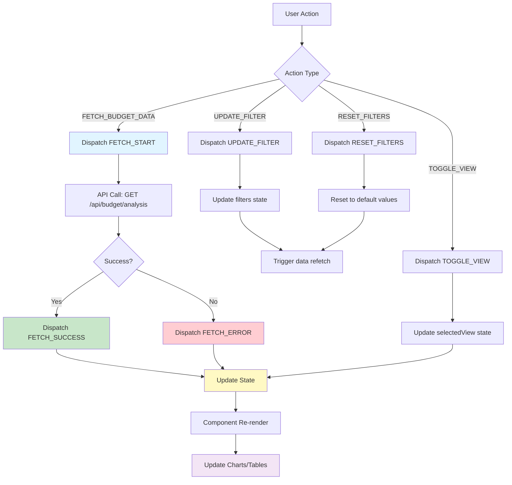
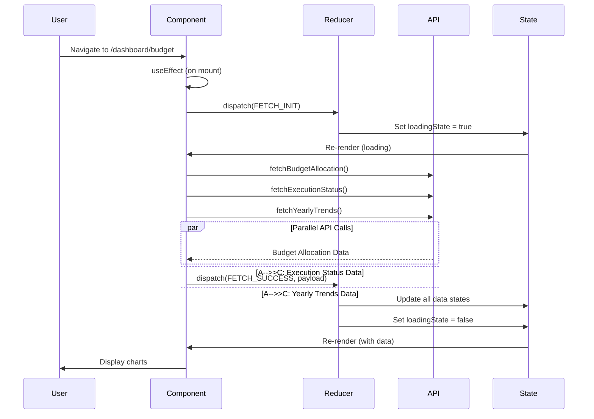
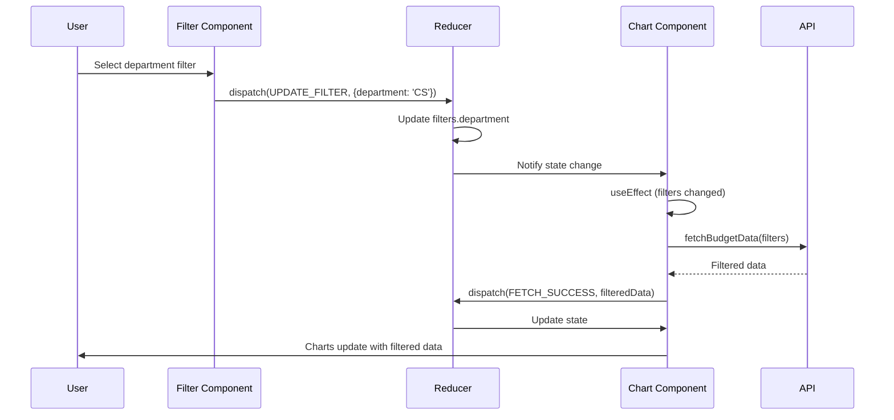
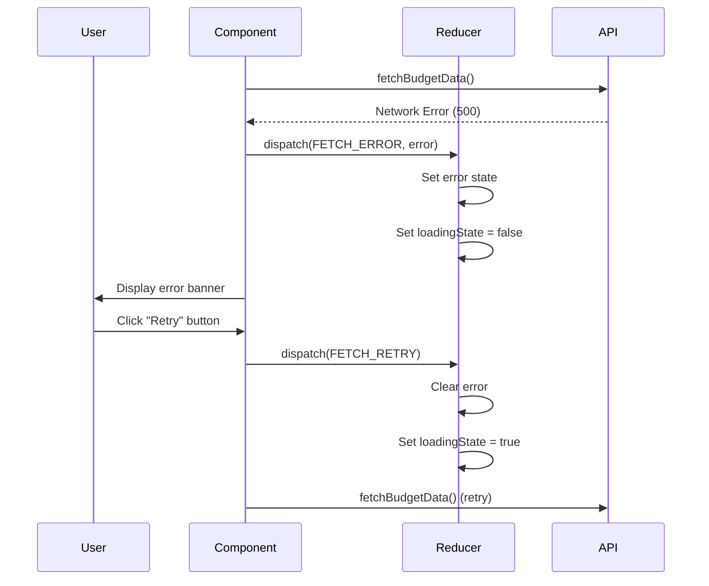
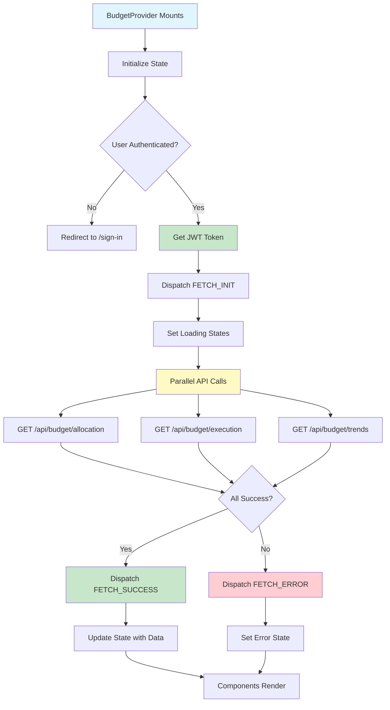
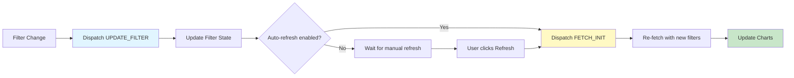
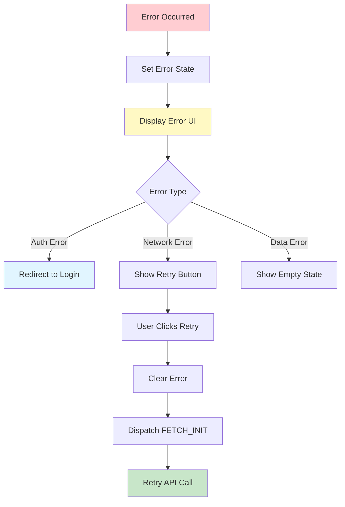

# State Management Design: Budget Analysis Page

> **Page**: `/dashboard/budget`
> **Pattern**: Context + useReducer
> **Purpose**: Display budget allocation, execution status, and year-over-year trends with filtering capabilities

---

## 1. State Data (Managed by useReducer)

### 1.1 Core State Structure

| State Name | Type | Initial Value | Description |
|------------|------|---------------|-------------|
| `budgetAllocation` | `Array<BudgetAllocationItem>` | `[]` | Department-wise budget allocation data |
| `executionStatus` | `Array<ExecutionStatusItem>` | `[]` | Budget execution status by department |
| `yearlyTrends` | `Array<YearlyTrendItem>` | `[]` | Year-over-year budget trends |
| `filters` | `FilterState` | See below | Active filter conditions |
| `loadingState` | `LoadingState` | `{ allocation: false, execution: false, trends: false }` | Loading status for each data type |
| `error` | `ErrorState` | `null` | Error information |
| `selectedView` | `'chart' \| 'table'` | `'chart'` | Current view mode |

### 1.2 Type Definitions

```typescript
interface BudgetAllocationItem {
  department: string;
  totalBudget: number;
  percentage: number;
  projectCount: number;
}

interface ExecutionStatusItem {
  department: string;
  totalBudget: number;
  executedAmount: number;
  executionRate: number;
  remainingBudget: number;
  status: 'normal' | 'warning' | 'critical'; // <90%, 90-100%, >100%
}

interface YearlyTrendItem {
  year: number;
  totalBudget: number;
  executedAmount: number;
  executionRate: number;
}

interface FilterState {
  department: string | null;      // null = all departments
  year: number;                   // default: current year
  budgetCategory: string | null;  // null = all categories
  dateRange: {
    startDate: string | null;     // ISO date string
    endDate: string | null;       // ISO date string
  };
}

interface LoadingState {
  allocation: boolean;
  execution: boolean;
  trends: boolean;
}

interface ErrorState {
  type: 'network' | 'auth' | 'validation' | 'data';
  message: string;
  details?: string;
} | null
```

---

## 2. Computed/Derived Data (NOT State)

These values are calculated on-the-fly from state and don't need to be stored:

| Data | Source | Calculation |
|------|--------|-------------|
| `overallExecutionRate` | `executionStatus` | `sum(executedAmount) / sum(totalBudget) × 100` |
| `totalBudget` | `budgetAllocation` | `sum(totalBudget)` |
| `totalExecuted` | `executionStatus` | `sum(executedAmount)` |
| `totalRemaining` | `executionStatus` | `sum(remainingBudget)` |
| `departmentCount` | `budgetAllocation` | `length` |
| `warningDepartments` | `executionStatus` | `filter(status === 'warning').length` |
| `criticalDepartments` | `executionStatus` | `filter(status === 'critical').length` |
| `chartData` | `budgetAllocation` / `executionStatus` / `yearlyTrends` | Transform to chart library format |
| `filteredData` | All data + `filters` | Apply active filters |
| `isLoading` | `loadingState` | `allocation \|\| execution \|\| trends` |

---

## 3. State Transition Table

| State | Condition for Change | How Screen Changes |
|-------|---------------------|-------------------|
| `budgetAllocation` | API fetch success | Pie chart updates with department distribution |
| `executionStatus` | API fetch success | Progress bars update with execution rates |
| `yearlyTrends` | API fetch success | Line chart updates with yearly comparison |
| `filters.department` | User selects department from dropdown | All charts filter to show selected department only |
| `filters.year` | User selects year from year picker | Data refreshes for selected year, charts update |
| `filters.budgetCategory` | User selects category from filter | Charts show only selected category data |
| `filters.dateRange` | User picks start/end date | Execution status filters to date range |
| `loadingState.allocation` | `true` when fetching starts, `false` when complete | Loading spinner shows/hides on pie chart |
| `loadingState.execution` | `true` when fetching starts, `false` when complete | Skeleton UI shows/hides on progress bars |
| `loadingState.trends` | `true` when fetching starts, `false` when complete | Loading spinner shows/hides on line chart |
| `error` | API request fails or validation error | Error banner displays with retry button |
| `selectedView` | User clicks chart/table toggle button | Content area switches between chart and table views |

---

## 4. Action → Store → View Flow (Flux Pattern)

### 4.1 Main Flow Diagram



### 4.2 Detailed Action Flows

#### Flow 1: Initial Page Load



#### Flow 2: Filter Application



#### Flow 3: Error Handling



---

## 5. Context Data Loading Flow

### 5.1 Initial Load Sequence



### 5.2 Data Refresh Flow



### 5.3 Error Recovery Flow



---

## 6. Reducer Actions

### 6.1 Action Types

```typescript
type BudgetAction =
  | { type: 'FETCH_INIT' }
  | { type: 'FETCH_SUCCESS'; payload: FetchSuccessPayload }
  | { type: 'FETCH_ERROR'; payload: ErrorState }
  | { type: 'UPDATE_FILTER'; payload: Partial<FilterState> }
  | { type: 'RESET_FILTERS' }
  | { type: 'TOGGLE_VIEW'; payload: 'chart' | 'table' }
  | { type: 'SET_YEAR'; payload: number }
  | { type: 'CLEAR_ERROR' }

interface FetchSuccessPayload {
  allocation?: BudgetAllocationItem[];
  execution?: ExecutionStatusItem[];
  trends?: YearlyTrendItem[];
}
```

### 6.2 Reducer Logic

```typescript
function budgetReducer(state: BudgetState, action: BudgetAction): BudgetState {
  switch (action.type) {
    case 'FETCH_INIT':
      return {
        ...state,
        loadingState: { allocation: true, execution: true, trends: true },
        error: null,
      };

    case 'FETCH_SUCCESS':
      return {
        ...state,
        budgetAllocation: action.payload.allocation ?? state.budgetAllocation,
        executionStatus: action.payload.execution ?? state.executionStatus,
        yearlyTrends: action.payload.trends ?? state.yearlyTrends,
        loadingState: { allocation: false, execution: false, trends: false },
        error: null,
      };

    case 'FETCH_ERROR':
      return {
        ...state,
        loadingState: { allocation: false, execution: false, trends: false },
        error: action.payload,
      };

    case 'UPDATE_FILTER':
      return {
        ...state,
        filters: { ...state.filters, ...action.payload },
      };

    case 'RESET_FILTERS':
      return {
        ...state,
        filters: initialState.filters,
      };

    case 'TOGGLE_VIEW':
      return {
        ...state,
        selectedView: action.payload,
      };

    case 'SET_YEAR':
      return {
        ...state,
        filters: { ...state.filters, year: action.payload },
      };

    case 'CLEAR_ERROR':
      return {
        ...state,
        error: null,
      };

    default:
      return state;
  }
}
```

---

## 7. Context Provider Implementation

### 7.1 Context Structure

```typescript
interface BudgetContextValue {
  // State
  state: BudgetState;

  // Computed values
  overallExecutionRate: number;
  totalBudget: number;
  totalExecuted: number;
  totalRemaining: number;
  warningDepartments: number;
  criticalDepartments: number;
  isLoading: boolean;

  // Actions
  fetchBudgetData: () => Promise<void>;
  updateFilter: (filter: Partial<FilterState>) => void;
  resetFilters: () => void;
  toggleView: (view: 'chart' | 'table') => void;
  setYear: (year: number) => void;
  retryFetch: () => Promise<void>;
}

const BudgetContext = createContext<BudgetContextValue | undefined>(undefined);
```

### 7.2 Provider Component

```typescript
export function BudgetProvider({ children }: { children: React.ReactNode }) {
  const [state, dispatch] = useReducer(budgetReducer, initialState);
  const { getToken } = useAuth();
  const { getAuthenticatedClient } = useApiClient();

  // Fetch all budget data
  const fetchBudgetData = useCallback(async () => {
    dispatch({ type: 'FETCH_INIT' });

    try {
      const client = await getAuthenticatedClient();
      const { filters } = state;

      // Build query params
      const params = new URLSearchParams();
      if (filters.department) params.append('department', filters.department);
      if (filters.year) params.append('year', filters.year.toString());
      if (filters.budgetCategory) params.append('category', filters.budgetCategory);
      if (filters.dateRange.startDate) params.append('start_date', filters.dateRange.startDate);
      if (filters.dateRange.endDate) params.append('end_date', filters.dateRange.endDate);

      // Parallel API calls
      const [allocationRes, executionRes, trendsRes] = await Promise.all([
        client.get(`/budget/allocation?${params}`),
        client.get(`/budget/execution?${params}`),
        client.get(`/budget/trends?${params}`),
      ]);

      dispatch({
        type: 'FETCH_SUCCESS',
        payload: {
          allocation: allocationRes.data,
          execution: executionRes.data,
          trends: trendsRes.data,
        },
      });
    } catch (error) {
      dispatch({
        type: 'FETCH_ERROR',
        payload: {
          type: error.response?.status === 401 ? 'auth' : 'network',
          message: error.message || 'Failed to fetch budget data',
          details: error.response?.data?.detail,
        },
      });
    }
  }, [state.filters, getAuthenticatedClient]);

  // Auto-fetch on mount and filter changes
  useEffect(() => {
    fetchBudgetData();
  }, [state.filters]);

  // Computed values
  const overallExecutionRate = useMemo(() => {
    if (state.executionStatus.length === 0) return 0;
    const totalBudget = state.executionStatus.reduce((sum, item) => sum + item.totalBudget, 0);
    const totalExecuted = state.executionStatus.reduce((sum, item) => sum + item.executedAmount, 0);
    return totalBudget > 0 ? (totalExecuted / totalBudget) * 100 : 0;
  }, [state.executionStatus]);

  const totalBudget = useMemo(() => {
    return state.budgetAllocation.reduce((sum, item) => sum + item.totalBudget, 0);
  }, [state.budgetAllocation]);

  const totalExecuted = useMemo(() => {
    return state.executionStatus.reduce((sum, item) => sum + item.executedAmount, 0);
  }, [state.executionStatus]);

  const totalRemaining = useMemo(() => {
    return state.executionStatus.reduce((sum, item) => sum + item.remainingBudget, 0);
  }, [state.executionStatus]);

  const warningDepartments = useMemo(() => {
    return state.executionStatus.filter(item => item.status === 'warning').length;
  }, [state.executionStatus]);

  const criticalDepartments = useMemo(() => {
    return state.executionStatus.filter(item => item.status === 'critical').length;
  }, [state.executionStatus]);

  const isLoading = useMemo(() => {
    return state.loadingState.allocation || state.loadingState.execution || state.loadingState.trends;
  }, [state.loadingState]);

  // Action functions
  const updateFilter = useCallback((filter: Partial<FilterState>) => {
    dispatch({ type: 'UPDATE_FILTER', payload: filter });
  }, []);

  const resetFilters = useCallback(() => {
    dispatch({ type: 'RESET_FILTERS' });
  }, []);

  const toggleView = useCallback((view: 'chart' | 'table') => {
    dispatch({ type: 'TOGGLE_VIEW', payload: view });
  }, []);

  const setYear = useCallback((year: number) => {
    dispatch({ type: 'SET_YEAR', payload: year });
  }, []);

  const retryFetch = useCallback(async () => {
    dispatch({ type: 'CLEAR_ERROR' });
    await fetchBudgetData();
  }, [fetchBudgetData]);

  const value: BudgetContextValue = {
    state,
    overallExecutionRate,
    totalBudget,
    totalExecuted,
    totalRemaining,
    warningDepartments,
    criticalDepartments,
    isLoading,
    fetchBudgetData,
    updateFilter,
    resetFilters,
    toggleView,
    setYear,
    retryFetch,
  };

  return (
    <BudgetContext.Provider value={value}>
      {children}
    </BudgetContext.Provider>
  );
}
```

---

## 8. Custom Hook for Consuming Context

```typescript
export function useBudget() {
  const context = useContext(BudgetContext);

  if (context === undefined) {
    throw new Error('useBudget must be used within BudgetProvider');
  }

  return context;
}
```

---

## 9. Variables and Functions Exposed to Child Components

### 9.1 State Variables

| Variable | Type | Description | Usage |
|----------|------|-------------|-------|
| `state.budgetAllocation` | `BudgetAllocationItem[]` | Department budget allocation | Pie chart, allocation table |
| `state.executionStatus` | `ExecutionStatusItem[]` | Execution status by department | Progress bars, status table |
| `state.yearlyTrends` | `YearlyTrendItem[]` | Year-over-year trends | Line chart, trend analysis |
| `state.filters` | `FilterState` | Active filter conditions | Filter panel display |
| `state.selectedView` | `'chart' \| 'table'` | Current view mode | View toggle button state |
| `state.error` | `ErrorState \| null` | Error information | Error banner |

### 9.2 Computed Values

| Variable | Type | Description | Usage |
|----------|------|-------------|-------|
| `overallExecutionRate` | `number` | Overall execution percentage | KPI card, summary dashboard |
| `totalBudget` | `number` | Sum of all budgets | KPI card, header summary |
| `totalExecuted` | `number` | Sum of all executed amounts | KPI card, header summary |
| `totalRemaining` | `number` | Sum of all remaining budgets | KPI card, alert calculation |
| `warningDepartments` | `number` | Count of warning-level departments | Alert badge |
| `criticalDepartments` | `number` | Count of critical-level departments | Alert badge |
| `isLoading` | `boolean` | Overall loading state | Loading overlay |

### 9.3 Action Functions

| Function | Signature | Description | Usage |
|----------|-----------|-------------|-------|
| `fetchBudgetData` | `() => Promise<void>` | Fetch all budget data | Refresh button |
| `updateFilter` | `(filter: Partial<FilterState>) => void` | Update specific filter | Filter inputs onChange |
| `resetFilters` | `() => void` | Reset all filters to defaults | Reset button |
| `toggleView` | `(view: 'chart' \| 'table') => void` | Switch between chart and table | View toggle button |
| `setYear` | `(year: number) => void` | Set year filter | Year picker onChange |
| `retryFetch` | `() => Promise<void>` | Retry failed fetch | Error banner retry button |

---

## 10. Component Usage Example

### 10.1 Page Component

```typescript
// pages/BudgetPage.tsx
import { BudgetProvider, useBudget } from '../contexts/BudgetContext';
import { MainLayout } from '../layouts/MainLayout';

function BudgetPageContent() {
  const {
    state,
    overallExecutionRate,
    totalBudget,
    totalExecuted,
    isLoading,
    updateFilter,
    resetFilters,
  } = useBudget();

  if (isLoading) {
    return <Loading />;
  }

  if (state.error) {
    return <ErrorBanner error={state.error} onRetry={retryFetch} />;
  }

  return (
    <MainLayout>
      <FilterPanel
        filters={state.filters}
        onFilterChange={updateFilter}
        onReset={resetFilters}
      />

      <KPISection
        totalBudget={totalBudget}
        totalExecuted={totalExecuted}
        executionRate={overallExecutionRate}
      />

      <ChartsSection
        allocation={state.budgetAllocation}
        execution={state.executionStatus}
        trends={state.yearlyTrends}
      />
    </MainLayout>
  );
}

export default function BudgetPage() {
  return (
    <BudgetProvider>
      <BudgetPageContent />
    </BudgetProvider>
  );
}
```

### 10.2 Child Component Example

```typescript
// components/BudgetAllocationChart.tsx
import { useBudget } from '../contexts/BudgetContext';
import { PieChart } from './charts/PieChart';
import { transformToPieChartData } from '../services/dataTransformer';

export function BudgetAllocationChart() {
  const { state } = useBudget();

  const chartData = transformToPieChartData(
    state.budgetAllocation,
    'department',
    'totalBudget'
  );

  return (
    <Card title="Department Budget Allocation">
      <PieChart data={chartData} />
    </Card>
  );
}
```

---

## 11. DRY Principles Applied

### 11.1 Reusable Logic

1. **API Client**: Use shared `useApiClient` hook (from common-modules.md)
2. **Authentication**: Use shared `useAuth` hook (from common-modules.md)
3. **Data Transformation**: Use shared `dataTransformer` service (from common-modules.md)
4. **Formatters**: Use shared `formatCurrency`, `formatPercentage` utilities
5. **Chart Components**: Reuse `PieChart`, `LineChart`, `BarChart` components

### 11.2 Shared State Logic

1. **Loading Pattern**: Same loading state structure across all data fetches
2. **Error Handling**: Unified error state structure and handling
3. **Filter Pattern**: Consistent filter state structure (can be extracted to shared hook)
4. **Fetch Pattern**: Standard API fetch with auth token injection

### 11.3 Avoided Duplication

1. **No duplicate API calls**: Parallel fetching in single function
2. **No duplicate computations**: All derived values use `useMemo`
3. **No duplicate error logic**: Single error handler for all API calls
4. **No inline transformations**: All chart transformations use shared service

---

## 12. Interface Contracts

### 12.1 API Response Interfaces

```typescript
// GET /api/budget/allocation
interface BudgetAllocationResponse {
  data: BudgetAllocationItem[];
  total: number;
}

// GET /api/budget/execution
interface BudgetExecutionResponse {
  data: ExecutionStatusItem[];
  summary: {
    totalBudget: number;
    totalExecuted: number;
    overallRate: number;
  };
}

// GET /api/budget/trends
interface BudgetTrendsResponse {
  data: YearlyTrendItem[];
  yearRange: {
    min: number;
    max: number;
  };
}
```

### 12.2 API Request Interfaces

```typescript
interface BudgetQueryParams {
  department?: string;
  year?: number;
  category?: string;
  start_date?: string;
  end_date?: string;
}
```

---

## 13. State Management Best Practices

### 13.1 Performance Optimizations

1. **Memoization**: All computed values use `useMemo`
2. **Callback Stability**: All action functions use `useCallback`
3. **Conditional Rendering**: Loading states prevent unnecessary renders
4. **Data Normalization**: Flat state structure for easy access

### 13.2 Error Resilience

1. **Error Boundaries**: Each section wrapped in error boundary
2. **Retry Logic**: Built-in retry mechanism for failed requests
3. **Fallback UI**: Graceful degradation to table view on chart errors
4. **Auth Handling**: Automatic redirect on auth errors

### 13.3 Developer Experience

1. **Type Safety**: Full TypeScript coverage
2. **Clear Naming**: Descriptive variable and function names
3. **Single Source of Truth**: All state in one reducer
4. **Predictable Updates**: All state changes through dispatched actions

---

## 14. Testing Considerations

### 14.1 Reducer Tests

```typescript
describe('budgetReducer', () => {
  test('FETCH_INIT sets loading to true', () => {
    const state = budgetReducer(initialState, { type: 'FETCH_INIT' });
    expect(state.loadingState.allocation).toBe(true);
  });

  test('FETCH_SUCCESS updates data and clears loading', () => {
    const payload = { allocation: mockAllocationData };
    const state = budgetReducer(initialState, { type: 'FETCH_SUCCESS', payload });
    expect(state.budgetAllocation).toEqual(mockAllocationData);
    expect(state.loadingState.allocation).toBe(false);
  });

  test('UPDATE_FILTER merges new filter values', () => {
    const state = budgetReducer(initialState, {
      type: 'UPDATE_FILTER',
      payload: { department: 'CS' }
    });
    expect(state.filters.department).toBe('CS');
  });
});
```

### 14.2 Context Tests

```typescript
describe('BudgetProvider', () => {
  test('provides all context values', () => {
    const { result } = renderHook(() => useBudget(), {
      wrapper: BudgetProvider,
    });

    expect(result.current.state).toBeDefined();
    expect(result.current.fetchBudgetData).toBeDefined();
    expect(result.current.updateFilter).toBeDefined();
  });
});
```

---

## 15. Migration and Scalability

### 15.1 Future Enhancements

1. **Caching**: Add React Query for server state caching
2. **Optimistic Updates**: Implement optimistic UI updates for better UX
3. **Pagination**: Add pagination for large datasets
4. **Real-time**: Add WebSocket support for live budget updates
5. **Export**: Add data export functionality (CSV, PDF)

### 15.2 Backwards Compatibility

1. All state changes are additive (no breaking changes)
2. API response shape is versioned
3. Optional filter parameters maintain compatibility
4. Error states include backward-compatible fields

---

## Appendix: Complete Type Definitions

```typescript
// Complete state interface
interface BudgetState {
  budgetAllocation: BudgetAllocationItem[];
  executionStatus: ExecutionStatusItem[];
  yearlyTrends: YearlyTrendItem[];
  filters: FilterState;
  loadingState: LoadingState;
  error: ErrorState;
  selectedView: 'chart' | 'table';
}

// Initial state
const initialState: BudgetState = {
  budgetAllocation: [],
  executionStatus: [],
  yearlyTrends: [],
  filters: {
    department: null,
    year: new Date().getFullYear(),
    budgetCategory: null,
    dateRange: {
      startDate: null,
      endDate: null,
    },
  },
  loadingState: {
    allocation: false,
    execution: false,
    trends: false,
  },
  error: null,
  selectedView: 'chart',
};
```

---

**Document Version**: 1.0
**Last Updated**: 2025-11-02
**Author**: State Planning Agent
**Related Documents**:
- `/docs/requirement.md`
- `/docs/prd.md`
- `/docs/userflow.md`
- `/docs/database.md`
- `/docs/common-modules.md`
- `/docs/usecase/008/spec.md`
