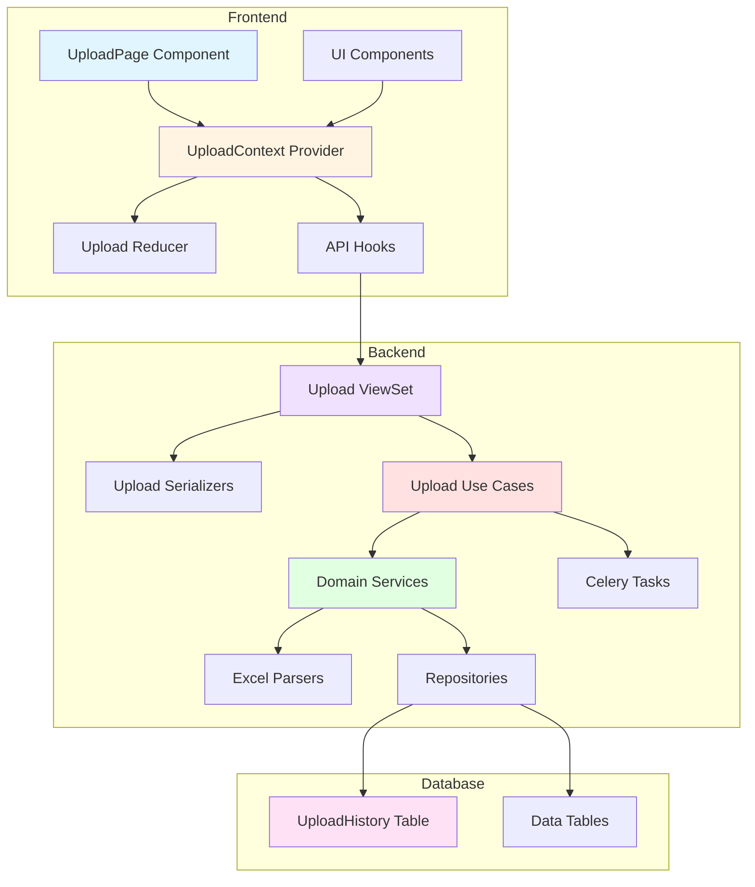

# Implementation Plan: Data Upload Page (`/admin/upload`)

> **Page**: `/admin/upload`
> **Purpose**: Excel file upload interface for administrators with upload history tracking
> **Related Use Cases**: UC-009 (Excel Data Upload), UC-010 (Upload History Inquiry)
> **State Management**: Context + useReducer (Flux pattern) - See `/docs/pages/6-data-upload/state.md`

---

## Overview

### Module Summary

This implementation plan follows the **Layered Architecture** (Presentation, Application, Domain, Infrastructure) and **SOLID principles** as defined in `/docs/architecture.md`. The Data Upload page enables administrators to upload Excel files containing university data and view upload history with pagination.

**Total Modules to Implement**: 23 (14 Backend + 9 Frontend)

| Layer | Backend Modules | Frontend Modules |
|-------|----------------|------------------|
| **Presentation** | 2 (Serializers, Views) | 7 (Components) |
| **Application** | 2 (Use Cases) | 1 (Context Provider) |
| **Domain** | 3 (Services) | 1 (Reducer) |
| **Infrastructure** | 7 (Parsers, Repositories, Tasks) | - |

---

## Module Relationship Diagram



---

## Implementation Plan

### Phase 1: Backend Infrastructure (Foundation)

#### Module 1.1: Excel Parser Classes
**File**: `backend/apps/data_dashboard/infrastructure/file_parsers.py`
**Type**: Infrastructure Layer
**Dependencies**: Pandas, common-modules (exceptions, validators)

**Purpose**: Parse uploaded Excel files and validate data structure

**Classes to Implement**:

```python
class BaseExcelParser:
    """
    Base parser class with common parsing logic.
    Follows OCP: extend for specific file types.
    """

    def parse(self, file_path: str) -> pd.DataFrame:
        """Parse Excel file to DataFrame"""

    def validate_columns(self, df: pd.DataFrame, required_columns: List[str]) -> bool:
        """Validate required columns exist"""

    def validate_data_types(self, df: pd.DataFrame, type_mapping: Dict) -> List[ValidationError]:
        """Validate data types match schema"""

    def detect_duplicates(self, df: pd.DataFrame, unique_columns: List[str]) -> List[int]:
        """Detect duplicate rows based on unique columns"""

    def clean_data(self, df: pd.DataFrame) -> pd.DataFrame:
        """Clean whitespace, handle null values"""


class DepartmentKPIParser(BaseExcelParser):
    """Parser for department_kpi.csv/xlsx"""
    REQUIRED_COLUMNS = ['year', 'college', 'department', 'employment_rate', ...]
    TYPE_MAPPING = {'year': int, 'employment_rate': float, ...}
    UNIQUE_COLUMNS = ['year', 'college', 'department']

    def parse_to_dict(self, file_path: str) -> List[Dict]:
        """Parse and return list of dictionaries for DB insertion"""


class PublicationParser(BaseExcelParser):
    """Parser for publication_list.csv/xlsx"""
    REQUIRED_COLUMNS = ['publication_id', 'publication_date', 'title', ...]
    TYPE_MAPPING = {...}
    UNIQUE_COLUMNS = ['publication_id']


class StudentParser(BaseExcelParser):
    """Parser for student_roster.csv/xlsx"""
    REQUIRED_COLUMNS = ['student_id', 'name', 'college', 'department', ...]
    TYPE_MAPPING = {...}
    UNIQUE_COLUMNS = ['student_id']


class ResearchBudgetParser(BaseExcelParser):
    """Parser for research_project_data.csv/xlsx"""
    REQUIRED_COLUMNS = ['execution_id', 'project_number', 'project_name', ...]
    TYPE_MAPPING = {...}
    UNIQUE_COLUMNS = ['execution_id']
```

**Testing Requirements**:
- Unit tests for each parser with sample Excel files
- Test valid data parsing
- Test missing column detection
- Test data type validation errors
- Test duplicate detection
- Test empty file handling

**QA Sheet**: Not required (Infrastructure layer - unit tests only)

---

#### Module 1.2: Data Repositories
**File**: `backend/apps/data_dashboard/infrastructure/repositories.py`
**Type**: Infrastructure Layer (Persistence)
**Dependencies**: Django ORM models (from `models.py`)

**Purpose**: Abstract database operations for data insertion/update

**Classes to Implement**:

```python
class DataRepository:
    """
    Generic repository for data models.
    Follows DIP: Domain layer depends on repository interface.
    """

    def bulk_upsert(self, model_class, data: List[Dict], unique_fields: List[str]) -> int:
        """
        Bulk insert or update data using UPSERT strategy.
        Returns number of records processed.
        """

    def backup_data(self, model_class, backup_name: str) -> bool:
        """Create backup of existing data before update"""

    def count_records(self, model_class, filters: Dict = None) -> int:
        """Count records matching filters"""


class UploadHistoryRepository:
    """Repository for UploadHistory model"""

    def create_history(
        self,
        user_id: int,
        file_name: str,
        file_type: str,
        status: str,
        records_processed: int = 0,
        error_message: str = None
    ) -> UploadHistory:
        """Create upload history record"""

    def get_history_list(self, page: int, page_size: int) -> QuerySet:
        """Get paginated upload history"""

    def get_history_by_user(self, user_id: int, page: int, page_size: int) -> QuerySet:
        """Get history filtered by user"""
```

**Testing Requirements**:
- Unit tests for UPSERT logic
- Test duplicate handling (ON CONFLICT DO UPDATE)
- Test transaction rollback on failure
- Test pagination

**QA Sheet**: Not required (Infrastructure layer)

---

#### Module 1.3: Domain Services
**File**: `backend/apps/data_dashboard/domain/services.py`
**Type**: Domain Layer (Business Logic)
**Dependencies**: Repositories, Parsers, Exceptions

**Purpose**: Core business logic for data validation and processing

**Classes to Implement**:

```python
class FileValidationService:
    """
    Validates uploaded files before processing.
    Pure business logic - no persistence logic.
    """

    def validate_file_format(self, filename: str) -> bool:
        """Validate file extension (.xlsx, .xls)"""

    def validate_file_size(self, file_size: int, max_size_mb: int = 10) -> bool:
        """Validate file size is within limit"""

    def detect_file_type(self, filename: str, columns: List[str]) -> str:
        """
        Detect which data type the file contains based on columns.
        Returns: 'department_kpi', 'publication_list', 'student_roster', 'research_project_data'
        """


class DataProcessingService:
    """
    Processes parsed data according to business rules.
    Coordinates between parser and repository.
    """

    def __init__(self, repository: DataRepository):
        self.repository = repository

    def process_department_kpi(self, data: List[Dict]) -> Dict:
        """
        Process department KPI data.
        Returns: {'records_processed': int, 'duplicates_found': int}
        """

    def process_publication(self, data: List[Dict]) -> Dict:
        """Process publication data"""

    def process_student(self, data: List[Dict]) -> Dict:
        """Process student data"""

    def process_research_budget(self, data: List[Dict]) -> Dict:
        """Process research budget data"""

    def validate_business_rules(self, file_type: str, data: List[Dict]) -> List[ValidationError]:
        """
        Apply business rule validations:
        - BR-4: Data Validation (required fields, data types)
        - Check year ranges (2000-2100)
        - Check valid enum values
        """
```

**Testing Requirements**:
- Unit tests for each validation method
- Test business rule enforcement
- Test error message formatting
- Mock repositories (DIP principle)

**QA Sheet**: Not required (Business logic - unit tests cover)

---

#### Module 1.4: Application Use Cases
**File**: `backend/apps/data_dashboard/application/use_cases.py`
**Type**: Application Layer (Orchestration)
**Dependencies**: Domain Services, Repositories, Tasks, Exceptions

**Purpose**: Orchestrate the upload workflow and transaction management

**Classes to Implement**:

```python
class UploadFileUseCase:
    """
    Orchestrates file upload workflow.
    Follows SRP: Only coordinates the upload flow.
    """

    def __init__(
        self,
        validation_service: FileValidationService,
        processing_service: DataProcessingService,
        history_repository: UploadHistoryRepository,
        parser_factory: ParserFactory
    ):
        self.validation_service = validation_service
        self.processing_service = processing_service
        self.history_repository = history_repository
        self.parser_factory = parser_factory

    def execute(self, user_id: int, uploaded_file: File) -> Dict:
        """
        Execute upload workflow:
        1. Validate file format and size
        2. Save file temporarily
        3. Parse file
        4. Detect file type
        5. Validate data
        6. Begin transaction
        7. Process and save data
        8. Commit transaction
        9. Record upload history
        10. Return result

        Returns: {
            'success': bool,
            'records_processed': int,
            'file_type': str,
            'file_name': str,
            'errors': List[ValidationError]
        }
        """

    def _save_temp_file(self, uploaded_file: File) -> str:
        """Save uploaded file to temp storage"""

    def _cleanup_temp_file(self, file_path: str):
        """Remove temp file after processing"""


class GetUploadHistoryUseCase:
    """
    Retrieves upload history with pagination.
    Follows SRP: Only coordinates history retrieval.
    """

    def __init__(self, history_repository: UploadHistoryRepository):
        self.history_repository = history_repository

    def execute(self, user_id: int, page: int, page_size: int, is_admin: bool) -> Dict:
        """
        Get upload history.
        - Admin: See all uploads
        - Non-admin: See only own uploads

        Returns: {
            'results': List[UploadHistory],
            'total': int,
            'page': int,
            'page_size': int
        }
        """
```

**Testing Requirements**:
- Integration tests for full upload workflow
- Test transaction rollback scenarios
- Test file cleanup on error
- Mock external dependencies

**QA Sheet**: Required (See Section: Module 1.4 QA Sheet)

---

#### Module 1.5: Celery Tasks (Async Processing)
**File**: `backend/apps/data_dashboard/infrastructure/tasks.py`
**Type**: Infrastructure Layer (External Services)
**Dependencies**: Celery, Use Cases

**Purpose**: Handle large file uploads asynchronously

**Tasks to Implement**:

```python
@shared_task(bind=True)
def process_large_file_async(self, user_id: int, file_path: str, file_name: str):
    """
    Process large files asynchronously.
    Updates task progress for frontend polling.

    BR-10: Files 5-10MB may require async processing
    """
    try:
        # Update progress: 0%
        self.update_state(state='PROCESSING', meta={'progress': 0})

        # Execute upload use case
        use_case = UploadFileUseCase(...)

        # Update progress periodically
        # ...

        # Update progress: 100%
        self.update_state(state='SUCCESS', meta={'progress': 100})

    except Exception as e:
        self.update_state(state='FAILURE', meta={'error': str(e)})
        raise


@shared_task
def cleanup_old_temp_files():
    """
    Periodic task to clean up temp files older than 24 hours.
    Scheduled via Celery Beat.
    """
```

**Testing Requirements**:
- Integration tests with Celery worker
- Test task retry logic
- Test progress updates

**QA Sheet**: Not required (Infrastructure layer)

---

#### Module 1.6: Serializers
**File**: `backend/apps/data_dashboard/presentation/serializers.py`
**Type**: Presentation Layer
**Dependencies**: DRF, Models

**Purpose**: Validate request data and serialize responses

**Serializers to Implement**:

```python
class UploadFileSerializer(serializers.Serializer):
    """
    Validates file upload request.
    Client-side validation mirror.
    """
    file = serializers.FileField(
        required=True,
        allow_empty_file=False,
        help_text="Excel file (.xlsx or .xls), max 10MB"
    )

    def validate_file(self, value):
        """
        Validate file extension and size.
        Raises ValidationError if invalid.
        """
        # Check extension
        if not value.name.endswith(('.xlsx', '.xls')):
            raise ValidationError("Invalid file format. Only .xlsx and .xls allowed.")

        # Check size (10MB = 10 * 1024 * 1024 bytes)
        if value.size > 10 * 1024 * 1024:
            raise ValidationError("File size exceeds 10MB limit.")

        return value


class UploadResultSerializer(serializers.Serializer):
    """Serializes upload result response"""
    success = serializers.BooleanField()
    records_processed = serializers.IntegerField()
    file_type = serializers.CharField()
    file_name = serializers.CharField()
    uploaded_at = serializers.DateTimeField()
    errors = serializers.ListField(child=serializers.DictField(), required=False)


class UploadHistorySerializer(serializers.ModelSerializer):
    """Serializes upload history records"""
    uploaded_by = serializers.CharField(source='user.email', read_only=True)

    class Meta:
        model = UploadHistory
        fields = [
            'id', 'file_name', 'file_type', 'status',
            'records_processed', 'error_message',
            'uploaded_at', 'uploaded_by'
        ]


class UploadHistoryListSerializer(serializers.Serializer):
    """Paginated history list response"""
    results = UploadHistorySerializer(many=True)
    total = serializers.IntegerField()
    page = serializers.IntegerField()
    page_size = serializers.IntegerField()
```

**Testing Requirements**:
- Unit tests for validation logic
- Test error message formatting
- Test serialization output

**QA Sheet**: Not required (Presentation layer - tested via API tests)

---

#### Module 1.7: API ViewSet
**File**: `backend/apps/data_dashboard/presentation/views.py`
**Type**: Presentation Layer
**Dependencies**: DRF, Serializers, Use Cases, Middleware

**Purpose**: Expose REST API endpoints for file upload and history

**ViewSet to Implement**:

```python
class UploadViewSet(viewsets.ViewSet):
    """
    API endpoints for file upload and history.

    Endpoints:
    - POST /api/upload/ - Upload file
    - GET /api/upload/history/ - Get upload history
    - GET /api/upload/task-status/{task_id}/ - Check async task status
    """

    permission_classes = [IsAuthenticated, IsAdminUser]  # BR-1: Admin only
    parser_classes = [MultiPartParser, FormParser]

    @action(detail=False, methods=['post'])
    def upload(self, request):
        """
        Upload Excel file.

        Request: multipart/form-data with 'file' field
        Response: UploadResultSerializer

        Status Codes:
        - 200: Success
        - 400: Validation error
        - 403: Permission denied
        - 422: File processing error
        - 500: Server error
        """
        serializer = UploadFileSerializer(data=request.data)
        serializer.is_valid(raise_exception=True)

        uploaded_file = serializer.validated_data['file']
        user_id = request.user.id

        # Check file size for async processing
        if uploaded_file.size > 5 * 1024 * 1024:  # 5MB threshold
            # Process asynchronously
            task = process_large_file_async.delay(user_id, uploaded_file, uploaded_file.name)
            return Response({
                'task_id': task.id,
                'status': 'processing',
                'message': 'Large file is being processed asynchronously'
            }, status=202)

        # Process synchronously
        use_case = UploadFileUseCase(...)
        result = use_case.execute(user_id, uploaded_file)

        if result['success']:
            serializer = UploadResultSerializer(result)
            return Response(serializer.data, status=200)
        else:
            return Response({
                'errors': result['errors']
            }, status=400)

    @action(detail=False, methods=['get'], url_path='history')
    def history(self, request):
        """
        Get upload history with pagination.

        Query Params:
        - page: int (default 1)
        - page_size: int (default 20, max 100)

        Response: UploadHistoryListSerializer
        """
        page = int(request.query_params.get('page', 1))
        page_size = min(int(request.query_params.get('page_size', 20)), 100)

        use_case = GetUploadHistoryUseCase(...)
        result = use_case.execute(
            user_id=request.user.id,
            page=page,
            page_size=page_size,
            is_admin=request.user.is_staff
        )

        serializer = UploadHistoryListSerializer(result)
        return Response(serializer.data, status=200)

    @action(detail=True, methods=['get'], url_path='task-status')
    def task_status(self, request, pk=None):
        """
        Check status of async upload task.

        Path Param: task_id
        Response: {'status': str, 'progress': int, 'result': dict or 'error': str}
        """
        task = AsyncResult(pk)

        if task.state == 'PENDING':
            return Response({'status': 'pending'}, status=200)
        elif task.state == 'PROCESSING':
            return Response({
                'status': 'processing',
                'progress': task.info.get('progress', 0)
            }, status=200)
        elif task.state == 'SUCCESS':
            return Response({
                'status': 'success',
                'result': task.result
            }, status=200)
        elif task.state == 'FAILURE':
            return Response({
                'status': 'error',
                'error': str(task.info)
            }, status=200)
```

**Testing Requirements**:
- API integration tests for all endpoints
- Test authentication and permission checks
- Test file upload with valid/invalid files
- Test pagination
- Test async task flow

**QA Sheet**: Required (See Section: Module 1.7 QA Sheet)

---

### Phase 2: Frontend Components (UI)

#### Module 2.1: Upload Reducer
**File**: `frontend/src/pages/UploadPage/uploadReducer.js`
**Type**: Domain Layer (State Management)
**Dependencies**: None (pure function)

**Purpose**: Manage upload page state with predictable transitions

**Implementation**: See `/docs/pages/6-data-upload/state.md` Section 7 for complete reducer implementation.

**Key Actions**:
- `SELECT_FILE`, `CLEAR_FILE`
- `START_UPLOAD`, `UPDATE_PROGRESS`, `UPLOAD_SUCCESS`, `UPLOAD_ERROR`, `VALIDATION_ERROR`
- `FETCH_HISTORY_START`, `FETCH_HISTORY_SUCCESS`, `FETCH_HISTORY_ERROR`
- `CHANGE_TAB`, `SET_PAGE`, `SET_DRAGGING`

**Testing Requirements**:
- Unit tests for all action types
- Test state transitions
- Test immutability

**QA Sheet**: Not required (Pure logic - unit tests only)

---

#### Module 2.2: Upload Context Provider
**File**: `frontend/src/pages/UploadPage/UploadContext.jsx`
**Type**: Application Layer (Orchestration)
**Dependencies**: Reducer, API hooks, Auth hooks

**Purpose**: Provide centralized state and functions to child components

**Implementation**: See `/docs/pages/6-data-upload/state.md` Section 6 for complete implementation.

**Exposed Functions**:
- `handleFileSelect(file)` - Validate and select file
- `handleUpload()` - Upload file to backend
- `handleClearFile()` - Clear selected file
- `handleDragEnter/Leave()` - Drag-drop handlers
- `handleTabChange(tab)` - Switch tabs
- `handlePageChange(page)` - Paginate history
- `fetchHistory(page)` - Load history data
- `resetUpload()` - Reset to initial state

**Testing Requirements**:
- Integration tests with React Testing Library
- Test context provider rendering
- Test function calls update state correctly
- Mock API calls

**QA Sheet**: Not required (Orchestration layer)

---

#### Module 2.3: FileDropZone Component
**File**: `frontend/src/pages/UploadPage/components/FileDropZone.jsx`
**Type**: Presentation Layer
**Dependencies**: Context, MUI, react-dropzone

**Purpose**: Drag-and-drop file upload area

**Component Structure**:

```jsx
import { useDropzone } from 'react-dropzone';
import { Box, Typography } from '@mui/material';
import { useUpload } from '../UploadContext';

const FileDropZone = () => {
  const {
    state: { isDragging, selectedFile, uploadStatus },
    handleFileSelect,
    handleDragEnter,
    handleDragLeave
  } = useUpload();

  const { getRootProps, getInputProps } = useDropzone({
    onDrop: (acceptedFiles) => {
      if (acceptedFiles.length > 0) {
        handleFileSelect(acceptedFiles[0]);
      }
    },
    accept: {
      'application/vnd.openxmlformats-officedocument.spreadsheetml.sheet': ['.xlsx'],
      'application/vnd.ms-excel': ['.xls']
    },
    maxFiles: 1,
    disabled: uploadStatus === 'uploading'
  });

  return (
    <Box
      {...getRootProps()}
      onDragEnter={handleDragEnter}
      onDragLeave={handleDragLeave}
      sx={{
        border: '2px dashed',
        borderColor: isDragging ? 'primary.main' : 'grey.400',
        borderRadius: 2,
        p: 4,
        textAlign: 'center',
        cursor: 'pointer',
        bgcolor: isDragging ? 'action.hover' : 'background.paper',
        transition: 'all 0.2s'
      }}
    >
      <input {...getInputProps()} />
      <Typography variant="h6">
        {selectedFile ? selectedFile.name : 'Drag & drop Excel file here, or click to select'}
      </Typography>
      <Typography variant="body2" color="textSecondary">
        Supported formats: .xlsx, .xls (Max 10MB)
      </Typography>
    </Box>
  );
};

export default FileDropZone;
```

**Testing Requirements**:
- Unit test with @testing-library/react
- Test drag events
- Test file selection
- Test disabled state during upload

**QA Sheet**: Required (See Section: Module 2.3 QA Sheet)

---

#### Module 2.4: FileInfoCard Component
**File**: `frontend/src/pages/UploadPage/components/FileInfoCard.jsx`
**Type**: Presentation Layer
**Dependencies**: Context, MUI, Common modules (formatters)

**Purpose**: Display selected file information with clear option

**Component Structure**:

```jsx
import { Card, CardContent, Typography, IconButton, Box } from '@mui/material';
import CloseIcon from '@mui/icons-material/Close';
import { useUpload } from '../UploadContext';
import { formatFileSize } from '../../../utils/formatters';

const FileInfoCard = () => {
  const {
    state: { selectedFile },
    handleClearFile
  } = useUpload();

  if (!selectedFile) return null;

  return (
    <Card sx={{ mt: 2 }}>
      <CardContent>
        <Box display="flex" justifyContent="space-between" alignItems="center">
          <Box>
            <Typography variant="subtitle1" fontWeight="bold">
              {selectedFile.name}
            </Typography>
            <Typography variant="body2" color="textSecondary">
              Size: {formatFileSize(selectedFile.size)} | Type: {selectedFile.type}
            </Typography>
          </Box>
          <IconButton onClick={handleClearFile} size="small">
            <CloseIcon />
          </IconButton>
        </Box>
      </CardContent>
    </Card>
  );
};

export default FileInfoCard;
```

**Testing Requirements**:
- Test rendering with file
- Test clear button click
- Test file size formatting

**QA Sheet**: Not required (Simple presentation)

---

#### Module 2.5: UploadButton Component
**File**: `frontend/src/pages/UploadPage/components/UploadButton.jsx`
**Type**: Presentation Layer
**Dependencies**: Context, MUI

**Purpose**: Upload button with loading state

**Component Structure**:

```jsx
import { Button, CircularProgress } from '@mui/material';
import CloudUploadIcon from '@mui/icons-material/CloudUpload';
import { useUpload } from '../UploadContext';

const UploadButton = () => {
  const {
    state: { selectedFile, uploadStatus },
    handleUpload
  } = useUpload();

  const isUploading = uploadStatus === 'uploading';
  const isDisabled = !selectedFile || isUploading;

  return (
    <Button
      variant="contained"
      color="primary"
      size="large"
      startIcon={isUploading ? <CircularProgress size={20} /> : <CloudUploadIcon />}
      onClick={handleUpload}
      disabled={isDisabled}
      fullWidth
      sx={{ mt: 2 }}
    >
      {isUploading ? 'Uploading...' : 'Upload File'}
    </Button>
  );
};

export default UploadButton;
```

**Testing Requirements**:
- Test disabled state
- Test upload click
- Test loading state

**QA Sheet**: Not required (Simple presentation)

---

#### Module 2.6: ProgressIndicator Component
**File**: `frontend/src/pages/UploadPage/components/ProgressIndicator.jsx`
**Type**: Presentation Layer
**Dependencies**: Context, MUI

**Purpose**: Display upload progress bar

**Component Structure**:

```jsx
import { Box, LinearProgress, Typography } from '@mui/material';
import { useUpload } from '../UploadContext';

const ProgressIndicator = () => {
  const {
    state: { uploadStatus, uploadProgress }
  } = useUpload();

  if (uploadStatus !== 'uploading') return null;

  return (
    <Box sx={{ width: '100%', mt: 2 }}>
      <Typography variant="body2" color="textSecondary" gutterBottom>
        Uploading... {uploadProgress}%
      </Typography>
      <LinearProgress variant="determinate" value={uploadProgress} />
    </Box>
  );
};

export default ProgressIndicator;
```

**Testing Requirements**:
- Test progress display
- Test hidden when not uploading

**QA Sheet**: Not required (Simple presentation)

---

#### Module 2.7: ValidationErrorList Component
**File**: `frontend/src/pages/UploadPage/components/ValidationErrorList.jsx`
**Type**: Presentation Layer
**Dependencies**: Context, MUI

**Purpose**: Display validation errors from backend

**Component Structure**:

```jsx
import { Alert, AlertTitle, List, ListItem, ListItemText } from '@mui/material';
import { useUpload } from '../UploadContext';

const ValidationErrorList = () => {
  const {
    state: { validationErrors }
  } = useUpload();

  if (validationErrors.length === 0) return null;

  return (
    <Alert severity="error" sx={{ mt: 2 }}>
      <AlertTitle>Validation Errors ({validationErrors.length})</AlertTitle>
      <List dense>
        {validationErrors.map((error, index) => (
          <ListItem key={index}>
            <ListItemText
              primary={error.message}
              secondary={error.row ? `Row ${error.row}, Column: ${error.column}` : null}
            />
          </ListItem>
        ))}
      </List>
    </Alert>
  );
};

export default ValidationErrorList;
```

**Testing Requirements**:
- Test error list rendering
- Test row/column display

**QA Sheet**: Required (See Section: Module 2.7 QA Sheet)

---

#### Module 2.8: HistoryTable Component
**File**: `frontend/src/pages/UploadPage/components/HistoryTable.jsx`
**Type**: Presentation Layer
**Dependencies**: Context, MUI, Common modules (Table, formatters)

**Purpose**: Display upload history with pagination

**Component Structure**:

```jsx
import { Table } from '../../../components/common/Table';
import { Chip, Box, Pagination, CircularProgress } from '@mui/material';
import { useUpload } from '../UploadContext';
import { formatDate } from '../../../utils/formatters';

const HistoryTable = () => {
  const {
    state: { historyData, historyLoading, historyPagination },
    handlePageChange
  } = useUpload();

  if (historyLoading) {
    return <Box display="flex" justifyContent="center" p={4}><CircularProgress /></Box>;
  }

  if (historyData.length === 0) {
    return <Box p={4} textAlign="center">No upload history yet</Box>;
  }

  const columns = [
    { id: 'uploaded_at', label: 'Upload Date', render: (row) => formatDate(row.uploaded_at) },
    { id: 'uploaded_by', label: 'User' },
    { id: 'file_name', label: 'File Name' },
    { id: 'file_type', label: 'Type' },
    {
      id: 'status',
      label: 'Status',
      render: (row) => (
        <Chip
          label={row.status}
          color={row.status === 'success' ? 'success' : 'error'}
          size="small"
        />
      )
    },
    { id: 'records_processed', label: 'Records' }
  ];

  const totalPages = Math.ceil(historyPagination.total / historyPagination.pageSize);

  return (
    <Box>
      <Table columns={columns} data={historyData} />
      <Box display="flex" justifyContent="center" mt={2}>
        <Pagination
          count={totalPages}
          page={historyPagination.page}
          onChange={(e, page) => handlePageChange(page)}
          color="primary"
        />
      </Box>
    </Box>
  );
};

export default HistoryTable;
```

**Testing Requirements**:
- Test table rendering with data
- Test pagination
- Test loading state
- Test empty state

**QA Sheet**: Required (See Section: Module 2.8 QA Sheet)

---

#### Module 2.9: UploadPage Component
**File**: `frontend/src/pages/UploadPage/index.jsx`
**Type**: Presentation Layer (Page)
**Dependencies**: All sub-components, Context, MainLayout

**Purpose**: Main page component that assembles all sub-components

**Component Structure**:

```jsx
import { Box, Container, Typography, Tabs, Tab } from '@mui/material';
import MainLayout from '../../layouts/MainLayout';
import { UploadProvider, useUpload } from './UploadContext';
import FileDropZone from './components/FileDropZone';
import FileInfoCard from './components/FileInfoCard';
import UploadButton from './components/UploadButton';
import ProgressIndicator from './components/ProgressIndicator';
import ValidationErrorList from './components/ValidationErrorList';
import HistoryTable from './components/HistoryTable';
import SuccessMessage from './components/SuccessMessage';
import ErrorMessage from './components/ErrorMessage';

const UploadPageContent = () => {
  const {
    state: { activeTab },
    handleTabChange
  } = useUpload();

  return (
    <MainLayout>
      <Container maxWidth="lg">
        <Box sx={{ py: 4 }}>
          <Typography variant="h4" gutterBottom>
            Data Upload
          </Typography>

          <Tabs value={activeTab} onChange={(e, tab) => handleTabChange(tab)} sx={{ mb: 3 }}>
            <Tab label="Upload File" value="upload" />
            <Tab label="Upload History" value="history" />
          </Tabs>

          {activeTab === 'upload' ? (
            <Box>
              <FileDropZone />
              <FileInfoCard />
              <UploadButton />
              <ProgressIndicator />
              <ValidationErrorList />
              <ErrorMessage />
              <SuccessMessage />
            </Box>
          ) : (
            <Box>
              <HistoryTable />
            </Box>
          )}
        </Box>
      </Container>
    </MainLayout>
  );
};

const UploadPage = () => {
  return (
    <UploadProvider>
      <UploadPageContent />
    </UploadProvider>
  );
};

export default UploadPage;
```

**Testing Requirements**:
- Integration test for full page
- Test tab switching
- Test upload flow end-to-end
- Test history loading

**QA Sheet**: Required (See Section: Module 2.9 QA Sheet)

---

## QA Sheets

### Module 1.4 QA Sheet: UploadFileUseCase

| Test Case | Input | Expected Output | Pass/Fail |
|-----------|-------|-----------------|-----------|
| Valid Excel file with correct columns | `department_kpi.xlsx` with valid data | `{'success': True, 'records_processed': 100}` | |
| Invalid file format | `data.pdf` | `ValidationError: "Invalid file format"` | |
| File size exceeds limit | `large_file.xlsx` (15MB) | `ValidationError: "File size exceeds 10MB"` | |
| Missing required columns | Excel missing 'department' column | `ValidationError: "Missing columns: [department]"` | |
| Data type mismatch | String in 'year' column | `ValidationError: "Row 5: year must be integer"` | |
| Duplicate data handling | Duplicate student_id records | Warning + UPSERT updates existing | |
| Database transaction failure | DB connection lost during insert | Transaction rollback + error logged | |
| Empty file | Excel with 0 data rows | `ValidationError: "File contains no data"` | |
| Upload history recorded | Successful upload | UploadHistory record created | |
| File cleanup | After processing (success or error) | Temp file removed | |

---

### Module 1.7 QA Sheet: UploadViewSet

| Test Case | HTTP Request | Expected Response | Pass/Fail |
|-----------|-------------|-------------------|-----------|
| Successful file upload | POST /api/upload/ with valid Excel | 200 + `{'success': true, 'records_processed': 100}` | |
| Upload without authentication | POST /api/upload/ without JWT | 401 Unauthorized | |
| Non-admin user upload | POST /api/upload/ with user role | 403 Forbidden | |
| Invalid file format | POST with .pdf file | 400 + validation error message | |
| Large file async processing | POST with 7MB Excel | 202 + `{'task_id': '...', 'status': 'processing'}` | |
| Check async task status | GET /api/upload/task-status/{task_id}/ | 200 + progress percentage | |
| Get upload history | GET /api/upload/history/?page=1 | 200 + paginated history | |
| Get history - page 2 | GET /api/upload/history/?page=2&page_size=20 | 200 + next page data | |
| History without authentication | GET /api/upload/history/ without JWT | 401 Unauthorized | |
| CORS headers present | OPTIONS /api/upload/ | 200 + CORS headers | |

---

### Module 2.3 QA Sheet: FileDropZone Component

| Test Case | User Action | Expected UI Change | Pass/Fail |
|-----------|-------------|-------------------|-----------|
| Drag file over zone | Drag .xlsx file over drop zone | Border color changes to primary, background highlights | |
| Drop file | Drop .xlsx file in zone | File selected, name displayed, upload button enabled | |
| Click to select file | Click on drop zone | File picker dialog opens | |
| Select invalid file type | Select .pdf file | Error alert: "Invalid file format" | |
| Drop multiple files | Drag 3 Excel files | Only first file selected + warning | |
| Drag leave zone | Drag in then drag out | Highlight removed | |
| Disabled during upload | File uploading | Drop zone grayed out, not clickable | |
| Mobile touch support | Touch and hold file on mobile | Works same as drag on desktop | |

---

### Module 2.7 QA Sheet: ValidationErrorList Component

| Test Case | State | Expected Display | Pass/Fail |
|-----------|-------|------------------|-----------|
| No errors | `validationErrors = []` | Component not rendered | |
| Single error | 1 validation error | Alert with 1 error item | |
| Multiple errors | 5 validation errors | Alert with "Errors (5)" + list of 5 items | |
| Error with row/column | Error at row 10, column 'age' | "Row 10, Column: age" displayed | |
| Error without row | General error message | Only message shown, no row info | |
| Error severity - warning | Severity = 'warning' | Yellow warning alert | |
| Error severity - error | Severity = 'error' | Red error alert | |
| Long error list | 50+ errors | Scrollable list, not page overflow | |

---

### Module 2.8 QA Sheet: HistoryTable Component

| Test Case | State | Expected Display | Pass/Fail |
|-----------|-------|------------------|-----------|
| Loading state | `historyLoading = true` | Circular progress spinner centered | |
| Empty history | `historyData = []` | "No upload history yet" message | |
| 10 history records | 10 records on page 1 | Table with 10 rows, pagination hidden (single page) | |
| 50 records (3 pages) | Page 1 of 3 | 20 rows + pagination with 3 pages | |
| Success status badge | Record with status='success' | Green chip with "success" | |
| Failed status badge | Record with status='failed' | Red chip with "failed" | |
| Date formatting | uploaded_at timestamp | Formatted: "2025-11-02 14:30" | |
| Click next page | User clicks page 2 | API called with page=2, new data loaded | |
| Sort by date | Click date column header | Rows sorted by date (default descending) | |
| Mobile responsive | View on mobile | Horizontal scroll for table, pagination responsive | |

---

### Module 2.9 QA Sheet: UploadPage (Integration)

| Test Case | User Flow | Expected Behavior | Pass/Fail |
|-----------|-----------|-------------------|-----------|
| Initial page load | Navigate to /admin/upload | Upload tab active, drop zone visible | |
| Switch to history tab | Click "Upload History" tab | History table loads, pagination appears | |
| Complete upload flow | Select file > Upload > Success | File uploaded, success message, history refreshed | |
| Upload with validation errors | Upload invalid file | Errors displayed, file not cleared, retry possible | |
| Network error handling | Upload while offline | Error message + retry button | |
| Session expiration | Upload with expired JWT | Redirect to login page | |
| Non-admin access | Access as regular user | 403 error or redirect to dashboard | |
| Async large file upload | Upload 8MB file | 202 response, task polling starts, completion alert | |
| Concurrent tab switching | Switch tabs during upload | Upload continues, progress saved | |
| Browser back button | Click back during upload | Warning: "Upload in progress" | |

---

## Implementation Order

### Week 1: Backend Foundation
1. ✅ Module 1.1: Excel Parser Classes
2. ✅ Module 1.2: Data Repositories
3. ✅ Module 1.3: Domain Services
4. ✅ Write unit tests for Modules 1.1-1.3

### Week 2: Backend Application & API
5. ✅ Module 1.4: Application Use Cases
6. ✅ Module 1.5: Celery Tasks
7. ✅ Module 1.6: Serializers
8. ✅ Module 1.7: API ViewSet
9. ✅ Integration tests + QA Sheet 1.4, 1.7

### Week 3: Frontend State & Core Components
10. ✅ Module 2.1: Upload Reducer
11. ✅ Module 2.2: Upload Context Provider
12. ✅ Module 2.3: FileDropZone Component
13. ✅ Module 2.4: FileInfoCard Component
14. ✅ Module 2.5: UploadButton Component
15. ✅ Write unit tests for Modules 2.1-2.5

### Week 4: Frontend UI Components & Integration
16. ✅ Module 2.6: ProgressIndicator Component
17. ✅ Module 2.7: ValidationErrorList Component
18. ✅ Module 2.8: HistoryTable Component
19. ✅ Module 2.9: UploadPage Component
20. ✅ Integration tests + QA Sheets 2.3, 2.7, 2.8, 2.9
21. ✅ End-to-end testing

### Week 5: Polish & Documentation
22. ✅ Error handling refinements
23. ✅ Performance optimization (memoization, lazy loading)
24. ✅ Accessibility audit (ARIA labels, keyboard navigation)
25. ✅ Documentation update
26. ✅ Final QA review

---

## Testing Strategy

### Unit Tests
- **Backend**: All parsers, services, repositories
- **Frontend**: Reducer, individual components
- **Coverage Target**: 90%+

### Integration Tests
- **Backend**: Full upload workflow with database
- **Frontend**: Context provider with components

### E2E Tests
- Complete user flows:
  1. Login > Navigate to upload > Upload file > View history
  2. Upload invalid file > See errors > Retry
  3. Large file async upload > Check progress

### Performance Tests
- Upload 10MB file
- Load history with 1000+ records
- Concurrent uploads

---

## Error Handling & Edge Cases

### Backend Error Handling
1. **File Validation Errors**: Return 400 with detailed messages
2. **Database Errors**: Rollback transaction, return 500, log for debugging
3. **Celery Task Failures**: Retry logic (max 3 attempts), notify user
4. **Duplicate Data**: Warn user, provide UPSERT option

### Frontend Error Handling
1. **Network Errors**: Show retry button, maintain state
2. **Session Expiration**: Auto-redirect to login
3. **File Selection Errors**: Inline validation before upload
4. **Progress Interruption**: Resume upload if possible

---

## Security Considerations

1. **Authentication**: JWT token required for all endpoints
2. **Authorization**: Admin role verification on backend
3. **File Validation**: Check extension, size, MIME type
4. **SQL Injection**: Use parameterized queries (Django ORM)
5. **CSRF Protection**: Django CSRF middleware enabled
6. **File Storage**: Secure temp directory, cleanup after processing
7. **Rate Limiting**: Limit upload requests per user (e.g., 10/hour)

---

## Performance Optimization

1. **Async Processing**: Files >5MB processed asynchronously
2. **Database Indexing**: Indexes on frequently queried fields
3. **Frontend Memoization**: React.memo for expensive components
4. **Pagination**: Limit history records per page
5. **Caching**: Cache upload history (5-minute TTL)
6. **Lazy Loading**: Load history only when tab opened

---

## Accessibility Checklist

- [ ] All interactive elements have ARIA labels
- [ ] Keyboard navigation works for file selection and upload
- [ ] Screen reader announces upload progress
- [ ] Error messages are announced
- [ ] Color contrast meets WCAG AA standards
- [ ] Focus management during upload flow
- [ ] Alt text for all icons

---

## Dependencies

### Backend Dependencies
```python
# requirements.txt
django>=4.2
djangorestframework>=3.14
pandas>=2.0
openpyxl>=3.1  # Excel parsing
celery>=5.3
redis>=4.5  # Celery broker
psycopg2-binary>=2.9  # PostgreSQL
python-decouple>=3.8  # Environment variables
```

### Frontend Dependencies
```json
// package.json
{
  "dependencies": {
    "react": "^18.2.0",
    "@mui/material": "^5.14.0",
    "@emotion/react": "^11.11.0",
    "@emotion/styled": "^11.11.0",
    "react-dropzone": "^14.2.0",
    "axios": "^1.5.0",
    "@clerk/clerk-react": "^4.26.0"
  },
  "devDependencies": {
    "@testing-library/react": "^14.0.0",
    "@testing-library/jest-dom": "^6.1.0",
    "vitest": "^0.34.0"
  }
}
```

---

## Monitoring & Logging

### Backend Logging
```python
# Log points:
1. File upload start (user_id, filename, size)
2. Validation errors (error type, details)
3. Database transaction start/commit/rollback
4. Upload success (records processed)
5. Upload failure (error stack trace)
6. Celery task progress
```

### Frontend Monitoring
```javascript
// Track events:
1. Page load time
2. File selection
3. Upload initiation
4. Upload completion (success/failure)
5. Validation errors encountered
6. Tab switches
7. History pagination
```

---

## Rollback Plan

If critical issues are discovered:

1. **Backend Rollback**: Revert Django migrations, restore database backup
2. **Frontend Rollback**: Deploy previous version via Railway
3. **Data Recovery**: Use UploadHistory table to identify affected uploads
4. **User Notification**: Email administrators about rollback

---

## Success Criteria

- [ ] All 23 modules implemented and tested
- [ ] All QA sheets completed with Pass status
- [ ] Unit test coverage >90%
- [ ] Integration tests pass
- [ ] E2E tests pass
- [ ] Performance benchmarks met (upload <30s for 5MB)
- [ ] Accessibility audit passed
- [ ] Security audit passed
- [ ] Documentation complete

---

## Related Documents

- [PRD](/Users/paul/edu/awesomedev/final_report/docs/prd.md)
- [Userflow](/Users/paul/edu/awesomedev/final_report/docs/userflow.md)
- [Database Schema](/Users/paul/edu/awesomedev/final_report/docs/database.md)
- [Architecture](/Users/paul/edu/awesomedev/final_report/docs/architecture.md)
- [Common Modules](/Users/paul/edu/awesomedev/final_report/docs/common-modules.md)
- [State Management Design](/Users/paul/edu/awesomedev/final_report/docs/pages/6-data-upload/state.md)
- [Use Case 009: Excel Upload](/Users/paul/edu/awesomedev/final_report/docs/usecase/009/spec.md)
- [Use Case 010: Upload History](/Users/paul/edu/awesomedev/final_report/docs/usecase/010/spec.md)

---

**Document Version**: 1.0
**Last Updated**: 2025-11-02
**Author**: Plan-Writer Agent
**Status**: Ready for Implementation
