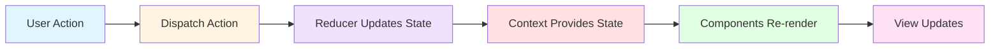
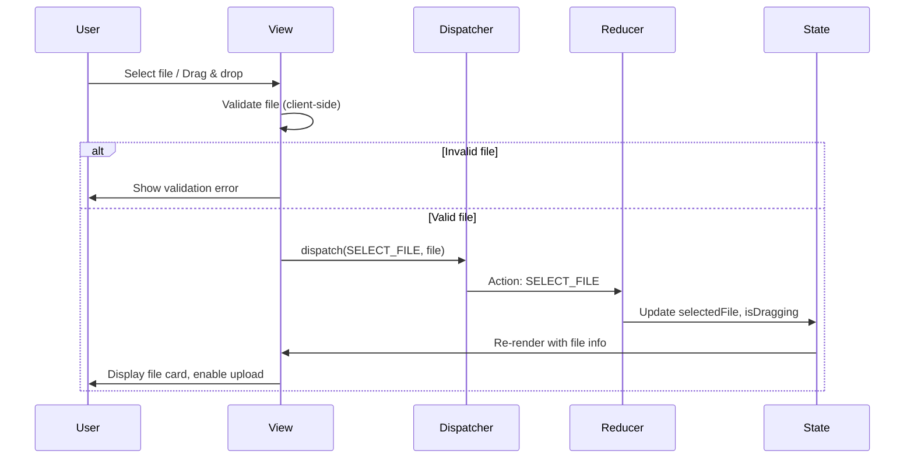
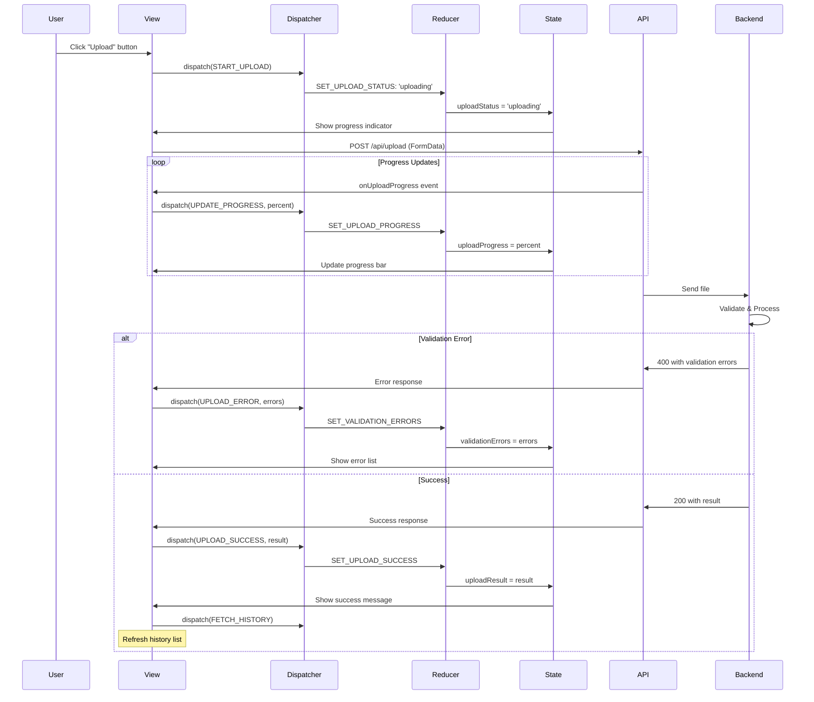
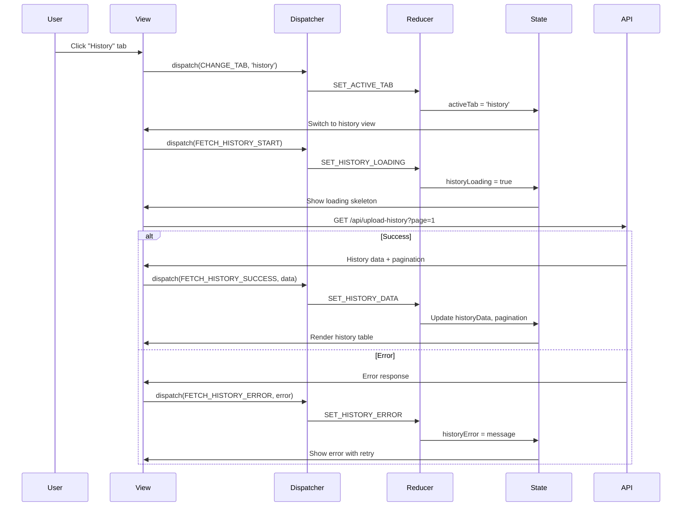
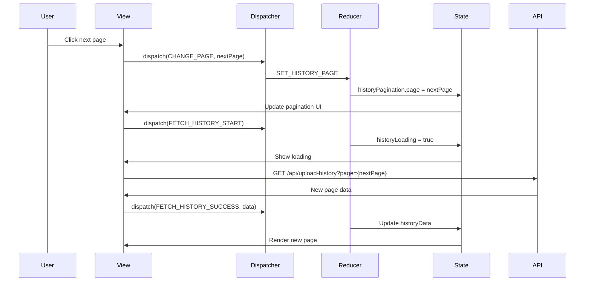
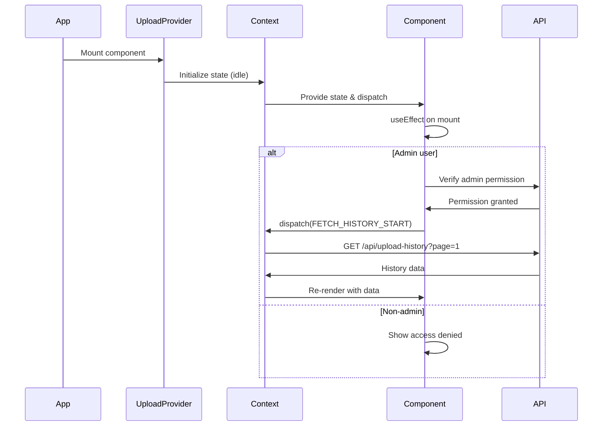
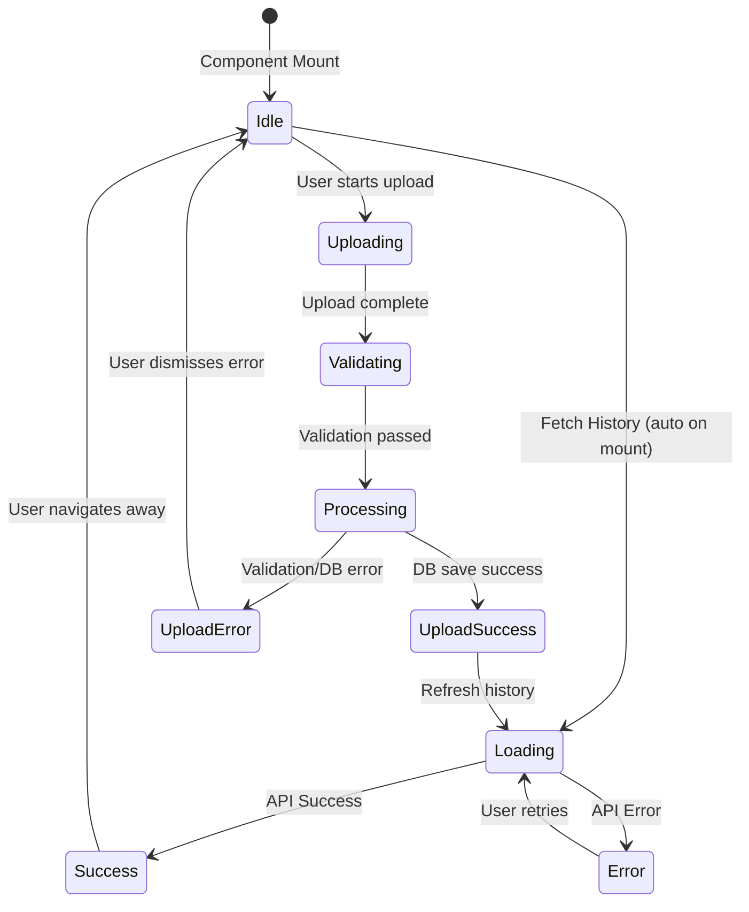

# State Management Design: Data Upload Page

> **Page**: `/admin/upload`
> **Pattern**: Context + useReducer (Flux pattern)
> **Design Principle**: DRY, Single Source of Truth, Predictable State Changes

---

## 1. State Data (Managed by Reducer)

All state data that changes over time and triggers UI updates:

| State Name | Type | Initial Value | Description |
|------------|------|---------------|-------------|
| `uploadStatus` | `'idle' \| 'uploading' \| 'validating' \| 'processing' \| 'success' \| 'error'` | `'idle'` | Current upload process status |
| `selectedFile` | `File \| null` | `null` | File selected by user for upload |
| `uploadProgress` | `number` | `0` | Upload progress percentage (0-100) |
| `validationErrors` | `ValidationError[]` | `[]` | Array of validation errors from backend |
| `uploadResult` | `UploadResult \| null` | `null` | Result of successful upload (records processed, etc.) |
| `errorMessage` | `string \| null` | `null` | General error message for failures |
| `historyData` | `UploadHistory[]` | `[]` | List of upload history records |
| `historyPagination` | `PaginationState` | `{ page: 1, pageSize: 20, total: 0 }` | Pagination state for history |
| `historyLoading` | `boolean` | `false` | Loading state for history fetch |
| `historyError` | `string \| null` | `null` | Error message for history fetch |
| `activeTab` | `'upload' \| 'history'` | `'upload'` | Currently active tab |
| `isDragging` | `boolean` | `false` | Drag-and-drop active state |

### Type Definitions

```typescript
interface ValidationError {
  row?: number;
  column?: string;
  message: string;
  severity: 'error' | 'warning';
}

interface UploadResult {
  recordsProcessed: number;
  fileName: string;
  uploadedAt: string;
  fileType: string;
}

interface UploadHistory {
  id: number;
  fileName: string;
  fileType: string;
  status: 'success' | 'failed';
  recordsProcessed: number;
  errorMessage: string | null;
  uploadedAt: string;
  uploadedBy: string;
}

interface PaginationState {
  page: number;
  pageSize: number;
  total: number;
}

interface UploadState {
  uploadStatus: 'idle' | 'uploading' | 'validating' | 'processing' | 'success' | 'error';
  selectedFile: File | null;
  uploadProgress: number;
  validationErrors: ValidationError[];
  uploadResult: UploadResult | null;
  errorMessage: string | null;
  historyData: UploadHistory[];
  historyPagination: PaginationState;
  historyLoading: boolean;
  historyError: string | null;
  activeTab: 'upload' | 'history';
  isDragging: boolean;
}
```

---

## 2. Non-State Display Data (Derived/Computed)

Data displayed on screen that is NOT part of state (computed or derived):

| Display Data | Source | Description |
|--------------|--------|-------------|
| File size formatted | `selectedFile.size` | "2.5 MB" (formatted from bytes) |
| Upload time elapsed | Computed from timestamps | "2 seconds ago" |
| Success rate percentage | `historyData` | Computed from success/fail ratio |
| Validation error count | `validationErrors.length` | Total number of errors |
| Can submit upload | `selectedFile && uploadStatus === 'idle'` | Boolean - upload button enabled |
| Progress text | `uploadProgress` | "Uploading... 45%" |
| History page count | `Math.ceil(total / pageSize)` | Total pages in history |
| Current user email | Clerk `user.email` | From authentication context |
| File type label | `selectedFile.type` | Formatted file type display |
| Allowed file types | Constant | ".xlsx, .xls" |
| Max file size text | Constant | "Maximum 10MB" |

**Note**: These are derived from state or constants and do NOT need to be stored in state.

---

## 3. State Change Conditions & Screen Updates

| State Name | Conditions for Change | How Screen Changes |
|------------|----------------------|-------------------|
| `uploadStatus` | User clicks upload → `'uploading'`<br>API validation starts → `'validating'`<br>API processing starts → `'processing'`<br>API success → `'success'`<br>API error → `'error'`<br>Reset → `'idle'` | Progress indicator shows/hides<br>Upload button disabled<br>Success/error message displays<br>Form resets on success |
| `selectedFile` | User selects file → `File object`<br>User clears file → `null`<br>Upload success → `null` (reset) | File info card appears/disappears<br>Upload button enabled/disabled<br>File name and size display |
| `uploadProgress` | API upload progress event → `0-100` | Progress bar updates<br>Percentage text updates |
| `validationErrors` | API returns validation errors → `[errors]`<br>Upload success → `[]` (clear) | Error list appears<br>Error count badge updates<br>Affected rows highlighted |
| `uploadResult` | API upload success → `UploadResult object`<br>User dismisses success → `null` | Success message with record count<br>Refresh dashboard prompt<br>History list refreshes |
| `errorMessage` | API error → `error message`<br>User dismisses → `null` | Error alert/snackbar appears<br>Retry button shows |
| `historyData` | Load history API success → `[history records]`<br>Upload success → refresh list | History table populates<br>Empty state shows if no data |
| `historyPagination` | User clicks page → update `page`<br>API returns total → update `total` | Table pagination updates<br>Page numbers change |
| `historyLoading` | History API starts → `true`<br>API completes → `false` | Loading skeleton shows<br>Table data appears |
| `historyError` | History API error → `error message`<br>Retry/dismiss → `null` | Error message shows<br>Retry button appears |
| `activeTab` | User clicks tab → `'upload' | 'history'` | Tab content switches<br>Active tab highlighted |
| `isDragging` | User drags file over zone → `true`<br>Drop/leave → `false` | Drop zone highlights<br>Visual feedback changes |

---

## 4. Action → Store → View Flow (Flux Pattern)

### 4.1 Mermaid Diagram: Upload Flow



### 4.2 Detailed Action Flow Diagrams

#### Flow 1: File Selection



#### Flow 2: File Upload Process



#### Flow 3: History Tab Loading



#### Flow 4: Pagination



---

## 5. Context Data Loading Flow

### 5.1 Initial Load Sequence



### 5.2 Context Provider Structure

```typescript
// UploadContext.tsx
interface UploadContextType {
  state: UploadState;
  dispatch: React.Dispatch<UploadAction>;
  // Exposed functions (see Section 6)
  handleFileSelect: (file: File) => void;
  handleUpload: () => Promise<void>;
  handleClearFile: () => void;
  handleDragEnter: () => void;
  handleDragLeave: () => void;
  handleTabChange: (tab: 'upload' | 'history') => void;
  handlePageChange: (page: number) => void;
  fetchHistory: (page?: number) => Promise<void>;
  resetUpload: () => void;
}

const UploadContext = createContext<UploadContextType | undefined>(undefined);

export const UploadProvider: React.FC<{children: React.ReactNode}> = ({ children }) => {
  const [state, dispatch] = useReducer(uploadReducer, initialState);
  const { getToken } = useAuth();
  const { getAuthenticatedClient } = useApiClient();

  // Implementation of exposed functions...

  return (
    <UploadContext.Provider value={{state, dispatch, /* exposed functions */}}>
      {children}
    </UploadContext.Provider>
  );
};
```

### 5.3 Data Loading Lifecycle



---

## 6. Variables & Functions Exposed to Child Components

### 6.1 Exposed State (Read-Only)

Components can access state through the context:

```typescript
const {
  state: {
    uploadStatus,
    selectedFile,
    uploadProgress,
    validationErrors,
    uploadResult,
    errorMessage,
    historyData,
    historyPagination,
    historyLoading,
    historyError,
    activeTab,
    isDragging
  }
} = useUpload();
```

### 6.2 Exposed Functions

| Function | Parameters | Return | Description |
|----------|-----------|--------|-------------|
| `handleFileSelect` | `file: File` | `void` | Validates and selects file for upload |
| `handleUpload` | - | `Promise<void>` | Initiates file upload process |
| `handleClearFile` | - | `void` | Clears selected file and resets state |
| `handleDragEnter` | - | `void` | Sets isDragging to true |
| `handleDragLeave` | - | `void` | Sets isDragging to false |
| `handleTabChange` | `tab: 'upload' \| 'history'` | `void` | Switches between upload/history tabs |
| `handlePageChange` | `page: number` | `void` | Changes history pagination page |
| `fetchHistory` | `page?: number` | `Promise<void>` | Fetches upload history data |
| `resetUpload` | - | `void` | Resets upload state to idle |

### 6.3 Function Implementation Details

```typescript
const handleFileSelect = useCallback((file: File) => {
  // Client-side validation
  if (!isValidFileExtension(file, ['xlsx', 'xls'])) {
    dispatch({ type: 'SET_ERROR', payload: 'Invalid file format. Please upload .xlsx or .xls files.' });
    return;
  }

  if (!isValidFileSize(file, 10)) {
    dispatch({ type: 'SET_ERROR', payload: 'File size exceeds 10MB limit.' });
    return;
  }

  dispatch({ type: 'SELECT_FILE', payload: file });
}, []);

const handleUpload = useCallback(async () => {
  if (!state.selectedFile) return;

  try {
    dispatch({ type: 'START_UPLOAD' });

    const client = await getAuthenticatedClient();
    const formData = new FormData();
    formData.append('file', state.selectedFile);

    const response = await client.post('/upload/', formData, {
      headers: { 'Content-Type': 'multipart/form-data' },
      onUploadProgress: (progressEvent) => {
        const progress = Math.round((progressEvent.loaded * 100) / progressEvent.total);
        dispatch({ type: 'UPDATE_PROGRESS', payload: progress });
      }
    });

    dispatch({ type: 'UPLOAD_SUCCESS', payload: response.data });

    // Refresh history after successful upload
    await fetchHistory(1);

  } catch (error) {
    if (error.response?.status === 400) {
      // Validation errors
      dispatch({
        type: 'VALIDATION_ERROR',
        payload: error.response.data.errors
      });
    } else {
      // General error
      dispatch({
        type: 'UPLOAD_ERROR',
        payload: error.response?.data?.message || 'Upload failed. Please try again.'
      });
    }
  }
}, [state.selectedFile, getAuthenticatedClient, fetchHistory]);

const fetchHistory = useCallback(async (page: number = 1) => {
  dispatch({ type: 'FETCH_HISTORY_START' });

  try {
    const client = await getAuthenticatedClient();
    const response = await client.get('/upload-history/', {
      params: {
        page,
        page_size: state.historyPagination.pageSize
      }
    });

    dispatch({
      type: 'FETCH_HISTORY_SUCCESS',
      payload: {
        data: response.data.results,
        total: response.data.count,
        page
      }
    });
  } catch (error) {
    dispatch({
      type: 'FETCH_HISTORY_ERROR',
      payload: error.response?.data?.message || 'Failed to load history.'
    });
  }
}, [getAuthenticatedClient, state.historyPagination.pageSize]);

const handleClearFile = useCallback(() => {
  dispatch({ type: 'CLEAR_FILE' });
}, []);

const handleDragEnter = useCallback(() => {
  dispatch({ type: 'SET_DRAGGING', payload: true });
}, []);

const handleDragLeave = useCallback(() => {
  dispatch({ type: 'SET_DRAGGING', payload: false });
}, []);

const handleTabChange = useCallback((tab: 'upload' | 'history') => {
  dispatch({ type: 'CHANGE_TAB', payload: tab });

  // Auto-fetch history when switching to history tab
  if (tab === 'history' && state.historyData.length === 0) {
    fetchHistory(1);
  }
}, [state.historyData.length, fetchHistory]);

const handlePageChange = useCallback((page: number) => {
  dispatch({ type: 'SET_PAGE', payload: page });
  fetchHistory(page);
}, [fetchHistory]);

const resetUpload = useCallback(() => {
  dispatch({ type: 'RESET_UPLOAD' });
}, []);
```

---

## 7. Reducer Actions & State Transitions

### 7.1 Action Types

```typescript
type UploadAction =
  | { type: 'SELECT_FILE'; payload: File }
  | { type: 'CLEAR_FILE' }
  | { type: 'START_UPLOAD' }
  | { type: 'UPDATE_PROGRESS'; payload: number }
  | { type: 'UPLOAD_SUCCESS'; payload: UploadResult }
  | { type: 'UPLOAD_ERROR'; payload: string }
  | { type: 'VALIDATION_ERROR'; payload: ValidationError[] }
  | { type: 'SET_ERROR'; payload: string }
  | { type: 'CLEAR_ERROR' }
  | { type: 'RESET_UPLOAD' }
  | { type: 'FETCH_HISTORY_START' }
  | { type: 'FETCH_HISTORY_SUCCESS'; payload: { data: UploadHistory[]; total: number; page: number } }
  | { type: 'FETCH_HISTORY_ERROR'; payload: string }
  | { type: 'SET_PAGE'; payload: number }
  | { type: 'CHANGE_TAB'; payload: 'upload' | 'history' }
  | { type: 'SET_DRAGGING'; payload: boolean };
```

### 7.2 Reducer Implementation

```typescript
const uploadReducer = (state: UploadState, action: UploadAction): UploadState => {
  switch (action.type) {
    case 'SELECT_FILE':
      return {
        ...state,
        selectedFile: action.payload,
        validationErrors: [],
        errorMessage: null,
        uploadResult: null,
        isDragging: false
      };

    case 'CLEAR_FILE':
      return {
        ...state,
        selectedFile: null,
        validationErrors: [],
        errorMessage: null,
        uploadResult: null
      };

    case 'START_UPLOAD':
      return {
        ...state,
        uploadStatus: 'uploading',
        uploadProgress: 0,
        validationErrors: [],
        errorMessage: null,
        uploadResult: null
      };

    case 'UPDATE_PROGRESS':
      return {
        ...state,
        uploadProgress: action.payload
      };

    case 'UPLOAD_SUCCESS':
      return {
        ...state,
        uploadStatus: 'success',
        uploadResult: action.payload,
        selectedFile: null,
        uploadProgress: 0,
        validationErrors: [],
        errorMessage: null
      };

    case 'UPLOAD_ERROR':
      return {
        ...state,
        uploadStatus: 'error',
        errorMessage: action.payload,
        uploadProgress: 0
      };

    case 'VALIDATION_ERROR':
      return {
        ...state,
        uploadStatus: 'error',
        validationErrors: action.payload,
        uploadProgress: 0
      };

    case 'SET_ERROR':
      return {
        ...state,
        errorMessage: action.payload
      };

    case 'CLEAR_ERROR':
      return {
        ...state,
        errorMessage: null,
        validationErrors: []
      };

    case 'RESET_UPLOAD':
      return {
        ...state,
        uploadStatus: 'idle',
        selectedFile: null,
        uploadProgress: 0,
        validationErrors: [],
        errorMessage: null,
        uploadResult: null
      };

    case 'FETCH_HISTORY_START':
      return {
        ...state,
        historyLoading: true,
        historyError: null
      };

    case 'FETCH_HISTORY_SUCCESS':
      return {
        ...state,
        historyLoading: false,
        historyData: action.payload.data,
        historyPagination: {
          ...state.historyPagination,
          total: action.payload.total,
          page: action.payload.page
        },
        historyError: null
      };

    case 'FETCH_HISTORY_ERROR':
      return {
        ...state,
        historyLoading: false,
        historyError: action.payload
      };

    case 'SET_PAGE':
      return {
        ...state,
        historyPagination: {
          ...state.historyPagination,
          page: action.payload
        }
      };

    case 'CHANGE_TAB':
      return {
        ...state,
        activeTab: action.payload
      };

    case 'SET_DRAGGING':
      return {
        ...state,
        isDragging: action.payload
      };

    default:
      return state;
  }
};
```

### 7.3 State Transition Table

| Current State | Action | Next State | Side Effects |
|--------------|--------|------------|--------------|
| `idle` | `SELECT_FILE` | `idle` (file selected) | File info displayed |
| `idle` | `START_UPLOAD` | `uploading` | API call initiated |
| `uploading` | `UPDATE_PROGRESS` | `uploading` | Progress bar updates |
| `uploading` | `UPLOAD_SUCCESS` | `success` | Success message, clear file |
| `uploading` | `UPLOAD_ERROR` | `error` | Error message displayed |
| `uploading` | `VALIDATION_ERROR` | `error` | Validation errors listed |
| `error` | `RESET_UPLOAD` | `idle` | Form reset |
| `success` | `RESET_UPLOAD` | `idle` | Ready for next upload |
| Any | `CHANGE_TAB` | Same | Tab switches, may fetch history |
| Any | `FETCH_HISTORY_START` | Same (loading=true) | Loading skeleton shown |
| Any | `FETCH_HISTORY_SUCCESS` | Same (loading=false) | History table populated |
| Any | `FETCH_HISTORY_ERROR` | Same (loading=false) | Error message shown |

---

## 8. Component Hierarchy & Context Usage

### 8.1 Component Tree

```
UploadPage (Wrapped by UploadProvider)
├── UploadHeader (Reads: activeTab, user)
├── TabNavigation (Reads: activeTab, Calls: handleTabChange)
├── TabContent
│   ├── UploadTab (When activeTab === 'upload')
│   │   ├── FileDropZone (Reads: isDragging, selectedFile, uploadStatus)
│   │   │   └── Calls: handleFileSelect, handleDragEnter, handleDragLeave
│   │   ├── FileInfoCard (Reads: selectedFile)
│   │   │   └── Calls: handleClearFile
│   │   ├── UploadButton (Reads: selectedFile, uploadStatus)
│   │   │   └── Calls: handleUpload
│   │   ├── ProgressIndicator (Reads: uploadProgress, uploadStatus)
│   │   ├── ValidationErrorList (Reads: validationErrors)
│   │   ├── ErrorMessage (Reads: errorMessage)
│   │   └── SuccessMessage (Reads: uploadResult)
│   │       └── Calls: resetUpload
│   └── HistoryTab (When activeTab === 'history')
│       ├── HistoryTable (Reads: historyData, historyLoading)
│       ├── Pagination (Reads: historyPagination)
│       │   └── Calls: handlePageChange
│       └── HistoryError (Reads: historyError)
│           └── Calls: fetchHistory (retry)
```

### 8.2 Context Hook Usage Pattern

Each component uses the context hook:

```typescript
// Example: FileDropZone component
const FileDropZone: React.FC = () => {
  const {
    state: { isDragging, selectedFile, uploadStatus },
    handleFileSelect,
    handleDragEnter,
    handleDragLeave
  } = useUpload();

  const onDrop = (acceptedFiles: File[]) => {
    if (acceptedFiles.length > 0) {
      handleFileSelect(acceptedFiles[0]);
    }
  };

  // Component implementation...
};

// Example: UploadButton component
const UploadButton: React.FC = () => {
  const {
    state: { selectedFile, uploadStatus },
    handleUpload
  } = useUpload();

  const isDisabled = !selectedFile || uploadStatus !== 'idle';

  return (
    <Button
      onClick={handleUpload}
      disabled={isDisabled}
      loading={uploadStatus === 'uploading'}
    >
      Upload
    </Button>
  );
};

// Example: HistoryTable component
const HistoryTable: React.FC = () => {
  const {
    state: { historyData, historyLoading },
    handlePageChange
  } = useUpload();

  if (historyLoading) return <LoadingSkeleton />;
  if (historyData.length === 0) return <EmptyState />;

  return (
    <Table data={historyData} />
  );
};
```

---

## 9. API Integration Points

### 9.1 API Endpoints Used

| Endpoint | Method | When Called | Payload | Response |
|----------|--------|-------------|---------|----------|
| `/api/upload/` | POST | `handleUpload()` | FormData with file | `{ recordsProcessed, fileName, fileType }` |
| `/api/upload-history/` | GET | `fetchHistory(page)` | `?page={n}&page_size={size}` | `{ results: [], count: n }` |

### 9.2 API Call Flow in Context

```typescript
const UploadProvider: React.FC = ({ children }) => {
  const [state, dispatch] = useReducer(uploadReducer, initialState);
  const { getToken } = useAuth();

  const handleUpload = async () => {
    dispatch({ type: 'START_UPLOAD' });

    const token = await getToken();
    const formData = new FormData();
    formData.append('file', state.selectedFile!);

    try {
      const response = await axios.post('/api/upload/', formData, {
        headers: {
          'Authorization': `Bearer ${token}`,
          'Content-Type': 'multipart/form-data'
        },
        onUploadProgress: (event) => {
          const progress = Math.round((event.loaded * 100) / event.total);
          dispatch({ type: 'UPDATE_PROGRESS', payload: progress });
        }
      });

      dispatch({ type: 'UPLOAD_SUCCESS', payload: response.data });
      await fetchHistory(1); // Refresh history

    } catch (error) {
      // Error handling as shown in Section 6.3
    }
  };

  // Similar pattern for fetchHistory...
};
```

---

## 10. Error Handling Strategy

### 10.1 Error Types & Handling

| Error Type | Trigger | State Update | UI Response |
|-----------|---------|--------------|-------------|
| Client Validation | Invalid file format/size | `errorMessage` set | Alert with clear message, prevent upload |
| Network Error | API call fails | `uploadStatus = 'error'`, `errorMessage` set | Error alert with retry button |
| Validation Error (400) | Backend validation fails | `validationErrors` array filled | Error list with row/column details |
| Permission Error (403) | Non-admin access | `errorMessage` set | Access denied message, redirect |
| Server Error (500) | Backend processing fails | `uploadStatus = 'error'`, `errorMessage` set | Generic error, contact support |

### 10.2 Error Recovery Actions

```typescript
// Retry mechanism for failed history fetch
const handleHistoryRetry = () => {
  fetchHistory(state.historyPagination.page);
};

// Reset after error to allow new upload
const handleResetAfterError = () => {
  dispatch({ type: 'RESET_UPLOAD' });
};

// Clear validation errors when selecting new file
const handleFileSelect = (file: File) => {
  dispatch({ type: 'CLEAR_ERROR' }); // Clear previous errors
  dispatch({ type: 'SELECT_FILE', payload: file });
};
```

---

## 11. Performance Considerations

### 11.1 Optimization Strategies

1. **Memoization**: Use `useCallback` for all exposed functions to prevent unnecessary re-renders
2. **Selective Context Consumption**: Split context if needed to avoid re-rendering unaffected components
3. **Debouncing**: Debounce pagination requests if user clicks rapidly
4. **Virtual Scrolling**: For large history lists (future enhancement)
5. **Abort Controllers**: Cancel pending API calls when component unmounts

### 11.2 Example: Memoized Components

```typescript
// Memoize components that don't need frequent updates
const FileInfoCard = React.memo(({ file, onClear }) => {
  // Component implementation
});

const HistoryRow = React.memo(({ history }) => {
  // Component implementation
});
```

---

## 12. Testing Considerations

### 12.1 State Testing

```typescript
describe('uploadReducer', () => {
  it('should handle SELECT_FILE action', () => {
    const state = initialState;
    const file = new File([''], 'test.xlsx');
    const action = { type: 'SELECT_FILE', payload: file };

    const newState = uploadReducer(state, action);

    expect(newState.selectedFile).toBe(file);
    expect(newState.validationErrors).toEqual([]);
  });

  it('should transition from uploading to success', () => {
    const state = { ...initialState, uploadStatus: 'uploading' };
    const result = { recordsProcessed: 100, fileName: 'test.xlsx' };
    const action = { type: 'UPLOAD_SUCCESS', payload: result };

    const newState = uploadReducer(state, action);

    expect(newState.uploadStatus).toBe('success');
    expect(newState.uploadResult).toEqual(result);
    expect(newState.selectedFile).toBeNull();
  });
});
```

### 12.2 Context Testing

```typescript
describe('UploadContext', () => {
  it('should provide state and functions to children', () => {
    const { result } = renderHook(() => useUpload(), {
      wrapper: UploadProvider
    });

    expect(result.current.state.uploadStatus).toBe('idle');
    expect(typeof result.current.handleUpload).toBe('function');
  });

  it('should handle file upload flow', async () => {
    const { result } = renderHook(() => useUpload(), {
      wrapper: UploadProvider
    });

    const file = new File([''], 'test.xlsx');
    act(() => {
      result.current.handleFileSelect(file);
    });

    expect(result.current.state.selectedFile).toBe(file);

    // Mock API call and test upload
  });
});
```

---

## 13. Summary

### 13.1 Key Design Decisions

1. **Context + useReducer Pattern**: Provides centralized state management with predictable state transitions
2. **Single Source of Truth**: All upload-related state in one reducer
3. **Separation of Concerns**: State (what) vs Actions (how) vs View (presentation)
4. **DRY Principle**: Reusable functions exposed through context, no duplicate logic
5. **Type Safety**: Full TypeScript support with strict typing
6. **Error Handling**: Comprehensive error states and recovery mechanisms
7. **Performance**: Memoization and selective re-rendering
8. **Testability**: Reducer and context are easily unit testable

### 13.2 Benefits

- **Predictable State Changes**: All state transitions go through reducer
- **Easy Debugging**: Action flow is traceable
- **Scalability**: Easy to add new actions without modifying existing code
- **Maintainability**: Clear separation between state logic and UI
- **Reusability**: Context can be consumed by any child component
- **Type Safety**: TypeScript ensures correct action payloads

### 13.3 State Management Flow Summary

```
User Action → Dispatch Action → Reducer → New State → Context → Components → UI Update
```

All state changes follow this unidirectional flow, making the application predictable and maintainable.

---

## Appendix A: Complete Type Definitions

```typescript
// ============================================
// State Types
// ============================================

type UploadStatus = 'idle' | 'uploading' | 'validating' | 'processing' | 'success' | 'error';

interface ValidationError {
  row?: number;
  column?: string;
  message: string;
  severity: 'error' | 'warning';
}

interface UploadResult {
  recordsProcessed: number;
  fileName: string;
  uploadedAt: string;
  fileType: string;
}

interface UploadHistory {
  id: number;
  fileName: string;
  fileType: 'department_kpi' | 'publication_list' | 'research_project_data' | 'student_roster';
  status: 'success' | 'failed';
  recordsProcessed: number;
  errorMessage: string | null;
  uploadedAt: string;
  uploadedBy: string;
}

interface PaginationState {
  page: number;
  pageSize: number;
  total: number;
}

interface UploadState {
  uploadStatus: UploadStatus;
  selectedFile: File | null;
  uploadProgress: number;
  validationErrors: ValidationError[];
  uploadResult: UploadResult | null;
  errorMessage: string | null;
  historyData: UploadHistory[];
  historyPagination: PaginationState;
  historyLoading: boolean;
  historyError: string | null;
  activeTab: 'upload' | 'history';
  isDragging: boolean;
}

// ============================================
// Action Types
// ============================================

type UploadAction =
  | { type: 'SELECT_FILE'; payload: File }
  | { type: 'CLEAR_FILE' }
  | { type: 'START_UPLOAD' }
  | { type: 'UPDATE_PROGRESS'; payload: number }
  | { type: 'UPLOAD_SUCCESS'; payload: UploadResult }
  | { type: 'UPLOAD_ERROR'; payload: string }
  | { type: 'VALIDATION_ERROR'; payload: ValidationError[] }
  | { type: 'SET_ERROR'; payload: string }
  | { type: 'CLEAR_ERROR' }
  | { type: 'RESET_UPLOAD' }
  | { type: 'FETCH_HISTORY_START' }
  | { type: 'FETCH_HISTORY_SUCCESS'; payload: { data: UploadHistory[]; total: number; page: number } }
  | { type: 'FETCH_HISTORY_ERROR'; payload: string }
  | { type: 'SET_PAGE'; payload: number }
  | { type: 'CHANGE_TAB'; payload: 'upload' | 'history' }
  | { type: 'SET_DRAGGING'; payload: boolean };

// ============================================
// Context Types
// ============================================

interface UploadContextType {
  state: UploadState;
  dispatch: React.Dispatch<UploadAction>;
  handleFileSelect: (file: File) => void;
  handleUpload: () => Promise<void>;
  handleClearFile: () => void;
  handleDragEnter: () => void;
  handleDragLeave: () => void;
  handleTabChange: (tab: 'upload' | 'history') => void;
  handlePageChange: (page: number) => void;
  fetchHistory: (page?: number) => Promise<void>;
  resetUpload: () => void;
}
```

---

## Appendix B: Initial State

```typescript
const initialState: UploadState = {
  uploadStatus: 'idle',
  selectedFile: null,
  uploadProgress: 0,
  validationErrors: [],
  uploadResult: null,
  errorMessage: null,
  historyData: [],
  historyPagination: {
    page: 1,
    pageSize: 20,
    total: 0
  },
  historyLoading: false,
  historyError: null,
  activeTab: 'upload',
  isDragging: false
};
```

---

**Document Version**: 1.0
**Last Updated**: 2025-11-02
**Author**: State Management Design Team
