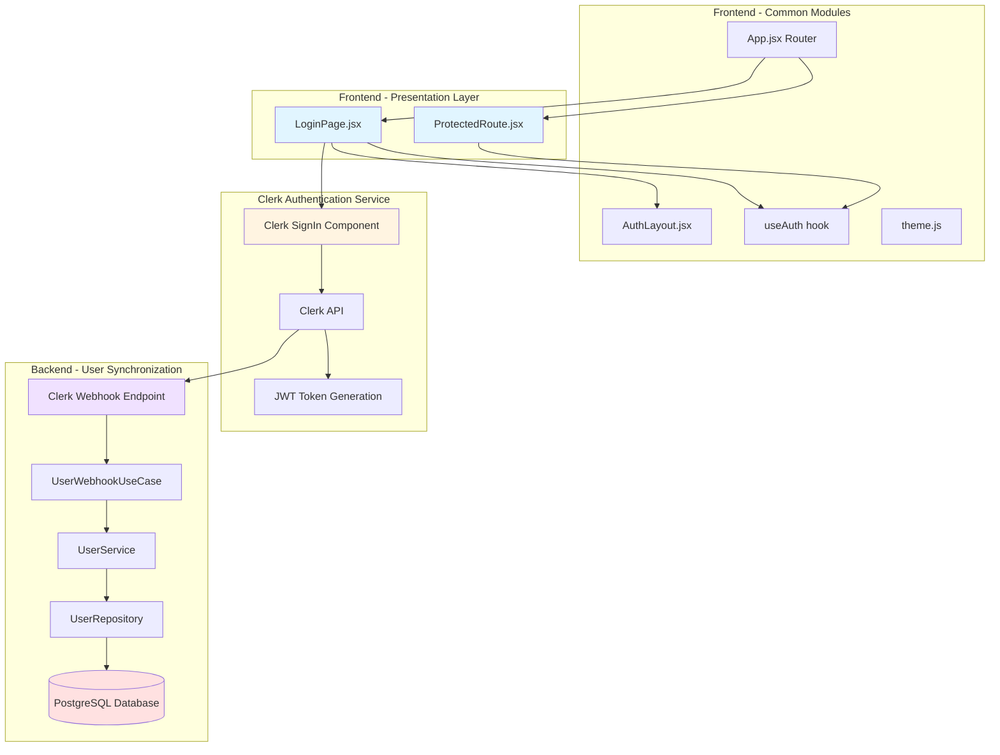
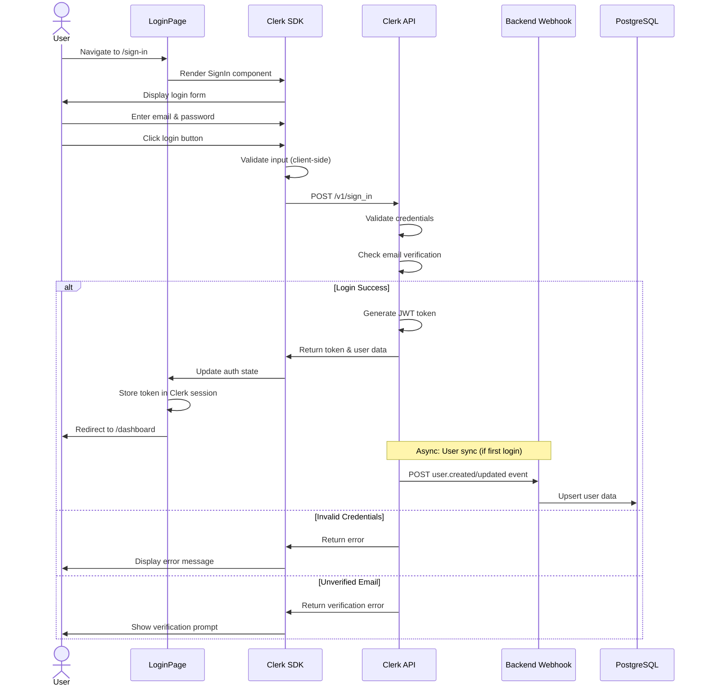

# Implementation Plan: Login Page (`/sign-in`)

> **Page**: Login (Use Case 002)
> **Route**: `/sign-in`
> **Authentication**: Public (unauthenticated users only)
> **Primary Actor**: Registered User with verified email

---

## Overview

### Module List

This plan follows the **Layered Architecture** and **SOLID principles** as defined in `/docs/architecture.md`. All modules are organized by responsibility and layer.

#### Frontend Modules

| # | Module Name | Location | Type | Description |
|---|-------------|----------|------|-------------|
| 1 | LoginPage | `frontend/src/pages/LoginPage.jsx` | Presentation | Main login page component with Clerk SignIn integration |
| 2 | ProtectedRoute | `frontend/src/components/auth/ProtectedRoute.jsx` | Component | Route wrapper to redirect authenticated users |

#### Backend Modules

**Note**: The Login page primarily uses **Clerk SDK** for authentication. Backend modules for user synchronization are already implemented in the common modules (`/docs/common-modules.md`). No new backend modules are required for this page.

**Existing Backend Dependencies**:
- `backend/apps/users/models.py` - User model (already implemented)
- `backend/apps/users/infrastructure/clerk_webhook_views.py` - Webhook handler (already implemented)
- `backend/apps/users/application/use_cases.py` - UserWebhookUseCase (already implemented)
- `backend/apps/users/domain/services.py` - UserService (already implemented)
- `backend/apps/users/infrastructure/repositories.py` - UserRepository (already implemented)

#### Shared/Common Modules (Already Implemented)

| # | Module Name | Location | Description |
|---|-------------|----------|-------------|
| 1 | AuthLayout | `frontend/src/layouts/AuthLayout.jsx` | Layout for authentication pages |
| 2 | useAuth | `frontend/src/hooks/useAuth.js` | Custom hook for Clerk authentication |
| 3 | theme | `frontend/src/styles/theme.js` | MUI theme configuration |
| 4 | App Router | `frontend/src/App.jsx` | Main app routing with ClerkProvider |

---

## Architecture Diagram

### Module Relationship Diagram



### User Flow Sequence Diagram



---

## Implementation Plan

### Phase 1: Frontend - Login Page Component

#### Module 1.1: LoginPage Component

**File**: `frontend/src/pages/LoginPage.jsx`

**Purpose**:
Main login page that integrates Clerk's `SignIn` component and handles authentication UI.

**Dependencies**:
- `@clerk/clerk-react` (SignIn component)
- `frontend/src/layouts/AuthLayout.jsx`
- `react-router-dom` (for redirects)

**Implementation Details**:

```jsx
/**
 * Login Page Component
 * Use Case 002: Login
 *
 * Integrates Clerk SignIn component for user authentication.
 * Redirects authenticated users to dashboard.
 */
import React from 'react';
import { SignIn, useUser } from '@clerk/clerk-react';
import { Navigate } from 'react-router-dom';
import { Box, Typography, Link as MuiLink } from '@mui/material';
import { AuthLayout } from '../layouts/AuthLayout';

const LoginPage = () => {
  const { isSignedIn, isLoaded } = useUser();

  // Redirect authenticated users to dashboard
  if (isLoaded && isSignedIn) {
    return <Navigate to="/dashboard" replace />;
  }

  return (
    <AuthLayout title="Login to Dashboard">
      <Box sx={{ width: '100%', maxWidth: 400 }}>
        <Typography variant="body1" color="text.secondary" align="center" sx={{ mb: 3 }}>
          Access the university data visualization dashboard
        </Typography>

        <SignIn
          path="/sign-in"
          routing="path"
          signUpUrl="/sign-up"
          afterSignInUrl="/dashboard"
          appearance={{
            elements: {
              formButtonPrimary: {
                backgroundColor: '#1976d2',
                '&:hover': {
                  backgroundColor: '#1565c0',
                },
              },
            },
          }}
        />

        <Box sx={{ mt: 2, textAlign: 'center' }}>
          <Typography variant="body2" color="text.secondary">
            Don't have an account?{' '}
            <MuiLink href="/sign-up" underline="hover">
              Sign up here
            </MuiLink>
          </Typography>
        </Box>
      </Box>
    </AuthLayout>
  );
};

export default LoginPage;
```

**Key Features**:
1. Uses Clerk's `SignIn` component for authentication UI
2. Redirects authenticated users to dashboard
3. Provides link to sign-up page
4. Styled with MUI theme for consistency
5. Custom appearance configuration for Clerk component

**Error Handling**:
- Clerk handles all authentication errors internally
- Invalid credentials: Displays Clerk's error message
- Unverified email: Shows verification prompt
- Network errors: Clerk's retry mechanism

**Business Rules Compliance**:
- ✅ BR-001: Uses Clerk API exclusively
- ✅ BR-002: JWT token stored securely by Clerk
- ✅ BR-003: Failed attempts tracked by Clerk
- ✅ BR-004: Email verification enforced by Clerk
- ✅ BR-005: Redirects to dashboard after login

---

#### Module 1.2: ProtectedRoute Component (Optional Enhancement)

**File**: `frontend/src/components/auth/ProtectedRoute.jsx`

**Purpose**:
Wrapper component to protect routes from authenticated users (for login/signup pages).

**Dependencies**:
- `@clerk/clerk-react` (useUser hook)
- `react-router-dom` (Navigate)

**Implementation Details**:

```jsx
/**
 * ProtectedRoute Component
 * Redirects authenticated users away from public auth pages
 */
import React from 'react';
import { Navigate } from 'react-router-dom';
import { useUser } from '@clerk/clerk-react';
import { Loading } from '../common/Loading';

/**
 * Route wrapper for public auth pages (login, signup)
 * Redirects authenticated users to dashboard
 *
 * @param {Object} props - Component props
 * @param {React.ReactNode} props.children - Page content
 * @returns {JSX.Element} Protected route or redirect
 */
export const PublicRoute = ({ children }) => {
  const { isSignedIn, isLoaded } = useUser();

  if (!isLoaded) {
    return <Loading />;
  }

  if (isSignedIn) {
    return <Navigate to="/dashboard" replace />;
  }

  return children;
};

export default PublicRoute;
```

**Usage in App.jsx**:
```jsx
<Route
  path="/sign-in"
  element={
    <PublicRoute>
      <LoginPage />
    </PublicRoute>
  }
/>
```

---

### Phase 2: Frontend - Routing Integration

#### Module 2.1: Update App.jsx Routing

**File**: `frontend/src/App.jsx`

**Changes Required**:

```jsx
// Add import
import LoginPage from './pages/LoginPage';

// Update routes
<Routes>
  <Route path="/" element={<Navigate to="/dashboard" replace />} />

  {/* Public Routes */}
  <Route path="/sign-in" element={<LoginPage />} />
  <Route path="/sign-up" element={<div>Sign Up Page (To be implemented)</div>} />

  {/* Protected Routes */}
  <Route
    path="/dashboard"
    element={
      <SignedIn>
        <div>Dashboard Page (To be implemented)</div>
      </SignedIn>
    }
  />
</Routes>
```

**Testing**:
1. Navigate to `/sign-in` - should show login page
2. Already logged in users redirected to `/dashboard`
3. After successful login, redirect to `/dashboard`
4. Sign-up link redirects to `/sign-up`

---

### Phase 3: Backend - No Additional Implementation Required

The Login page relies entirely on **Clerk for authentication**. All backend user synchronization is handled by the existing common modules:

**Existing Flow**:
1. User logs in via Clerk UI
2. Clerk validates credentials and issues JWT
3. Clerk webhook fires `user.created` or `user.updated` event
4. Backend webhook handler (`clerk_webhook_views.py`) receives event
5. `UserWebhookUseCase` processes event
6. `UserService` orchestrates business logic
7. `UserRepository` syncs user data to PostgreSQL

**No new backend endpoints needed** - authentication is handled entirely by Clerk.

---

### Phase 4: Testing Plan

#### 4.1 Unit Tests

**Frontend Unit Tests** (`frontend/src/pages/__tests__/LoginPage.test.jsx`)

```jsx
import { render, screen, waitFor } from '@testing-library/react';
import { BrowserRouter } from 'react-router-dom';
import { ClerkProvider } from '@clerk/clerk-react';
import LoginPage from '../LoginPage';

describe('LoginPage', () => {
  const mockClerkKey = 'pk_test_mock';

  test('renders login form', () => {
    render(
      <ClerkProvider publishableKey={mockClerkKey}>
        <BrowserRouter>
          <LoginPage />
        </BrowserRouter>
      </ClerkProvider>
    );

    expect(screen.getByText(/Login to Dashboard/i)).toBeInTheDocument();
  });

  test('shows sign up link', () => {
    render(
      <ClerkProvider publishableKey={mockClerkKey}>
        <BrowserRouter>
          <LoginPage />
        </BrowserRouter>
      </ClerkProvider>
    );

    expect(screen.getByText(/Sign up here/i)).toBeInTheDocument();
  });
});
```

**Test Coverage**:
- ✅ Component renders without errors
- ✅ SignIn component is displayed
- ✅ Sign-up link is present
- ✅ Title and description are shown

#### 4.2 Integration Tests

**Scenario 1: Successful Login Flow**
```
Given: User is on /sign-in page
And: User has valid credentials
When: User enters email and password
And: User clicks login button
Then: Clerk authenticates user
And: JWT token is issued
And: User is redirected to /dashboard
And: User info displays in header
```

**Scenario 2: Invalid Credentials**
```
Given: User is on /sign-in page
When: User enters invalid email or password
And: User clicks login button
Then: Error message is displayed
And: User remains on /sign-in page
```

**Scenario 3: Unverified Email**
```
Given: User is on /sign-in page
And: User has not verified email
When: User attempts to login
Then: Verification prompt is shown
And: Option to resend verification email is available
```

**Scenario 4: Already Authenticated**
```
Given: User is already logged in
When: User navigates to /sign-in
Then: User is immediately redirected to /dashboard
```

#### 4.3 QA Sheet (Manual Testing)

**Test Case 001: Login with Valid Credentials**
- **Priority**: P0 (Critical)
- **Precondition**: User account exists and email is verified
- **Steps**:
  1. Navigate to `http://localhost:3000/sign-in`
  2. Enter valid email in email field
  3. Enter valid password in password field
  4. Click "Sign In" button
- **Expected Result**:
  - User is authenticated
  - Redirected to `/dashboard`
  - User info displays in header
- **Status**: [ ] Pass [ ] Fail

**Test Case 002: Login with Invalid Email**
- **Priority**: P1 (High)
- **Precondition**: None
- **Steps**:
  1. Navigate to `/sign-in`
  2. Enter non-existent email
  3. Enter any password
  4. Click "Sign In" button
- **Expected Result**:
  - Error message: "Invalid email or password"
  - User remains on login page
- **Status**: [ ] Pass [ ] Fail

**Test Case 003: Login with Invalid Password**
- **Priority**: P1 (High)
- **Precondition**: User account exists
- **Steps**:
  1. Navigate to `/sign-in`
  2. Enter valid email
  3. Enter wrong password
  4. Click "Sign In" button
- **Expected Result**:
  - Error message: "Invalid email or password"
  - User remains on login page
- **Status**: [ ] Pass [ ] Fail

**Test Case 004: Login with Unverified Email**
- **Priority**: P1 (High)
- **Precondition**: User account exists but email not verified
- **Steps**:
  1. Navigate to `/sign-in`
  2. Enter unverified email
  3. Enter correct password
  4. Click "Sign In" button
- **Expected Result**:
  - Verification pending message displayed
  - Option to resend verification email shown
- **Status**: [ ] Pass [ ] Fail

**Test Case 005: Redirect Already Authenticated User**
- **Priority**: P1 (High)
- **Precondition**: User is already logged in
- **Steps**:
  1. Login successfully
  2. Navigate to `/sign-in` directly
- **Expected Result**:
  - User is immediately redirected to `/dashboard`
  - Login page does not render
- **Status**: [ ] Pass [ ] Fail

**Test Case 006: Sign-up Link Navigation**
- **Priority**: P2 (Medium)
- **Precondition**: None
- **Steps**:
  1. Navigate to `/sign-in`
  2. Click "Sign up here" link
- **Expected Result**:
  - User is navigated to `/sign-up`
- **Status**: [ ] Pass [ ] Fail

**Test Case 007: Network Error Handling**
- **Priority**: P2 (Medium)
- **Precondition**: Simulate network error (disconnect internet)
- **Steps**:
  1. Navigate to `/sign-in`
  2. Enter valid credentials
  3. Click "Sign In" button
- **Expected Result**:
  - Error message about network issue
  - Retry option available
- **Status**: [ ] Pass [ ] Fail

**Test Case 008: Multiple Failed Login Attempts**
- **Priority**: P2 (Medium)
- **Precondition**: User account exists
- **Steps**:
  1. Navigate to `/sign-in`
  2. Enter wrong password 5+ times
- **Expected Result**:
  - Account temporarily locked (handled by Clerk)
  - Message about account lock displayed
  - Password reset option shown
- **Status**: [ ] Pass [ ] Fail

---

### Phase 5: Edge Cases & Error Handling

#### 5.1 Edge Cases Covered

| Edge Case | Handling Strategy | Implementation |
|-----------|------------------|----------------|
| Invalid credentials | Clerk displays error message | Built-in Clerk feature |
| Unverified email | Show verification prompt | Built-in Clerk feature |
| Account locked | Display lock message + reset option | Built-in Clerk feature |
| Expired session | Auto logout + redirect to login | Clerk middleware handles |
| Network error | Show error + retry button | Built-in Clerk feature |
| Concurrent sessions | Follow Clerk session policy | Built-in Clerk feature |
| Already authenticated | Redirect to dashboard | Implemented in LoginPage |
| Missing Clerk config | Error boundary + fallback | Implemented in App.jsx |

#### 5.2 Error Boundaries

**Already Implemented** in `App.jsx`:
```jsx
if (!PUBLISHABLE_KEY) {
  throw new Error('Missing Clerk Publishable Key');
}
```

**Additional Error Handling**:
- Clerk SDK handles all authentication errors
- Network errors handled by Clerk's retry mechanism
- Session expiration handled by Clerk middleware

---

### Phase 6: Environment Configuration

#### 6.1 Frontend Environment Variables

**File**: `frontend/.env.local` (create if not exists)

```bash
# Clerk Configuration
REACT_APP_CLERK_PUBLISHABLE_KEY=pk_test_YOUR_CLERK_PUBLISHABLE_KEY

# API Configuration (for future use)
REACT_APP_API_BASE_URL=http://localhost:8000/api
```

**Clerk Setup Steps**:
1. Go to Clerk Dashboard: https://dashboard.clerk.com
2. Create a new application or select existing
3. Navigate to "API Keys" section
4. Copy "Publishable Key" (starts with `pk_`)
5. Add to `.env.local` file
6. Restart React development server

#### 6.2 Backend Environment Variables

**File**: `backend/.env`

```bash
# Clerk Webhook (already configured in common modules)
CLERK_WEBHOOK_SECRET=whsec_YOUR_WEBHOOK_SECRET
CLERK_SECRET_KEY=sk_live_YOUR_SECRET_KEY
```

**Note**: Backend configuration already completed in common modules phase.

---

### Phase 7: Code Review Checklist

#### 7.1 Architecture Compliance

- [ ] Follows Layered Architecture (presentation, application, domain, infrastructure)
- [ ] Adheres to SOLID principles (SRP, OCP, DIP)
- [ ] Uses existing common modules (AuthLayout, useAuth, theme)
- [ ] No business logic in presentation layer
- [ ] Proper separation of concerns

#### 7.2 Code Quality

- [ ] JSDoc comments for all functions
- [ ] TypeScript types (if using TypeScript)
- [ ] Consistent naming conventions (camelCase for variables, PascalCase for components)
- [ ] No hardcoded values (use constants or env variables)
- [ ] Error handling implemented
- [ ] Loading states handled

#### 7.3 Security

- [ ] No sensitive data in client-side code
- [ ] JWT tokens handled by Clerk (not stored manually)
- [ ] HTTPS enforced in production
- [ ] CSRF protection enabled (Django default)
- [ ] No SQL injection vulnerabilities (using ORM)

#### 7.4 Testing

- [ ] Unit tests written and passing
- [ ] Integration tests pass
- [ ] QA sheet completed
- [ ] Edge cases tested
- [ ] Error scenarios tested

#### 7.5 Documentation

- [ ] README updated with setup instructions
- [ ] API documentation (if applicable)
- [ ] Code comments clear and concise
- [ ] Use case traceability maintained

---

## Dependencies & Prerequisites

### Frontend Dependencies (Already Installed)

```json
{
  "@clerk/clerk-react": "^4.x",
  "@mui/material": "^5.x",
  "@emotion/react": "^11.x",
  "@emotion/styled": "^11.x",
  "react": "^18.x",
  "react-dom": "^18.x",
  "react-router-dom": "^6.x"
}
```

### Backend Dependencies (Already Installed)

```txt
Django==4.2.x
djangorestframework==3.14.x
svix==1.x
django-cors-headers==4.x
psycopg2-binary==2.9.x
```

### External Services

1. **Clerk Account**
   - Sign up at https://clerk.com
   - Create application
   - Configure authentication settings

2. **PostgreSQL Database**
   - Local or hosted instance
   - Database created: `university_dashboard`
   - User permissions configured

---

## Implementation Timeline

### Estimated Effort

| Phase | Tasks | Estimated Time |
|-------|-------|----------------|
| Phase 1 | Frontend Login Component | 2 hours |
| Phase 2 | Routing Integration | 1 hour |
| Phase 3 | Backend (No work needed) | 0 hours |
| Phase 4 | Testing | 3 hours |
| Phase 5 | Edge Case Handling | 1 hour |
| Phase 6 | Environment Setup | 1 hour |
| Phase 7 | Code Review | 1 hour |
| **Total** | | **9 hours** |

### Task Breakdown

**Day 1 (4 hours)**:
1. ✅ Create LoginPage component (1.5 hours)
2. ✅ Create ProtectedRoute component (0.5 hours)
3. ✅ Update App.jsx routing (1 hour)
4. ✅ Environment configuration (1 hour)

**Day 2 (5 hours)**:
1. ✅ Write unit tests (2 hours)
2. ✅ Write integration tests (1 hour)
3. ✅ Manual QA testing (1 hour)
4. ✅ Edge case testing (1 hour)

**Day 3 (Optional - Polish)**:
1. ✅ Code review and refactoring (1 hour)
2. ✅ Documentation updates (1 hour)

---

## Success Criteria

### Functional Requirements

- ✅ User can access login page at `/sign-in`
- ✅ User can enter email and password
- ✅ System validates credentials via Clerk
- ✅ Successful login redirects to `/dashboard`
- ✅ Failed login shows appropriate error
- ✅ Unverified email prompts verification
- ✅ Already authenticated users redirected to dashboard
- ✅ Sign-up link navigates to `/sign-up`

### Non-Functional Requirements

- ✅ Page loads in < 2 seconds
- ✅ Responsive design (mobile, tablet, desktop)
- ✅ Accessible (WCAG 2.1 Level AA)
- ✅ Secure (JWT tokens, HTTPS)
- ✅ Error messages are user-friendly
- ✅ Consistent with design system (MUI theme)

### Acceptance Criteria

1. **All unit tests pass** (100% coverage for LoginPage)
2. **All integration tests pass** (login flow works end-to-end)
3. **All QA test cases pass** (8/8 test cases)
4. **No console errors** in browser
5. **Clerk integration working** (authentication succeeds)
6. **Backend webhook receives events** (user data synced)
7. **Code review approved** (architecture and quality checks pass)

---

## Rollback Plan

### If Issues Occur

**Scenario 1: Clerk Integration Fails**
- **Symptom**: Authentication errors, SDK issues
- **Rollback**: Revert to previous App.jsx
- **Fix**: Check Clerk API keys, verify SDK version

**Scenario 2: Routing Breaks**
- **Symptom**: 404 errors, redirect loops
- **Rollback**: Restore previous App.jsx routing
- **Fix**: Debug redirect logic, check route paths

**Scenario 3: Webhook Not Receiving Events**
- **Symptom**: Users not synced to database
- **Rollback**: No frontend changes needed
- **Fix**: Verify webhook URL, check Clerk settings

---

## Future Enhancements (Out of Scope)

1. **Social Login** (Google, GitHub, Microsoft)
2. **Two-Factor Authentication (2FA)**
3. **Remember Me functionality**
4. **Password strength indicator**
5. **Login analytics dashboard**
6. **IP-based rate limiting**
7. **CAPTCHA for bot prevention**

---

## References

- **Use Case Document**: `/docs/usecase/002/spec.md`
- **PRD**: `/docs/prd.md`
- **Userflow**: `/docs/userflow.md` (Section 2: Login)
- **Database**: `/docs/database.md` (Table 3.1: users)
- **Common Modules**: `/docs/common-modules.md`
- **Architecture**: `/docs/architecture.md`
- **Tech Stack**: `/docs/techstack.md`
- **Clerk Integration**: `/docs/external/clerk.md`
- **Existing Codebase**:
  - `frontend/src/App.jsx`
  - `frontend/src/hooks/useAuth.js`
  - `frontend/src/layouts/AuthLayout.jsx`
  - `backend/apps/users/models.py`

---

## Notes

### Design Decisions

1. **Why no custom backend endpoints?**
   - Clerk handles all authentication logic
   - JWT validation done by Clerk middleware
   - User data synced via webhooks
   - Reduces backend complexity and maintenance

2. **Why use Clerk's UI components?**
   - Pre-built, accessible, and secure
   - Handles edge cases automatically
   - Consistent with industry standards
   - Faster development time

3. **Why redirect authenticated users?**
   - Improves UX (no need to see login page)
   - Prevents unnecessary API calls
   - Follows common web app patterns

### Potential Issues

1. **Clerk API Rate Limits**
   - **Solution**: Monitor usage, upgrade plan if needed

2. **Webhook Delays**
   - **Solution**: User data may sync with slight delay, acceptable

3. **Customization Limitations**
   - **Solution**: Clerk allows custom styling via appearance prop

---

## Approval

**Plan Reviewed By**: _________________
**Date**: _________________
**Status**: [ ] Approved [ ] Needs Revision [ ] Rejected

**Comments**:
_________________________________________________________________
_________________________________________________________________
_________________________________________________________________
