# PRD: 대학교 데이터 시각화 대시보드

## 1. 제품 개요

### 1.1 프로젝트 배경
대학교 내부에서 사용하는 실적, 논문 게재 수, 학생 수, 예산 등 데이터를 보다 직관적으로 파악하고 공유하기 위한 웹 기반 시각화 대시보드 구축을 목표로 합니다. 현재 데이터는 이카운트(Ecount) 시스템을 통해 관리되고 있으나, 기본 제공되는 그래프의 시인성이 낮고 활용도가 떨어져 의사결정에 어려움이 있습니다.

### 1.2 프로젝트 목표
Ecount에서 추출한 데이터(엑셀)를 기반으로, 사용자가 각 항목의 성과와 추이를 한눈에 파악할 수 있는 맞춤형 그래프 및 차트를 제공하는 웹 애플리케이션을 개발합니다. 데이터를 기반으로 한 정보를 시각적으로 쉽고 편리하게 확인할 수 있도록 하는 것이 최종 목표입니다.

### 1.3 Stakeholders

| 역할 | 책임 | 주요 관심사 |
|------|------|------------|
| **대학교 관리자** | 엑셀 데이터 업로드 및 시스템 관리 | 데이터 업로드의 편의성, 시스템 안정성 |
| **내부 직원 (일반 사용자)** | 대시보드를 통한 데이터 조회 및 분석 | 직관적인 UI/UX, 다양한 시각화 옵션 |
| **의사결정권자 (경영진)** | 대시보드 데이터를 기반으로 의사결정 | 정확한 데이터, 한눈에 파악 가능한 시각화 |
| **개발팀** | 시스템 개발 및 유지보수 | 확장 가능한 아키텍처, 코드 품질 |
| **IT 운영팀** | 시스템 배포 및 모니터링 | 배포 자동화, 시스템 안정성 |

## 2. 포함 페이지

### 2.1 페이지 구성

#### 2.1.1 인증 페이지
- **로그인 페이지** (`/sign-in`)
  - Clerk 기반 인증 UI
  - 이메일/비밀번호 로그인
  - 회원가입 페이지로 이동 링크

- **회원가입 페이지** (`/sign-up`)
  - Clerk 기반 회원가입 UI
  - 이메일 인증
  - 로그인 페이지로 이동 링크

#### 2.1.2 메인 대시보드
- **대시보드 홈 페이지** (`/dashboard`)
  - 주요 성과 지표 (KPI) 카드
    - 총 실적
    - 논문 게재 수
    - 학생 수
    - 예산 현황
  - 기간별 추이 그래프 (라인 차트)
  - 부서별 성과 비교 (막대 그래프)
  - 예산 배분 현황 (파이 차트)

#### 2.1.3 세부 분석 페이지
- **실적 분석 페이지** (`/dashboard/performance`)
  - 기간별 실적 추이
  - 부서별/프로젝트별 실적 비교
  - 목표 대비 달성률

- **논문 분석 페이지** (`/dashboard/papers`)
  - 연도별 논문 게재 수
  - 학술지별 분류
  - 분야별 논문 통계

- **학생 분석 페이지** (`/dashboard/students`)
  - 학과별 학생 수
  - 학년별 분포
  - 입학/졸업 추이

- **예산 분석 페이지** (`/dashboard/budget`)
  - 부서별 예산 배분
  - 예산 집행 현황
  - 연도별 예산 추이

#### 2.1.4 관리 페이지
- **데이터 업로드 페이지** (`/admin/upload`)
  - 엑셀 파일 드래그 앤 드롭 업로드
  - 파일 형식 검증
  - 업로드 히스토리

- **사용자 관리 페이지** (`/admin/users`) (선택사항)
  - 사용자 목록 조회
  - 권한 관리
  - 사용자 활성/비활성화

## 3. 사용자 여정 (User Journey)

### 3.1 타겟 유저 세그먼트

#### Segment 1: 관리자
**페르소나**: 김관리 (40대, IT 담당 직원)
- **목표**: 이카운트에서 추출한 엑셀 데이터를 시스템에 업로드하여 최신 데이터를 유지
- **Pain Point**: 기존 이카운트 그래프의 낮은 시인성, 데이터 공유의 어려움

**사용자 여정**:
1. **로그인** (`/sign-in`)
   - Clerk 로그인 페이지에서 이메일/비밀번호 입력
   - 인증 후 대시보드로 리다이렉트

2. **데이터 업로드** (`/admin/upload`)
   - 사이드바에서 "데이터 업로드" 메뉴 클릭
   - 이카운트에서 다운로드한 엑셀 파일을 드래그 앤 드롭
   - 파일 검증 및 파싱 진행 상태 확인
   - 업로드 완료 알림 수신

3. **대시보드 확인** (`/dashboard`)
   - 업로드된 데이터가 정상적으로 반영되었는지 확인
   - 각종 그래프와 차트를 통해 최신 데이터 시각화 확인

#### Segment 2: 일반 직원 (데이터 조회자)
**페르소나**: 박분석 (30대, 기획팀 직원)
- **목표**: 부서별 실적 및 예산 현황을 확인하여 보고서 작성
- **Pain Point**: 데이터 접근의 어려움, 복잡한 데이터 해석

**사용자 여정**:
1. **로그인** (`/sign-in`)
   - Clerk 로그인 페이지에서 인증

2. **메인 대시보드 확인** (`/dashboard`)
   - 로그인 후 자동으로 대시보드 홈으로 이동
   - 주요 KPI 카드를 통해 핵심 지표 한눈에 파악
   - 기간별 추이 그래프로 트렌드 분석

3. **세부 분석** (`/dashboard/performance`, `/dashboard/budget`)
   - 사이드바에서 "실적 분석" 메뉴 클릭
   - 부서별/프로젝트별 상세 실적 데이터 확인
   - "예산 분석" 메뉴로 이동하여 예산 집행 현황 확인

4. **데이터 활용**
   - 필요한 그래프를 스크린샷하여 보고서에 활용
   - 인사이트를 팀원들과 공유

#### Segment 3: 의사결정권자 (경영진)
**페르소나**: 이교수 (50대, 학과장)
- **목표**: 전체 학과 운영 현황을 파악하고 전략적 의사결정
- **Pain Point**: 여러 문서를 찾아봐야 하는 번거로움, 데이터의 분산

**사용자 여정**:
1. **로그인** (`/sign-in`)
   - Clerk 로그인 페이지에서 인증

2. **대시보드 개요 확인** (`/dashboard`)
   - 한 화면에서 모든 주요 지표 확인
   - 실적, 논문, 학생 수, 예산 현황을 종합적으로 파악

3. **필요 시 세부 데이터 드릴다운**
   - 특정 지표에 관심이 있을 경우 해당 세부 분석 페이지로 이동
   - 예: 학생 수 감소 추세 확인 시 "학생 분석" 페이지로 이동

4. **의사결정**
   - 시각화된 데이터를 기반으로 빠른 의사결정
   - 회의 시 대시보드를 활용하여 데이터 기반 논의

## 4. Information Architecture (IA)

```
대학교 데이터 시각화 대시보드
│
├── 인증 (Authentication)
│   ├── 로그인 (/sign-in)
│   └── 회원가입 (/sign-up)
│
├── 메인 대시보드 (/dashboard)
│   ├── 주요 지표 (KPI Cards)
│   │   ├── 총 실적
│   │   ├── 논문 게재 수
│   │   ├── 학생 수
│   │   └── 예산 현황
│   │
│   ├── 기간별 추이 그래프 (Line Chart)
│   ├── 부서별 성과 비교 (Bar Chart)
│   └── 예산 배분 현황 (Pie Chart)
│
├── 세부 분석 (Analytics)
│   ├── 실적 분석 (/dashboard/performance)
│   │   ├── 기간별 실적 추이
│   │   ├── 부서별/프로젝트별 비교
│   │   └── 목표 대비 달성률
│   │
│   ├── 논문 분석 (/dashboard/papers)
│   │   ├── 연도별 논문 게재 수
│   │   ├── 학술지별 분류
│   │   └── 분야별 논문 통계
│   │
│   ├── 학생 분석 (/dashboard/students)
│   │   ├── 학과별 학생 수
│   │   ├── 학년별 분포
│   │   └── 입학/졸업 추이
│   │
│   └── 예산 분석 (/dashboard/budget)
│       ├── 부서별 예산 배분
│       ├── 예산 집행 현황
│       └── 연도별 예산 추이
│
└── 관리 (Admin)
    ├── 데이터 업로드 (/admin/upload)
    │   ├── 파일 업로드 인터페이스
    │   ├── 업로드 히스토리
    │   └── 파일 검증 결과
    │
    └── 사용자 관리 (/admin/users) [선택사항]
        ├── 사용자 목록
        ├── 권한 관리
        └── 활성/비활성화
```

### 4.1 IA 다이어그램 (Mermaid)

```mermaid
graph TD
    A[대학교 데이터 시각화 대시보드] --> B[인증]
    A --> C[메인 대시보드]
    A --> D[세부 분석]
    A --> E[관리]

    B --> B1[로그인 /sign-in]
    B --> B2[회원가입 /sign-up]

    C --> C1[대시보드 홈 /dashboard]
    C1 --> C1A[주요 지표 KPI Cards]
    C1 --> C1B[기간별 추이 그래프]
    C1 --> C1C[부서별 성과 비교]
    C1 --> C1D[예산 배분 현황]

    D --> D1[실적 분석 /dashboard/performance]
    D --> D2[논문 분석 /dashboard/papers]
    D --> D3[학생 분석 /dashboard/students]
    D --> D4[예산 분석 /dashboard/budget]

    D1 --> D1A[기간별 실적 추이]
    D1 --> D1B[부서별/프로젝트별 비교]
    D1 --> D1C[목표 대비 달성률]

    D2 --> D2A[연도별 논문 게재 수]
    D2 --> D2B[학술지별 분류]
    D2 --> D2C[분야별 논문 통계]

    D3 --> D3A[학과별 학생 수]
    D3 --> D3B[학년별 분포]
    D3 --> D3C[입학/졸업 추이]

    D4 --> D4A[부서별 예산 배분]
    D4 --> D4B[예산 집행 현황]
    D4 --> D4C[연도별 예산 추이]

    E --> E1[데이터 업로드 /admin/upload]
    E --> E2[사용자 관리 /admin/users]

    E1 --> E1A[파일 업로드 인터페이스]
    E1 --> E1B[업로드 히스토리]
    E1 --> E1C[파일 검증 결과]

    E2 --> E2A[사용자 목록]
    E2 --> E2B[권한 관리]
    E2 --> E2C[활성/비활성화]

    style A fill:#e1f5ff
    style C fill:#fff4e1
    style D fill:#f0e1ff
    style E fill:#ffe1e1
```



## 5. 핵심 기능 요구사항

### 5.1 인증 및 권한 관리
- **Clerk 기반 인증**: 이메일/비밀번호 기반 로그인 및 회원가입
- **세션 관리**: JWT 토큰 기반 세션 유지
- **권한 구분**: 관리자 vs 일반 사용자 권한 분리
- **보안**: 허가된 사용자만 접근 가능

### 5.2 데이터 관리
- **엑셀 파일 업로드**: 드래그 앤 드롭 또는 파일 선택 방식
- **파일 검증**: 업로드된 파일의 형식 및 데이터 유효성 검증
- **데이터 파싱**: Pandas를 활용한 엑셀 데이터 파싱
- **데이터 저장**: PostgreSQL 데이터베이스에 구조화된 데이터 저장
- **업로드 히스토리**: 파일 업로드 이력 관리

### 5.3 데이터 시각화
- **KPI 카드**: 주요 지표를 카드 형태로 표시
- **다양한 차트 타입**:
  - 라인 차트: 기간별 추이 분석
  - 막대 그래프: 카테고리별 비교
  - 파이 차트: 비율 표현
- **인터랙티브 차트**: 툴팁, 줌, 필터링 기능
- **반응형 디자인**: 다양한 화면 크기에 대응

### 5.4 대시보드 기능
- **실시간 데이터 반영**: 최신 데이터 자동 로드
- **필터링**: 기간, 부서, 카테고리별 데이터 필터링
- **정렬 및 검색**: 데이터 테이블에서 정렬 및 검색 기능
- **데이터 내보내기**: 차트 이미지 다운로드 (선택사항)

## 6. 기술 스택

### 6.1 프론트엔드
- **프레임워크**: React.js
- **상태 관리**: React Query 또는 Redux Toolkit
- **UI 라이브러리**: MUI (Material-UI) 또는 Ant Design
- **차트 라이브러리**: Chart.js 또는 Recharts
- **인증**: @clerk/clerk-react

### 6.2 백엔드
- **프레임워크**: Django & Django Rest Framework (DRF)
- **데이터베이스**: PostgreSQL
- **데이터 처리**: Pandas
- **인증**: Clerk Webhook & API 연동
- **비동기 작업**: Celery (선택사항)

### 6.3 배포
- **플랫폼**: Railway
- **CI/CD**: Git 기반 자동 배포

## 7. 비기능 요구사항

### 7.1 성능
- 대시보드 로딩 시간: 3초 이내
- 차트 렌더링 시간: 1초 이내
- 대용량 엑셀 파일 처리: 10MB 이상 파일 지원

### 7.2 보안
- HTTPS 통신
- Clerk 기반 안전한 인증
- SQL Injection 방지
- CSRF 보호

### 7.3 사용성
- 직관적인 UI/UX
- 반응형 웹 디자인
- 브라우저 호환성: Chrome, Firefox, Safari, Edge 최신 버전

### 7.4 확장성
- 새로운 데이터 지표 추가 용이
- 새로운 차트 타입 추가 용이
- 모듈화된 아키텍처 (Layered Architecture & SOLID 원칙)

## 8. 개발 우선순위

### Phase 1 (MVP)
1. Clerk 기반 로그인/회원가입 기능
2. 엑셀 파일 업로드 및 파싱 기능
3. 메인 대시보드 (주요 KPI 카드 + 기본 차트 3개)
4. 데이터베이스 스키마 설계 및 구축

### Phase 2
1. 세부 분석 페이지 4개 (실적, 논문, 학생, 예산)
2. 필터링 및 검색 기능
3. 업로드 히스토리 관리

### Phase 3 (선택사항)
1. 사용자 관리 페이지
2. 데이터 내보내기 기능
3. 비동기 대용량 파일 처리 (Celery)
4. 고급 차트 인터랙션

## 9. 성공 지표 (Success Metrics)

- **사용자 만족도**: 내부 직원 설문조사 점수 4점 이상 (5점 만점)
- **데이터 접근성**: 평균 대시보드 접속 시간 3초 이내
- **업로드 성공률**: 엑셀 파일 업로드 성공률 95% 이상
- **시스템 가용성**: 99% 이상 업타임
- **의사결정 효율성**: 데이터 기반 의사결정 시간 50% 단축

## 10. 제약사항 및 고려사항

- **예산 제약**: 대학 지원사업 예산 내에서 개발
- **데이터 소스**: 이카운트 시스템에서 추출한 엑셀 파일에 의존
- **보안 요구사항**: 대학교 내부 데이터 보안 정책 준수
- **사용자 교육**: 관리자를 위한 간단한 사용 가이드 제공 필요
- **유지보수**: 개발 완료 후 유지보수 계획 수립 필요
