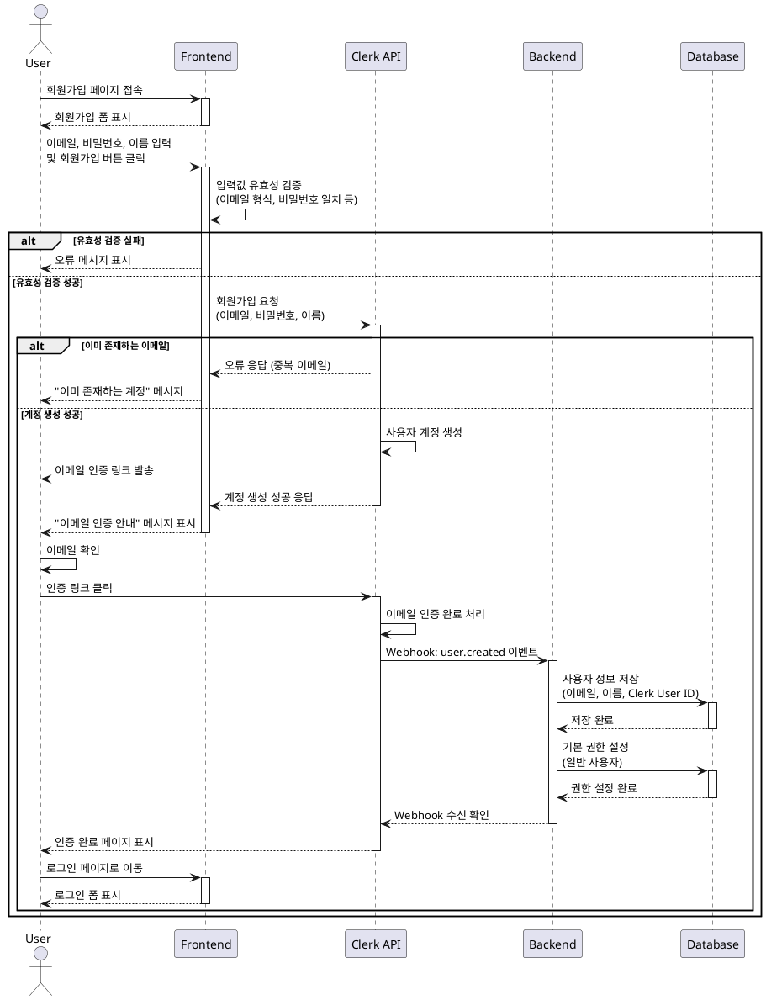

# Use Case Specification: 회원가입 (User Registration)

## Primary Actor
일반 사용자 (Guest User)

## Precondition
- 사용자가 회원가입 페이지에 접근할 수 있는 인터넷 연결이 가능한 상태
- 사용자가 유효한 이메일 주소를 보유하고 있음
- 사용자가 아직 시스템에 등록되지 않은 상태

## Trigger
사용자가 회원가입 페이지에 접속하여 계정 생성을 시작함

## Main Scenario

1. 사용자가 회원가입 페이지 URL에 접속한다
2. 시스템이 회원가입 폼을 표시한다
3. 사용자가 이메일 주소를 입력한다
4. 사용자가 비밀번호를 입력한다
5. 사용자가 비밀번호 확인을 입력한다
6. 사용자가 이름을 입력한다 (선택사항)
7. 사용자가 "회원가입" 버튼을 클릭한다
8. 시스템(FE)이 입력값 유효성을 검증한다
   - 이메일 형식 검증
   - 비밀번호 길이 및 복잡도 검증
   - 비밀번호 일치 여부 검증
9. 시스템(FE)이 Clerk API로 회원가입 요청을 전송한다
10. Clerk가 사용자 계정을 생성한다
11. Clerk가 사용자 이메일로 인증 링크를 발송한다
12. 시스템(FE)이 "이메일 인증 안내" 메시지를 표시한다
13. 사용자가 이메일에서 인증 링크를 클릭한다
14. Clerk가 이메일 인증을 완료 처리한다
15. Clerk가 Webhook을 통해 user.created 이벤트를 백엔드로 전송한다
16. 시스템(BE)이 사용자 정보를 데이터베이스에 저장한다
17. 시스템(BE)이 기본 사용자 권한(일반 사용자)을 설정한다
18. 시스템(FE)이 사용자를 로그인 페이지로 리다이렉트한다

## Edge Cases

### EC-1: 이메일 형식 오류
- **Condition**: 사용자가 잘못된 이메일 형식을 입력
- **Handling**: FE에서 즉시 오류 메시지 표시, 재입력 요청

### EC-2: 비밀번호 불일치
- **Condition**: 비밀번호와 비밀번호 확인 값이 일치하지 않음
- **Handling**: FE에서 오류 메시지 표시, 재입력 요청

### EC-3: 이미 존재하는 이메일
- **Condition**: 가입하려는 이메일이 이미 시스템에 등록됨
- **Handling**: Clerk에서 오류 반환, "이미 존재하는 계정" 메시지 표시, 로그인 페이지로 안내

### EC-4: 이메일 인증 미완료 상태에서 로그인 시도
- **Condition**: 사용자가 이메일 인증을 완료하지 않고 로그인 시도
- **Handling**: "이메일 인증 필요" 메시지 표시, 인증 이메일 재발송 옵션 제공

### EC-5: Webhook 전송 실패
- **Condition**: Clerk에서 BE로 user.created Webhook 전송 실패
- **Handling**: BE에서 사용자 데이터 누락, Webhook 재시도 로직 또는 수동 동기화 필요

### EC-6: 네트워크 연결 오류
- **Condition**: 회원가입 요청 중 네트워크 연결 끊김
- **Handling**: 요청 타임아웃 처리, "네트워크 오류" 메시지 표시, 재시도 안내

### EC-7: 비밀번호 복잡도 미달
- **Condition**: 비밀번호가 최소 요구사항(길이, 복잡도)을 충족하지 못함
- **Handling**: FE에서 즉시 오류 메시지 및 요구사항 안내 표시

## Business Rules

### BR-1: 이메일 형식
- 유효한 이메일 형식(RFC 5322 표준)을 따라야 함
- 중복된 이메일 주소는 허용하지 않음

### BR-2: 비밀번호 정책
- 최소 8자 이상
- 영문, 숫자, 특수문자 조합 권장
- Clerk의 기본 보안 정책을 따름

### BR-3: 이메일 인증 필수
- 모든 신규 사용자는 이메일 인증을 완료해야 로그인 가능
- 인증 링크는 발송 후 24시간 동안 유효

### BR-4: 기본 권한 설정
- 신규 가입 사용자는 기본적으로 "일반 사용자" 권한을 부여받음
- 관리자 권한은 시스템 관리자가 수동으로 부여

### BR-5: 개인정보 보호
- 비밀번호는 암호화되어 저장됨 (Clerk에서 처리)
- 사용자 개인정보는 관련 법규(GDPR, PIPA 등)에 따라 처리됨

### BR-6: 계정 생성 제한
- 동일 IP에서 단시간 내 다수 계정 생성 시도 시 제한 가능 (Clerk Rate Limiting)

## Sequence Diagram

