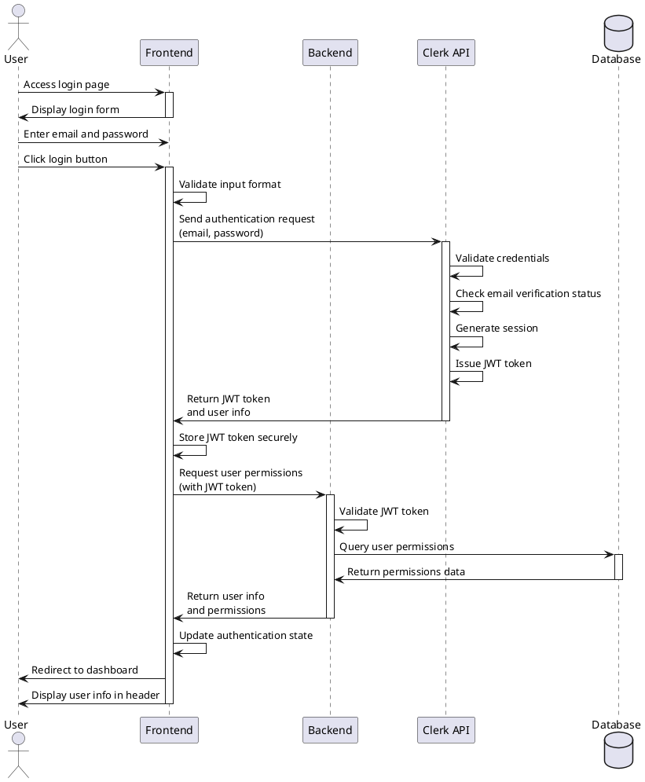

# Use Case 002: Login

## Overview
User authentication to access the university data visualization dashboard system.

---

## Primary Actor
- Registered User (email verified)

---

## Precondition
- User has completed registration and email verification
- User has valid credentials (email and password)
- Login page is accessible

---

## Trigger
User navigates to the login page and attempts to access the dashboard system.

---

## Main Scenario

1. User accesses login page via URL
2. User enters email address in email field
3. User enters password in password field
4. User clicks login button
5. System validates input format on client side
6. System sends authentication request to Clerk API
7. Clerk validates credentials and verifies email verification status
8. Clerk generates session and issues JWT token
9. System stores JWT token securely in client
10. System retrieves user information and permissions
11. System redirects to dashboard home page
12. User information displays in header area

**Result**: User successfully logged in and can access dashboard features.

---

## Edge Cases

### Invalid Credentials
- **Scenario**: User enters incorrect email or password
- **Handling**: Display error message "Invalid email or password", allow retry

### Unverified Email
- **Scenario**: User attempts login before completing email verification
- **Handling**: Display verification pending message, provide option to resend verification email

### Account Locked
- **Scenario**: Multiple failed login attempts trigger account lock
- **Handling**: Display account locked message, guide user to password reset

### Expired Session
- **Scenario**: User attempts to access with expired session token
- **Handling**: Automatically logout, redirect to login page with session expired message

### Network Error
- **Scenario**: Request fails due to network connectivity issues
- **Handling**: Display error message, provide retry button

### Concurrent Sessions
- **Scenario**: User logs in from multiple devices simultaneously
- **Handling**: Apply session policy (maintain session or terminate previous session based on configuration)

---

## Business Rules

### BR-001: Authentication Provider
- All authentication processes must use Clerk API
- Direct database authentication is prohibited

### BR-002: Session Management
- JWT token must be stored securely (httpOnly cookie or secure storage)
- Token expiration follows Clerk default settings
- Expired tokens require re-authentication

### BR-003: Security
- Failed login attempts are tracked
- Excessive failures trigger temporary account lock
- Password must not be stored or logged in plain text

### BR-004: Email Verification Requirement
- Only email-verified accounts can login
- Unverified accounts must complete verification first

### BR-005: Authorization
- After successful login, user permissions are loaded
- Access to features is controlled by user role (admin/regular user)

---

## Sequence Diagram

