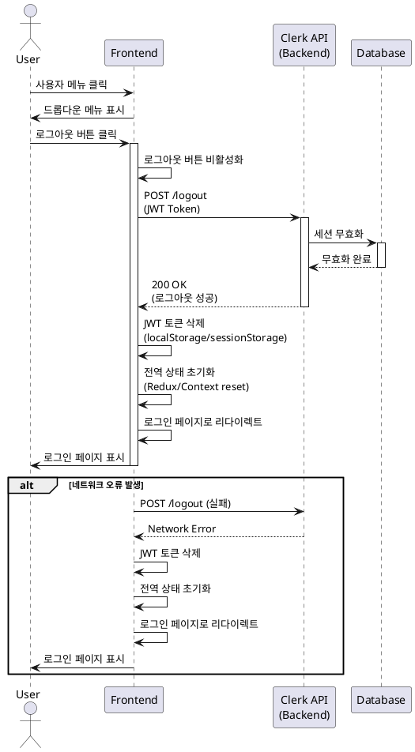

# Use Case Specification: 로그아웃 (UC-003)

## Overview
사용자가 시스템에서 안전하게 로그아웃하여 세션을 종료하는 기능

---

## Primary Actor
인증된 사용자 (Authenticated User)

---

## Precondition
- 사용자가 로그인된 상태여야 함
- 유효한 세션이 존재해야 함

---

## Trigger
사용자가 헤더 영역의 사용자 메뉴에서 로그아웃 버튼을 클릭

---

## Main Scenario

1. 사용자가 헤더 영역의 사용자 메뉴를 클릭
2. 드롭다운 메뉴에서 로그아웃 버튼을 클릭
3. 시스템이 Clerk 로그아웃 함수를 호출
4. Clerk이 서버에서 세션을 무효화
5. 시스템이 클라이언트의 로컬 저장소에서 JWT 토큰 삭제
6. 시스템이 전역 상태(Redux/Context 등)를 초기화
7. 시스템이 사용자를 로그인 페이지로 리다이렉트
8. (선택사항) 로그아웃 성공 메시지 표시

**Expected Result**: 사용자가 로그아웃되고 로그인 페이지로 이동

---

## Edge Cases

### EC-1: 네트워크 연결 끊김
- **상황**: 로그아웃 요청 시 네트워크 오류 발생
- **처리**:
  - 서버 요청 실패에도 불구하고 로컬 토큰 삭제
  - 전역 상태 초기화
  - 로그인 페이지로 리다이렉트
  - 사용자에게 투명하게 처리 (추가 오류 메시지 불필요)

### EC-2: 이미 만료된 세션
- **상황**: 세션이 만료된 상태에서 로그아웃 시도
- **처리**:
  - 정상적인 로그아웃 프로세스 진행
  - 로컬 데이터 삭제
  - 로그인 페이지로 리다이렉트

### EC-3: 중복 로그아웃 요청
- **상황**: 로그아웃 처리 중 사용자가 반복 클릭
- **처리**:
  - 로그아웃 진행 중 버튼 비활성화
  - 추가 요청 무시
  - 첫 번째 요청만 처리

### EC-4: Clerk API 오류
- **상황**: Clerk 서비스 장애 또는 타임아웃
- **처리**:
  - 로컬 토큰 및 상태 삭제 우선 실행
  - 로그인 페이지로 리다이렉트
  - 백그라운드에서 세션 정리 재시도 (선택사항)

---

## Business Rules

### BR-1: 클라이언트 우선 정책
로그아웃은 서버 응답과 관계없이 클라이언트 측에서 항상 완료되어야 함

### BR-2: 데이터 보안
로그아웃 시 모든 민감한 사용자 데이터(토큰, 세션 정보)를 로컬 저장소에서 완전히 제거해야 함

### BR-3: 상태 초기화
로그아웃 시 애플리케이션의 전역 상태를 초기 상태로 리셋하여 이전 사용자의 데이터가 남지 않도록 함

### BR-4: 리다이렉션 정책
로그아웃 후 사용자는 항상 로그인 페이지로 리다이렉트되어야 하며, 인증이 필요한 페이지 접근을 방지해야 함

### BR-5: 멱등성 보장
로그아웃 작업은 멱등성을 보장하여 여러 번 실행되어도 동일한 결과를 보장해야 함

---

## Sequence Diagram

---

## Additional Notes

### Security Considerations
- 로그아웃 후 브라우저의 뒤로가기 버튼을 통해 이전 페이지 접근 방지
- 로그아웃 시 캐시된 민감 정보 제거
- 세션 토큰의 서버 측 블랙리스트 관리 (선택사항)

### UX Considerations
- 로그아웃 프로세스는 1-2초 이내에 완료되어야 함
- 로딩 인디케이터 표시 (선택사항)
- 로그아웃 성공 메시지는 과도하지 않게 간결하게 표시

### Performance
- 로그아웃 작업은 비동기로 처리되어 UI 블로킹 방지
- 네트워크 타임아웃 설정: 5초 이내
