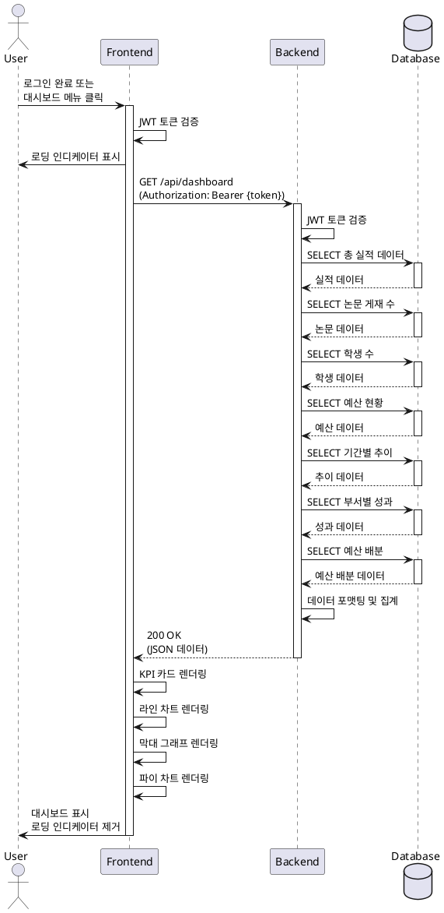
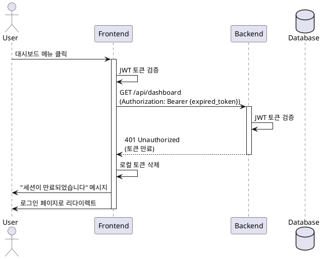
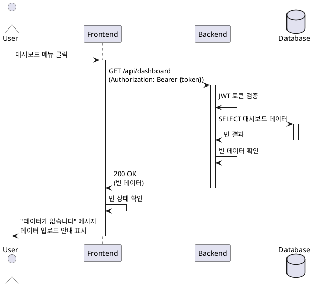

# Use Case: 메인 대시보드 조회

## Primary Actor
- 인증된 사용자 (일반 사용자 또는 관리자)

## Precondition
- 사용자가 시스템에 로그인되어 있어야 함
- 유효한 JWT 토큰을 보유하고 있어야 함

## Trigger
- 로그인 완료 후 자동 리다이렉트
- 내비게이션 메뉴에서 대시보드 메뉴 클릭

## Main Scenario

1. 사용자가 로그인을 완료하거나 대시보드 메뉴를 클릭한다
2. 시스템은 JWT 토큰의 유효성을 검증한다
3. 시스템은 로딩 인디케이터를 표시한다
4. 프론트엔드는 인증 헤더에 JWT 토큰을 포함하여 백엔드에 대시보드 데이터를 요청한다
5. 백엔드는 토큰을 검증하고 데이터베이스에서 다음 데이터를 조회한다:
   - 총 실적
   - 논문 게재 수
   - 학생 수
   - 예산 현황
   - 기간별 추이 데이터
   - 부서별 성과 데이터
   - 예산 배분 데이터
6. 백엔드는 데이터를 JSON 형식으로 포맷하여 응답한다
7. 프론트엔드는 응답 데이터를 수신하고 다음을 렌더링한다:
   - 4개의 주요 KPI 카드 (총 실적, 논문 게재 수, 학생 수, 예산 현황)
   - 기간별 추이 라인 차트
   - 부서별 성과 막대 그래프
   - 예산 배분 파이 차트
8. 시스템은 로딩 인디케이터를 제거하고 대시보드를 표시한다

## Edge Cases

### 데이터 없음
- 데이터베이스에 데이터가 없는 경우 빈 상태 메시지를 표시하고 데이터 업로드 안내를 제공한다
- 차트 영역에 "데이터가 없습니다" 메시지를 표시한다

### 토큰 만료
- JWT 토큰이 만료된 경우 자동으로 로그아웃 처리하고 로그인 페이지로 리다이렉트한다
- 토스트 메시지로 "세션이 만료되었습니다. 다시 로그인해주세요" 안내를 표시한다

### 네트워크 오류
- API 요청 실패 시 오류 메시지와 함께 재시도 버튼을 표시한다
- 3회 재시도 후에도 실패할 경우 관리자에게 문의하도록 안내한다

### 대용량 데이터
- 데이터 로딩이 지연될 경우 스켈레톤 UI를 표시하여 사용자 경험을 개선한다
- 타임아웃(30초) 발생 시 오류 메시지를 표시한다

### 차트 렌더링 오류
- 차트 라이브러리 오류 발생 시 데이터 테이블 형식으로 대체 표시한다
- 콘솔에 오류를 로깅하고 사용자에게는 "일부 차트를 표시할 수 없습니다" 안내를 표시한다

### 권한 오류
- 권한이 없는 사용자가 접근 시도 시 403 오류를 반환하고 접근 불가 메시지를 표시한다
- 적절한 페이지로 리다이렉트한다

### API 서버 다운
- 백엔드 서버가 응답하지 않을 경우 오류 페이지를 표시한다
- 관리자에게 알림을 전송하고 사용자에게는 잠시 후 다시 시도하도록 안내한다

## Business Rules

### BR-1: 인증 필수
- 대시보드 조회는 인증된 사용자만 접근 가능하다

### BR-2: 실시간 데이터
- 대시보드는 항상 최신 데이터를 표시해야 한다
- 데이터는 페이지 로드 시점의 최신 상태를 반영한다

### BR-3: 데이터 보안
- JWT 토큰은 모든 API 요청에 포함되어야 한다
- 토큰이 없거나 유효하지 않은 경우 401 Unauthorized를 반환한다

### BR-4: 데이터 정확성
- 모든 KPI 수치는 데이터베이스의 집계 결과를 정확하게 반영해야 한다
- 반올림이 필요한 경우 소수점 둘째 자리까지 표시한다

### BR-5: 성능 기준
- 페이지 초기 로딩은 3초 이내에 완료되어야 한다
- 차트 렌더링은 1초 이내에 완료되어야 한다

### BR-6: 사용자 경험
- 로딩 중에는 스켈레톤 UI 또는 로딩 인디케이터를 표시해야 한다
- 오류 발생 시 사용자 친화적인 메시지를 표시해야 한다

## Sequence Diagram

## Error Scenario: 토큰 만료

## Error Scenario: 데이터 없음

