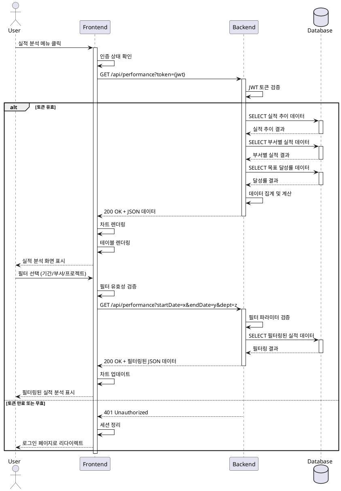

# Use Case: 실적 분석 조회 (Performance Analysis View)

## Primary Actor
- 인증된 사용자 (Authenticated User)

## Precondition
- 사용자가 시스템에 로그인되어 있어야 함
- 유효한 JWT 토큰을 보유하고 있어야 함
- 데이터베이스에 실적 데이터가 존재해야 함

## Trigger
- 사용자가 사이드바 또는 내비게이션에서 "실적 분석" 메뉴를 클릭

## Main Scenario

### 1. 페이지 접근
- 사용자가 실적 분석 메뉴를 클릭
- 시스템이 인증 상태를 확인
- 실적 분석 페이지로 이동

### 2. 기본 데이터 조회
- FE가 JWT 토큰과 함께 BE API 요청 전송
- BE가 토큰 검증 수행
- BE가 DB에 실적 데이터 조회 쿼리 실행
  - 기간별 실적 추이 데이터
  - 부서별/프로젝트별 실적 비교 데이터
  - 목표 대비 달성률 데이터
- BE가 데이터 집계 및 계산 수행
- BE가 JSON 형식으로 응답 데이터 전송

### 3. 데이터 시각화
- FE가 응답 데이터 수신
- 다음 차트들을 렌더링:
  - 기간별 실적 추이 라인 차트
  - 부서별/프로젝트별 비교 막대 그래프
  - 목표 대비 달성률 게이지 차트 또는 프로그레스 바
- 현재 필터 상태 표시

### 4. 필터 적용 (선택사항)
- 사용자가 필터 옵션 선택:
  - 기간 필터 (시작일, 종료일)
  - 부서 필터
  - 프로젝트 필터
- FE가 필터 파라미터와 함께 새로운 API 요청 전송
- BE가 필터링된 데이터 조회 및 응답
- FE가 차트 및 테이블 업데이트
- 적용된 필터 상태를 UI에 표시

## Edge Cases

### 인증 관련
- **토큰 만료**: 자동으로 로그인 페이지로 리다이렉트, 세션 만료 메시지 표시
- **권한 부족**: 접근 불가 메시지 표시, 메인 대시보드로 리다이렉트

### 데이터 관련
- **데이터 없음**: 빈 상태 메시지 표시, 데이터 업로드 페이지로 이동 링크 제공
- **필터 조건 불일치**: "필터 조건에 맞는 데이터가 없습니다" 메시지 표시, 필터 초기화 버튼 제공
- **잘못된 필터 조합**: 클라이언트 측 유효성 검증 수행, 오류 메시지 표시

### 성능 관련
- **대용량 데이터**: 로딩 인디케이터 표시, 페이지네이션 또는 가상 스크롤 적용
- **차트 렌더링 실패**: 오류 메시지 표시, 데이터 테이블 형식으로 대체 표시

### 네트워크 관련
- **API 요청 실패**: 오류 메시지 표시, 재시도 버튼 제공
- **네트워크 타임아웃**: 타임아웃 메시지 표시, 재시도 옵션 제공

## Business Rules

### BR-1: 데이터 접근 권한
- 모든 인증된 사용자는 실적 분석 조회 권한을 가짐
- 각 사용자는 본인이 속한 부서의 데이터만 조회 가능 (부서별 권한 관리 적용 시)

### BR-2: 기간 필터 제약
- 기간 필터의 시작일은 종료일보다 앞서야 함
- 최대 조회 기간은 5년을 초과할 수 없음
- 기본 조회 기간은 최근 1년

### BR-3: 목표 달성률 계산
- 달성률 = (실제 실적 / 목표 실적) × 100
- 목표가 설정되지 않은 경우 "목표 미설정"으로 표시
- 달성률이 100% 이상인 경우 녹색, 80-99% 황색, 80% 미만 적색으로 표시

### BR-4: 데이터 집계 기준
- 기간별 데이터는 월 단위로 집계
- 부서별/프로젝트별 데이터는 선택된 기간의 합계로 표시
- 모든 금액은 원화(KRW) 기준

### BR-5: 필터 조합 규칙
- 모든 필터는 AND 조건으로 결합
- 필터 미선택 시 전체 데이터 조회
- 필터 적용 후 URL 파라미터로 상태 유지 (새로고침 시 필터 상태 보존)

## Sequence Diagram

