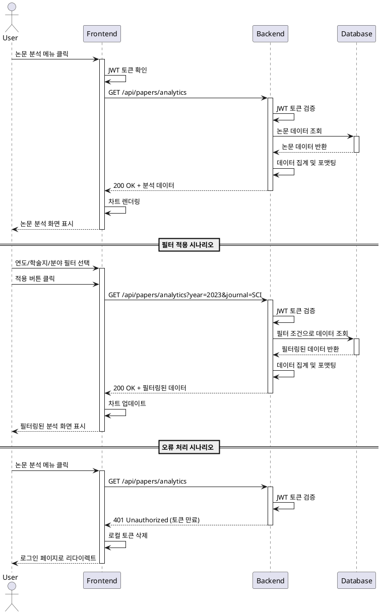

# Use Case Specification: 논문 분석 조회

## Primary Actor
- 인증된 사용자 (일반 사용자 또는 관리자)

## Precondition
- 사용자가 로그인되어 있어야 함
- 유효한 JWT 세션 토큰을 보유하고 있어야 함
- 논문 데이터가 데이터베이스에 존재해야 함

## Trigger
- 사용자가 사이드바 또는 내비게이션에서 "논문 분석" 메뉴를 클릭

## Main Scenario

### 1. 페이지 접근
- 사용자가 사이드바에서 "논문 분석" 메뉴 클릭
- 프론트엔드가 JWT 토큰을 확인하여 인증 상태 검증
- 논문 분석 페이지로 라우팅

### 2. 초기 데이터 로드
- 프론트엔드가 백엔드 API에 논문 분석 데이터 요청 (GET /api/papers/analytics)
- 요청 헤더에 JWT 토큰 포함
- 백엔드가 토큰 유효성 검증
- 데이터베이스에서 전체 논문 데이터 조회
  - 연도별 논문 게재 수
  - 학술지별 분류 통계
  - 분야별 논문 통계
- 데이터 집계 및 응답 포맷팅
- 프론트엔드가 데이터 수신 후 차트 렌더링

### 3. 필터 적용 (Optional)
- 사용자가 연도 필터 선택 (예: 2023년)
- 사용자가 학술지 필터 선택 (예: SCI, KCI)
- 사용자가 분야 필터 선택 (예: 공학, 의학)
- "적용" 버튼 클릭
- 프론트엔드가 필터 파라미터와 함께 API 재요청 (GET /api/papers/analytics?year=2023&journal=SCI&field=engineering)
- 백엔드가 필터 조건에 맞는 데이터만 조회
- 필터링된 데이터로 차트 업데이트

### 4. 데이터 시각화
- 연도별 논문 게재 수: 라인 차트 또는 막대 그래프로 표시
- 학술지별 분류: 파이 차트로 비율 표시
- 분야별 논문 통계: 막대 그래프로 비교 표시
- 적용된 필터 조건을 뱃지 형태로 화면에 표시

## Edge Cases

### 1. 데이터 없음
- **상황**: 필터 조건에 맞는 논문 데이터가 없는 경우
- **처리**: 빈 상태 메시지 표시 ("조건에 맞는 논문 데이터가 없습니다")

### 2. 특정 연도 데이터 부재
- **상황**: 특정 연도에 논문 게재가 없는 경우
- **처리**: 차트에서 해당 연도의 값을 0으로 표시

### 3. 토큰 만료
- **상황**: 요청 중 JWT 토큰이 만료된 경우
- **처리**: 401 Unauthorized 응답 수신 시 자동 로그아웃 후 로그인 페이지로 리다이렉트

### 4. 네트워크 오류
- **상황**: API 요청 중 네트워크 연결 끊김 또는 서버 오류
- **처리**: 오류 메시지 표시 및 "재시도" 버튼 제공

### 5. 차트 렌더링 실패
- **상황**: 차트 라이브러리 오류로 시각화 실패
- **처리**: 데이터 테이블 형태로 대체 표시

### 6. 대용량 데이터
- **상황**: 조회 결과가 너무 많아 로딩이 느린 경우
- **처리**: 로딩 인디케이터 표시, 페이지네이션 또는 가상 스크롤 적용

## Business Rules

### BR-1: 접근 권한
- 로그인한 모든 사용자(일반 사용자, 관리자)가 논문 분석 페이지에 접근 가능

### BR-2: 데이터 범위
- 기본적으로 전체 연도의 논문 데이터를 표시
- 필터를 통해 특정 범위로 제한 가능

### BR-3: 필터 조합
- 연도, 학술지, 분야 필터는 독립적으로 또는 조합하여 적용 가능
- 여러 필터가 적용되면 AND 조건으로 데이터 필터링

### BR-4: 데이터 정확성
- 데이터베이스에 저장된 논문 정보만 표시
- 실시간 데이터가 아닌 마지막 업로드 기준 데이터 제공

### BR-5: 성능 최적화
- API 응답 시간은 3초 이내여야 함
- 대용량 데이터의 경우 서버 사이드에서 집계 수행

## Sequence Diagram

