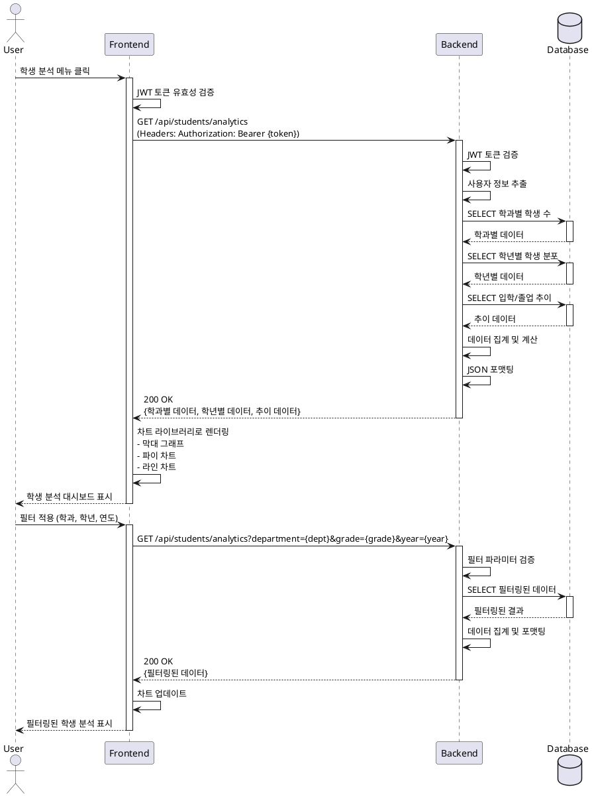

# Use Case Specification: 학생 분석 조회 (Student Analysis Inquiry)

## UC-007: 학생 분석 조회

### Primary Actor
- 인증된 대학교 관리자 또는 일반 사용자

### Precondition
- 사용자가 시스템에 로그인되어 있음
- 사용자의 JWT 토큰이 유효함
- 데이터베이스에 학생 데이터가 존재함

### Trigger
- 사용자가 사이드바에서 "학생 분석" 메뉴를 클릭

### Main Scenario

**Step 1: 페이지 접근**
- 사용자가 사이드바에서 학생 분석 메뉴 클릭
- 시스템이 학생 분석 페이지로 라우팅

**Step 2: 인증 확인**
- 프론트엔드가 JWT 토큰 유효성 검증
- 유효한 토큰이 없으면 로그인 페이지로 리다이렉트

**Step 3: 초기 데이터 요청**
- 프론트엔드가 백엔드 API에 학생 분석 데이터 요청
- 요청 헤더에 JWT 토큰 포함
- 필터 파라미터 포함 (학과, 학년, 연도)

**Step 4: 백엔드 처리**
- 백엔드가 JWT 토큰 검증
- 토큰에서 사용자 정보 추출
- 필터 조건에 따라 SQL 쿼리 생성
- 데이터베이스에서 다음 데이터 조회:
  - 학과별 학생 수 통계
  - 학년별 학생 분포 통계
  - 입학/졸업 연도별 추이 데이터

**Step 5: 데이터 집계**
- 조회된 데이터를 필터 조건에 맞게 집계
- 통계 계산 수행 (합계, 평균, 비율 등)
- JSON 형식으로 데이터 포맷팅

**Step 6: 응답 전송**
- 백엔드가 집계된 데이터를 프론트엔드로 전송
- HTTP 200 상태 코드와 함께 데이터 반환

**Step 7: 데이터 시각화**
- 프론트엔드가 응답 데이터 수신
- 다음 차트 렌더링:
  - 학과별 학생 수 막대 그래프
  - 학년별 분포 파이 차트 또는 도넛 차트
  - 입학/졸업 추이 라인 차트
- 적용된 필터 상태 표시

**Step 8: 필터 적용 (선택사항)**
- 사용자가 학과/학년/연도 필터 선택
- Step 3부터 반복하여 필터링된 데이터 조회

### Edge Cases

**EC-1: 데이터 없음**
- 필터 조건에 맞는 학생 데이터가 없는 경우
- 빈 상태 메시지 표시: "조회된 학생 데이터가 없습니다"
- 필터 초기화 버튼 제공

**EC-2: 토큰 만료**
- JWT 토큰이 만료된 경우
- 자동 로그아웃 처리
- 로그인 페이지로 리다이렉트

**EC-3: 네트워크 오류**
- API 요청이 실패한 경우
- 오류 메시지 표시: "데이터를 불러오는 중 오류가 발생했습니다"
- 재시도 버튼 제공

**EC-4: 차트 렌더링 실패**
- 차트 라이브러리 오류 발생 시
- 데이터 테이블로 대체 표시
- 오류 로그 기록

**EC-5: 특정 학과 학생 수 0명**
- 특정 학과에 학생이 없는 경우
- 막대 그래프에 0으로 표시
- 파이 차트에서는 해당 항목 제외 또는 0% 표시

**EC-6: 대용량 데이터**
- 조회 데이터가 많아 로딩이 느린 경우
- 로딩 인디케이터 또는 스켈레톤 UI 표시
- 페이지네이션 또는 가상 스크롤 적용 고려

**EC-7: 권한 부족**
- 사용자 권한이 불충분한 경우
- HTTP 403 오류 반환
- "접근 권한이 없습니다" 메시지 표시

### Business Rules

**BR-1: 데이터 접근 권한**
- 모든 인증된 사용자는 학생 분석 데이터를 조회할 수 있음
- 개인정보는 표시하지 않고 통계 정보만 제공

**BR-2: 필터 기본값**
- 학과 필터: 전체 (기본값)
- 학년 필터: 전체 (기본값)
- 연도 필터: 현재 연도 (기본값)

**BR-3: 데이터 정합성**
- 학생 수는 정수로 표시
- 비율은 소수점 첫째 자리까지 표시
- 합계는 자동으로 계산되어 표시

**BR-4: 필터 조합**
- 다중 필터 조합 가능 (학과 + 학년 + 연도)
- 필터 적용 시 AND 조건으로 동작
- 필터 초기화 시 모든 필터가 기본값으로 복원

**BR-5: 데이터 캐싱**
- 동일한 필터 조건에 대한 재요청 시 캐시 활용 (선택사항)
- 캐시 유효 시간: 5분
- 데이터 업로드 발생 시 캐시 무효화

**BR-6: 차트 표시 우선순위**
- 학과별 학생 수: 막대 그래프 (내림차순 정렬)
- 학년별 분포: 파이 차트 또는 도넛 차트
- 입학/졸업 추이: 라인 차트 (시간순 정렬)

**BR-7: 오류 처리**
- 모든 오류는 사용자 친화적 메시지로 표시
- 서버 오류 시 관리자에게 자동 알림 (선택사항)
- 클라이언트 오류는 로컬에서 처리

---

## Sequence Diagram

---

## Alternative Scenarios

### AS-1: 네트워크 오류 발생
**Divergence Point:** Step 3 (초기 데이터 요청)
- API 요청이 타임아웃 또는 실패
- 프론트엔드가 오류 메시지 표시
- "재시도" 버튼 제공
- 사용자가 재시도 버튼 클릭 시 Step 3부터 재시도

### AS-2: 빈 데이터셋
**Divergence Point:** Step 5 (데이터 집계)
- 조회된 데이터가 없음
- 백엔드가 빈 배열 반환 (HTTP 200)
- 프론트엔드가 빈 상태 UI 표시
- "데이터 업로드" 페이지로 이동 링크 제공

### AS-3: 부분적 데이터 로드 실패
**Divergence Point:** Step 4 (백엔드 처리)
- 일부 쿼리만 성공 (예: 학과별 데이터만 조회 성공)
- 성공한 데이터만 반환
- 실패한 차트는 오류 메시지 표시
- 성공한 차트는 정상 렌더링

---

## Notes
- 개인정보 보호를 위해 개별 학생 정보는 표시하지 않음
- 통계 데이터만 집계하여 제공
- 실시간 데이터가 아닌 마지막 업로드 시점의 데이터 제공
- 필터 상태는 URL 쿼리 파라미터로 관리하여 페이지 새로고침 시에도 유지
