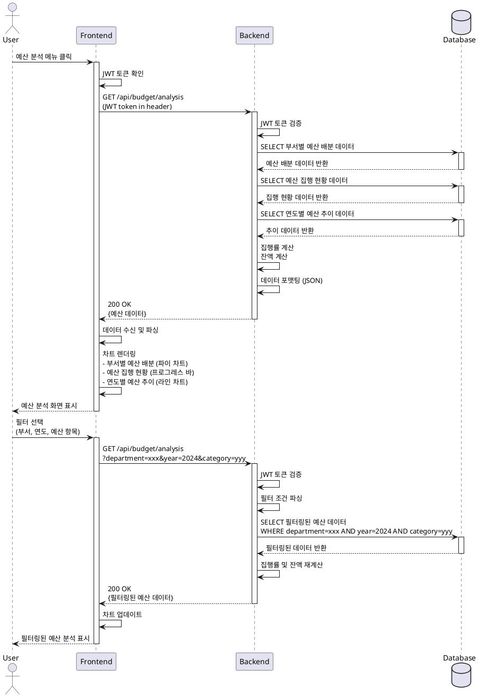

# Use Case Specification: 예산 분석 조회

## Primary Actor
일반 사용자 (로그인된 대학교 관계자)

## Precondition
- 사용자가 시스템에 로그인되어 있어야 함
- 유효한 JWT 토큰을 보유하고 있어야 함
- 데이터베이스에 예산 관련 데이터가 존재해야 함

## Trigger
사용자가 사이드바 또는 내비게이션에서 "예산 분석" 메뉴를 클릭

## Main Scenario

### 1. 페이지 접근
- 사용자가 예산 분석 메뉴 클릭
- 시스템이 JWT 토큰 검증을 통해 인증 상태 확인
- 예산 분석 페이지 로드

### 2. 데이터 요청
- 클라이언트가 백엔드 API에 예산 데이터 요청
- 인증 헤더에 JWT 토큰 포함하여 전송
- 선택된 필터 파라미터 함께 전송 (부서, 연도, 예산 항목)

### 3. 데이터 처리
- 백엔드가 토큰 검증
- 필터 조건에 따라 데이터베이스 쿼리 실행
  - 부서별 예산 배분 데이터
  - 예산 집행 현황 데이터
  - 연도별 예산 추이 데이터
- 데이터 집계 및 계산
  - 집행률 계산 (집행액 / 총예산 × 100)
  - 잔액 계산 (총예산 - 집행액)
- 응답 데이터 JSON 포맷으로 변환

### 4. 데이터 시각화
- 클라이언트가 데이터 수신
- 차트 렌더링:
  - 부서별 예산 배분: 파이 차트 또는 트리맵
  - 예산 집행 현황: 프로그레스 바 또는 게이지 차트
  - 연도별 예산 추이: 라인 차트
- 필터 적용 상태 표시

### 5. 필터 적용 (선택사항)
- 사용자가 필터 옵션 선택:
  - 부서 필터 (드롭다운 또는 다중 선택)
  - 연도 필터 (연도 선택기)
  - 예산 항목 필터 (카테고리 선택)
- 필터 적용 버튼 클릭
- 시스템이 새로운 필터 조건으로 데이터 재요청
- 차트 및 테이블 업데이트

## Edge Cases

### 데이터 부재
- **상황**: 필터 조건에 맞는 데이터가 없음
- **처리**: 빈 상태 메시지 표시, 필터 초기화 버튼 제공

### 예산 초과 경고
- **상황**: 예산 집행률이 100% 초과
- **처리**: 경고 아이콘 및 색상(빨강)으로 강조 표시, 초과 금액 표시

### 인증 오류
- **상황**: JWT 토큰 만료 또는 유효하지 않음
- **처리**: 자동 로그아웃 후 로그인 페이지로 리다이렉트

### 네트워크 오류
- **상황**: API 요청 실패 또는 타임아웃
- **처리**: 오류 메시지 표시, 재시도 버튼 제공

### 차트 렌더링 실패
- **상황**: 차트 라이브러리 오류 또는 데이터 형식 불일치
- **처리**: 오류 메시지 표시, 데이터 테이블로 대체 표시

### 대용량 데이터
- **상황**: 조회 데이터가 과도하게 많음
- **처리**: 로딩 인디케이터 표시, 페이지네이션 또는 무한 스크롤 적용

## Business Rules

### BR-1: 인증 요구사항
- 모든 예산 데이터 조회는 인증된 사용자만 가능
- 유효한 JWT 토큰 필수

### BR-2: 예산 집행률 계산
- 집행률 = (집행액 / 총예산) × 100
- 소수점 둘째 자리까지 표시

### BR-3: 잔액 계산
- 잔액 = 총예산 - 집행액
- 음수일 경우 초과 집행으로 표시

### BR-4: 예산 초과 경고
- 집행률 90% 이상: 주의 상태 (노란색)
- 집행률 100% 이상: 경고 상태 (빨간색)

### BR-5: 데이터 필터링
- 필터 미선택 시 전체 데이터 조회
- 다중 필터 조합 가능
- 연도 필터 기본값: 현재 연도

### BR-6: 데이터 갱신
- 데이터 업로드 시 자동 갱신
- 수동 새로고침 버튼 제공

### BR-7: 금액 표시
- 금액은 천 단위 콤마 구분
- 단위: 원 (KRW)

## Sequence Diagram

