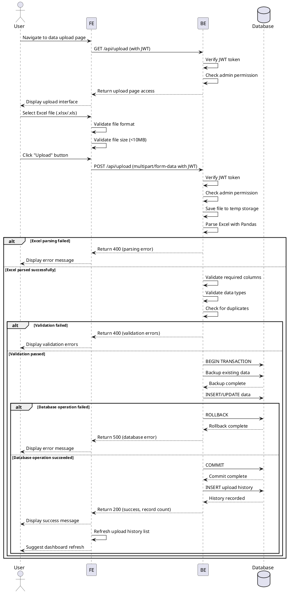

# Use Case Specification: Excel Data Upload

## Primary Actor
Administrator

## Precondition
- User is logged in with administrator privileges
- User has access to the data upload menu

## Trigger
User clicks on the "Data Upload" menu in the sidebar to upload new Excel data to the system

## Main Scenario

1. User navigates to the data upload page
2. System verifies user authentication and administrator role
3. System displays the file upload interface (drag-and-drop or file selector)
4. User selects an Excel file (.xlsx or .xls) or drags it to the upload area
5. User clicks the "Upload" button
6. System validates the file format and size (max 10MB)
7. System sends the file to the backend via multipart/form-data
8. Backend validates the JWT token and administrator permission
9. Backend temporarily stores the uploaded file
10. Backend parses the Excel file using Pandas
11. Backend validates data structure (required columns, data types, formats)
12. Backend checks for duplicate data
13. Backend starts a database transaction
14. Backend backs up existing data or creates a version
15. Backend inserts or updates data in the database
16. Backend commits the transaction
17. Backend records upload history (timestamp, user, filename, result)
18. System displays success message with processed record count
19. System updates the upload history list
20. System suggests refreshing the dashboard to view new data

## Edge Cases

### Invalid File Format
- User uploads non-Excel file (e.g., .pdf, .txt)
- System validates file extension before upload
- System displays error message: "Invalid file format. Please upload .xlsx or .xls files only"

### File Size Exceeded
- User uploads file larger than 10MB
- System checks file size client-side before upload
- System displays error message: "File size exceeds 10MB limit"

### Empty File
- User uploads Excel file with no data rows
- Backend detects empty data after parsing
- System displays error message: "File contains no data"

### Missing Required Columns
- Excel file lacks mandatory columns
- Backend validates column headers
- System displays error message with list of required columns
- Example: "Missing required columns: [StudentID, Name, Department]"

### Data Type Mismatch
- Data in columns doesn't match expected type (e.g., text in numeric field)
- Backend validates each row during parsing
- System displays error message with row number and expected format
- Example: "Row 15: Age field must be numeric"

### Duplicate Data
- Uploaded data contains records that already exist
- Backend checks for duplicates using primary keys
- System displays warning message
- System offers options: "Overwrite existing data" or "Skip duplicates"

### Large File Processing Time
- File contains thousands of rows
- System displays progress indicator during upload
- Backend processes asynchronously if needed
- System sends notification upon completion

### Network Interruption
- Connection lost during upload
- System implements retry logic
- System allows resuming partial uploads if possible
- System displays error message: "Upload interrupted. Please try again"

### Concurrent Uploads
- Multiple administrators attempt simultaneous uploads
- System queues upload requests
- System limits concurrent uploads to prevent conflicts
- System displays queue position to user

### Database Transaction Failure
- Error occurs during data insertion
- System rolls back transaction automatically
- System preserves previous data state
- System logs error details for debugging
- System displays error message: "Database error occurred. Data not saved. Please contact support"

## Business Rules

### BR-1: Access Control
Only users with administrator role can access the data upload feature

### BR-2: File Format
Accepted file formats are .xlsx and .xls only

### BR-3: File Size Limit
Maximum upload file size is 10MB

### BR-4: Data Validation
All uploaded data must pass validation checks before being saved to database:
- Required columns must be present
- Data types must match schema definitions
- No null values in mandatory fields

### BR-5: Transaction Integrity
All data changes must be wrapped in database transactions to ensure atomicity

### BR-6: Audit Trail
Every upload attempt must be logged with:
- Upload timestamp
- Uploader user ID and name
- Original filename
- Processing result (success/failure)
- Number of records processed

### BR-7: Data Backup
Before inserting new data, the system must create a backup or version of existing data for recovery purposes

### BR-8: Duplicate Handling
When duplicates are detected, the system must:
- Notify the user
- Provide options to overwrite or skip
- Default to skip to prevent accidental data loss

### BR-9: Error Reporting
All validation and processing errors must be clearly communicated to the user with:
- Error description
- Location of error (row/column if applicable)
- Suggested resolution

### BR-10: Performance
File processing should complete within reasonable time:
- Files under 1MB: within 10 seconds
- Files 1-5MB: within 30 seconds
- Files 5-10MB: may require asynchronous processing with notification

## Sequence Diagram

