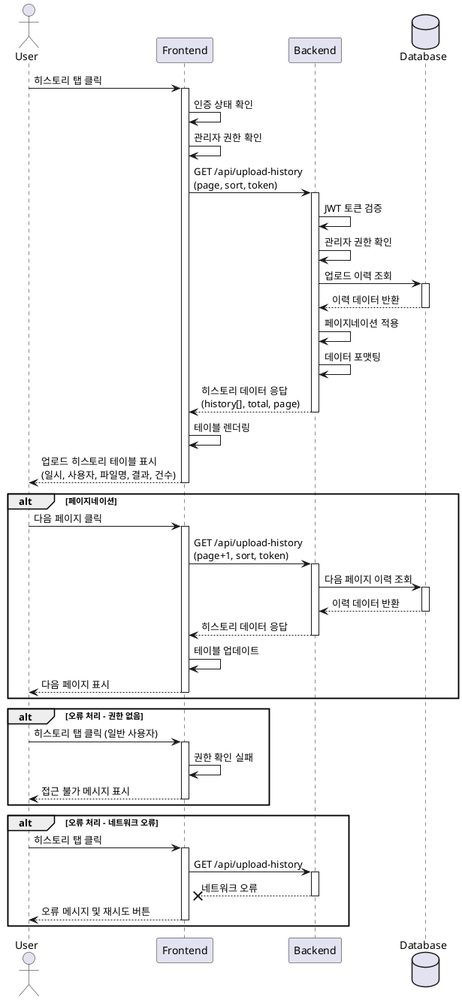

# Use Case Specification: 업로드 히스토리 조회

## 1. Overview

**Use Case ID**: UC-010
**Use Case Name**: 업로드 히스토리 조회 (Upload History Inquiry)
**Primary Actor**: 관리자 (Administrator)
**Scope**: 대학교 데이터 시각화 대시보드 시스템

## 2. Precondition

- 사용자가 시스템에 로그인되어 있어야 함
- 사용자가 관리자 권한을 보유해야 함
- 데이터 업로드 페이지에 접근 가능해야 함

## 3. Trigger

사용자가 데이터 업로드 페이지에서 히스토리 탭을 클릭

## 4. Main Scenario

1. 사용자가 데이터 업로드 페이지의 히스토리 탭을 클릭
2. 시스템이 사용자 인증 상태 및 관리자 권한 확인
3. 시스템이 백엔드 API에 업로드 히스토리 데이터 요청 (페이지 번호, 정렬 조건 포함)
4. 백엔드가 JWT 토큰 검증 및 관리자 권한 확인
5. 데이터베이스에서 업로드 이력 조회
   - 업로드 일시
   - 업로드한 사용자
   - 파일명
   - 처리 결과 (성공/실패)
   - 처리된 데이터 건수
6. 백엔드가 페이지네이션 적용 후 데이터 포맷팅
7. 프론트엔드가 응답 데이터를 수신하여 테이블 형태로 렌더링
8. 사용자에게 업로드 히스토리 테이블 표시
   - 업로드 일시 (날짜/시간)
   - 업로드 사용자명
   - 파일명
   - 처리 결과 (성공/실패 뱃지)
   - 처리된 데이터 건수
9. 페이지네이션 컨트롤 표시

**Alternative Flow 1: 페이지네이션**
- 4a. 사용자가 다음 페이지 버튼 클릭
- 4b. 시스템이 해당 페이지의 히스토리 데이터 요청
- 4c. Main Scenario 5단계로 복귀

**Alternative Flow 2: 필터 적용**
- 4a. 사용자가 검색 또는 필터 조건 입력
- 4b. 시스템이 필터 조건과 함께 히스토리 데이터 요청
- 4c. Main Scenario 5단계로 복귀

## 5. Postcondition

**Success**: 업로드 히스토리가 테이블 형태로 정상 표시됨
**Failure**: 오류 메시지 표시 및 이전 상태 유지

## 6. Edge Cases

### 6.1 업로드 이력 없음
- **상황**: 시스템에 업로드 이력이 하나도 없는 경우
- **처리**: 빈 상태 메시지 표시 ("아직 업로드 이력이 없습니다")

### 6.2 대량의 히스토리 데이터
- **상황**: 히스토리 레코드가 수천 건 이상인 경우
- **처리**: 페이지네이션 적용 (기본 20건씩 표시) 또는 가상 스크롤 적용

### 6.3 권한 없음
- **상황**: 일반 사용자가 히스토리 조회 시도
- **처리**: 접근 불가 메시지 표시 ("관리자만 접근할 수 있습니다")

### 6.4 네트워크 오류
- **상황**: API 요청 중 네트워크 연결 끊김
- **처리**: 오류 메시지 및 재시도 버튼 표시

### 6.5 세션 만료
- **상황**: JWT 토큰이 만료된 상태에서 조회 시도
- **처리**: 자동 로그아웃 후 로그인 페이지로 리다이렉트

### 6.6 상세 정보 조회
- **상황**: 특정 업로드 항목의 상세 정보 확인 필요
- **처리**: 테이블 행 클릭 시 상세 모달 또는 페이지 표시

## 7. Business Rules

### BR-01: 권한 제한
관리자 권한을 가진 사용자만 업로드 히스토리를 조회할 수 있음

### BR-02: 데이터 보존
업로드 히스토리는 최소 1년간 보존되어야 함

### BR-03: 정렬 기준
히스토리는 기본적으로 업로드 일시 기준 내림차순 정렬 (최신순)

### BR-04: 페이지네이션
한 페이지당 최대 20개의 히스토리 항목을 표시

### BR-05: 상태 표시
처리 결과는 시각적으로 구분되어야 함 (성공: 녹색, 실패: 빨간색)

### BR-06: 사용자 추적
각 업로드 이력에는 업로드한 사용자 정보가 반드시 기록되어야 함

## 8. Sequence Diagram

## 9. Non-Functional Requirements

### 9.1 Performance
- 히스토리 목록 조회 응답 시간: 2초 이내
- 1000건 이상의 데이터도 페이지네이션으로 원활하게 처리

### 9.2 Usability
- 테이블은 정렬 가능해야 함 (일시, 사용자명, 파일명 기준)
- 모바일 화면에서도 가독성 유지

### 9.3 Security
- 모든 API 요청에 JWT 토큰 포함 필수
- 관리자 권한 검증은 서버 측에서 이중 확인

### 9.4 Reliability
- 데이터베이스 조회 실패 시 적절한 오류 처리
- 부분 데이터 로드 실패 시에도 사용 가능한 데이터는 표시
