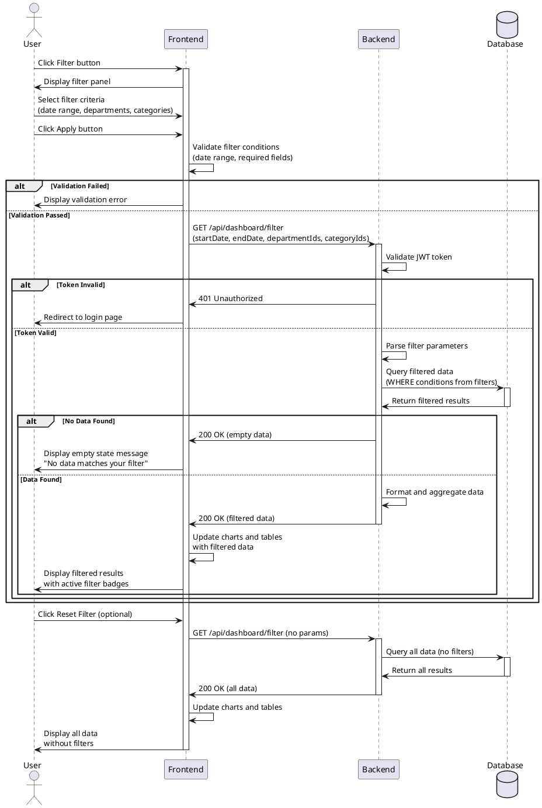

# Use Case Specification: Dashboard Data Filtering

## Overview
Feature #11 allows users to filter dashboard and analysis page data by applying various conditions such as date range, departments, and categories to view specific subsets of information.

---

## Primary Actor
Authenticated User (General User or Administrator)

---

## Precondition
- User is logged in with a valid session
- User is on a dashboard or analysis page (Main Dashboard, Performance Analysis, Paper Analysis, Student Analysis, or Budget Analysis)
- Data exists in the database to be filtered

---

## Trigger
User clicks the filter button on a dashboard or analysis page to apply custom filtering criteria

---

## Main Scenario

### 1. User Opens Filter Panel
User clicks the "Filter" button on the dashboard or analysis page, and the filter panel opens.

### 2. User Selects Filter Criteria
User selects one or more of the following filter options:
- Date Range: Start date and end date
- Departments: Single or multiple department selection
- Categories: Single or multiple category selection

### 3. User Applies Filter
User clicks the "Apply" button after selecting desired filter criteria.

### 4. Client-Side Validation
Frontend validates the selected filter conditions:
- Ensures start date is before or equal to end date
- Verifies required filter values are selected
- If validation fails, displays error message and stops processing

### 5. API Request
Frontend sends a GET or POST request to the backend API with filter parameters:
- Date range (startDate, endDate)
- Selected department IDs
- Selected category IDs
- Current page context (dashboard type)

### 6. Backend Processing
Backend receives the request and performs the following:
- Validates JWT token
- Parses filter parameters
- Converts parameters into database query conditions
- Executes filtered query on the database

### 7. Database Query
Database returns filtered data based on the applied conditions:
- Aggregated KPI data matching filter criteria
- Chart data matching filter criteria
- Statistical summaries

### 8. Response
Backend formats the filtered data and sends response to frontend.

### 9. UI Update
Frontend receives the filtered data and updates:
- Charts are rerendered with filtered data
- Tables are updated with filtered results
- Active filter badges are displayed showing applied conditions
- "Reset Filter" button becomes visible

---

## Edge Cases

### Invalid Date Range
- Error: Start date is after end date
- Handling: Display validation error message, prevent API call, highlight date fields

### No Matching Data
- Error: Filter conditions return zero results
- Handling: Display empty state message with "No data matches your filter criteria", suggest resetting filters

### Network Error
- Error: API request fails due to network issues
- Handling: Display error message with retry button, maintain previous data view

### Session Expiration
- Error: JWT token expired during filter operation
- Handling: Redirect to login page with return URL to preserve context

### Complex Multi-Filter Performance
- Error: Multiple complex filters cause slow query response
- Handling: Display loading indicator, implement query optimization, consider caching

### Page Refresh with Active Filters
- Error: User refreshes page and loses filter state
- Handling: Store filter parameters in URL query string to preserve state across refreshes

---

## Business Rules

### BR-1: Date Range Validation
Start date must be before or equal to end date. Date range cannot exceed 5 years.

### BR-2: Filter Persistence
Applied filters remain active until user explicitly resets them or navigates to a different page type.

### BR-3: Filter Availability
Available filter options depend on the current page context:
- Main Dashboard: Date range, departments, categories
- Performance Analysis: Date range, departments, projects
- Paper Analysis: Year, journal, field
- Student Analysis: Department, grade level, year
- Budget Analysis: Department, year, budget category

### BR-4: Default State
When no filters are applied, system displays all available data without restrictions.

### BR-5: Permission-Based Filtering
Users can only filter data they have permission to view. Administrators see all departments, while general users may see only their assigned departments.

### BR-6: Real-Time Updates
Charts and tables update immediately after filter application without full page reload.

---

## Sequence Diagram

---

## Success Criteria
- User can select and apply filter criteria smoothly
- Filtered data is displayed within 2 seconds for typical datasets
- Applied filters are clearly indicated with badges or tags
- User can easily reset filters to view all data
- Filter state persists during page refresh via URL parameters
- No data loss or corruption occurs during filtering operations

---

## Notes
- Filter performance should be optimized with proper database indexing
- Consider implementing filter debouncing for better UX
- URL parameter encoding should follow standard query string format
- Filter combinations should be logged for analytics purposes
