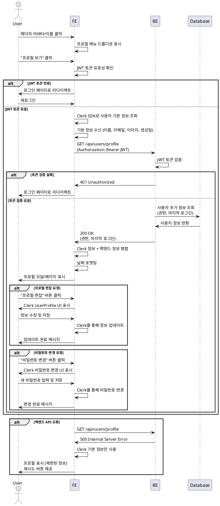

# Use Case Specification: 사용자 프로필 확인

## Primary Actor
일반 사용자 (로그인된 모든 사용자)

## Precondition
- 사용자가 시스템에 로그인되어 있어야 함
- 유효한 JWT 세션 토큰이 존재해야 함

## Trigger
사용자가 헤더 영역의 사용자 아바타 또는 이름을 클릭하여 프로필 메뉴를 열고, "프로필 보기" 옵션을 선택함

## Main Scenario

### 1. 사용자 프로필 접근
- 사용자가 헤더 영역의 사용자 아바타/이름을 클릭
- 프로필 메뉴 드롭다운이 표시됨
- "프로필 보기" 옵션을 클릭

### 2. 인증 확인
- 프론트엔드가 현재 인증 상태를 확인
- JWT 토큰이 유효한지 검증

### 3. Clerk 사용자 정보 조회
- Clerk SDK를 통해 현재 로그인한 사용자의 기본 정보 조회
  - 이름 (Name)
  - 이메일 (Email)
  - 프로필 이미지 URL
  - 계정 생성일 (Created At)

### 4. 백엔드 추가 정보 조회 (선택사항)
- 백엔드 API에 GET 요청으로 추가 사용자 정보 조회
  - 사용자 권한 (Role: 관리자/일반 사용자)
  - 마지막 로그인 일시
  - API 엔드포인트: `GET /api/users/profile`
  - 요청 헤더: `Authorization: Bearer {JWT_TOKEN}`

### 5. 데이터 병합 및 포맷팅
- Clerk 정보와 백엔드 정보를 병합
- 날짜 형식을 사용자 친화적 형식으로 변환

### 6. 프로필 UI 렌더링
- 프로필 모달 또는 페이지를 표시
- 사용자 정보 표시:
  - 프로필 이미지 (또는 기본 아바타)
  - 이름
  - 이메일
  - 권한 (뱃지 형태)
  - 계정 생성일
  - 마지막 로그인 일시
- 액션 버튼 제공:
  - "프로필 편집" 버튼 (Clerk UserProfile UI로 연결)
  - "비밀번호 변경" 버튼 (Clerk 비밀번호 변경 UI로 연결)

## Edge Cases

### 1. 프로필 이미지 없음
- **상황**: 사용자가 프로필 이미지를 설정하지 않은 경우
- **처리**: 기본 아바타 이미지 또는 이니셜 기반 아바타 표시

### 2. 백엔드 API 조회 실패
- **상황**: 네트워크 오류 또는 서버 오류로 추가 정보 조회 실패
- **처리**: Clerk 기본 정보만 표시, 재시도 버튼 제공

### 3. JWT 토큰 만료
- **상황**: 세션이 만료된 상태에서 프로필 접근 시도
- **처리**: 자동으로 로그인 페이지로 리다이렉트, 세션 만료 메시지 표시

### 4. Clerk UI 연동 오류
- **상황**: Clerk UserProfile 컴포넌트 로딩 실패
- **처리**: 오류 메시지 표시, 페이지 새로고침 안내

### 5. 권한 정보 누락
- **상황**: 백엔드에서 권한 정보를 반환하지 못하는 경우
- **처리**: 기본 권한 "일반 사용자"로 표시

## Business Rules

### BR-1: 인증 필수
모든 사용자는 프로필 정보를 조회하기 전에 유효한 인증 세션을 가지고 있어야 한다.

### BR-2: 본인 프로필만 조회 가능
사용자는 자신의 프로필 정보만 조회할 수 있으며, 다른 사용자의 프로필은 조회할 수 없다.

### BR-3: 민감 정보 보호
비밀번호와 같은 민감한 정보는 프로필 화면에 절대 표시되지 않으며, Clerk의 보안 UI를 통해서만 변경 가능하다.

### BR-4: 프로필 편집 권한
모든 사용자는 자신의 프로필 정보(이름, 이메일, 프로필 이미지)를 편집할 수 있다. 단, 편집은 Clerk UserProfile UI를 통해서만 가능하다.

### BR-5: 권한 정보 표시
사용자의 권한(관리자/일반 사용자)은 정보 제공 목적으로만 표시되며, 사용자가 직접 변경할 수 없다.

### BR-6: 데이터 일관성
Clerk와 백엔드 데이터베이스 간의 사용자 정보는 동기화되어야 하며, 불일치 발생 시 Clerk 정보를 우선한다.

## Sequence Diagram

